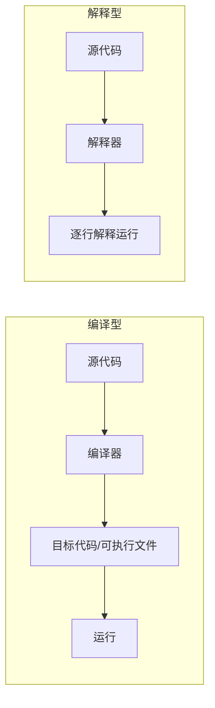
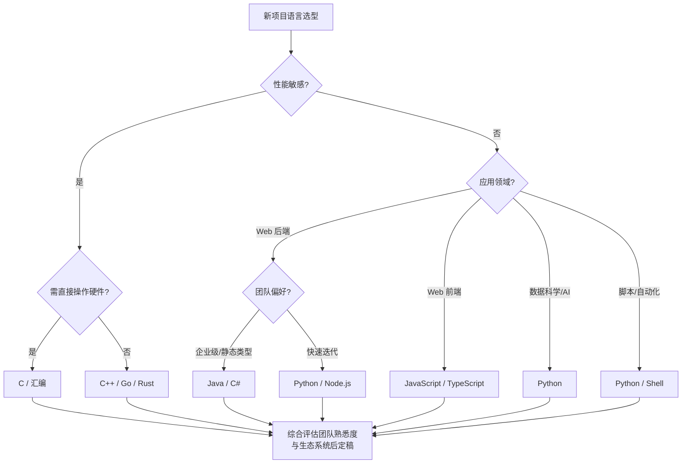

# 8.1 程序设计语言与选择

进入实现阶段后，第一个工程决策是选择合适的程序设计语言。本节阐明程序设计语言的分类（机器语言、汇编语言、高级语言）、高级语言按范型的划分、编译型与解释型的差别，以及影响语言选择的因素，为[[8.2 编码规范与代码质量]]提供语言层面的前提。

## 程序设计语言分类

按对硬件的抽象层次，程序设计语言分为三类：

| 类别 | 特点 | 优点 | 缺点 | 示例 |
| --- | --- | --- | --- | --- |
| 机器语言 | 二进制代码，直接执行 | 执行效率最高 | 不可读、不可移植、易错 | 0/1 序列 |
| 汇编语言 | 助记符代替二进制 | 比机器语言易读、仍贴近硬件 | 依赖 CPU、移植性差 | x86 ASM、ARM ASM |
| 高级语言 | 接近自然语言与数学表达 | 可读、可移植、生产率高 | 需编译/解释、运行开销略增 | C、Java、Python |

> [!note] 抽象层次与生产率
> > 抽象层次越高，可读性、可移植性与开发效率越高，但对硬件的控制力与运行效率越低。汇编语言在操作系统内核、驱动、嵌入式性能关键路径仍有不可替代的价值；绝大多数应用软件使用高级语言开发。

## 高级语言按范型分类

高级语言按编程范型（Programming Paradigm）可分为：

| 范型 | 核心思想 | 代表语言 |
| --- | --- | --- |
| 过程式(命令式) | 以过程/函数组织程序，顺序执行、改变状态 | C、Pascal、Fortran |
| 面向对象 | 以对象与类组织，封装、继承、多态 | Java、C++、Python、C# |
| 函数式 | 以函数与不可变数据为核心，避免副作用 | Haskell、Lisp、Scala |
| 脚本式 | 解释执行、动态类型、胶水语言 | Python、JavaScript、Ruby、Shell |

> [!tip] 范型并非互斥
> > 现代语言多为多范型。Python 支持面向对象与过程式，也具备函数式特性；Java 8 之后引入 lambda 支持函数式风格；C++ 兼容过程式、面向对象与泛型编程。选择语言时不必拘泥于单一范型标签。

## 编译型与解释型

> [!definition] 编译型与解释型
> > **编译型**语言在运行前由编译器将源代码整体翻译为目标机器码（或中间码），生成可执行文件后运行。**解释型**语言在运行时由解释器逐行翻译并执行源代码，不预先生成独立可执行文件。

| 维度 | 编译型 | 解释型 |
| --- | --- | --- |
| 执行速度 | 快 | 较慢 |
| 跨平台性 | 差（需重新编译） | 好（依赖解释器） |
| 开发调试 | 周期长 | 快速迭代 |
| 类型检查 | 多为静态、编译期 | 多为动态、运行期 |
| 典型语言 | C、C++、Go、Rust | Python、JavaScript、Ruby |

> [!warning] Java 的折中
> > Java 采用“先编译后解释”的折中：源代码先由 `javac` 编译为与平台无关的字节码(Bytecode)，再由 JVM 解释执行（现代 JVM 含 JIT 即时编译，将热点字节码编译为机器码）。这种“一次编写、到处运行”兼顾了跨平台性与运行性能。C# 与 .NET 的 IL 机制与此类似。

## 编程语言选择因素

选择编程语言需综合考量以下因素：

| 因素 | 说明 |
| --- | --- |
| 应用领域 | 系统/嵌入式选 C/C++；Web 后端选 Java/Go/Python；数据科学选 Python；前端选 JavaScript |
| 团队熟悉度 | 团队熟悉的语言能降低学习成本与出错率，提升交付速度 |
| 性能需求 | 实时、高并发场景倾向编译型或带 JIT 的语言 |
| 可维护性 | 类型系统、模块化、生态成熟度影响长期维护成本 |
| 生态系统 | 库、框架、工具链、社区支持与人才储备 |
| 可移植性 | 跨平台需求高时优先考虑解释型或基于虚拟机的语言 |

### 语言选择决策图

> [!note] 选型的工程现实
> > 语言选型不是单纯技术问题，往往受团队既有技术栈、组织标准、人才市场与项目周期约束。理想选型应在满足性能与应用领域的前提下，优先选择团队熟悉、生态成熟的语言，避免为追求新技术而引入过高的学习与维护成本。

## 小结

程序设计语言按抽象层次分为机器语言、汇编语言、高级语言；高级语言按范型分为过程式、面向对象、函数式、脚本式，现代语言多为多范型。编译型语言性能高但跨平台性差，解释型语言反之，Java 以字节码与 JVM 兼顾两者。语言选择需综合应用领域、团队熟悉度、性能需求、可维护性与生态系统，没有普适最优，只有适配具体项目语境的最佳选择。

## 关联

- 上一级：[[MOC - 第8章]]
- 下一节：[[8.2 编码规范与代码质量]]
- 关联概念：[[7.3 详细设计文档与评审]]（详细设计是编码实现的直接依据）、[[MOC - Java程序设计]]、[[MOC - C语言程序设计A]]（编码实现的载体语言）
