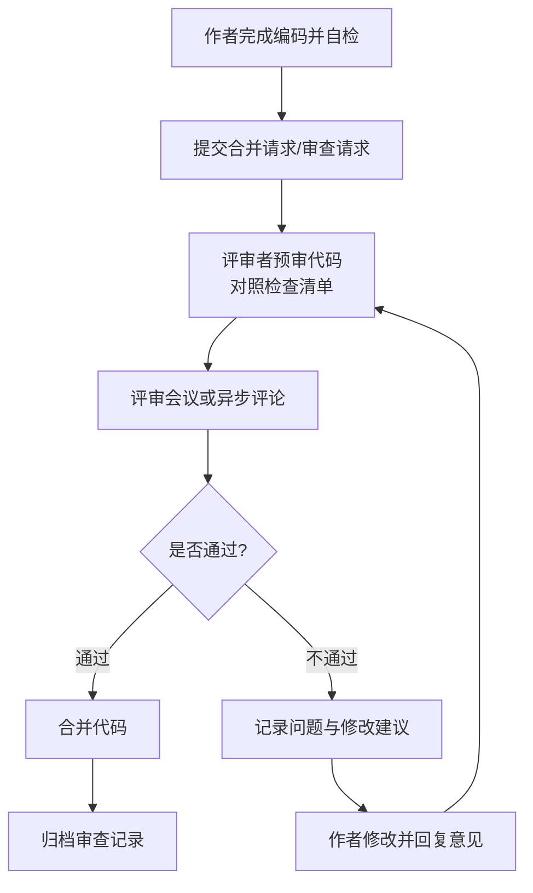

# 8.2 编码规范与代码质量

确定程序设计语言（[[8.1 程序设计语言与选择]]）后，如何写出高质量代码成为实现阶段的核心问题。本节阐明编码规范的重要性、命名与格式规范、复杂度控制（圈复杂度、嵌套深度）、代码审查流程，并给出 Java/Python 编码规范示例，为[[8.3 代码重构与优化]]奠定质量基础。

## 编码规范的重要性

> [!definition] 编码规范
> > 编码规范(Coding Standard)是团队约定的一套代码编写规则，涵盖命名、格式、注释、结构等，约束开发者以一致风格编写代码。

编码规范的核心价值：

| 价值 | 说明 |
| --- | --- |
| 可读性 | 一致风格降低阅读成本，新成员更快理解代码 |
| 可维护性 | 规范代码更易修改、扩展与排错，降低维护成本 |
| 团队协作 | 减少风格争议，代码如同出自一人之手 |
| 缺陷预防 | 部分规范（如强制空指针检查、命名歧义）直接减少常见错误 |

> [!note] 代码被阅读的次数远多于被编写
> > 工业界经验表明，代码在整个生命周期中被阅读的次数远多于最初编写。可读性优先于“聪明”的写法，是编码规范的首要目标。

## 命名规范

命名是代码可读性最关键的要素之一：

| 对象 | 规范要点 | 示例 |
| --- | --- | --- |
| 变量 | 名词或名词短语，表意明确 | `userName`、`orderCount` |
| 函数/方法 | 动词或动宾短语，说明行为 | `calculateTotal()`、`sendEmail()` |
| 类 | 名词，首字母大写(PascalCase) | `OrderService`、`UserController` |
| 常量 | 全大写，下划线分隔 | `MAX_RETRY_COUNT`、`DEFAULT_TIMEOUT` |
| 布尔变量 | 用 is/has/can 前缀 | `isValid`、`hasPermission` |

> [!warning] 命名禁忌
> > 避免 `data`、`info`、`temp`、`x1`、`a2` 等无信息量命名；避免缩写不统一（如 `usr` 与 `user` 混用）；避免用数字后缀区分同类变量。命名应能自解释其含义，减少对注释的依赖。

## 代码格式

代码格式约定视觉层面的统一：

- **缩进**：统一用空格或 Tab（不混用），Python 强制缩进，Java/JS 常用 4 空格。
- **括号**：行尾或换行风格统一即可（K&R 或 Allman 二选一）。
- **空行**：方法之间、逻辑块之间留空行分隔，避免过密。
- **注释**：解释“为什么”而非“是什么”；公共接口必须有文档注释；避免过时注释误导。

> [!tip] 注释的价值与边界
> > 好注释解释意图、约束、非显然的决策；坏注释复述代码、记录历史或重复类型声明。能通过好的命名与结构表达清楚的，不必加注释；难以从代码看出意图的，必须加注释。

## 代码复杂度控制

### 圈复杂度

> [!definition] 圈复杂度
> > 圈复杂度(Cyclomatic Complexity)由 Thomas McCabe 提出，度量程序控制流的复杂程度，数值等于程序线性独立路径数。计算公式为 $V(G) = e - n + 2p$，其中 $e$ 为控制流图的边数，$n$ 为节点数，$p$ 为连通分量数。对于单入口单出口的常见程序，简化为判断节点数加 1。

| 圈复杂度 | 风险等级 | 建议 |
| --- | --- | --- |
| 1–10 | 低风险 | 简单、易测 |
| 11–20 | 中等 | 可接受，关注测试覆盖 |
| 21–50 | 高风险 | 应重构拆分 |
| >50 | 不可接受 | 必须重构 |

> [!note] 降低圈复杂度的方法
> > 提取方法将复杂判断拆分；用多态或策略模式替代复杂条件分支；用早返回(early return)减少嵌套；用映射表替代 switch-case。

### 嵌套深度

过深的嵌套降低可读性并增加圈复杂度。常见约定：单层方法嵌套不超过 3–4 层。

```python
# 反例：嵌套过深
def process(items):
    for item in items:
        if item is not None:
            if item.is_valid:
                if item.priority > 0:
                    # 处理逻辑
                    pass

# 改进：用早返回与卫语句降低嵌套
def process(items):
    for item in items:
        if item is None:
            continue
        if not item.is_valid:
            continue
        if item.priority <= 0:
            continue
        # 处理逻辑
```

## 代码审查(Code Review)

> [!definition] 代码审查
> > 代码审查(Code Review)是由开发者之外的评审者对代码进行系统性检查的活动，目的是在编码阶段发现缺陷、落实规范、提升质量与促进知识共享。

### 代码审查流程



### 代码审查检查清单

| 评审项 | 检查内容 |
| --- | --- |
| 功能正确性 | 是否正确实现需求？是否覆盖边界与异常？ |
| 命名与格式 | 是否符合编码规范？命名是否表意？ |
| 复杂度 | 圈复杂度是否过高？嵌套是否过深？ |
| 重复 | 是否存在重复代码可提取？ |
| 错误处理 | 异常是否妥善处理？资源是否释放？ |
| 安全性 | 是否有注入、越权、敏感信息泄漏？ |
| 性能 | 是否有明显低效算法或 N+1 查询？ |
| 测试 | 是否附带单元测试？覆盖是否充分？ |
| 可维护性 | 是否影响接口契约？是否需更新文档？ |

> [!tip] 评审的工程纪律
> > 评审应聚焦缺陷与设计而非风格争论（风格交由 linter/formatter 自动化）；每次评审规模不宜过大（单次审查建议少于 400 行）；评审记录应留存以追踪决策。良好的评审能将大量缺陷拦截在编码阶段，修复成本远低于测试与维护阶段。

## Java/Python 编码规范示例

### Java 编码规范示例

```java
/**
 * 订单服务：处理订单的创建与查询。
 */
public class OrderService {

    private static final int MAX_RETRY_COUNT = 3;

    /**
     * 根据订单 ID 查询订单。
     *
     * @param orderId 订单 ID
     * @return 订单对象，不存在时返回 null
     */
    public Order findOrder(String orderId) {
        if (orderId == null || orderId.isEmpty()) {
            return null;
        }
        // 查询逻辑省略
        return null;
    }
}
```

### Python 编码规范示例

```python
MAX_RETRY_COUNT = 3


def calculate_total(items):
    """计算订单总金额。

    Args:
        items: 订单商品列表，每项含 price 与 quantity。

    Returns:
        总金额。
    """
    if not items:
        return 0
    return sum(item.price * item.quantity for item in items)
```

> [!note] 语言级规范
> > Java 通常遵循 Oracle 官方规范或 Google Java Style；Python 遵循 PEP 8。团队应在语言通用规范基础上裁剪出团队约定，并用 linter（如 Java 的 Checkstyle、Python 的 flake8/black）自动化执行，避免人工争论风格。

## 小结

编码规范统一团队代码风格，提升可读性、可维护性与协作效率。命名应表意自解释，格式应一致，注释应解释意图而非复述代码。圈复杂度衡量控制流复杂度，超过 20 应重构，嵌套深度建议不超过 3–4 层。代码审查通过检查清单系统发现缺陷、落实规范，是编码阶段质量保障的关键活动。Java 与 Python 各有成熟规范（Oracle/Google Style、PEP 8），团队应结合 linter 自动化执行。

## 关联

- 上一级：[[MOC - 第8章]]
- 上一节：[[8.1 程序设计语言与选择]]
- 下一节：[[8.3 代码重构与优化]]
- 关联概念：[[7.3 详细设计文档与评审]]（设计评审与代码审查同属质量保障）、[[MOC - 软件测试技术]]（代码质量是测试有效性的前提）
