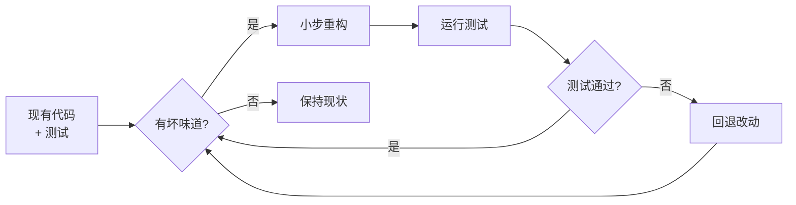
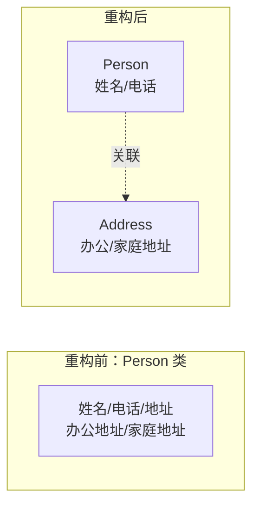
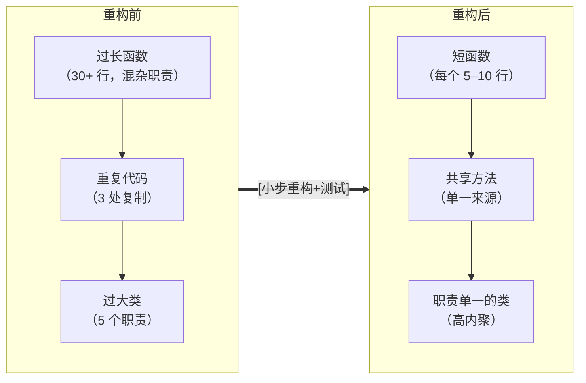

# 8.3 代码重构与优化

即便遵守编码规范（[[8.2 编码规范与代码质量]]），代码在演进中仍会逐渐腐化。本节阐明重构的定义与原则、常见代码坏 smell、典型重构手法与性能优化策略，为长期保持代码内部结构健康提供方法。

## 重构的定义与原则

> [!definition] 重构
> > 重构(Refactoring)是在**不改变软件外部行为的前提下，调整其内部结构**，使代码更易读、更易修改、更易扩展。重构的核心约束是“行为不变”，因此必须伴随充分的自动化测试以保障安全。



> [!warning] 重构与改写、新增功能的区别
> > 重构不改变外部行为，不修复缺陷也不增加新功能；修复缺陷是缺陷修复，增加功能是功能演进。三者应分离提交，避免“一边重构一边改 bug”导致难以定位回归。重构依赖测试：没有测试保护的重构是危险的。

## 代码坏味道(Bad Smells)

> [!definition] 代码坏味道
> > 代码坏味道(Bad Smell)指代码中暗示需要重构的特征，由 Martin Fowler 在《重构》中系统总结。坏味道不是绝对错误，而是值得审视的信号。

| 坏味道 | 表现 | 对应重构手法 |
| --- | --- | --- |
| 重复代码(Duplicated Code) | 相同逻辑多处复制 | 提取方法、提取父类、提取模块 |
| 过长函数(Long Method) | 方法过长、职责混杂 | 提取方法、以查询替代临时变量 |
| 过大类(Large Class) | 类承担过多职责 | 提取类、提取子类 |
| 过长参数列表(Long Parameter List) | 参数过多难以理解 | 引入参数对象、保持对象完整 |
| 发散式修改(Divergent Change) | 一个类因不同原因被多次修改 | 拆分为多个职责单一的类 |
| 霰弹式修改(Shotgun Surgery) | 一个改动散布在多个类 | 合并相关方法到同一类/模块 |
| 依恋情结(Feature Envy) | 方法大量使用他类数据 | 移动方法到数据所在的类 |
| 数据泥团(Data Clumps) | 多处出现相同的成组参数 | 提取为对象 |

> [!note] 坏味道与设计原则的对应
> > 发散式修改与霰弹式修改对应单一职责原则(SRP)；过大类与依恋情结对应高内聚低耦合（参见[[5.2 模块内聚与耦合]]）。识别坏味道本质是识别违反设计原则的代码结构。

## 典型重构手法

### 提取方法

将长方法中一段有清晰职责的代码提取为独立方法，以方法名表达意图。

```java
// 重构前
void printOwing() {
    Enumeration e = orders.elements();
    double outstanding = 0.0;
    System.out.println("**** 客户欠款 ****");
    System.out.println("姓名：" + name);
    while (e.hasMoreElements()) {
        Order each = (Order) e.nextElement();
        outstanding += each.getAmount();
    }
    System.out.println("欠款总额：" + outstanding);
}

// 重构后
void printOwing() {
    printBanner();
    double outstanding = getOutstanding();
    printDetails(outstanding);
}
```

### 内联方法

与方法体同样清晰的方法可内联回调用处，消除不必要的间接层。

### 提取类

将承担过多职责的类拆分为多个职责单一的类。



### 移动方法

将方法移到它真正所属的类（消除依恋情结），使数据与操作聚集。

### 重命名

用更具表意力的名字替换模糊命名，是最简单也最常用的重构。

> [!tip] 小步重构与版本控制
> > 重构应小步进行、每步运行测试，配合版本控制（Git）逐步提交。一旦测试失败可快速回退到上一绿色状态。批量大重构难以审查且风险高，应拆分为多个小步提交。

## 性能优化策略

> [!definition] 性能优化
> > 性能优化(Performance Optimization)是在不改变功能的前提下提升软件运行效率。与重构不同，性能优化可能改变内部实现甚至结构，但同样需保证外部行为不变。

| 策略 | 手段 | 说明 |
| --- | --- | --- |
| 算法优化 | 选用更优时间/空间复杂度的算法 | 如 $O(n^2) \to O(n \log n)$，收益最大 |
| 数据结构优化 | 选用适配访问模式的结构 | 如用哈希表替代线性查找 |
| I/O 优化 | 批量化、缓存、异步、减少往返 | I/O 常是瓶颈，减少调用次数收益显著 |
| 并发优化 | 多线程/协程/并行计算 | 充分利用多核 |
| 内存优化 | 对象池、惰性加载、避免重复分配 | 减少垃圾回收压力 |

> [!warning] 优化的工程纪律
> > 性能优化应遵循“先度量、后优化”：用 profiler 定位真正瓶颈，避免凭直觉优化非热点（过早优化是万恶之源）。每次只优化一处并重新度量，避免引入难以察觉的回归。优化常与可读性冲突，应在确有必要时才牺牲可读性换取性能，并留下注释说明原因。

## 重构前后对比



> [!note] 重构与优化的关系
> > 重构改善结构可读性，性能优化提升效率，二者目标不同但常相互促进：良好的结构便于定位与实施性能优化，而某些优化（如提取方法、消除重复）本身就是重构。工程实践中应先重构使结构清晰，再在必要时做针对性性能优化。

## 小结

重构是在不改变外部行为前提下改善内部结构的活动，必须以测试为安全网，小步进行、逐步提交。代码坏味道是重构的信号，常见包括重复代码、过长函数、过大类、过长参数列表、发散式修改、霰弹式修改等，每种坏味道对应特定重构手法（提取方法、提取类、移动方法、重命名等）。性能优化应先度量后优化，聚焦真正瓶颈，避免过早优化牺牲可读性。重构与优化相辅相成，共同支撑代码的长期健康。

## 关联

- 上一级：[[MOC - 第8章]]
- 上一节：[[8.2 编码规范与代码质量]]
- 关联概念：[[5.2 模块内聚与耦合]]（坏味道本质是违反高内聚低耦合）、[[MOC - 第9章]]（重构提高可维护性，降低维护成本）、[[MOC - 软件测试技术]]（测试是重构的安全网）
