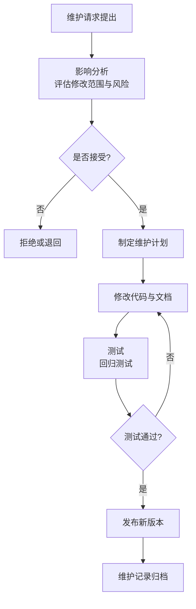

# 9.1 软件维护类型与维护过程

软件交付并不意味着生命周期结束，维护才是最长的阶段。本节阐明软件维护的定义、四种维护类型及其占比、影响维护成本的因素与维护过程，为[[9.2 软件可维护性与维护策略]]奠定概念基础。

## 软件维护的定义

> [!definition] 软件维护
> > 软件维护(Software Maintenance)是指软件交付并投入运行后，为改正错误、适应环境变化或增强功能而对软件进行的修改。维护不是简单的“修 bug”，而是软件生命周期中持续进行的一类工程活动。

> [!note] 维护是软件生命周期最长的阶段
> > 软件维护通常占软件生命周期成本的 60% 以上，部分系统甚至达到 80%。这是因为在交付后的数年甚至数十年里，软件需持续适应环境、满足新需求并修复遗留缺陷。维护成本居高不下正是软件工程强调可维护性的根本原因。

## 维护的四种类型

按维护目的，软件维护分为四类：

| 类型 | 含义 | 典型场景 | 占比参考 |
| --- | --- | --- | --- |
| 改正性维护(Corrective) | 改正在开发阶段产生、测试未发现的残留错误 | 用户报告的运行故障、崩溃修复 | 约 20% |
| 适应性维护(Adaptive) | 为适应外部环境变化而修改 | 操作系统升级、硬件更换、法规变更 | 约 25% |
| 完善性维护(Perfective) | 为增强功能、提升性能、改善体验而主动改进 | 用户提出新需求、性能优化 | 约 50%–66% |
| 预防性维护(Preventive) | 为提高可维护性与可靠性而主动改造 | 重构、补充文档、修复隐患 | 约 5% |

> [!warning] 完善性维护占比最大
> > 完善性维护占比最大，反映了软件交付后用户会持续提出新需求与改进期望。这意味着维护不仅是“修复”，更是“演进”。预防性维护虽占比小，但对控制长期复杂度增长（见[[9.3 软件演化与 Lehman 定律]]）至关重要。

## 维护成本因素

影响维护成本的因素包括：

| 因素类别 | 具体因素 |
| --- | --- |
| 系统因素 | 系统规模、年龄、复杂度、架构合理性 |
| 人员因素 | 开发者流动性、维护人员对系统的熟悉度 |
| 过程因素 | 文档完整性、测试覆盖、配置管理成熟度 |
| 外部因素 | 需求变更频率、运行环境变化频率、用户规模 |

> [!tip] 降低维护成本的工程手段
> > 在开发阶段就为可维护性投资：遵守编码规范（[[8.2 编码规范与代码质量]]）、保持文档与代码同步、提高测试覆盖率、定期重构（[[8.3 代码重构与优化]]）。这些前期投入能显著降低后期维护成本。

## 维护过程

软件维护遵循结构化过程，避免随意修改引入新缺陷：

### 维护过程的关键环节

| 环节 | 内容 |
| --- | --- |
| 维护请求 | 用户或运维提出维护申请，说明问题或需求 |
| 影响分析 | 评估修改涉及哪些模块、是否影响接口、风险与成本 |
| 修改 | 按设计修改代码与数据，同步更新文档 |
| 测试 | 单元测试 + 回归测试，确保修改正确且未引入新缺陷 |
| 发布 | 经配置管理建立新基线，发布新版本 |
| 记录归档 | 记录维护内容、原因、影响范围，用于追踪与统计 |

> [!warning] 维护的回归风险
> > 维护修改最危险的是引入新缺陷（回归）。每次维护修改后必须进行回归测试，且修改应通过配置管理（[[10.2 软件配置管理与风险管理]]）建立新基线，确保可追溯与可回退。缺乏回归测试与配置管理的维护是遗留系统腐化的主因。

## 小结

软件维护是软件交付后进行的修改活动，是生命周期中最长、成本最高的阶段。维护分为改正性、适应性、完善性、预防性四类，其中完善性维护占比最大。维护成本受系统规模、年龄、人员流动、文档与测试质量等因素影响。维护应遵循“请求→影响分析→修改→测试（回归）→发布→归档”的结构化过程，并通过配置管理建立基线、回归测试控制风险。

## 关联

- 上一级：[[MOC - 第9章]]
- 下一节：[[9.2 软件可维护性与维护策略]]
- 关联概念：[[8.2 编码规范与代码质量]]（编码规范降低维护成本）、[[10.2 软件配置管理与风险管理]]（维护修改需配置管理与回归测试）
