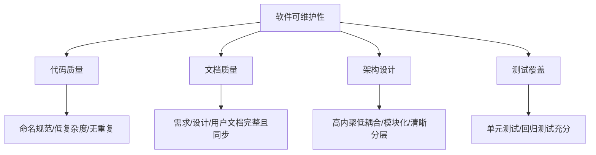
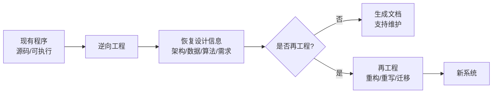

# 9.2 软件可维护性与维护策略

维护成本居高不下（[[9.1 软件维护类型与维护过程]]），根本出路是提高软件本身的可维护性。本节阐明软件可维护性的定义与构成、影响因素、提高可维护性的方法，以及软件逆向工程，为控制长期维护成本提供策略。

## 软件可维护性的定义

> [!definition] 软件可维护性
> > 软件可维护性(Software Maintainability)是指维护人员理解、改正、改动和扩充软件的难易程度。可维护性是软件质量的重要属性，直接决定维护成本与软件寿命。

### 可维护性的构成要素

可维护性由以下相互关联的要素构成：

| 要素 | 含义 |
| --- | --- |
| 可理解性(Understandability) | 读者理解软件结构、功能与代码的容易程度 |
| 可测试性(Testability) | 软件易于诊断与测试的程度 |
| 可修改性(Modifiability) | 软件易于修改且修改不易引入新错误的程度 |
| 可靠性(Reliability) | 软件在规定时间与条件下正确运行的概率 |
| 可移植性(Portability) | 软件从一个环境移到另一环境的难易程度 |

## 影响可维护性的因素

| 因素 | 说明 |
| --- | --- |
| 代码质量 | 命名规范、低圈复杂度、无重复代码（[[8.2 编码规范与代码质量]]） |
| 文档质量 | 需求、设计、用户文档完整且与代码同步 |
| 架构设计 | 高内聚低耦合、模块化、清晰分层（[[5.2 模块内聚与耦合]]） |
| 测试覆盖 | 充分的单元测试与回归测试，保障修改安全 |

> [!warning] 文档与代码脱节的危害
> > 文档若与代码脱节，比没有文档更糟——它会误导维护者做出错误判断。维护过程中任何代码修改都必须同步更新文档，这是控制可维护性的硬性纪律。

## 提高可维护性的方法

| 方法 | 作用 |
| --- | --- |
| 遵守编码规范 | 统一风格、提升可读性与可理解性 |
| 维护文档 | 保持需求/设计/接口/用户文档与代码同步 |
| 定期重构 | 消除坏味道、降低复杂度（[[8.3 代码重构与优化]]） |
| 应用设计模式 | 用成熟模式表达通用结构，提升可理解性与可扩展性 |
| 提高测试覆盖 | 为修改提供安全网，提升可测试性与可修改性 |
| 模块化设计 | 高内聚低耦合，使修改局部化 |

> [!tip] 可维护性是设计出来的
> > 可维护性主要在分析与设计阶段奠定，而非维护阶段补救。良好的需求分析（[[MOC - 第3章]]）、结构化/面向对象设计（[[MOC - 第5章]]、[[MOC - 第6章]]）与详细设计（[[MOC - 第7章]]）是高可维护性的源头。开发阶段的投入远比维护阶段补救划算。

## 软件逆向工程

> [!definition] 软件逆向工程
> > 软件逆向工程(Reverse Engineering)是从已有程序中恢复其设计信息（体系结构、数据结构、算法、需求）的过程，目的是理解缺乏文档或源码不全的软件，为维护与再工程提供依据。逆向工程本身不改变原系统。

### 逆向工程与再工程

| 概念 | 是否改变系统 | 目的 |
| --- | --- | --- |
| 逆向工程(Reverse Engineering) | 否 | 恢复设计信息、理解系统 |
| 再文档化(Redocumentation) | 否 | 在同一抽象层次重新生成文档 |
| 再工程(Reengineering) | 是 | 检查并改造系统，提升可维护性 |

> [!note] 逆向工程的典型场景
> > ①遗留系统再工程——理解老旧系统以重构或迁移；②二进制接口分析——分析无源码产品的协议与接口；③安全审计——挖掘漏洞与恶意行为。逆向工程工具（如反编译器、调用图分析器）能部分自动化设计信息恢复，但人工理解仍是核心。

## 小结

软件可维护性是维护人员理解、改正、改动与扩充软件的难易程度，由可理解性、可测试性、可修改性、可靠性、可移植性构成。影响可维护性的因素包括代码质量、文档质量、架构设计与测试覆盖。提高可维护性的方法有遵守编码规范、维护文档、定期重构、应用设计模式与提高测试覆盖，且这些主要在设计阶段奠定。软件逆向工程从已有程序恢复设计信息，为遗留系统维护与再工程提供依据，本身不改变原系统。

## 关联

- 上一级：[[MOC - 第9章]]
- 上一节：[[9.1 软件维护类型与维护过程]]
- 下一节：[[9.3 软件演化与 Lehman 定律]]
- 关联概念：[[8.2 编码规范与代码质量]]、[[8.3 代码重构与优化]]（提高可维护性的具体手段）、[[5.2 模块内聚与耦合]]（架构设计影响可维护性）
