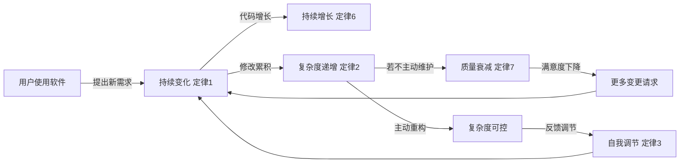
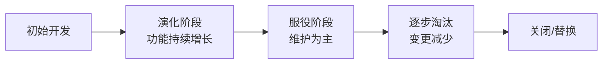

# 9.3 软件演化与 Lehman 定律

软件维护（[[9.1 软件维护类型与维护过程]]）累积起来构成软件演化。本节阐明软件演化的定义、Lehman 软件演化八大定律、软件演化的阶段模型，以及遗留系统的维护策略，从更长的时间尺度理解软件如何随时间变化与腐化。

## 软件演化的定义

> [!definition] 软件演化
> > 软件演化(Software Evolution)是指软件在交付后随时间持续变化的过程，包括功能增删、结构调整、性能调整与环境适应等所有修改活动。软件演化强调软件是“活”的实体，会因需求与环境变化而持续改变。

> [!note] 维护与演化的视角差异
> > 维护(Maintenance)关注单次修改活动及其类型，演化(Evolution)关注软件随时间的整体变化规律。维护是演化的组成部分，演化是维护累积形成的过程级现象。

## Lehman 软件演化八大定律

Lehman 兄弟(Meir Lehman 与 Les Belady)对大型软件系统的长期演化进行实证研究，总结出八大定律，描述了持续使用软件的演化规律：

| 序号 | 定律名称 | 含义 |
| --- | --- | --- |
| 1 | 持续变化(Continuing Change) | 持续使用的软件必须不断变化，否则满意度下降 |
| 2 | 复杂度递增(Increasing Complexity) | 随演化复杂度持续增长，除非主动维护（重构） |
| 3 | 自我调节(Self-Regulation) | 演化过程自我调节，使版本增长率等属性统计稳定 |
| 4 | 稳定性保持(Conservation of Organizational Stability) | 演化过程中的工作量（变更率）趋于稳定 |
| 5 | 熟悉度保持(Conservation of Familiarity) | 系统的熟悉度（可理解性）趋于稳定，需持续投入 |
| 6 | 持续增长(Continuing Growth) | 系统功能持续增长以维持用户满意度 |
| 7 | 质量衰减(Declining Quality) | 不投入维护时，软件质量随时间下降 |
| 8 | 反馈系统(Feedback System) | 演化过程是多层次的反馈系统，需反馈驱动管理 |

> [!warning] 复杂度递增定律的工程含义
> > 复杂度递增定律指出：软件演化过程中复杂度会持续增长，除非投入主动维护（如重构）否则复杂度不可逆地上升，最终导致维护成本爆炸、质量衰减（定律 7）。这是[[8.3 代码重构与优化]]作为预防性维护的理论依据——只有持续主动重构才能对抗复杂度的自然增长。

### Lehman 定律示意图



> [!note] 反馈系统定律
> > Lehman 第 8 定律指出软件演化是反馈系统——过去的变更影响未来的变更。这要求演化管理需基于度量与反馈（如变更率、缺陷率、复杂度趋势）主动调控，而非被动响应需求。

## 软件演化的阶段模型

软件演化通常经历若干阶段：



| 阶段 | 特征 | 主要活动 |
| --- | --- | --- |
| 初始开发 | 首版构建 | 需求、设计、实现、测试 |
| 演化阶段 | 功能持续增长 | 完善性维护为主 |
| 服役阶段 | 维护稳定运行 | 改正性、适应性维护为主 |
| 逐步淘汰 | 变更减少 | 仅关键修复 |
| 关闭/替换 | 退役 | 数据迁移、新系统上线 |

## 遗留系统维护策略

> [!definition] 遗留系统
> > 遗留系统(Legacy System)是指仍在使用但已老旧、技术栈过时、文档不全或难以维护的软件系统。遗留系统通常承载关键业务，无法简单废弃。

### 遗留系统维护策略矩阵

按业务价值与技术质量两个维度，遗留系统有四种处置策略：

```mermaid
quadrantChart
    title 遗留系统维护策略
    x-axis 低技术质量 --> 高技术质量
    y-axis 低业务价值 --> 高业务价值
    quadrant-1 改造(全面重构)
    quadrant-2 替换(重新开发)
    quadrant-3 淘汰(逐步淘汰)
    quadrant-4 保留(维持现状)
```

| 策略 | 业务价值 | 技术质量 | 处置 |
| --- | --- | --- | --- |
| 全面改造 | 高 | 高 | 重构/再工程，提升可维护性 |
| 重新替换 | 高 | 低 | 重新开发新系统替换 |
| 维持现状 | 低 | 高 | 保留运行，仅必要维护 |
| 逐步淘汰 | 低 | 低 | 制定退役计划，迁移到新系统 |

> [!tip] 遗留系统再工程路径
> > 对高业务价值的遗留系统，常用再工程路径：先逆向工程（[[9.2 软件可维护性与维护策略]]）恢复设计信息→再文档化→重构内部结构→必要时重新实现部分模块→逐步替换。这种渐进式再工程比一次性重写风险更低，能保持业务连续性。

## 小结

软件演化是软件交付后随时间持续变化的过程，关注维护累积形成的过程级规律。Lehman 八大定律揭示了持续变化、复杂度递增、自我调节、稳定性保持、熟悉度保持、持续增长、质量衰减与反馈系统等规律，其中复杂度递增与质量衰减定律是主动重构的理论依据。软件演化经历初始开发、演化、服役、逐步淘汰、关闭等阶段。遗留系统按业务价值与技术质量两个维度，选择改造、替换、保留或淘汰策略，高价值系统常采用渐进式再工程以控制风险。

## 关联

- 上一级：[[MOC - 第9章]]
- 上一节：[[9.2 软件可维护性与维护策略]]
- 关联概念：[[8.3 代码重构与优化]]（对抗复杂度递增的手段）、[[9.2 软件可维护性与维护策略]]（逆向工程与再工程的方法论基础）、[[2.2 增量模型与螺旋模型]]（增量交付与演化思想同源）
