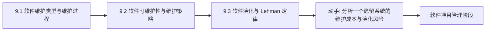

# MOC - 第9章 软件维护与软件演化

> [!info] 本章定位
> 第9章承接[[MOC - 第8章]]实现的代码，进入软件生命周期中最长的阶段——交付后的维护与演化。本章解决的核心问题是：**软件交付后如何持续修改以保持其价值，又如何应对长期变化带来的复杂度增长与质量衰减**。本章覆盖软件维护的四种类型与维护过程、软件可维护性及其策略、软件演化与 Lehman 定律，是从“交付即结束”转向“软件持续演化”的关键认知。

## 学习路线图

## 知识点导航

| 节 | 主题 | 核心要点 | 入口 |
| --- | --- | --- | --- |
| 9.1 | 软件维护类型与维护过程 | 维护定义、四种维护类型、维护过程、成本因素 | [[9.1 软件维护类型与维护过程]] |
| 9.2 | 软件可维护性与维护策略 | 可维护性定义与因素、提高方法、逆向工程 | [[9.2 软件可维护性与维护策略]] |
| 9.3 | 软件演化与 Lehman 定律 | 软件演化定义、Lehman 八大定律、遗留系统 | [[9.3 软件演化与 Lehman 定律]] |

## 核心考点

> [!warning] 重点掌握
> 1. 软件维护的定义：交付后为改正错误、适应环境变化或增强功能而对软件进行的修改。
> 2. 维护的四种类型：改正性、适应性、完善性、预防性维护，及各自占比。
> 3. 软件维护过程：维护请求→影响分析→修改→测试→发布。
> 4. 软件可维护性的定义与构成：可理解性、可测试性、可修改性、可靠性、可移植性。
> 5. 提高可维护性的方法：编码规范、文档维护、重构、设计模式。
> 6. 软件逆向工程的概念与作用。
> 7. Lehman 软件演化八大定律（持续变化、复杂度递增等）。
> 8. 遗留系统维护策略。

## 自测题

> [!question] 题1
> 说明软件维护的四种类型，并指出哪一种占比最大。
> > [!check]- 参考答案
> > ①改正性维护(Corrective)：改正在开发阶段产生、测试未发现的残留错误；②适应性维护(Adaptive)：适应外部环境（硬件、操作系统、法规）变化而修改；③完善性维护(Perfective)：为扩充功能、提升性能、改善用户体验而主动增强；④预防性维护(Preventive)：为提高可维护性与可靠性主动改造。其中完善性维护占比最大，约占 50%–66%，反映了用户在交付后持续提出新需求；改正性约占 20%、适应性约占 25%、预防性约占 5%。

> [!question] 题2
> 简述软件可维护性的构成要素。
> > [!check]- 参考答案
> > 软件可维护性是指维护人员理解、改正、改动和扩充软件的难易程度，主要由以下要素构成：①可理解性——读者理解软件结构、功能与代码的容易程度；②可测试性——软件易于诊断与测试的程度；③可修改性——软件易于修改且修改不易引入新错误的程度；④可靠性——软件在规定时间内正确运行的概率；⑤可移植性——软件从一个环境移到另一个环境的难易程度。这些要素相互关联，共同决定维护成本。

> [!question] 题3
> 列举 Lehman 软件演化定律中的三条并简述含义。
> > [!check]- 参考答案
> > ①持续变化定律(Continuing Change)：持续使用的软件必须不断变化，否则其用户满意度会下降；②复杂度递增定律(Increasing Complexity)：随着软件演化，其复杂度持续增长，除非主动维护（重构）否则复杂度不可逆地上升；③自我调节定律(Self-Regulation)：软件演化过程自我调节，使系统属性（如版本增长率、变更率）趋于统计稳定的范围。此外还有稳定性保持、熟悉度保持、持续增长、质量衰减、反馈系统等定律，共同说明软件演化是一个需要主动干预的反馈系统。

> [!question] 题4
> 说明软件逆向工程的作用与典型场景。
> > [!check]- 参考答案
> > 软件逆向工程(Reverse Engineering)是从已有程序中恢复其设计信息（如体系结构、数据结构、算法与需求）的过程。作用在于：理解缺乏文档或源码不全的遗留系统，为维护与迁移提供设计依据；分析竞争对手产品接口；安全审计与漏洞挖掘。典型场景包括遗留系统再工程（再文档化、重构、重新设计）与二进制接口分析。逆向工程的产物是设计信息，本身不改变原系统。

## 章节导航

- 上一级：[[MOC - 软件工程]]
- 上一章：[[MOC - 第8章]]
- 下一章：[[MOC - 第10章]]
