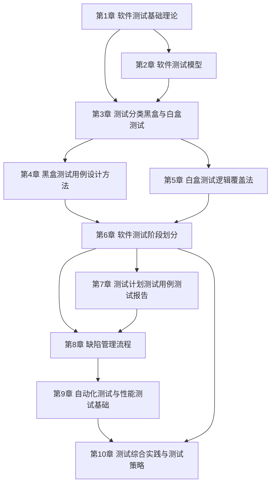

# MOC - 软件测试技术

> [!info] 课程定位
> 软件测试技术是软件工程的核心质量保障课程。它解决的核心问题是：**如何在有限的成本与时间内，系统地发现软件缺陷、评估产品质量、降低发布风险，并最终增强用户对软件的信心**。课程贯穿测试基础理论、测试模型、测试分类、黑盒与白盒测试方法、测试用例设计、缺陷管理、测试管理与自动化实践，是连接软件开发与质量交付的关键环节。

## 课程摘要

本课程围绕“**基础理论 → 测试方法 → 测试管理 → 综合实践**”四条主线展开。学生需要掌握：

1. 软件质量、软件缺陷与软件测试的基本概念，测试七大原则与测试发展阶段；
2. 主流测试过程模型（V/W/H/X 模型）的原理、适用场景与优缺点，以及敏捷测试与测试左移思想；
3. 测试的多维分类体系：按阶段、按目的、按执行方式、按内部知识（黑/白/灰盒）；
4. 黑盒测试方法：等价类划分、边界值分析、因果图、决策表、正交实验与场景法；
5. 白盒测试方法：语句覆盖、判定覆盖、条件覆盖、判定/条件覆盖、条件组合覆盖与路径覆盖；
6. 测试用例的设计、评审与管理，软件缺陷的生命周期与缺陷管理流程；
7. 自动化测试、性能测试与 CI/CD 持续测试在工程中的落地。

## 章节结构与依赖关系

> [!note] 依赖说明
> 第1章奠定质量、缺陷与测试原则的总览基础；第2章引入测试过程模型，明确测试在生命周期中的位置；第3章建立测试分类体系，作为后续方法学习的入口；第4–5章分别展开黑盒与白盒两大方法体系；第6章把方法沉淀为可管理的测试用例；第7章关注缺陷的发现与闭环管理；第8章上升到测试过程与团队管理；第9–10章引入自动化、性能与综合实践，形成从理论到工程的闭环。

## 章节导航

| 章节 | 主题 | 阶段 | 入口 |
| --- | --- | --- | --- |
| 第1章 | 软件测试基础理论 | 基础理论 | [[MOC - 第1章]] |
| 第2章 | 软件测试模型 | 基础理论 | [[MOC - 第2章]] |
| 第3章 | 测试分类：黑盒与白盒测试 | 基础理论 | [[MOC - 第3章]] |
| 第4章 | 黑盒测试用例设计方法 | 测试方法 | [[MOC - 第4章]] |
| 第5章 | 白盒测试逻辑覆盖法 | 测试方法 | [[MOC - 第5章]] |
| 第6章 | 软件测试阶段划分 | 测试方法 | [[MOC - 第6章]] |
| 第7章 | 测试计划、测试用例、测试报告 | 测试管理 | [[MOC - 第7章]] |
| 第8章 | 缺陷管理流程 | 测试管理 | [[MOC - 第8章]] |
| 第9章 | 自动化测试与性能测试基础 | 综合实践 | [[MOC - 第9章]] |
| 第10章 | 测试综合实践与测试策略 | 综合实践 | [[MOC - 第10章]] |

## 分阶段学习目标

> [!example] 基础理论阶段（第1–3章）
> 建立软件测试的心智模型，理解软件质量与缺陷的定义、测试目的与七大原则、测试与调试的区别。掌握 V/W/H/X 等测试过程模型及敏捷测试、测试左移思想。建立测试分类体系，明确黑盒、白盒、灰盒测试的边界与各类测试阶段、目的、执行方式。

> [!example] 测试方法阶段（第4–6章）
> 系统掌握黑盒测试的等价类、边界值、因果图、决策表、正交实验与场景法，能针对功能规格设计有效测试用例；掌握白盒测试的六种逻辑覆盖准则与基本路径法，能针对代码结构计算覆盖并补全用例；能对测试用例进行评审、优先级排序与版本化管理。

> [!example] 测试管理阶段（第7–8章）
> 掌握软件缺陷的属性、严重度、优先级与生命周期，能使用缺陷管理工具完成缺陷报告与跟踪；理解测试计划、测试策略、测试进度与风险控制，能在团队中组织测试过程并进行度量。

> [!example] 综合实践阶段（第9–10章）
> 掌握自动化测试框架的分层设计与脚本维护，了解性能测试的负载模型与关键指标；能在 CI/CD 流水线中落地持续测试，并完成一个涵盖功能、接口、性能的综合测试项目。

## 先修与关联课程

- [[面向对象系统分析与建模]]：提供需求分析、用例建模与设计模型基础，测试用例设计常以用例规约与设计规约作为输入依据。
- [[可视化程序设计]]：提供事件驱动、组件体系与界面交互知识，是 GUI 功能测试与界面自动化测试的对象模型基础。
- 关联延伸：软件工程（工程化流程、SDLC 与质量保证）、[[数据结构]]（白盒测试中路径与控制流分析的基础）、[[Java程序设计]]（单元测试 JUnit 的实现载体）。

## 测试工具推荐

| 工具 | 类型 | 优势 | 适用场景 | 说明 |
| --- | --- | --- | --- | --- |
| JUnit | 单元测试框架 | 与 Java 深度集成、注解简洁、生态成熟 | Java 项目单元测试 | 配合 Maven/Gradle 使用，支持参数化与断言 |
| TestNG | 单元/集成测试框架 | 支持依赖测试、分组、并发执行、数据驱动 | 复杂集成测试、数据驱动测试 | 兼顾单元与集成，灵活度高于 JUnit |
| Selenium | Web UI 自动化 | 支持多浏览器、多语言、跨平台 | Web 应用功能与回归测试 | 配合 WebDriver 驱动浏览器，可集成进 CI |
| JMeter | 性能测试工具 | 开源、协议丰富、可视化报告 | 接口与系统性能、压力与负载测试 | 支持 HTTP/HTTPS/JDBC 等，可分布式压测 |
| Postman | 接口测试工具 | 图形化、支持脚本断言与环境变量 | API 功能测试、联调与契约测试 | 支持集合批量运行，可导出导入接口集 |
| PyTest | Python 测试框架 | 语法简洁、插件丰富、支持参数化 | Python 项目单元与接口测试 | 适合快速编写与持续集成 |

> [!tip] 课程选型建议
> 课程练习推荐 **JUnit** 作为 Java 单元测试主力、**Selenium** 作为 Web UI 自动化入门、**JMeter** 作为性能测试体验工具；**Postman** 适合接口测试快速上手，**PyTest** 适合有 Python 基础的同学进行接口与单元测试。

## 复习与查询入口

- 基础概念速查：[[1.1 软件质量、软件缺陷定义]]、[[1.2 软件测试目的、原则与发展阶段]]、[[1.3 测试与调试区别、测试风险]]
- 测试模型速查：[[2.1 V模型与W模型]]、[[2.2 H模型与X模型]]、[[2.3 敏捷测试模型与测试左移]]
- 测试分类速查：[[3.1 黑盒测试概念与方法概述]]、[[3.2 白盒测试概念与方法概述]]、[[3.3 灰盒测试与测试分类体系]]
- 黑盒方法速查：[[4.1 等价类划分法]]、[[4.2 边界值分析法]]、[[4.3 因果图法与决策表法]]
- 白盒方法速查：[[5.1 语句覆盖与判定覆盖]]、[[5.2 条件覆盖与判定条件覆盖]]、[[5.3 条件组合覆盖与路径覆盖]]
- 测试阶段速查：[[6.1 单元测试与集成测试]]、[[6.2 系统测试与验收测试]]、[[6.3 回归测试与冒烟测试]]
- 测试管理速查：[[7.1 测试计划编写]]、[[7.2 测试用例设计与管理]]、[[7.3 测试报告与度量]]
- 缺陷管理速查：[[8.1 缺陷生命周期与状态流转]]、[[8.2 缺陷分级与分类]]、[[8.3 缺陷管理工具与流程规范]]
- 自动化与性能速查：[[9.1 自动化测试原理与框架]]、[[9.2 接口测试与API测试]]、[[9.3 性能测试基础与工具]]
- 综合实践速查：[[10.1 Web应用测试综合实践]]、[[10.2 移动应用测试实践]]、[[10.3 测试策略与质量保障体系]]
