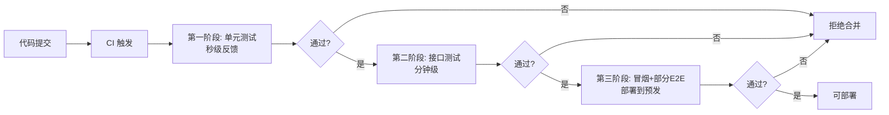

# 习题 - 第10章 综合测试策略

> [!info] 本章习题定位
> 第10章习题围绕 Web 测试与移动测试的工程实践、测试策略制定、测试金字塔模型、持续集成中的分层测试策略、质量保障体系的"测试+评审+度量+改进"闭环展开，是全课程方法论的收束，强调综合运用与策略思维。

## 知识点覆盖表

| 题号 | 题型 | 考查知识点 | 对应笔记 |
| --- | --- | --- | --- |
| 10.1 | 单选 | Web 测试类型 | [[10.1 Web应用测试综合实践]] |
| 10.2 | 单选 | Cookie HttpOnly 属性 | [[10.1 Web应用测试综合实践]] |
| 10.3 | 单选 | DOM 测试与 E2E 测试区别 | [[10.1 Web应用测试综合实践]] |
| 10.4 | 单选 | 移动测试设备碎片化 | [[10.2 移动应用测试实践]] |
| 10.5 | 单选 | Appium 驱动平台 | [[10.2 移动应用测试实践]] |
| 10.6 | 单选 | 测试策略制定依据 | [[10.3 测试策略与质量保障体系]] |
| 10.7 | 单选 | 测试金字塔层次 | [[10.3 测试策略与质量保障体系]] |
| 10.8 | 单选 | 冰淇淋反模式 | [[10.3 测试策略与质量保障体系]] |
| 10.9 | 单选 | CI 测试分层执行 | [[10.3 测试策略与质量保障体系]] |
| 10.10 | 单选 | 质量保障体系组成 | [[10.3 测试策略与质量保障体系]] |
| 10.11 | 多选 | Web 安全测试项 | [[10.1 Web应用测试综合实践]] |
| 10.12 | 多选 | 移动特有测试类型 | [[10.2 移动应用测试实践]] |
| 10.13 | 多选 | 测试金字塔原则 | [[10.3 测试策略与质量保障体系]] |
| 10.14 | 多选 | 质量保障体系组成 | [[10.3 测试策略与质量保障体系]] |
| 10.15 | 多选 | CI 测试阶段 | [[10.3 测试策略与质量保障体系]] |
| 10.16 | 判断 | 响应式测试断点 | [[10.1 Web应用测试综合实践]] |
| 10.17 | 判断 | Appium 跨平台能力 | [[10.2 移动应用测试实践]] |
| 10.18 | 判断 | 测试金字塔顶层最多 | [[10.3 测试策略与质量保障体系]] |
| 10.19 | 判断 | 质量是全员责任 | [[10.3 测试策略与质量保障体系]] |
| 10.20 | 判断 | CI 快速失败原则 | [[10.3 测试策略与质量保障体系]] |
| 10.21 | 简答 | Web 测试类型与兼容性 | [[10.1 Web应用测试综合实践]] |
| 10.22 | 简答 | 移动测试特殊性 | [[10.2 移动应用测试实践]] |
| 10.23 | 简答 | 测试金字塔与 UI 层最少 | [[10.3 测试策略与质量保障体系]] |
| 10.24 | 简答 | 质量保障体系闭环 | [[10.3 测试策略与质量保障体系]] |
| 10.25 | 设计 | Web 电商测试方案 | [[10.1 Web应用测试综合实践]] |
| 10.26 | 设计 | 移动测试策略与 Appium | [[10.2 移动应用测试实践]] |
| 10.27 | 设计 | 测试金字塔与 CI 策略 | [[10.3 测试策略与质量保障体系]] |
| 10.28 | 设计 | 质量度量指标体系 | [[10.3 测试策略与质量保障体系]] |
| 10.29 | 综合 | Web 测试综合实践 | [[10.1 Web应用测试综合实践]] |
| 10.30 | 综合 | 测试策略与质量体系 | [[10.3 测试策略与质量保障体系]] |

## 一、单选题（每题 2 分，共 10 题）

**10.1** 下列不属于 Web 应用测试主要类型的是？

A. 功能测试  
B. 兼容性测试  
C. 编译测试  
D. 性能测试

**10.2** Cookie 的 `HttpOnly` 属性的作用是？

A. 限定 Cookie 仅通过 HTTPS 传输  
B. 防止 JavaScript 读取 Cookie，防 XSS 窃取  
C. 防止 CSRF 攻击  
D. 设置 Cookie 过期时间

**10.3** 关于 DOM 测试与 E2E 测试，下列正确的是？

A. DOM 测试粒度大、执行慢，E2E 测试粒度小、执行快  
B. DOM 测试关注组件逻辑，E2E 测试关注完整业务路径  
C. DOM 测试数量少，E2E 测试数量多  
D. 二者完全相同，可互相替代

**10.4** 移动测试相比 Web 测试最显著的挑战是？

A. 浏览器版本繁多  
B. 设备碎片化（机型、系统、分辨率组合繁多）  
C. 服务器配置差异  
D. 数据库类型不同

**10.5** Appium 在 Android 平台使用的底层驱动是？

A. XCUITest  
B. UIAutomator2  
C. WebDriverAgent  
D. Selendroid

**10.6** 测试策略制定的依据不包括？

A. 基于风险  
B. 基于需求  
C. 基于质量目标  
D. 基于开发人员数量

**10.7** 测试金字塔从底到顶的层次顺序是？

A. E2E 测试 → 接口测试 → 单元测试  
B. 单元测试 → 接口测试 → E2E 测试  
C. 接口测试 → 单元测试 → E2E 测试  
D. 单元测试 → E2E 测试 → 接口测试

**10.8** "冰淇淋模型"反模式的特征是？

A. 单元测试最多、E2E 测试最少  
B. E2E/UI 测试最多、单元测试最少  
C. 接口测试最多  
D. 各层测试数量均匀

**10.9** 持续集成中测试分层执行的原则是？

A. 所有测试塞进一个阶段一次性执行  
B. 快速测试先行门禁，慢速测试后置预发  
C. 只运行 E2E 测试  
D. 慢速测试先行，快速测试后置

**10.10** 质量保障体系的四个组成环节是？

A. 测试、开发、运维、产品  
B. 测试、评审、度量、改进  
C. 计划、设计、执行、报告  
D. 单元、接口、系统、验收

## 二、多选题（每题 3 分，共 5 题）

**10.11** Web 安全测试的典型测试项包括？（多选）

A. XSS 跨站脚本  
B. SQL 注入  
C. 越权访问  
D. 会话固定  
E. 跨浏览器渲染

**10.12** 下列属于移动应用特有测试类型的有？（多选）

A. 安装/卸载/升级测试  
B. 中断测试（来电/短信/通知）  
C. 网络切换测试  
D. 电量与性能测试  
E. 跨浏览器测试

**10.13** 测试金字塔的原则包括？（多选）

A. 底层单元测试数量最多  
B. 顶层 E2E 测试只覆盖核心业务路径  
C. 接口测试居中，性价比高  
D. 底层测试秒级反馈，问题早发现  
E. 顶层 E2E 测试应覆盖全部功能

**10.14** 质量保障体系的组成包括？（多选）

A. 测试（多层次验证）  
B. 评审（需求/设计/代码评审）  
C. 度量（覆盖率/缺陷密度/趋势）  
D. 改进（流程与工具优化）  
E. 部署（自动化发布）

**10.15** 持续集成中的测试阶段包括？（多选）

A. 提交门禁：单元测试（秒级）  
B. 集成阶段：接口测试（分钟级）  
C. 部署前：冒烟 + 部分 E2E（分钟级）  
D. 定期：全量回归 + 性能（小时级）  
E. 上线后：不进行任何测试

## 三、判断题（每题 2 分，共 5 题）

**10.16** 响应式测试需覆盖各断点下的布局，典型断点为手机（<768px）、平板（768–1024px）、桌面（>1024px）。

**10.17** Appium 只支持 Android 平台，无法测试 iOS 应用。

**10.18** 测试金字塔中，顶层 E2E 测试应占最大比例，以覆盖完整业务路径。

**10.19** 质量保障不只是测试团队的事，开发负责单元测试与代码质量，质量是全员责任。

**10.20** CI 测试应遵循"快速失败、尽早反馈"原则，快速测试先行门禁，慢速测试后置。

## 四、简答题（每题 6 分，共 4 题）

**10.21** 列出 Web 应用测试的主要类型，并说明兼容性测试需要覆盖哪些维度。

**10.22** 说明移动应用测试相比 Web 测试的特殊性，并列举至少四种移动特有的测试类型。

**10.23** 解释测试金字塔的层次结构，并说明为什么 UI 层测试应占最小比例。

**10.24** 描述质量保障体系的组成，并说明"测试+评审+度量+改进"闭环如何运作。

## 五、设计题（每题 8 分，共 4 题）

**10.25** 请为某 B2C 电商网站（含用户注册登录、商品浏览、购物车、下单支付、订单管理模块）设计完整测试方案，要求覆盖单元、接口、前端、功能、兼容性、安全、性能七个层次，给出各层测试范围、工具与目标。

**10.26** 请为某移动电商 App 设计测试策略，要求包含：①设备选型原则；②测试分层（接口为主、UI 为辅）；③专项测试（网络/中断/电量）；④用 Appium 编写一个 Android 搜索场景的自动化脚本骨架（搜索框 id 为 `com.example.shop:id/search_box`，搜索按钮 id 为 `com.example.shop:id/btn_search`，结果项 id 为 `com.example.shop:id/item_title`）。

**10.27** 某项目采用 CI/CD 流水线，请设计测试金字塔的分层比例与 CI 中的测试执行策略：①画出金字塔各层比例（单元 70%、接口 20%、E2E 10%）；②说明 CI 各阶段执行的测试类型与反馈时长；③用 Mermaid 画出 CI 测试分层执行流程图。

**10.28** 请为某项目设计质量度量指标体系，要求包含：①覆盖率指标；②缺陷指标（密度、逃逸率、趋势、分布）；③过程指标（评审、自动化率）；④用表格列出指标定义、目标值与作用。

## 六、综合题（每题 10 分，共 2 题）

**10.29** 某电商网站上线前需进行 Web 综合测试，项目情况：前端 React 单页应用，后端 Java 提供 REST API，核心业务为"浏览→加购→下单→支付"。请综合回答：

1. 设计前后端分层测试方案（前端 DOM 测试 + E2E 测试，后端接口测试 + 单元测试），给出各层工具与覆盖范围；
2. 兼容性测试应覆盖哪些浏览器与断点？基于什么原则选型？
3. 安全测试应覆盖哪些项？Cookie 安全属性如何校验？
4. 若采用测试金字塔，各层比例如何分配？为什么 UI 测试不能太多？

**10.30** 某团队希望构建可持续的质量保障体系，当前问题：单元测试缺失、UI 自动化过多导致 CI 慢且易碎、缺陷度量数据未用于改进。请综合回答：

1. 用测试金字塔模型诊断当前问题（冰淇淋反模式），并给出纠正方案；
2. 设计 CI 中的分层测试策略（提交门禁、集成、部署前、定期），说明各阶段测试类型与反馈目标；
3. 设计质量保障体系的"测试+评审+度量+改进"闭环，说明各环节的关键活动；
4. 列出至少 4 个质量度量指标，说明各自回答的问题与改进作用。

---

## 答案与解析

### 单选题答案

<details>
<summary>点击展开单选题答案与解析</summary>

**10.1 答案：C**
解析：Web 测试主要类型包括功能、兼容性、安全、性能、易用性测试。编译测试不属于 Web 测试范畴。

**10.2 答案：B**
解析：`HttpOnly` 防止 JavaScript 读取 Cookie，防 XSS 窃取。`Secure` 限定 HTTPS 传输，`SameSite` 防 CSRF。

**10.3 答案：B**
解析：DOM 测试粒度小、执行快、关注组件逻辑，数量多；E2E 测试粒度大、执行慢、关注完整业务路径，数量少。二者互补，遵循测试金字塔。

**10.4 答案：B**
解析：移动测试最显著的挑战是设备碎片化——机型、屏幕尺寸、分辨率、系统版本组合繁多，需选型覆盖。

**10.5 答案：B**
解析：Appium 在 Android 使用 UIAutomator2 驱动，在 iOS 使用 XCUITest 驱动。

**10.6 答案：D**
解析：测试策略制定依据包括基于风险、基于需求、基于质量目标，不包括基于开发人员数量。

**10.7 答案：B**
解析：测试金字塔从底到顶为单元测试（最多）→ 接口测试（次之）→ E2E 测试（最少）。

**10.8 答案：B**
解析：冰淇淋反模式的特征是 E2E/UI 测试最多、单元测试最少，导致测试慢、易碎、维护成本高、反馈滞后。

**10.9 答案：B**
解析：CI 测试应分层：快速测试（单元）先行门禁，慢速测试（E2E、性能）后置预发，实现快速失败、尽早反馈。

**10.10 答案：B**
解析：质量保障体系由测试、评审、度量、改进四个环节构成闭环，目标是从事后发现前移为事前预防。

</details>

### 多选题答案

<details>
<summary>点击展开多选题答案与解析</summary>

**10.11 答案：A、B、C、D**
解析：Web 安全测试典型项包括 XSS、SQL 注入、越权访问、会话固定。跨浏览器渲染属于兼容性测试，非安全测试。

**10.12 答案：A、B、C、D**
解析：移动特有测试类型包括安装/卸载/升级、中断、网络切换、电量与性能测试。跨浏览器测试是 Web 测试范畴。

**10.13 答案：A、B、C、D**
解析：测试金字塔原则：底层单元测试最多、顶层 E2E 只覆盖核心路径、接口居中性价比高、底层秒级反馈。E2E 不应覆盖全部功能，否则易碎。

**10.14 答案：A、B、C、D**
解析：质量保障体系由测试、评审、度量、改进组成。部署不属于质量保障体系的四个核心环节。

**10.15 答案：A、B、C、D**
解析：CI 测试阶段包括提交门禁（单元）、集成阶段（接口）、部署前（冒烟+E2E）、定期（全量回归+性能）。上线后仍需监控与线上测试。

</details>

### 判断题答案

<details>
<summary>点击展开判断题答案与解析</summary>

**10.16 答案：正确**
解析：响应式测试典型断点：手机（<768px）、平板（768–1024px）、桌面（>1024px），需覆盖各断点下布局、导航折叠、图片缩放、触摸目标大小。

**10.17 答案：错误**
解析：Appium 是跨平台移动 UI 自动化框架，支持 iOS（XCUITest）与 Android（UIAutomator2），一套 API 跨平台测试。

**10.18 答案：错误**
解析：测试金字塔中顶层 E2E 测试应占最小比例。E2E 测试慢、易碎、维护成本高，只覆盖核心业务路径。顶层过多会形成冰淇淋反模式。

**10.19 答案：正确**
解析：质量保障不只是测试团队的事。开发负责单元测试与代码质量，产品负责需求清晰，运维负责环境稳定。质量是全员责任。

**10.20 答案：正确**
解析：CI 测试应遵循"快速失败、尽早反馈"原则，快速测试先行门禁、慢速测试后置预发，避免把所有测试塞进一个阶段导致 CI 慢且反馈滞后。

</details>

### 简答题答案

<details>
<summary>点击展开简答题参考答案</summary>

**10.21 参考答案**
主要类型：功能测试、兼容性测试、安全测试、性能测试、易用性测试、接口测试。
兼容性测试维度：①浏览器（Chrome/Edge/Firefox/Safari 及版本）；②操作系统（Windows/macOS/Linux/Android/iOS）；③分辨率（桌面、平板、手机）；④响应式布局断点；⑤网络环境（4G/5G/WiFi/弱网）。兼容性测试应基于用户实际使用分布优先覆盖主流环境，而非穷举所有组合。

**10.22 参考答案**
移动特殊性：①设备碎片化（机型、屏幕、系统版本繁多）；②网络切换（WiFi/4G/5G 切换、弱网、断网）；③电量与后台机制影响；④中断事件（来电、短信、通知、闹钟）；⑤安装/卸载/升级场景；⑥触控与手势交互。
移动特有测试类型：安装/卸载/升级测试、中断测试、网络切换测试、兼容性测试（机型/分辨率）、电量与性能测试、手势与传感器测试。

**10.23 参考答案**
测试金字塔从底到顶为：单元测试（最多）、集成/接口测试（次之）、端到端/UI 测试（最少）。
UI 层应占最小比例的原因：①UI 测试执行慢，反馈周期长；②UI 易变，脚本维护成本高、易碎；③定位问题困难，失败难以归因到具体代码；④投入产出比低于底层测试。金字塔原则保证大量快速的底层测试覆盖逻辑，少量 E2E 测试覆盖核心路径，兼顾速度与覆盖。

**10.24 参考答案**
质量保障体系组成：测试（多层次的验证）、评审（需求/设计/代码评审）、度量（覆盖率、缺陷密度、趋势等指标）、改进（基于度量的流程优化）。
闭环运作：测试发现缺陷并度量 → 度量数据暴露薄弱环节 → 评审在源头预防同类问题 → 改进流程与工具 → 进入下一轮迭代验证。该闭环把"事后发现"逐步前移为"事前预防"，使质量保障从单纯的测试上升为体系化的工程能力。

</details>

### 设计题答案

<details>
<summary>点击展开设计题参考答案</summary>

**10.25 参考答案**
B2C 电商网站测试方案：

| 层次 | 测试范围 | 工具 | 目标 |
| --- | --- | --- | --- |
| 单元测试 | 后端价格计算、库存扣减、优惠券逻辑 | JUnit | 覆盖率 > 80% |
| 接口测试 | 商品、购物车、订单、支付接口 | Requests+PyTest / Postman | 覆盖正向/反向/权限 |
| 前端测试 | 商品卡、购物车组件渲染 | Jest + Testing Library | 组件逻辑正确 |
| 功能测试 | 浏览→加购→下单→支付业务流程 | 手工 + 决策表 | 业务流程通过 |
| 兼容性测试 | Chrome/Edge/Safari + 移动响应式断点 | BrowserStack | 多环境一致 |
| 安全测试 | XSS/SQL 注入/越权/支付签名 | OWASP ZAP + 手工 | 无高危漏洞 |
| 性能测试 | 商品详情、下单接口压测 | JMeter | TPS 与响应时间达标 |

交付物：测试计划、测试用例、自动化脚本、性能测试报告、测试总结报告。

**10.26 参考答案**
移动电商 App 测试策略：
1. 设备选型：基于用户分布选择 Top 机型与系统版本（覆盖 80% 用户），剩余用云测平台补充，不穷举。
2. 测试分层：接口自动化为主（性价比高），UI 自动化覆盖核心路径（登录、搜索、下单）。
3. 专项测试：网络切换（WiFi/4G/弱网/断网）、中断（来电/短信/通知）、电量（低电量/省电模式）、性能（CPU/内存/启动时间）。
4. Appium 搜索场景脚本骨架：
```python
from appium import webdriver
from appium.webdriver.common.appiumby import AppiumBy

caps = {
    "platformName": "Android",
    "platformVersion": "12",
    "deviceName": "Pixel_Emulator",
    "appPackage": "com.example.shop",
    "appActivity": ".MainActivity",
    "noReset": True,
}
driver = webdriver.Remote("http://127.0.0.1:4723/wd/hub", caps)

try:
    # 定位搜索框并输入商品名
    driver.find_element(AppiumBy.ID, "com.example.shop:id/search_box").send_keys("手机")
    # 点击搜索按钮
    driver.find_element(AppiumBy.ID, "com.example.shop:id/btn_search").click()
    # 断言结果列表非空
    items = driver.find_elements(AppiumBy.ID, "com.example.shop:id/item_title")
    assert len(items) > 0, "搜索结果为空"
    print("移动搜索测试通过")
finally:
    driver.quit()
```

**10.27 参考答案**
1. 测试金字塔分层比例：
   - 单元测试 70%：覆盖函数逻辑分支，秒级反馈；
   - 接口测试 20%：覆盖服务契约与业务逻辑，分钟级；
   - E2E 测试 10%：覆盖核心业务路径，分钟级。
2. CI 各阶段测试类型与反馈：
   - 提交门禁：单元测试，秒级反馈；
   - 集成阶段：接口测试，分钟级；
   - 部署前：冒烟 + 部分 E2E，分钟级；
   - 定期：全量回归 + 性能，小时级。
3. CI 测试分层执行流程图：


**10.28 参考答案**
质量度量指标体系：

| 指标类别 | 指标名称 | 定义 | 目标值 | 作用 |
| --- | --- | --- | --- | --- |
| 覆盖率 | 代码覆盖率 | 已执行代码/总代码 | ≥ 80% | 测试充分性 |
| 覆盖率 | 需求覆盖率 | 已测需求/总需求 | 100% | 需求验证完整性 |
| 缺陷 | 缺陷密度 | 缺陷数/代码规模 | < 5/KLOC | 代码质量 |
| 缺陷 | 缺陷逃逸率 | 漏到生产的缺陷/总缺陷 | < 5% | 测试有效性 |
| 缺陷 | 缺陷趋势 | 每日发现/修复数曲线 | 收敛 | 质量收敛判断 |
| 缺陷 | 缺陷分布 | 按模块/严重度统计 | 无聚集 | 定位薄弱环节 |
| 过程 | 评审覆盖率 | 已评审需求/总需求 | 100% | 缺陷预防 |
| 过程 | 自动化率 | 自动化用例/总用例 | ≥ 70% | 回归效率 |

</details>

### 综合题答案

<details>
<summary>点击展开综合题参考答案</summary>

**10.29 参考答案**
1. 前后端分层测试方案：
   - 前端 DOM 测试：用 Jest + Testing Library 测试商品卡、购物车组件的渲染与交互逻辑，关注组件行为而非实现细节；
   - 前端 E2E 测试：用 Cypress 测试核心下单流程（浏览→加购→下单→支付），覆盖完整业务路径；
   - 后端接口测试：用 Requests+PyTest 测试商品、购物车、订单、支付接口，覆盖正向/反向/权限/业务副作用；
   - 后端单元测试：用 JUnit 测试价格计算、库存扣减、优惠券等核心逻辑，目标覆盖率 > 80%。
2. 兼容性测试覆盖：
   - 浏览器：Chrome、Edge、Safari（基于用户分布优先覆盖主流，不穷举）；
   - 断点：手机（<768px）、平板（768–1024px）、桌面（>1024px）；
   - 选型原则：基于用户实际使用分布优先覆盖 80% 用户的主流环境，剩余用 BrowserStack 等云测平台补充。
3. 安全测试覆盖：
   - XSS 跨站脚本、SQL 注入、越权访问、会话固定、支付接口签名校验；
   - Cookie 安全属性校验：`HttpOnly`（防 JS 读取，防 XSS 窃取）、`Secure`（限 HTTPS 传输）、`SameSite`（防 CSRF）；登录后 Session ID 应刷新防会话固定。
4. 测试金字塔比例分配：
   - 单元测试 70%（最多）：覆盖逻辑分支，秒级反馈；
   - 接口测试 20%：覆盖契约与业务逻辑；
   - E2E 测试 10%（最少）：只覆盖核心业务路径。
   UI 测试不能太多的原因：①执行慢、反馈周期长；②UI 易变、脚本易碎、维护成本高；③失败定位困难；④投入产出比低于底层测试。过多 UI 测试会形成冰淇淋反模式。

**10.30 参考答案**
1. 诊断与纠正：
   当前问题符合"冰淇淋反模式"：UI 自动化过多（顶层大）、单元测试缺失（底层空），导致 CI 慢且易碎。
   纠正方案：①补齐单元测试，用 JUnit/PyTest 覆盖核心逻辑，目标覆盖率 > 80%；②把 UI 自动化精简到核心冒烟路径，淘汰易碎脚本；③增加接口自动化作为中层主力；④把接口与单元测试接入 CI 门禁，E2E 后置预发。
2. CI 分层测试策略：

   | 阶段 | 测试类型 | 反馈目标 |
   | --- | --- | --- |
   | 提交门禁 | 单元测试 | 秒级 |
   | 集成阶段 | 接口测试 | 分钟级 |
   | 部署前 | 冒烟 + 部分 E2E | 分钟级 |
   | 定期 | 全量回归 + 性能 | 小时级 |

   原则：快速失败、尽早反馈，快速测试先行门禁，慢速测试后置预发。
3. 质量保障体系闭环：
   - 测试：多层次验证（单元/接口/E2E/性能），发现缺陷；
   - 评审：需求评审、设计评审、代码评审、用例评审，在源头预防缺陷；
   - 度量：覆盖率、缺陷密度、逃逸率、趋势、分布，量化质量；
   - 改进：基于度量数据复盘根因，优化流程与工具，进入下一轮迭代。
   闭环运作：测试发现缺陷并度量 → 度量暴露薄弱环节 → 评审预防同类问题 → 改进流程 → 迭代验证，把事后发现前移为事前预防。
4. 质量度量指标：
   - 覆盖率：回答"测试是否充分"，驱动补齐用例；
   - 缺陷逃逸率：回答"测试是否有效"，漏到生产的缺陷占比，驱动测试改进；
   - 缺陷趋势：回答"质量是否收敛、能否发布"，发现/修复曲线预测收敛；
   - 缺陷分布：回答"问题集中在哪"，定位薄弱模块，重点投入。

</details>

## 考点统计表

| 考查维度 | 题量 | 分值占比 | 难度 |
| --- | --- | --- | --- |
| Web 应用测试综合实践 | 8 | 约 27% | 中 |
| 移动应用测试实践 | 7 | 约 23% | 中 |
| 测试策略与测试金字塔 | 7 | 约 23% | 中高 |
| 持续集成测试策略 | 4 | 约 13% | 中高 |
| 质量保障体系 | 4 | 约 14% | 中高 |
| **合计** | **30** | **100%** | — |

## 关联

- 上一级：[[MOC - 软件测试技术]]
- 本章知识点：[[MOC - 第10章]]
- 上一章习题：[[习题-第9章-自动化与性能测试]]
