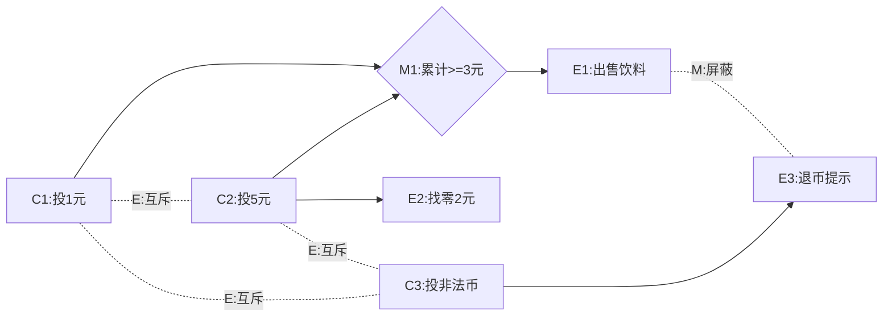

# 习题 - 第4章 黑盒测试用例设计

> [!info] 本章习题定位
> 第4章是黑盒测试方法的核心章节，习题围绕等价类划分法、边界值分析法、因果图法与决策表法展开。设计题要求完整设计测试用例表，是期末考试与课程设计的重点。

## 知识点覆盖表

| 题号 | 题型 | 考查知识点 | 对应笔记 |
| --- | --- | --- | --- |
| 4.1 | 单选 | 等价类定义 | [[4.1 等价类划分法]] |
| 4.2 | 单选 | 有效/无效等价类 | [[4.1 等价类划分法]] |
| 4.3 | 单选 | 无效等价类单独覆盖 | [[4.1 等价类划分法]] |
| 4.4 | 单选 | 区间型划分 | [[4.1 等价类划分法]] |
| 4.5 | 单选 | 边界值取值 | [[4.2 边界值分析法]] |
| 4.6 | 单选 | 边界值与等价类关系 | [[4.2 边界值分析法]] |
| 4.7 | 单选 | 因果图约束 E | [[4.3 因果图法与决策表法]] |
| 4.8 | 单选 | 因果图约束 M | [[4.3 因果图法与决策表法]] |
| 4.9 | 单选 | 决策表四要素 | [[4.3 因果图法与决策表法]] |
| 4.10 | 单选 | 方法选择 | [[4.3 因果图法与决策表法]] |
| 4.11 | 多选 | 等价类划分原则 | [[4.1 等价类划分法]] |
| 4.12 | 多选 | 边界值取值 | [[4.2 边界值分析法]] |
| 4.13 | 多选 | 因果图约束 | [[4.3 因果图法与决策表法]] |
| 4.14 | 多选 | 决策表四要素 | [[4.3 因果图法与决策表法]] |
| 4.15 | 多选 | 方法适用场景 | [[4.1 等价类划分法]] |
| 4.16 | 判断 | 无效等价类重要性 | [[4.1 等价类划分法]] |
| 4.17 | 判断 | 边界值适用范围 | [[4.2 边界值分析法]] |
| 4.18 | 判断 | M 约束作用对象 | [[4.3 因果图法与决策表法]] |
| 4.19 | 判断 | 决策表规则数 | [[4.3 因果图法与决策表法]] |
| 4.20 | 判断 | 等价类代表值假设 | [[4.1 等价类划分法]] |
| 4.21 | 简答 | 等价类划分步骤 | [[4.1 等价类划分法]] |
| 4.22 | 简答 | 因果图五类约束 | [[4.3 因果图法与决策表法]] |
| 4.23 | 简答 | 因果图到决策表转换 | [[4.3 因果图法与决策表法]] |
| 4.24 | 简答 | 边界值与等价类配合 | [[4.2 边界值分析法]] |
| 4.25 | 设计 | 等价类+边界值用例 | [[4.1 等价类划分法]] |
| 4.26 | 设计 | 注册表单用例 | [[4.1 等价类划分法]] |
| 4.27 | 设计 | 决策表用例 | [[4.3 因果图法与决策表法]] |
| 4.28 | 设计 | 售货机因果图决策表 | [[4.3 因果图法与决策表法]] |
| 4.29 | 综合 | 综合用例设计 | [[4.2 边界值分析法]] |
| 4.30 | 综合 | 方法组合应用 | [[4.3 因果图法与决策表法]] |

## 一、单选题（每题 2 分，共 10 题）

**4.1** 等价类划分法的基本假设是？

A. 每个输入都必须测试  
B. 等价类中的代表值能代表整个类  
C. 边界值最容易出错  
D. 所有输入组合都需覆盖

**4.2** 下列关于有效等价类与无效等价类的描述，正确的是？

A. 有效等价类用于检验异常处理能力  
B. 无效等价类用于检验程序是否实现预期功能  
C. 有效等价类符合需求规格，无效等价类不符合需求规格  
D. 只需设计有效等价类即可

**4.3** 设计无效用例时，"每个无效等价类必须由一个独立用例单独覆盖"的原因是？

A. 减少用例数量  
B. 避免多个无效输入同时出现时，程序在第一个无效处报错而掩盖其他无效输入未被处理的问题  
C. 提高测试效率  
D. 符合边界值分析原则

**4.4** 对输入条件"成绩为 0~100 的整数"，按区间型划分可得到几个等价类？

A. 1 个  
B. 2 个  
C. 3 个（1 个有效 + 2 个无效）  
D. 4 个

**4.5** 对输入范围为 [min, max] 的数值型输入，边界值分析法通常选取几个值？

A. 3 个  
B. 4 个  
C. 5 个  
D. 6 个（min-1、min、min+1、max-1、max、max+1）

**4.6** 边界值分析与等价类划分的关系是？

A. 二者互斥，只能选其一  
B. 边界值分析作为等价类划分的补充，"等价类定类 + 边界值定点"  
C. 边界值分析可替代等价类划分  
D. 等价类划分针对边界，边界值分析针对中间

**4.7** 因果图中，E 约束（互斥）的含义是？

A. 至少有一个原因必须成立  
B. 两个原因不能同时成立，至多一个为真  
C. 有且仅有一个原因成立  
D. 若 a 成立则 b 必须成立

**4.8** 因果图中，M 约束（屏蔽）作用于？

A. 原因之间  
B. 结果之间  
C. 条件与动作之间  
D. 输入与输出之间

**4.9** 决策表的四要素包括条件桩、条件项、动作桩和？

A. 规则桩  
B. 动作项  
C. 条件组合  
D. 动作规则

**4.10** 当输入之间存在逻辑依赖与约束时，最合适的黑盒方法是？

A. 等价类划分  
B. 边界值分析  
C. 因果图法与决策表法  
D. 正交实验法

## 二、多选题（每题 3 分，共 5 题）

**4.11** 等价类划分的常用原则包括？（多选）

A. 区间（数值范围）  
B. 集合（离散值）  
C. 条件（须满足某条件）  
D. 规则（多条规则约束）  
E. 随机选取

**4.12** 对输入范围为 [10, 50] 的数值，边界值分析法应选取的值有？（多选）

A. 9（min-1）  
B. 10（min）  
C. 11（min+1）  
D. 49（max-1）  
E. 50（max）  
F. 51（max+1）

**4.13** 因果图的五类约束中，作用于"原因之间"的有？（多选）

A. E（互斥）  
B. I（包含）  
C. O（唯一）  
D. R（要求）  
E. M（屏蔽）

**4.14** 决策表的四要素包括？（多选）

A. 条件桩  
B. 条件项  
C. 动作桩  
D. 动作项  
E. 规则项

**4.15** 下列关于黑盒测试方法适用场景的描述，正确的有？（多选）

A. 输入独立、范围明确：等价类 + 边界值  
B. 输入间存在逻辑依赖：因果图 → 决策表  
C. 多因素多水平需控制规模：正交实验  
D. 实际项目常组合使用  
E. 所有场景都只用等价类即可

## 三、判断题（每题 2 分，共 5 题）

**4.16** 大量缺陷隐藏在异常处理路径中，因此无效等价类与有效等价类同等重要，缺一不可。

**4.17** 边界值分析法适用于所有类型的输入，包括枚举型与布尔型。

**4.18** 因果图中 M 约束（屏蔽）作用于结果之间，而非原因之间。

**4.19** 若决策表有 n 个条件，最多有 $2^n$ 条规则，可通过无关项合并简化。

**4.20** 等价类划分基于"等价类中的代表值能代表整个类"的假设，因此每个等价类只需取一个代表值。

## 四、简答题（每题 6 分，共 4 题）

**4.21** 简述等价类划分法生成测试用例的完整步骤，并说明有效用例与无效用例的生成规则。

**4.22** 说明因果图中 E（互斥）、I（包含）、O（唯一）、R（要求）、M（屏蔽）五类约束的含义与作用对象。

**4.23** 简述从因果图到决策表的转换步骤。

**4.24** 说明边界值分析与等价类划分如何配合使用，形成"定类 + 定点"的策略。

## 五、设计题（每题 8 分，共 4 题）

**4.25** 某系统要求输入"年龄为 18~60 的整数"。请：

1. 写出等价类划分表（有效与无效等价类，并编号）；
2. 写出边界值取值；
3. 设计完整测试用例表（有效用例合并覆盖，无效用例单独覆盖）。

**4.26** 某用户注册表单包含三个字段：

| 字段 | 规则 |
| --- | --- |
| 用户名 | 6~18 位字符，由字母、数字、下划线组成 |
| 密码 | 8~20 位，必须同时包含字母和数字 |
| 邮箱 | 符合标准邮箱格式（含 @ 与域名） |

请编写等价类表，并设计测试用例表（至少包含 1 个有效用例和覆盖每个无效等价类的无效用例）。

**4.27** 某系统对用户登录有以下规则：输入用户名和密码，若两者都正确则登录成功；若用户名不存在则提示"用户不存在"；若用户名存在但密码错误则提示"密码错误"；若用户名或密码为空则提示"不能为空"。请用决策表法设计测试用例，写出完整决策表与对应用例。

**4.28** 某自动售货机销售饮料，单价 3 元，仅接受 1 元和 5 元硬币：

1. 投入总额 ≥ 3 元时，出售饮料并找零；
2. 若投入 5 元，找零 2 元；
3. 若投入 3 元（三个 1 元），不找零；
4. 投入总额 < 3 元，等待继续投币，不出货；
5. 投入非 1 元/5 元硬币，退币并提示。

请列出原因与结果，画出因果图（标注约束），并写出决策表与测试用例。

## 六、综合题（每题 10 分，共 2 题）

**4.29** 某查询系统要求用户输入日期范围：

- 开始日期 `startDate`、结束日期 `endDate`，格式 `YYYY-MM-DD`；
- 日期范围限定在 2020-01-01 至 2025-12-31 之间；
- 开始日期须不晚于结束日期。

请综合运用等价类划分与边界值分析：

1. 写出等价类与边界值分析表；
2. 设计完整测试用例表（包含范围边界、特殊日历边界如闰年、月末、顺序约束）；
3. 说明设计要点。

**4.30** 某电商优惠券系统有以下规则：用户下单时可使用优惠券，优惠券分"满减券"和"折扣券"两类，每笔订单只能使用一张券；满减券需订单金额满一定门槛才生效，折扣券对所有金额生效；若订单金额为 0 或负数则报错。请综合运用因果图法与决策表法：

1. 列出原因（条件）与结果（动作）；
2. 标注约束关系；
3. 写出决策表；
4. 生成测试用例表。

---

## 答案与解析

### 单选题答案

点击展开单选题答案与解析

**4.1 答案：B**
解析：等价类划分基于"等价类中的代表值能代表整个类"的假设，只需从每个等价类中取一个代表值即可假设覆盖了该类全部输入。

**4.2 答案：C**
解析：有效等价类符合需求规格，用于检验程序实现预期功能；无效等价类不符合需求规格，用于检验异常处理能力。

**4.3 答案：B**
解析：若多个无效输入同时出现，程序可能在第一个无效处即报错退出，掩盖其他无效输入未被正确处理的问题，导致缺陷漏测。因此每个无效等价类单独覆盖。

**4.4 答案：C**
解析：区间型输入产生 1 个有效（范围内）+ 2 个无效（小于下界、大于上界），共 3 个等价类。

**4.5 答案：D**
解析：边界值选取 6 个值：min-1、min、min+1、max-1、max、max+1。

**4.6 答案：B**
解析：边界值分析作为等价类划分的补充，等价类确定"测哪些类"，边界值确定"在边界附近取哪些值"，形成"定类+定点"策略。

**4.7 答案：B**
解析：E（互斥，Exclude）指两个原因不能同时成立，至多一个为真。

**4.8 答案：B**
解析：M（屏蔽，Mask）作用于结果之间：若结果 a 成立则结果 b 不成立。E/I/O/R 作用于原因之间。

**4.9 答案：B**
解析：决策表四要素：条件桩、条件项、动作桩、动作项。

**4.10 答案：C**
解析：输入间存在逻辑依赖与约束时，因果图法刻画因果关系与约束，决策表把关系表格化为规则，二者配套使用。

### 多选题答案

点击展开多选题答案与解析

**4.11 答案：A、B、C、D**
解析：四类划分原则：区间、集合、条件、规则。E（随机选取）不是划分原则。

**4.12 答案：A、B、C、D、E、F**
解析：6 个边界值全部：9(min-1)、10(min)、11(min+1)、49(max-1)、50(max)、51(max+1)。

**4.13 答案：A、B、C、D**
解析：E（互斥）、I（包含）、O（唯一）、R（要求）作用于原因之间；M（屏蔽）作用于结果之间。

**4.14 答案：A、B、C、D**
解析：决策表四要素：条件桩、条件项、动作桩、动作项。规则是每一列组合，不是独立要素。

**4.15 答案：A、B、C、D**
解析：输入独立用等价类+边界值，输入有依赖用因果图+决策表，多因素控规模用正交实验，实际常组合使用。E 错误，不同场景需不同方法。

### 判断题答案

点击展开判断题答案与解析

**4.16 答案：正确**
解析：大量缺陷隐藏在异常处理路径中，无效等价类与有效等价类同等重要，缺一不可。

**4.17 答案：错误**
解析：边界值分析主要针对数值型与范围型输入，对枚举型、布尔型输入意义不大，应优先使用等价类或决策表。

**4.18 答案：正确**
解析：M（屏蔽）作用于结果之间，E/I/O/R 作用于原因之间。

**4.19 答案：正确**
解析：n 个条件最多 $2^n$ 条规则，通过约束排除不可能组合，通过无关项（—）合并简化。

**4.20 答案：正确**
解析：等价类划分基于代表值假设，每个等价类取一个代表值即可假设覆盖该类。

### 简答题答案

点击展开简答题参考答案

**4.21 参考答案**
步骤：①划分等价类（有效与无效）；②编写等价类表并编号；③生成有效用例——尽量让一个用例覆盖多个有效等价类；④生成无效用例——每个无效等价类由一个独立用例单独覆盖，其余输入取有效值；⑤形成测试用例集。
有效用例规则：合并覆盖，减少用例数。无效用例规则：单独覆盖，避免掩盖。

**4.22 参考答案**
- E（互斥，Exclude）：原因之间，两个原因不能同时成立，至多一个为真。
- I（包含，Include）：原因之间，至少有一个原因必须成立。
- O（唯一，Only）：原因之间，有且仅有一个原因成立。
- R（要求，Require）：原因之间，若 a 成立则 b 必须成立。
- M（屏蔽，Mask）：结果之间，若结果 a 成立则结果 b 不成立。

**4.23 参考答案**
转换步骤：①列出因果图中所有原因（条件）和结果（动作）；②按约束排除不可能的条件组合；③对剩余每一组条件组合，确定对应动作；④将条件作为条件桩、动作作为动作桩，每列组合作为一条规则填入决策表；⑤对无关项（—）且动作相同的规则合并简化；⑥每条规则对应一个测试用例。

**4.24 参考答案**
配合策略："等价类定类 + 边界值定点"。①先用等价类划分确定输入的有效区间与无效区间；②对每个边界取 6 个值（min-1、min、min+1、max-1、max、max+1）；③对中间区域取 1 个代表值覆盖非边界等价类；④合并去重，边界值与等价类代表值重合时合并。

### 设计题答案

点击展开设计题参考答案

**4.25 参考答案**

1. 等价类表：

| 输入条件 | 有效等价类 | 编号 | 无效等价类 | 编号 |
| --- | --- | --- | --- | --- |
| 年龄范围 | 18~60 的整数 | V1 | <18 | I1 |
| 年龄范围 | — | — | >60 | I2 |
| 年龄类型 | 整数 | V2 | 非整数（字母、小数） | I3 |

2. 边界值取值：17(min-1)、18(min)、19(min+1)、59(max-1)、60(max)、61(max+1)。

3. 测试用例表：

| 用例号 | 年龄输入 | 覆盖等价类 | 预期结果 |
| --- | --- | --- | --- |
| TC1 | 30 | V1,V2 | 有效，接受 |
| TC2 | 17 | I1 | 无效，提示过小 |
| TC3 | 61 | I2 | 无效，提示过大 |
| TC4 | abc | I3 | 无效，提示非整数 |

边界值补充用例：

| 用例号 | 年龄输入 | 说明 | 预期结果 |
| --- | --- | --- | --- |
| TC5 | 18 | min 边界 | 有效 |
| TC6 | 60 | max 边界 | 有效 |
| TC7 | 19 | min+1 | 有效 |
| TC8 | 59 | max-1 | 有效 |

**4.26 参考答案**

等价类表：

| 输入条件 | 有效等价类 | 编号 | 无效等价类 | 编号 |
| --- | --- | --- | --- | --- |
| 用户名长度 | 6~18 位 | V1 | <6 位 | I1 |
| 用户名长度 | — | — | >18 位 | I2 |
| 用户名字符 | 字母/数字/下划线 | V2 | 含非法字符 | I3 |
| 密码长度 | 8~20 位 | V3 | <8 位 | I4 |
| 密码长度 | — | — | >20 位 | I5 |
| 密码组成 | 含字母和数字 | V4 | 仅字母 | I6 |
| 密码组成 | — | — | 仅数字 | I7 |
| 邮箱格式 | 含@与合法域名 | V5 | 缺少@ | I8 |
| 邮箱格式 | — | — | 域名非法 | I9 |

测试用例表：

| 用例号 | 用户名 | 密码 | 邮箱 | 覆盖 | 预期结果 |
| --- | --- | --- | --- | --- | --- |
| TC1 | user_01 | pass1234 | test@example.com | V1~V5 | 注册成功 |
| TC2 | usr | pass1234 | test@example.com | I1 | 用户名过短 |
| TC3 | user_name_too_long_123 | pass1234 | test@example.com | I2 | 用户名过长 |
| TC4 | user name | pass1234 | test@example.com | I3 | 用户名含非法字符 |
| TC5 | user_01 | pass12 | test@example.com | I4 | 密码过短 |
| TC6 | user_01 | password_too_long_12345 | test@example.com | I5 | 密码过长 |
| TC7 | user_01 | password | test@example.com | I6 | 密码须含数字 |
| TC8 | user_01 | 12345678 | test@example.com | I7 | 密码须含字母 |
| TC9 | user_01 | pass1234 | testexample.com | I8 | 邮箱格式错误 |
| TC10 | user_01 | pass1234 | test@example | I9 | 邮箱域名非法 |

**4.27 参考答案**

决策表：

| 规则 | 1 | 2 | 3 | 4 | 5 |
| --- | --- | --- | --- | --- | --- |
| **条件桩** | | | | | |
| 用户名为空 | Y | N | N | N | N |
| 密码为空 | — | Y | N | N | N |
| 用户名存在 | — | — | N | Y | Y |
| 密码正确 | — | — | — | N | Y |
| **动作桩** | | | | | |
| 提示不能为空 | X | X | | | |
| 提示用户不存在 | | | X | | |
| 提示密码错误 | | | | X | |
| 登录成功 | | | | | X |

测试用例表：

| 用例号 | 用户名 | 密码 | 预期结果 | 覆盖规则 |
| --- | --- | --- | --- | --- |
| TC1 | （空） | 任意 | 提示不能为空 | 规则1 |
| TC2 | alice | （空） | 提示不能为空 | 规则2 |
| TC3 | nobody | Pass1234 | 提示用户不存在 | 规则3 |
| TC4 | alice | wrongpwd | 提示密码错误 | 规则4 |
| TC5 | alice | Pass1234 | 登录成功 | 规则5 |

**4.28 参考答案**

原因：C1 投1元、C2 投5元、C3 投非法币。中间节点 M1 累计≥3元。结果：E1 出售饮料、E2 找零2元、E3 退币提示。

因果图（约束）：C1、C2、C3 互斥（E）；E1 与 E3 屏蔽（M）。

决策表：

| 规则 | 1 | 2 | 3 | 4 | 5 |
| --- | --- | --- | --- | --- | --- |
| C1 投1元 | Y | N | N | Y | N |
| C2 投5元 | N | Y | N | N | Y |
| C3 投非法币 | N | N | Y | N | N |
| 累计≥3元 | N | Y | — | Y | Y |
| E1 出售饮料 | | X | | X | X |
| E2 找零2元 | | X | | | X |
| E3 退币提示 | | | X | | |

测试用例表：

| 用例号 | 投币情况 | 累计金额 | 预期动作 | 覆盖规则 |
| --- | --- | --- | --- | --- |
| TC1 | 投1元（首次） | 1元 | 无动作，等待继续投币 | 规则1 |
| TC2 | 投5元 | 5元 | 出售饮料+找零2元 | 规则2 |
| TC3 | 投0.5元（非法） | — | 退币并提示 | 规则3 |
| TC4 | 投1元（第三次） | 3元 | 出售饮料，不找零 | 规则4 |

### 综合题答案

点击展开综合题参考答案

**4.29 参考答案**

1. 等价类与边界值分析表：

| 等价类 | 边界值取值 | 类型 |
| --- | --- | --- |
| 早于下界 | 2019-12-31（min-1） | 无效 |
| 下界 | 2020-01-01（min） | 有效 |
| 下界邻域 | 2020-01-02（min+1） | 有效 |
| 中间代表值 | 2023-06-15 | 有效 |
| 上界邻域 | 2025-12-30（max-1） | 有效 |
| 上界 | 2025-12-31（max） | 有效 |
| 晚于上界 | 2026-01-01（max+1） | 无效 |

特殊边界：闰年 2024-02-29（有效）、非闰年 2023-02-29（无效）、月末 2023-01-31（有效）、月末越界 2023-02-30（无效）。

2. 测试用例表：

| 用例号 | startDate | endDate | 预期结果 | 说明 |
| --- | --- | --- | --- | --- |
| TC1 | 2019-12-31 | 2023-06-15 | 提示日期超出范围 | min-1 无效 |
| TC2 | 2020-01-01 | 2023-06-15 | 查询成功 | min 有效边界 |
| TC3 | 2020-01-02 | 2023-06-15 | 查询成功 | min+1 有效 |
| TC4 | 2023-06-15 | 2025-12-30 | 查询成功 | max-1 有效 |
| TC5 | 2023-06-15 | 2025-12-31 | 查询成功 | max 有效边界 |
| TC6 | 2023-06-15 | 2026-01-01 | 提示日期超出范围 | max+1 无效 |
| TC7 | 2024-02-29 | 2024-03-01 | 查询成功 | 闰年边界 |
| TC8 | 2023-02-29 | 2023-03-01 | 提示日期非法 | 非闰年越界 |
| TC9 | 2023-06-15 | 2023-06-14 | 提示开始日期晚于结束日期 | 顺序约束 |

3. 设计要点：日期边界值不能只看范围上下界，还要考虑日历本身的特殊边界（闰年、月末、年末），这些是实践中极易出错的位置；此外需验证开始日期不晚于结束日期的顺序约束。

**4.30 参考答案**

1. 原因与结果：
原因：C1 使用满减券、C2 使用折扣券、C3 订单金额≥满减门槛、C4 订单金额为0或负数。
结果：E1 满减生效、E2 折扣生效、E3 报错、E4 不使用券（原价）。

2. 约束：C1 与 C2 互斥（E，每笔只能一张券）；C4 与其他动作屏蔽（M，金额异常直接报错）。

3. 决策表（简化）：

| 规则 | 1 | 2 | 3 | 4 | 5 |
| --- | --- | --- | --- | --- | --- |
| C1 满减券 | Y | N | Y | N | — |
| C2 折扣券 | N | Y | N | Y | — |
| C3 金额≥门槛 | Y | — | N | — | — |
| C4 金额异常 | N | N | N | N | Y |
| E1 满减生效 | X | | | | |
| E2 折扣生效 | | X | | | |
| E3 报错 | | | | | X |
| E4 不使用券 | | | X | X | |

4. 测试用例表：

| 用例号 | 券类型 | 订单金额 | 门槛 | 预期结果 | 覆盖规则 |
| --- | --- | --- | --- | --- | --- |
| TC1 | 满减券 | 100 | 50 | 满减生效 | 规则1 |
| TC2 | 折扣券 | 100 | — | 折扣生效 | 规则2 |
| TC3 | 满减券 | 30 | 50 | 不使用券（未达门槛） | 规则3 |
| TC4 | 无券 | 100 | — | 原价 | 规则4 |
| TC5 | 任意 | -10 | — | 报错 | 规则5 |

## 考点统计表

| 考查维度 | 题量 | 分值占比 | 难度 |
| --- | --- | --- | --- |
| 等价类划分法 | 8 | 约 28% | 中高 |
| 边界值分析法 | 6 | 约 20% | 中高 |
| 因果图法 | 7 | 约 22% | 高 |
| 决策表法 | 6 | 约 20% | 高 |
| 方法选择与组合 | 3 | 约 10% | 中 |
| **合计** | **30** | **100%** | — |

## 关联

- 上一级：[[MOC - 软件测试技术]]
- 本章知识点：[[MOC - 第4章]]
- 上一章习题：[[习题-第3章-黑盒白盒测试]]
- 下一章习题：[[习题-第5章-白盒逻辑覆盖]]
