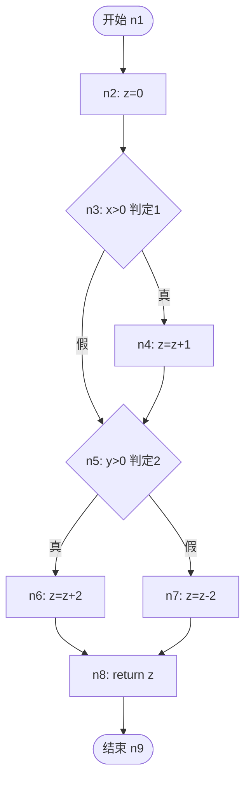
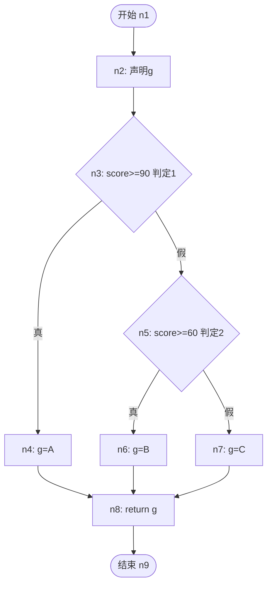

# 习题 - 第5章 白盒逻辑覆盖

> [!info] 本章习题定位
> 第5章是白盒测试方法的核心章节，习题围绕六种逻辑覆盖准则（语句、判定、条件、判定/条件、条件组合、路径覆盖）与 McCabe 环形复杂度展开。计算题要求给出控制流图（Mermaid）并计算覆盖率，是期末考试与课程设计的重点。

## 知识点覆盖表

| 题号 | 题型 | 考查知识点 | 对应笔记 |
| --- | --- | --- | --- |
| 5.1 | 单选 | 语句覆盖定义 | [[5.1 语句覆盖与判定覆盖]] |
| 5.2 | 单选 | 判定覆盖定义 | [[5.1 语句覆盖与判定覆盖]] |
| 5.3 | 单选 | 条件覆盖不一定满足判定覆盖 | [[5.2 条件覆盖与判定条件覆盖]] |
| 5.4 | 单选 | 判定/条件覆盖 | [[5.2 条件覆盖与判定条件覆盖]] |
| 5.5 | 单选 | 条件组合覆盖 | [[5.3 条件组合覆盖与路径覆盖]] |
| 5.6 | 单选 | 路径覆盖局限 | [[5.3 条件组合覆盖与路径覆盖]] |
| 5.7 | 单选 | McCabe 环形复杂度公式 | [[5.3 条件组合覆盖与路径覆盖]] |
| 5.8 | 单选 | 独立路径数与环形复杂度 | [[5.3 条件组合覆盖与路径覆盖]] |
| 5.9 | 单选 | 短路求值影响 | [[5.1 语句覆盖与判定覆盖]] |
| 5.10 | 单选 | 循环测试策略 | [[5.3 条件组合覆盖与路径覆盖]] |
| 5.11 | 多选 | 六种覆盖准则 | [[5.2 条件覆盖与判定条件覆盖]] |
| 5.12 | 多选 | 条件组合覆盖组合范围 | [[5.3 条件组合覆盖与路径覆盖]] |
| 5.13 | 多选 | 环形复杂度计算方法 | [[5.3 条件组合覆盖与路径覆盖]] |
| 5.14 | 多选 | 嵌套循环测试策略 | [[5.3 条件组合覆盖与路径覆盖]] |
| 5.15 | 多选 | 覆盖强度关系 | [[5.1 语句覆盖与判定覆盖]] |
| 5.16 | 判断 | 语句覆盖最弱 | [[5.1 语句覆盖与判定覆盖]] |
| 5.17 | 判断 | 判定覆盖必满足语句覆盖 | [[5.1 语句覆盖与判定覆盖]] |
| 5.18 | 判断 | 条件组合跨判定 | [[5.3 条件组合覆盖与路径覆盖]] |
| 5.19 | 判断 | 基本路径法用途 | [[5.3 条件组合覆盖与路径覆盖]] |
| 5.20 | 判断 | 串接循环独立时按简单循环 | [[5.3 条件组合覆盖与路径覆盖]] |
| 5.21 | 简答 | 语句与判定覆盖区别 | [[5.1 语句覆盖与判定覆盖]] |
| 5.22 | 简答 | 条件覆盖不满足判定覆盖 | [[5.2 条件覆盖与判定条件覆盖]] |
| 5.23 | 简答 | McCabe 环形复杂度 | [[5.3 条件组合覆盖与路径覆盖]] |
| 5.24 | 简答 | 循环测试分类 | [[5.3 条件组合覆盖与路径覆盖]] |
| 5.25 | 计算 | 覆盖率计算与用例设计 | [[5.1 语句覆盖与判定覆盖]] |
| 5.26 | 计算 | 条件组合覆盖用例 | [[5.2 条件覆盖与判定条件覆盖]] |
| 5.27 | 计算 | 环形复杂度与基本路径 | [[5.3 条件组合覆盖与路径覆盖]] |
| 5.28 | 计算 | 控制流图与路径覆盖 | [[5.3 条件组合覆盖与路径覆盖]] |
| 5.29 | 综合 | 六种覆盖综合计算 | [[5.2 条件覆盖与判定条件覆盖]] |
| 5.30 | 综合 | 白盒测试综合分析 | [[5.3 条件组合覆盖与路径覆盖]] |

## 一、单选题（每题 2 分，共 10 题）

**5.1** 语句覆盖要求？

A. 每个判定的真假分支各执行一次  
B. 每条可执行语句至少执行一次  
C. 每个条件的真假各取一次  
D. 所有独立路径各执行一次

**5.2** 判定覆盖又称分支覆盖，它要求？

A. 每条语句执行一次  
B. 每个判定的"真"与"假"分支至少各执行一次  
C. 每个条件取真与假  
D. 所有路径执行

**5.3** 关于条件覆盖与判定覆盖的关系，下列正确的是？

A. 条件覆盖满足则判定覆盖必满足  
B. 条件覆盖不一定满足判定覆盖  
C. 判定覆盖不满足语句覆盖  
D. 条件覆盖等价于路径覆盖

**5.4** 判定/条件覆盖要求？

A. 同时满足判定覆盖和条件覆盖  
B. 只满足判定覆盖  
C. 只满足条件覆盖  
D. 满足路径覆盖

**5.5** 条件组合覆盖针对的"组合"是？

A. 不同判定之间的条件组合  
B. 同一判定内部所有条件的真假组合  
C. 所有语句的组合  
D. 所有路径的组合

**5.6** 路径覆盖在含循环的程序中难以实现的原因是？

A. 用例数太少  
B. 路径数可能无限，无法穷举  
C. 循环不需要测试  
D. 路径覆盖比语句覆盖弱

**5.7** McCabe 环形复杂度的计算公式 $V(G) = e - n + 2$ 中，$e$ 和 $n$ 分别是？

A. 边数和判定数  
B. 边数和节点数  
C. 节点数和边数  
D. 判定数和路径数

**5.8** 环形复杂度 $V(G)$ 与独立路径数的关系是？

A. $V(G)$ 等于独立路径数  
B. $V(G)$ 大于独立路径数  
C. $V(G)$ 小于独立路径数  
D. 二者无关

**5.9** Java 中 `a > 0 && b > 0`，当 a≤0 时 b 的条件不会被执行（短路求值），这说明？

A. 语句覆盖能发现条件错误  
B. 语句覆盖和判定覆盖可能让某些条件从未被求值  
C. 路径覆盖不需要考虑短路  
D. 短路对测试无影响

**5.10** 对嵌套循环的测试策略是？

A. 对每层都做 7 种测试，全组合  
B. 自内向外测试，外层设最小值，逐层向外  
C. 只测最外层  
D. 只测最内层

## 二、多选题（每题 3 分，共 5 题）

**5.11** 下列属于白盒测试六种逻辑覆盖准则的有？（多选）

A. 语句覆盖  
B. 判定覆盖  
C. 条件覆盖  
D. 判定/条件覆盖  
E. 条件组合覆盖  
F. 路径覆盖

**5.12** 关于条件组合覆盖，下列说法正确的有？（多选）

A. 组合的是同一判定内的条件  
B. 若某判定含 k 个条件，需覆盖 $2^k$ 种组合  
C. 不组合不同判定之间的条件  
D. 能发现条件组合与短路求值相关的错误  
E. 条件数多时组合数线性增长

**5.13** McCabe 环形复杂度的计算方法有？（多选）

A. $V(G) = e - n + 2$（边数 - 节点数 + 2）  
B. $V(G) = P + 1$（判定节点数 + 1）  
C. $V(G) = 2n - e$  
D. $V(G)$ 等于独立路径数

**5.14** 关于嵌套循环测试策略，下列正确的有？（多选）

A. 从最内层循环开始测试  
B. 外层循环设为最小值  
C. 逐层向外，对当前层按简单循环测试  
D. 最外层测试全部范围  
E. 对每层全组合测试

**5.15** 下列覆盖强度关系中，正确的有？（多选）

A. 满足判定覆盖必满足语句覆盖  
B. 满足语句覆盖必满足判定覆盖  
C. 路径覆盖是最强覆盖准则  
D. 条件组合覆盖强于判定/条件覆盖  
E. 判定/条件覆盖同时满足判定覆盖与条件覆盖

## 三、判断题（每题 2 分，共 5 题）

**5.16** 语句覆盖是最弱的覆盖准则，甚至无法保证判定覆盖。

**5.17** 满足判定覆盖必满足语句覆盖，因为两分支都执行则分支内语句必被执行。

**5.18** 条件组合覆盖组合的是不同判定之间的条件。

**5.19** 基本路径测试法通过环形复杂度确定独立路径数，是路径覆盖的实用化方法。

**5.20** 串接循环若各循环独立，按简单循环分别测试；若有依赖则按嵌套循环策略测试。

## 四、简答题（每题 6 分，共 4 题）

**5.21** 简述语句覆盖与判定覆盖的区别，并说明为何语句覆盖是最弱的覆盖准则。

**5.22** 用例子说明"条件覆盖不一定满足判定覆盖"。

**5.23** 说明 McCabe 环形复杂度的两种计算方法，并解释其与独立路径数的关系。

**5.24** 简述简单循环、嵌套循环、串接循环三类循环的测试策略差异。

## 五、计算题（每题 8 分，共 4 题）

**5.25** 阅读以下 Java 代码，绘制控制流图（Mermaid），并设计满足**语句覆盖**与**判定覆盖**的测试用例，计算覆盖率。

```java
public String classify(int a, int b) {
    String result;
    if (a > 0 && b > 0) {            // 判定1
        result = "both positive";     // 语句2
    } else {
        result = "not both positive"; // 语句3
    }
    if (a > 0 || b > 0) {             // 判定2
        result = result + ", at least one"; // 语句4
    } else {
        result = result + ", none";   // 语句5
    }
    return result;                    // 语句6
}
```

要求：
1. 画出控制流图（Mermaid flowchart）；
2. 设计语句覆盖用例并计算语句覆盖率；
3. 设计判定覆盖用例并计算判定覆盖率。

**5.26** 对上题代码中的判定 `if (a > 0 && b > 0)`（含条件 c1: a>0, c2: b>0）：

1. 写出满足**条件组合覆盖**所需的全部条件取值组合；
2. 为每个组合设计测试用例（给出 a、b 取值）；
3. 计算条件组合覆盖率。

**5.27** 阅读以下代码，绘制控制流图（Mermaid），计算 McCabe 环形复杂度 $V(G)$（用两种方法），并列出全部独立路径。

```java
public int calc(int x, int y) {
    int z = 0;                    // n2
    if (x > 0) {                  // n3 判定1
        z = z + 1;                // n4
    }
    if (y > 0) {                  // n5 判定2
        z = z + 2;                // n6
    } else {
        z = z - 2;                // n7
    }
    return z;                     // n8
}
```

要求：
1. 画出控制流图并标注节点编号；
2. 用 $V(G) = e - n + 2$ 计算环形复杂度；
3. 用 $V(G) = P + 1$ 验证；
4. 列出全部独立路径。

**5.28** 阅读以下代码，绘制控制流图，计算环形复杂度，并设计基本路径测试用例。

```java
public String grade(int score) {
    String g;                       // n2
    if (score >= 90) {              // n3 判定1
        g = "A";                    // n4
    } else if (score >= 60) {       // n5 判定2
        g = "B";                    // n6
    } else {
        g = "C";                    // n7
    }
    return g;                       // n8
}
```

要求：
1. 画出控制流图；
2. 计算环形复杂度（两种方法）；
3. 列出独立路径并设计基本路径测试用例。

## 六、综合题（每题 10 分，共 2 题）

**5.29** 阅读以下代码，综合运用六种逻辑覆盖准则进行分析。

```java
public String check(int a, int b) {
    String result;
    if (a > 0 && b > 0) {            // 判定1，条件 c1:a>0, c2:b>0
        result = "P";                 // 语句2
    } else {
        result = "N";                 // 语句3
    }
    if (a > 0 || b > 0) {            // 判定2，条件 c3:a>0, c4:b>0
        result = result + "1";        // 语句4
    } else {
        result = result + "0";        // 语句5
    }
    return result;                    // 语句6
}
```

请完成：
1. 绘制控制流图（Mermaid）；
2. 设计满足**判定/条件覆盖**的用例（要求同时覆盖判定真假与条件真假），并计算判定覆盖率与条件覆盖率；
3. 设计满足**条件组合覆盖**的用例（针对判定1 与判定2 分别列出组合），并计算条件组合覆盖率；
4. 计算环形复杂度并设计**基本路径测试**用例。

**5.30** 某团队对一段含循环的代码追求 100% 路径覆盖，发现用例数随循环次数指数增长，无法完成。请分析：

1. 为什么含循环时路径覆盖难以穷举？
2. 应采用什么方法替代？说明其原理。
3. 对简单循环（循环次数为 n）应测试哪些执行次数？
4. 工程中通常以达到哪种覆盖准则为目标？为什么？

---

## 答案与解析

### 单选题答案

<details>
<summary>点击展开单选题答案与解析</summary>

**5.1 答案：B**
解析：语句覆盖要求每条可执行语句至少执行一次。

**5.2 答案：B**
解析：判定覆盖要求每个判定的"真"与"假"分支至少各执行一次。

**5.3 答案：B**
解析：条件覆盖关注单个条件真假，可能每个条件的真与假都取过但未在同一用例中组合出判定的真与假，故不一定满足判定覆盖。

**5.4 答案：A**
解析：判定/条件覆盖要求同时满足判定覆盖和条件覆盖。

**5.5 答案：B**
解析：条件组合覆盖针对同一判定内部所有条件的真假组合，不组合不同判定之间的条件。

**5.6 答案：B**
解析：含循环时路径数可能无限，无法穷举，需用基本路径测试法简化。

**5.7 答案：B**
解析：$V(G) = e - n + 2$，其中 $e$ 为边数，$n$ 为节点数。

**5.8 答案：A**
解析：环形复杂度 $V(G)$ 等于程序中线性独立路径的条数，也是基本路径测试应选取的最少路径数。

**5.9 答案：B**
解析：短路求值导致某些条件从未被求值，语句覆盖和判定覆盖都可能隐藏条件错误，这正是条件覆盖要解决的问题。

**5.10 答案：B**
解析：嵌套循环采用"自内向外"策略：从最内层开始测试，外层设最小值，逐层向外，最外层测试全部范围。

</details>

### 多选题答案

<details>
<summary>点击展开多选题答案与解析</summary>

**5.11 答案：A、B、C、D、E、F**
解析：六种准则：语句、判定、条件、判定/条件、条件组合、路径覆盖。

**5.12 答案：A、B、C、D**
解析：条件组合覆盖组合同一判定内条件（A），k 个条件需 $2^k$ 种（B），不跨判定（C），能发现短路错误（D）。E 错误，组合数指数增长而非线性。

**5.13 答案：A、B、D**
解析：$V(G) = e - n + 2$（A）、$V(G) = P + 1$（B），$V(G)$ 等于独立路径数（D）。C 错误。

**5.14 答案：A、B、C、D**
解析：嵌套循环自内向外（A），外层设最小值（B），逐层按简单循环测试（C），最外层测全部（D）。E 错误，全组合不现实。

**5.15 答案：A、C、D、E**
解析：判定覆盖必满足语句覆盖（A），路径覆盖最强（C），条件组合强于判定/条件（D），判定/条件同时满足二者（E）。B 错误，语句覆盖不一定满足判定覆盖。

</details>

### 判断题答案

<details>
<summary>点击展开判断题答案与解析</summary>

**5.16 答案：正确**
解析：语句覆盖只保证语句被执行，不关心判定分支——某条语句位于判定为假的分支中，只取判定为真的用例无法执行该语句。语句覆盖甚至无法保证判定覆盖。

**5.17 答案：正确**
解析：满足判定覆盖则两分支都执行，分支内语句必被执行，故必满足语句覆盖。

**5.18 答案：错误**
解析：条件组合覆盖组合的是同一判定内的条件，不组合不同判定之间的条件。

**5.19 答案：正确**
解析：基本路径测试法通过环形复杂度确定独立路径数，选取一组基本路径测试，是路径覆盖的实用化方法。

**5.20 答案：正确**
解析：串接循环若各循环独立按简单循环分别测试；若后一循环依赖前一循环结果则按嵌套循环策略测试。

</details>

### 简答题答案

<details>
<summary>点击展开简答题参考答案</summary>

**5.21 参考答案**
语句覆盖要求每条可执行语句至少执行一次；判定覆盖要求每个判定的真假分支至少各执行一次。语句覆盖最弱，因为它只保证语句被执行，不关心判定分支——若某条语句位于判定为假的分支中，只取判定为真的用例无法执行该语句；即便所有语句被执行，也可能遗漏判定的某一分支，导致分支内逻辑错误未被发现。判定覆盖强于语句覆盖，因为覆盖判定两分支必然使两分支内语句被执行。

**5.22 参考答案**
以判定 `a > 0 || b > 0` 为例：
- 用例1：a=1, b=-1 → a>0 真, b>0 假，判定为真；
- 用例2：a=-1, b=1 → a>0 假, b>0 真，判定为真。
两个用例覆盖了 a>0 与 b>0 各自的真假，但判定始终为真，判定的假分支从未执行，判定覆盖未满足。这验证了"条件覆盖不一定满足判定覆盖"。

**5.23 参考答案**
方法一：$V(G) = e - n + 2$，其中 $e$ 为控制流图的边数，$n$ 为节点数。
方法二：$V(G) = P + 1$，其中 $P$ 为判定节点数。
关系：环形复杂度等于程序中线性独立路径的条数，也是基本路径测试应选取的最少路径数。

**5.24 参考答案**
- 简单循环：测试零次、一次、两次、m 次（m<n）、n-1 次、n 次、n+1 次执行。
- 嵌套循环：自内向外，从最内层开始按简单循环测试，外层设最小值，逐层向外，最外层测试全部范围。
- 串接循环：若各循环独立，按简单循环分别测试；若后一循环依赖前一循环结果，按嵌套循环策略测试。

</details>

### 计算题答案

<details>
<summary>点击展开计算题参考答案</summary>

**5.25 参考答案**

1. 控制流图：

```mermaid
flowchart TD
    S([开始]) --> A[语句1: 声明result]
    A --> D1{判定1: a>0 && b>0}
    D1 -->|真| B[语句2: both positive]
    D1 -->|假| C[语句3: not both positive]
    B --> D2{判定2: a>0 || b>0}
    C --> D2
    D2 -->|真| E[语句4: +at least one]
    D2 -->|假| F[语句5: +none positive]
    E --> G[语句6: return]
    F --> G
    G --> E2([结束])
```

2. 语句覆盖用例：

| 用例号 | a | b | 执行路径 | 覆盖语句 |
| --- | --- | --- | --- | --- |
| SC1 | 1 | 1 | S→A→D1(真)→B→D2(真)→E→G | 1,2,4,6 |
| SC2 | -1 | -1 | S→A→D1(假)→C→D2(假)→F→G | 1,3,5,6 |

语句覆盖率 = 6/6 = 100%。

3. 判定覆盖用例：

| 用例号 | a | b | 判定1 | 判定2 | 覆盖分支 |
| --- | --- | --- | --- | --- | --- |
| DC1 | 1 | 1 | 真 | 真 | D1真, D2真 |
| DC2 | -1 | -1 | 假 | 假 | D1假, D2假 |

判定覆盖率 = 4/4 = 100%（2 个判定 × 2 分支）。

**5.26 参考答案**

1. 判定1 `a > 0 && b > 0` 含 c1(a>0)、c2(b>0)，共 $2^2=4$ 种组合：

| 组合号 | c1 (a>0) | c2 (b>0) | a 取值 | b 取值 |
| --- | --- | --- | --- | --- |
| 1 | 真 | 真 | 1 | 1 |
| 2 | 真 | 假 | 1 | -1 |
| 3 | 假 | 真 | -1 | 1 |
| 4 | 假 | 假 | -1 | -1 |

2. 测试用例即上表 a、b 取值。

3. 条件组合覆盖率 = 4/4 = 100%（针对判定1）。

**5.27 参考答案**

1. 控制流图：



2. 节点数 $n = 9$（n1~n9），边数 $e = 9$（S→A, A→D1, D1→B, D1→D2, B→D2, D2→C, D2→E, C→F, E→F, F→END，共 10 条边）。
重新计数边：n1→n2, n2→n3, n3→n4(真), n3→n5(假), n4→n5, n5→n6(真), n5→n7(假), n6→n8, n7→n8, n8→n9 = 10 条边。
$V(G) = e - n + 2 = 10 - 9 + 2 = 3$。

3. 判定节点数 $P = 2$（n3, n5），$V(G) = P + 1 = 2 + 1 = 3$ ✓ 验证一致。

4. 独立路径（3 条）：
- 路径1：n1→n2→n3→n4→n5→n6→n8→n9（判定1真, 判定2真）
- 路径2：n1→n2→n3→n5→n7→n8→n9（判定1假, 判定2假）
- 路径3：n1→n2→n3→n4→n5→n7→n8→n9（判定1真, 判定2假）

**5.28 参考答案**

1. 控制流图：



2. 环形复杂度：
- 节点数 $n = 9$，边数 $e = 10$（n1→n2, n2→n3, n3→n4, n3→n5, n4→n8, n5→n6, n5→n7, n6→n8, n7→n8, n8→n9）。
- 方法一：$V(G) = e - n + 2 = 10 - 9 + 2 = 3$。
- 方法二：判定节点 $P = 2$（n3, n5），$V(G) = P + 1 = 3$ ✓。

3. 独立路径与基本路径测试用例：

| 路径 | 节点序列 | 判定取值 | 用例号 | score | 预期结果 |
| --- | --- | --- | --- | --- | --- |
| 路径1 | n1→n2→n3→n4→n8→n9 | 判定1真 | BP1 | 95 | A |
| 路径2 | n1→n2→n3→n5→n6→n8→n9 | 判定1假, 判定2真 | BP2 | 75 | B |
| 路径3 | n1→n2→n3→n5→n7→n8→n9 | 判定1假, 判定2假 | BP3 | 50 | C |

</details>

### 综合题答案

<details>
<summary>点击展开综合题参考答案</summary>

**5.29 参考答案**

1. 控制流图：

```mermaid
flowchart TD
    S([开始 n1]) --> A[n2: 声明result]
    A --> D1{n3: 判定1 a>0&&b>0}
    D1 -->|真| B[n4: result=P]
    D1 -->|假| C[n5: result=N]
    B --> D2{n6: 判定2 a>0||b>0}
    C --> D2
    D2 -->|真| E[n7: result+1]
    D2 -->|假| F[n8: result+0]
    E --> G[n9: return]
    F --> G
    G --> END([结束 n10])
```

2. 判定/条件覆盖用例（条件清单：c1:a>0, c2:b>0, c3:a>0, c4:b>0，共 4 条件 8 取值；2 判定 4 分支）：

| 用例号 | a | b | c1 | c2 | 判定1 | c3 | c4 | 判定2 | 覆盖 |
| --- | --- | --- | --- | --- | --- | --- | --- | --- | --- |
| DCC1 | 1 | 1 | 真 | 真 | 真 | 真 | 真 | 真 | c1真,c2真,c3真,c4真,D1真,D2真 |
| DCC2 | -1 | -1 | 假 | 假 | 假 | 假 | 假 | 假 | c1假,c2假,c3假,c4假,D1假,D2假 |

- 判定覆盖率 = 4/4 = 100%
- 条件覆盖率 = 8/8 = 100%

3. 条件组合覆盖（判定1：c1,c2 共 4 组合；判定2：c3,c4 共 4 组合，合计 8 组合）：

判定1 组合用例：

| 用例号 | a | b | c1 | c2 | 判定1 |
| --- | --- | --- | --- | --- | --- |
| MC1 | 1 | 1 | 真 | 真 | 真 |
| MC2 | 1 | -1 | 真 | 假 | 假 |
| MC3 | -1 | 1 | 假 | 真 | 假 |
| MC4 | -1 | -1 | 假 | 假 | 假 |

判定2 组合用例：

| 用例号 | a | b | c3 | c4 | 判定2 |
| --- | --- | --- | --- | --- | --- |
| MC1 | 1 | 1 | 真 | 真 | 真 |
| MC2 | 1 | -1 | 真 | 假 | 真 |
| MC3 | -1 | 1 | 假 | 真 | 真 |
| MC4 | -1 | -1 | 假 | 假 | 假 |

条件组合覆盖率 = (4+4)/(4+4) = 8/8 = 100%。

4. 环形复杂度：节点 $n=10$，边 $e=11$，$V(G)=11-10+2=3$；判定节点 $P=2$，$V(G)=P+1=3$ ✓。

基本路径测试用例（3 条独立路径）：

| 用例号 | a | b | 路径 | 预期结果 |
| --- | --- | --- | --- | --- |
| BP1 | 1 | 1 | n1→n2→n3→n4→n6→n7→n9→n10 | P1 |
| BP2 | -1 | 1 | n1→n2→n3→n5→n6→n7→n9→n10 | N1 |
| BP3 | -1 | -1 | n1→n2→n3→n5→n6→n8→n9→n10 | N0 |

**5.30 参考答案**
1. 含循环时路径数随循环次数指数增长，甚至无限（如 while 循环），无法穷举所有路径，因此 100% 路径覆盖不可行。
2. 应采用**基本路径测试法**替代。原理：通过 McCabe 环形复杂度 $V(G)$ 确定程序的线性独立路径数，选取 $V(G)$ 条基本路径（每条至少含一条其他路径未走过的新边）进行测试，保证每条独立路径至少执行一次，是路径覆盖的实用化方法。
3. 简单循环（循环次数 n）应测试：0 次、1 次、2 次、m 次（m<n）、n-1 次、n 次、n+1 次。
4. 工程中通常以达到**判定/条件覆盖或条件组合覆盖**为目标，路径覆盖用基本路径测试法近似实现。原因：判定/条件覆盖兼顾判定与条件，实用性强；条件组合覆盖能发现条件组合与短路错误；100% 路径覆盖在含循环时不可行，需结合风险与成本权衡。

</details>

## 考点统计表

| 考查维度 | 题量 | 分值占比 | 难度 |
| --- | --- | --- | --- |
| 语句覆盖与判定覆盖 | 7 | 约 23% | 中高 |
| 条件覆盖与判定/条件覆盖 | 6 | 约 20% | 高 |
| 条件组合覆盖与路径覆盖 | 7 | 约 23% | 高 |
| McCabe 环形复杂度 | 6 | 约 20% | 高 |
| 循环测试 | 4 | 约 14% | 中高 |
| **合计** | **30** | **100%** | — |

## 关联

- 上一级：[[MOC - 软件测试技术]]
- 本章知识点：[[MOC - 第5章]]
- 上一章习题：[[习题-第4章-黑盒测试用例设计]]
- 下一章习题：[[习题-第6章-测试阶段]]
