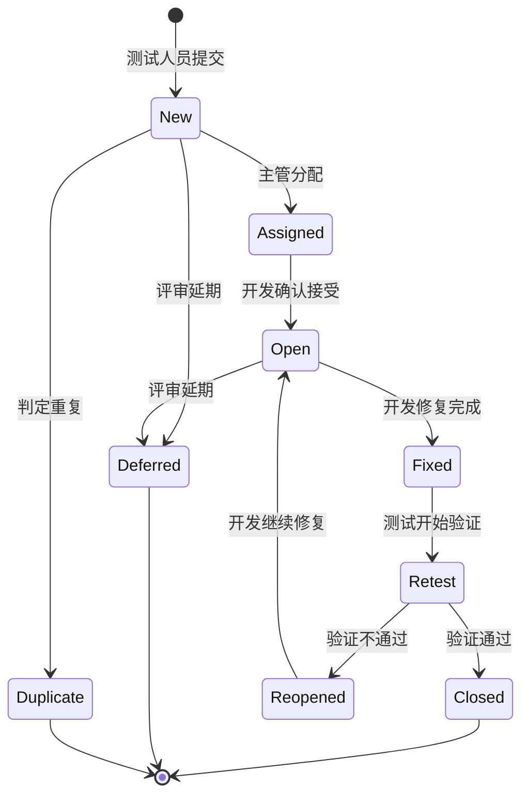
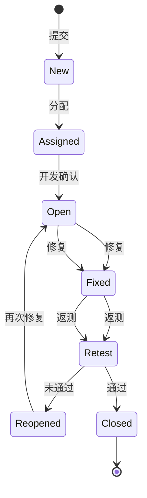

# 习题 - 第8章 缺陷管理

> [!info] 本章习题定位
> 第8章习题围绕缺陷生命周期状态流转、严重程度与优先级的区别、缺陷报告要素与编写规范、缺陷度量分析以及 Jira/禅道等工具使用展开，强调流程严谨性与可追溯性。

## 知识点覆盖表

| 题号 | 题型 | 考查知识点 | 对应笔记 |
| --- | --- | --- | --- |
| 8.1 | 单选 | 缺陷生命周期阶段 | [[8.1 缺陷生命周期与状态流转]] |
| 8.2 | 单选 | 缺陷状态 New | [[8.1 缺陷生命周期与状态流转]] |
| 8.3 | 单选 | Fixed 与 Closed 区别 | [[8.1 缺陷生命周期与状态流转]] |
| 8.4 | 单选 | 关闭权限归属 | [[8.1 缺陷生命周期与状态流转]] |
| 8.5 | 单选 | 严重程度定义 | [[8.2 缺陷分级与分类]] |
| 8.6 | 单选 | 优先级定义 | [[8.2 缺陷分级与分类]] |
| 8.7 | 单选 | 严重程度与优先级关系 | [[8.2 缺陷分级与分类]] |
| 8.8 | 单选 | 缺陷报告要素 | [[8.3 缺陷管理工具与流程规范]] |
| 8.9 | 单选 | 缺陷密度度量 | [[8.3 缺陷管理工具与流程规范]] |
| 8.10 | 单选 | Duplicate 处理 | [[8.1 缺陷生命周期与状态流转]] |
| 8.11 | 多选 | 缺陷状态 | [[8.1 缺陷生命周期与状态流转]] |
| 8.12 | 多选 | 严重程度等级 | [[8.2 缺陷分级与分类]] |
| 8.13 | 多选 | 缺陷类型分类 | [[8.2 缺陷分级与分类]] |
| 8.14 | 多选 | 缺陷报告要素 | [[8.3 缺陷管理工具与流程规范]] |
| 8.15 | 多选 | 缺陷度量 | [[8.3 缺陷管理工具与流程规范]] |
| 8.16 | 判断 | 验证必经 | [[8.1 缺陷生命周期与状态流转]] |
| 8.17 | 判断 | 严重等于优先 | [[8.2 缺陷分级与分类]] |
| 8.18 | 判断 | 一缺陷一报告 | [[8.3 缺陷管理工具与流程规范]] |
| 8.19 | 判断 | Reopened 需附证据 | [[8.1 缺陷生命周期与状态流转]] |
| 8.20 | 判断 | Deferred 需评审 | [[8.1 缺陷生命周期与状态流转]] |
| 8.21 | 简答 | 缺陷流转规则 | [[8.1 缺陷生命周期与状态流转]] |
| 8.22 | 简答 | 严重程度与优先级 | [[8.2 缺陷分级与分类]] |
| 8.23 | 简答 | 缺陷报告编写规范 | [[8.3 缺陷管理工具与流程规范]] |
| 8.24 | 简答 | 缺陷度量分析 | [[8.3 缺陷管理工具与流程规范]] |
| 8.25 | 设计 | 缺陷报告编写 | [[8.3 缺陷管理工具与流程规范]] |
| 8.26 | 设计 | 缺陷分级表 | [[8.2 缺陷分级与分类]] |
| 8.27 | 设计 | 状态流转图 | [[8.1 缺陷生命周期与状态流转]] |
| 8.28 | 设计 | 缺陷评审流程 | [[8.3 缺陷管理工具与流程规范]] |
| 8.29 | 综合 | 缺陷生命周期综合 | [[8.1 缺陷生命周期与状态流转]] |
| 8.30 | 综合 | 缺陷管理综合 | [[8.3 缺陷管理工具与流程规范]] |

## 一、单选题（每题 2 分，共 10 题）

**8.1** 缺陷生命周期的正确顺序是？

A. 发现→提交→分配→处理→验证→关闭  
B. 提交→发现→处理→关闭→验证  
C. 分配→发现→关闭→处理→验证  
D. 发现→处理→提交→验证→关闭

**8.2** 缺陷刚被提交、尚未处理的状态是？

A. Open  
B. New  
C. Fixed  
D. Closed

**8.3** 关于 Fixed 与 Closed 状态，下列正确的是？

A. Fixed 等于已关闭  
B. Fixed 表示开发自认修复完成，须经 Retest 验证通过才能 Closed  
C. 开发可以直接关闭缺陷  
D. Fixed 后无需验证

**8.4** 在缺陷管理中，谁有权关闭缺陷？

A. 开发人员  
B. 测试人员  
C. 产品经理  
D. 项目经理

**8.5** 严重程度（Severity）描述的是？

A. 缺陷修复的紧迫程度  
B. 缺陷对系统功能、数据或用户体验的影响程度  
C. 缺陷的责任人  
D. 缺陷的类型

**8.6** 优先级（Priority）描述的是？

A. 缺陷的技术影响  
B. 缺陷应被修复的紧迫程度  
C. 缺陷的复现概率  
D. 缺陷的模块归属

**8.7** 关于严重程度与优先级的关系，下列正确的是？

A. 严重程度高则优先级必为 P1  
B. 二者是独立维度，常常一致但不必然相等  
C. 二者完全相同  
D. 优先级高则严重程度必为 Critical

**8.8** 缺陷报告中，让开发能独立复现的关键要素是？

A. 标题  
B. 复现步骤  
C. 优先级  
D. 模块归属

**8.9** 缺陷密度用于回答的问题是？

A. 缺陷何时收敛  
B. 单位代码质量如何  
C. 缺陷集中在哪  
D. 谁该修复

**8.10** 标记为 Duplicate 时，必须？

A. 直接关闭不记录  
B. 关联被重复的主缺陷编号  
C. 删除该缺陷  
D. 重新打开

## 二、多选题（每题 3 分，共 5 题）

**8.11** 下列属于缺陷状态的有？（多选）

A. New  
B. Assigned  
C. Fixed  
D. Retest  
E. Closed  
F. Reopened

**8.12** 缺陷严重程度的等级包括？（多选）

A. Critical（致命）  
B. Major（严重）  
C. Normal（一般）  
D. Minor（轻微）  
E. Enhancement（建议）

**8.13** 按技术维度，缺陷类型分类包括？（多选）

A. 功能缺陷  
B. 性能缺陷  
C. 安全缺陷  
D. 兼容性缺陷  
E. 逻辑缺陷

**8.14** 缺陷报告的要素包括？（多选）

A. 标题  
B. 复现步骤  
C. 预期结果与实际结果  
D. 环境信息  
E. 严重程度与优先级

**8.15** 缺陷度量分析的常见维度包括？（多选）

A. 缺陷密度  
B. 缺陷趋势  
C. 缺陷分布  
D. 按严重度统计  
E. 按状态跟踪

## 三、判断题（每题 2 分，共 5 题）

**8.16** Fixed 必须经过 Retest 验证通过才能 Closed，禁止开发直接关闭缺陷。

**8.17** 严重程度 Critical 的缺陷，优先级一定为 P1。

**8.18** 编写缺陷报告时应遵循"一缺陷一报告"原则，不把多个问题塞进同一报告。

**8.19** Reopened 必须附返测失败证据（复现步骤、截图、日志）。

**8.20** Deferred（延期）必须经缺陷评审会议决议，并记录延期版本与理由。

## 四、简答题（每题 6 分，共 4 题）

**8.21** 列举缺陷状态流转的核心规则（至少 4 条）。

**8.22** 说明严重程度与优先级的区别，并举一个"高严重+低优先"和"低严重+高优先"的例子。

**8.23** 列出缺陷报告编写的至少 5 条规范要点。

**8.24** 说明缺陷度量分析的三类度量（密度、趋势、分布）各自回答的问题与作用。

## 五、设计题（每题 8 分，共 4 题）

**8.25** 请按规范编写一个缺陷报告：标题为"登录页输入正确密码提示密码错误（必现）"，环境为 Win10/Chrome 124/后端 v2.3.1，账号 alice 已注册且密码为 Pass1234，复现步骤为访问登录页→输入 alice→输入 Pass1234→点击登录，预期跳转首页，实际提示"密码错误"，严重程度 Major，优先级 P2，归属登录模块。

**8.26** 请完成以下缺陷分级表。

| 严重程度 | 默认建议优先级 | 处理时点 | 类型归属示例 |
| --- | --- | --- | --- |
| Critical | ? | ? | ? |
| Major | ? | ? | ? |
| Normal | ? | ? | ? |
| Minor | ? | ? | ? |

**8.27** 请用 Mermaid stateDiagram 画出缺陷状态流转图，包含 New、Assigned、Open、Fixed、Retest、Closed、Reopened、Deferred、Duplicate 状态及主要转换。

**8.28** 请设计缺陷评审流程，说明评审参与者、评审关注点与可能的评审决议（有效/无效/重复/延期/分配）。

## 六、综合题（每题 10 分，共 2 题）

**8.29** 某测试人员发现一个缺陷，提交后经历以下过程：提交（New）→分配（Assigned）→开发确认（Open）→开发修复（Fixed）→测试返测发现未修复（Reopened）→开发再次修复（Fixed）→测试返测通过（Closed）。请回答：

1. 画出该缺陷的完整状态流转图（Mermaid）；
2. 第一次返测失败说明什么？Reopened 应附什么证据？
3. 该流程体现了哪些核心流转规则？
4. 若开发认为该缺陷不应在当前版本修复，应如何处理？

**8.30** 某项目缺陷度量数据如下：缺陷总数 200，按模块分布为支付模块 80、订单模块 50、用户模块 30、其他 40；按严重度为 Critical 5、Major 40、Normal 80、Minor 75；近一周发现数从 30/天下降到 5/天，修复数从 20/天上升到 25/天。请综合分析：

1. 缺陷集中在哪个模块？体现了什么原则？应如何应对？
2. 严重度分布是否健康？给出判断理由。
3. 缺陷趋势是否收敛？能否发布？
4. 缺陷管理工具（Jira/禅道）在此过程中提供什么能力？

---

## 答案与解析

### 单选题答案

点击展开单选题答案与解析

**8.1 答案：A**
解析：缺陷生命周期顺序为发现→提交→分配→处理→验证→关闭（或重开）。

**8.2 答案：B**
解析：New 表示缺陷刚被提交、尚未处理。

**8.3 答案：B**
解析：Fixed 表示开发自认修复完成，但不等于已解决——必须经过 Retest 验证通过才能 Closed。

**8.4 答案：B**
解析：只有测试人员有权关闭缺陷，开发无权关闭自己修复的缺陷。

**8.5 答案：B**
解析：严重程度描述缺陷对系统功能、数据或用户体验的影响程度，是客观技术属性。

**8.6 答案：B**
解析：优先级描述缺陷应被修复的紧迫程度，综合考虑业务影响、发布计划与修复成本。

**8.7 答案：B**
解析：严重程度与优先级是两个独立维度，常常一致但不必然相等。

**8.8 答案：B**
解析：复现步骤是让开发能独立复现的关键要素，需编号化、具体到点击与输入数据。

**8.9 答案：B**
解析：缺陷密度 = 缺陷数/代码规模，回答"单位代码质量如何"。

**8.10 答案：B**
解析：标记 Duplicate 时必须关联被重复的主缺陷编号。

### 多选题答案

点击展开多选题答案与解析

**8.11 答案：A、B、C、D、E、F**
解析：缺陷状态包括 New、Assigned、Open、Fixed、Retest、Closed、Reopened、Deferred、Duplicate。

**8.12 答案：A、B、C、D、E**
解析：严重程度等级：Critical、Major、Normal、Minor、Enhancement。

**8.13 答案：A、B、C、D、E**
解析：缺陷类型包括功能、性能、界面、兼容性、安全、数据、逻辑缺陷。

**8.14 答案：A、B、C、D、E**
解析：缺陷报告要素包括标题、描述、复现步骤、预期/实际结果、截图/日志、环境、严重程度、优先级、归属模块、复现概率。

**8.15 答案：A、B、C、D、E**
解析：度量维度包括密度、趋势、分布（按模块/严重度/类型/状态/时间）。

### 判断题答案

点击展开判断题答案与解析

**8.16 答案：正确**
解析：Fixed 必须经过 Retest 验证通过才能 Closed，禁止开发直接关闭。

**8.17 答案：错误**
解析：严重程度与优先级是独立维度，Critical 不一定为 P1。如深埋在罕见操作下的崩溃（Critical + P3），因极少触发而延期。

**8.18 答案：正确**
解析：一缺陷一报告，不把多个问题塞进同一报告，便于跟踪与定位。

**8.19 答案：正确**
解析：Reopened 必须附返测失败证据（复现步骤、截图、日志），否则开发无法定位。

**8.20 答案：正确**
解析：Deferred 必须经缺陷评审会议决议，并记录延期版本与理由。

### 简答题答案

点击展开简答题参考答案

**8.21 参考答案**
核心流转规则：①单向闭环：缺陷按既定方向流转，不允许从 Closed 直接回 Open（重开须走 Reopened）；②验证必经：Fixed 须经 Retest 验证通过才能 Closed；③重开有据：Reopened 须附返测失败证据；④关闭权限归属测试：只有测试人员有权关闭，开发无权关闭自己修复的缺陷；⑤延期需评审：Deferred 须经评审会议决议并记录延期版本；⑥重复需引用：标记 Duplicate 须关联主缺陷编号。

**8.22 参考答案**
区别：严重程度看"技术影响"（客观），优先级看"业务紧迫"（综合业务、成本、发布窗口）。二者独立但常一致。
- 高严重+低优先：深埋在罕见操作下的崩溃（Critical + P3），因极少触发而延期。
- 低严重+高优先：首页品牌名拼写错误（Minor + P2），影响品牌形象需快修。

**8.23 参考答案**
编写规范：①标题精准，概括现象与影响；②步骤可复现，编号化、具体到点击与输入；③预期对照实际，并列写出；④证据充分，附截图、日志、网络请求；⑤环境完整，写明 OS、浏览器、版本、账号；⑥去重前置，提交前搜索是否已存在；⑦一缺陷一报告。

**8.24 参考答案**
- 缺陷密度：缺陷数/代码规模，回答"单位代码质量如何"，用于横向比较模块与项目质量。
- 缺陷趋势：随时间变化的发现数与修复数曲线，回答"质量是否收敛、能否按期发布"，预测收敛。
- 缺陷分布：按模块/严重度/类型/人员统计，回答"问题集中在哪、重点投入哪"，定位薄弱环节。

### 设计题答案

点击展开设计题参考答案

**8.25 参考答案**
- 标题：登录页输入正确密码提示"密码错误"（必现）
- 环境：Win10 / Chrome 124 / 后端 v2.3.1 / 测试账号 alice
- 前置条件：账号 alice 已注册且密码为 Pass1234
- 复现步骤：
  1. 访问 https://demo.example.com/login
  2. 用户名输入 alice
  3. 密码输入 Pass1234
  4. 点击"登录"按钮
- 预期结果：跳转到首页，右上角显示用户名 alice
- 实际结果：页面停留在登录页，提示"密码错误"
- 复现概率：必现（100%）
- 截图：login_error.png
- 严重程度：Major
- 优先级：P2
- 归属模块：登录模块

**8.26 参考答案**

| 严重程度 | 默认建议优先级 | 处理时点 | 类型归属示例 |
| --- | --- | --- | --- |
| Critical | P1 | 立即修复 | 功能/安全/数据 |
| Major | P2 | 当前版本 | 功能/性能 |
| Normal | P3 | 下一版本 | 功能/兼容性/逻辑 |
| Minor | P4 | 视资源安排 | 界面/数据校验 |

**8.27 参考答案**

**8.28 参考答案**
评审参与者：测试主管、开发主管、产品经理。
评审关注点：①缺陷是否有效（非误报、非需求未实现）；②严重程度与优先级是否合理；③是否当前版本修复或延期；④去重与归属模块。
评审决议：有效→确认分级并分配开发进入修复；无效→标记拒绝/误报；重复→标记 Duplicate 并关联主缺陷；延期→标记 Deferred 记录延期版本。

### 综合题答案

点击展开综合题参考答案

**8.29 参考答案**
1. 状态流转图：

2. 第一次返测失败说明开发的自认修复并未真正解决问题，可能修复不完整或引入新问题。Reopened 应附返测失败证据：复现步骤、截图、日志、环境信息。
3. 体现的规则：①验证必经（Fixed 须 Retest 才能 Closed）；②重开有据（Reopened 附证据）；③单向闭环（重开走 Reopened 而非直接回 Open）；④关闭权限归属测试。
4. 若开发认为不应在当前版本修复，应在评审会议提出，经评审决议后标记 Deferred，记录延期版本与理由。

**8.30 参考答案**
1. 缺陷集中在支付模块（80/200 = 40%），体现了**缺陷聚集**原则（少数模块集中大多数缺陷）。应对：对支付模块加重测试资源投入，进行深度回归与专项测试，分析根因改进。
2. 严重度分布：Critical 5 个（2.5%）、Major 40（20%）、Normal 80（40%）、Minor 75（37.5%）。Critical 与 Major 占比 22.5%，需关注 Critical 是否已全部修复关闭。分布基本符合"金字塔"（底层多、顶层少），但 Critical 5 个需确认状态。
3. 缺陷趋势：发现数从 30/天降到 5/天，修复数从 20/天上升到 25/天，发现与修复曲线趋于收敛，积压缺陷减少，趋势健康。能否发布还需确认：①无未关闭的 Critical/Major；②通过率达标；③覆盖率达标。
4. Jira/禅道提供：缺陷记录与流转（状态管理）、协作（分配与评论）、统计与导出（密度/趋势/分布）、与 CI/CD 及代码仓库集成、权限与角色模型，支撑缺陷从发现到关闭再到度量的完整闭环。

## 考点统计表

| 考查维度 | 题量 | 分值占比 | 难度 |
| --- | --- | --- | --- |
| 缺陷生命周期与状态流转 | 9 | 约 30% | 中高 |
| 严重程度与优先级 | 6 | 约 20% | 中 |
| 缺陷报告要素与规范 | 6 | 约 20% | 中 |
| 缺陷度量分析 | 5 | 约 17% | 中高 |
| 缺陷管理工具 | 4 | 约 13% | 中 |
| **合计** | **30** | **100%** | — |

## 关联

- 上一级：[[MOC - 软件测试技术]]
- 本章知识点：[[MOC - 第8章]]
- 上一章习题：[[习题-第7章-测试文档]]
- 下一章习题：[[习题-第9章-自动化与性能测试]]
