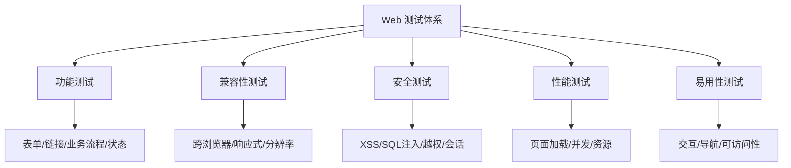
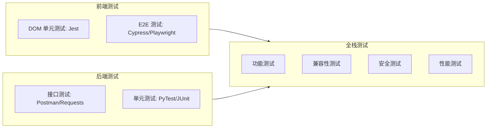
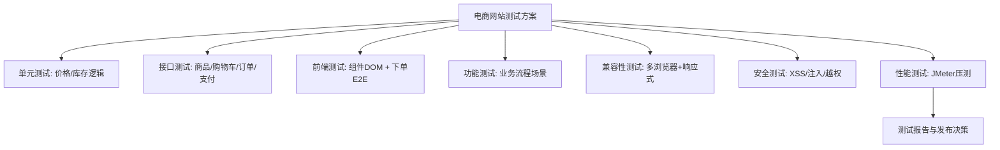

# 10.1 Web应用测试综合实践

Web 应用是测试最常见的工程对象。它跨浏览器、跨设备、前后端分离、依赖网络与状态管理，测试需综合考虑功能、兼容性、安全、性能与前后端分层。本节整合前 9 章方法，给出 Web 测试的类型、要点、前后端测试策略，并以电商网站为例呈现完整测试方案。

## Web 测试类型



| 类型 | 关注点 | 典型测试项 |
| --- | --- | --- |
| 功能测试 | 功能正确性 | 表单提交、链接跳转、业务流程、CRUD 操作 |
| 兼容性测试 | 多环境一致 | 跨浏览器、跨系统、响应式布局 |
| 安全测试 | 漏洞防护 | XSS、SQL 注入、越权、会话固定 |
| 性能测试 | 负载与速度 | 首屏加载、并发、资源加载顺序 |
| 易用性测试 | 用户体验 | 导航、错误提示、可访问性 |

## Web 测试要点

### 跨浏览器测试

| 维度 | 范围 | 策略 |
| --- | --- | --- |
| 浏览器 | Chrome/Edge/Firefox/Safari | 基于用户分布优先覆盖主流 |
| 版本 | 最新版与上 1–2 个版本 | 兼容测试矩阵 |
| 渲染引擎 | Blink/Gecko/WebKit | 关注 CSS 与 JS 兼容 |
| 工具 | BrowserStack/Sauce Labs | 云端多环境，节省本地设备 |

### 响应式测试

> [!note] 响应式测试要点
> > 响应式布局通过断点适配不同屏幕。测试需覆盖各断点下的布局、导航折叠、图片缩放、触摸目标大小（不小于 44px）、横向滚动是否出现。典型断点：手机（<768px）、平板（768–1024px）、桌面（>1024px）。

### Cookie / Session 测试

| 测试项 | 说明 |
| --- | --- |
| Cookie 写入与读取 | 登录后 Cookie 正确生成 |
| Cookie 过期 | 到期后自动登出 |
| Cookie 安全属性 | HttpOnly、Secure、SameSite |
| Session 超时 | 超时后需重新登录 |
| 会话固定 | 登录后 Session ID 应刷新 |
| 多标签页 | 同账号多标签会话一致性 |

> [!warning] 安全属性
> > Cookie 的 `HttpOnly` 防止 JS 读取（防 XSS 窃取）、`Secure` 限定 HTTPS 传输、`SameSite` 防 CSRF。安全测试应校验这些属性是否正确设置。

## 前端测试

### DOM 测试

DOM 单元测试针对前端组件的渲染与交互逻辑，不依赖后端。

| 框架 | 语言 | 说明 |
| --- | --- | --- |
| Jest | JavaScript/TypeScript | React 项目主流，快照测试 |
| Vitest | JavaScript | Vite 项目推荐 |
| Testing Library | JavaScript | 关注用户行为而非实现细节 |

```javascript
// Jest + Testing Library: 测试登录组件渲染
import { render, screen } from "@testing-library/react";
import LoginForm from "./LoginForm";

test("登录表单应包含用户名与密码输入框", () => {
  render(<LoginForm />);
  expect(screen.getByPlaceholderText("用户名")).toBeInTheDocument();
  expect(screen.getByPlaceholderText("密码")).toBeInTheDocument();
  expect(screen.getByRole("button", { name: "登录" })).toBeInTheDocument();
});
```

### E2E 测试

E2E（端到端）测试模拟真实用户从浏览器操作完整业务路径。

| 框架 | 特点 | 适用 |
| --- | --- | --- |
| Cypress | 同源执行、调试友好 | 现代 Web 应用 |
| Playwright | 多浏览器、多语言 | 跨浏览器 E2E |
| Selenium | 老牌、多语言 | 传统项目 |

> [!tip] DOM 测试 vs E2E 测试
> > DOM 测试粒度小、执行快、关注组件逻辑，数量多；E2E 测试粒度大、执行慢、关注完整业务路径，数量少。二者互补，遵循测试金字塔，见 [[10.3 测试策略与质量保障体系]]。

## 后端 API 测试

Web 后端测试以接口测试为主，验证 API 契约与业务逻辑。方法见 [[9.2 接口测试与API测试]]，要点包括：

- 正向与反向用例覆盖；
- 认证与权限校验；
- 数据一致性与业务副作用；
- 异常处理与错误码；
- 接口性能（响应时间阈值）。

## Web 测试体系图



## 完整案例：电商网站测试方案

> [!example] 电商网站测试方案
> > **项目**：B2C 电商网站，含用户注册登录、商品浏览、购物车、下单支付、订单管理模块。
> >
> > **测试范围与策略**：
> > 1. **单元测试**：后端服务核心逻辑（价格计算、库存扣减、优惠券）用 PyTest/JUnit 覆盖，目标覆盖率 > 80%；
> > 2. **接口测试**：商品、购物车、订单、支付接口用 Requests+PyTest 自动化，覆盖正向/反向/权限；
> > 3. **前端测试**：关键组件（商品卡、购物车）用 Jest DOM 测试，核心下单流程用 Cypress E2E；
> > 4. **功能测试**：按业务流程设计场景（浏览→加购→下单→支付→查单），用 [[4.3 因果图法与决策表法]] 处理优惠券组合；
> > 5. **兼容性测试**：Chrome/Edge/Safari + 移动端响应式断点；
> > 6. **安全测试**：XSS/SQL 注入扫描、支付接口签名校验、越权测试；
> > 7. **性能测试**：用 JMeter 压测商品详情、下单接口，目标 TPS 与响应时间达标；
> > 8. **缺陷管理**：按 [[8.1 缺陷生命周期与状态流转]] 流程跟踪，按 [[8.2 缺陷分级与分类]] 分级。
> >
> > **交付物**：测试计划、测试用例、自动化脚本、性能测试报告、测试总结报告。



## 小结

Web 测试是测试方法的综合应用，涵盖功能、兼容性、安全、性能与易用性。要点包括跨浏览器与响应式测试、Cookie/Session 的安全属性校验。前端测试分 DOM 单元测试与 E2E 测试，后端以接口测试为主。电商网站案例展示了从单元、接口、前端到全栈测试的完整方案，整合了前 9 章的方法与工具。

## 关联

- 上一级：[[MOC - 第10章]]
- 下一节：[[10.2 移动应用测试实践]]
- 关联概念：[[9.1 自动化测试原理与框架]]（Selenium/Cypress）、[[9.2 接口测试与API测试]]（后端测试）、[[9.3 性能测试基础与工具]]（Web 性能）、[[4.3 因果图法与决策表法]]（业务组合测试）
