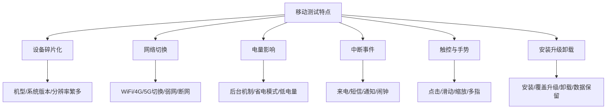
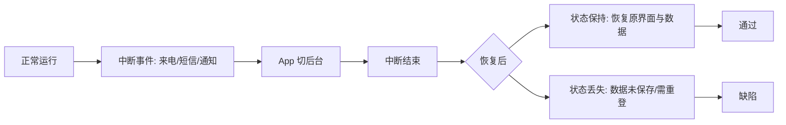
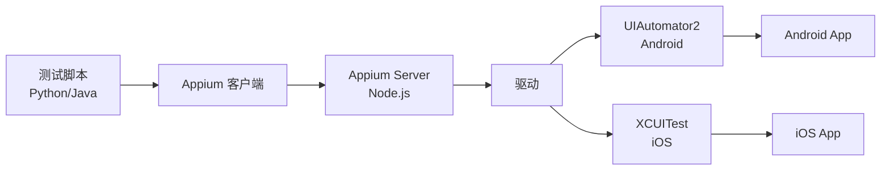
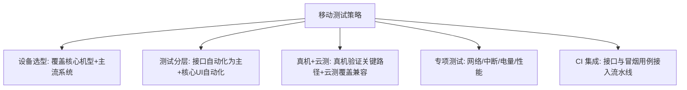

# 10.2 移动应用测试实践

移动应用运行在碎片化的设备上，受网络、电量、中断等环境因素影响显著，相比 Web 测试多了大量环境与状态维度的考量。本节介绍移动测试的特点、测试类型、Appium 自动化框架与移动测试策略。

## 移动测试特点



| 特点 | 影响与测试关注 |
| --- | --- |
| 设备碎片化 | 机型、屏幕尺寸、分辨率、系统版本组合繁多，需选型覆盖 |
| 网络切换 | WiFi/4G/5G 切换、弱网、断网下数据同步与提示 |
| 电量影响 | 低电量、省电模式下后台行为与性能 |
| 中断事件 | 来电、短信、通知、闹钟打断后状态恢复 |
| 触控与手势 | 多指、长按、滑动等交互准确性 |
| 后台机制 | 应用切后台被回收、恢复后状态保持 |

> [!note] 与 Web 测试的核心差异
> > Web 测试环境相对统一（浏览器），移动测试环境高度碎片化。移动特有的中断、网络切换、电量、安装升级等场景在 Web 中不显著，是移动测试的重点。

## 移动测试类型

| 类型 | 关注点 | 典型测试项 |
| --- | --- | --- |
| 功能测试 | 核心功能正确 | 登录、浏览、下单、支付 |
| 兼容性测试 | 多设备一致 | 机型、系统版本、分辨率 |
| 安装/卸载测试 | 安装包完整 | 全新安装、覆盖升级、卸载清理、数据保留 |
| 中断测试 | 中断后恢复 | 来电、短信、通知、闹钟、低电量提醒 |
| 网络测试 | 网络适应性 | 切换、弱网、断网、超时重连 |
| 性能测试 | 资源占用 | CPU、内存、耗电、启动时间 |
| UI 测试 | 界面适配 | 多分辨率布局、横竖屏 |

> [!example] 中断测试示例
> > 视频播放中收到来电 → 接听挂断后 → 视频应恢复到中断前位置继续播放，音量与播放状态正确。这是移动特有的“中断-恢复”场景。



## Appium 移动自动化框架

> [!definition] Appium
> Appium 是跨平台移动 UI 自动化测试框架，支持 iOS 与 Android，不依赖应用源码，使用 WebDriver 协议驱动原生、混合与移动 Web 应用。

### Appium 架构



> [!note] Appium 工作原理
> > 测试脚本通过 Appium 客户端发送 WebDriver 协议命令到 Appium Server，Server 把命令转译为对应平台的驱动命令（Android 用 UIAutomator2，iOS 用 XCUITest），驱动再操作设备上的应用。这种架构实现“一套 API，跨平台测试”。

### Appium 代码示例

```python
from appium import webdriver
from appium.webdriver.common.appiumby import AppiumBy

# 1. 初始化 Android 测试配置
caps = {
    "platformName": "Android",
    "platformVersion": "12",
    "deviceName": "Pixel_Emulator",
    "appPackage": "com.example.shop",
    "appActivity": ".MainActivity",
    "noReset": True,
}

driver = webdriver.Remote("http://127.0.0.1:4723/wd/hub", caps)

try:
    # 2. 定位搜索框并输入商品名
    search = driver.find_element(AppiumBy.ID, "com.example.shop:id/search_box")
    search.send_keys("手机")

    # 3. 点击搜索按钮
    driver.find_element(AppiumBy.ID, "com.example.shop:id/btn_search").click()

    # 4. 断言结果列表非空
    items = driver.find_elements(AppiumBy.ID, "com.example.shop:id/item_title")
    assert len(items) > 0, "搜索结果为空"
    print("移动搜索测试通过")
finally:
    driver.quit()
```

> [!example] 代码说明
> - **环境**：Python 3.x + Appium-Python-Client + Android 模拟器（API 31）+ Appium Server；
> - **输入**：搜索关键词“手机”；
> - **关键点**：`appPackage`/`appActivity` 指定被测应用入口，`AppiumBy.ID` 定位元素，`noReset` 保留应用状态；
> - **输出**：结果列表非空即通过；
> - **前提**：Appium Server 已启动，模拟器或真机已连接，应用已安装。

## 移动测试策略



| 策略 | 说明 |
| --- | --- |
| 设备选型 | 基于用户分布选择 Top 机型与系统版本，避免穷举 |
| 分层测试 | 接口自动化为主（性价比高），UI 自动化覆盖核心路径 |
| 真机 + 云测 | 真机验证关键路径，云测（如 Testin/WeTest）覆盖兼容性矩阵 |
| 专项测试 | 网络、中断、电量、性能作为独立专项 |
| 持续集成 | 接口与冒烟用例接入 CI，每次构建自动回归 |

> [!tip] 设备选型原则
> > 不要试图覆盖所有机型。基于用户实际分布选择覆盖 80% 用户的主流机型与系统版本，剩余用云测平台按需补充。投入产出比优于穷举。

## 小结

移动测试相比 Web 测试面临设备碎片化、网络切换、电量、中断等特有挑战。测试类型包括功能、兼容性、安装卸载、中断、网络、性能与 UI 测试。Appium 通过 WebDriver 协议实现跨平台 UI 自动化。策略上应基于用户分布选型、分层测试、真机与云测结合，并把接口与冒烟用例接入 CI。

## 关联

- 上一级：[[MOC - 第10章]]
- 上一节：[[10.1 Web应用测试综合实践]]
- 下一节：[[10.3 测试策略与质量保障体系]]
- 关联概念：[[9.1 自动化测试原理与框架]]（Appium 与 Selenium 同源）、[[6.2 系统测试与验收测试]]（移动系统测试）、[[8.2 缺陷分级与分类]]（兼容性缺陷分级）
