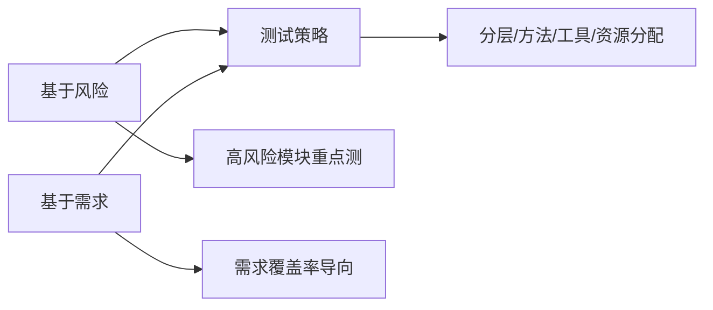
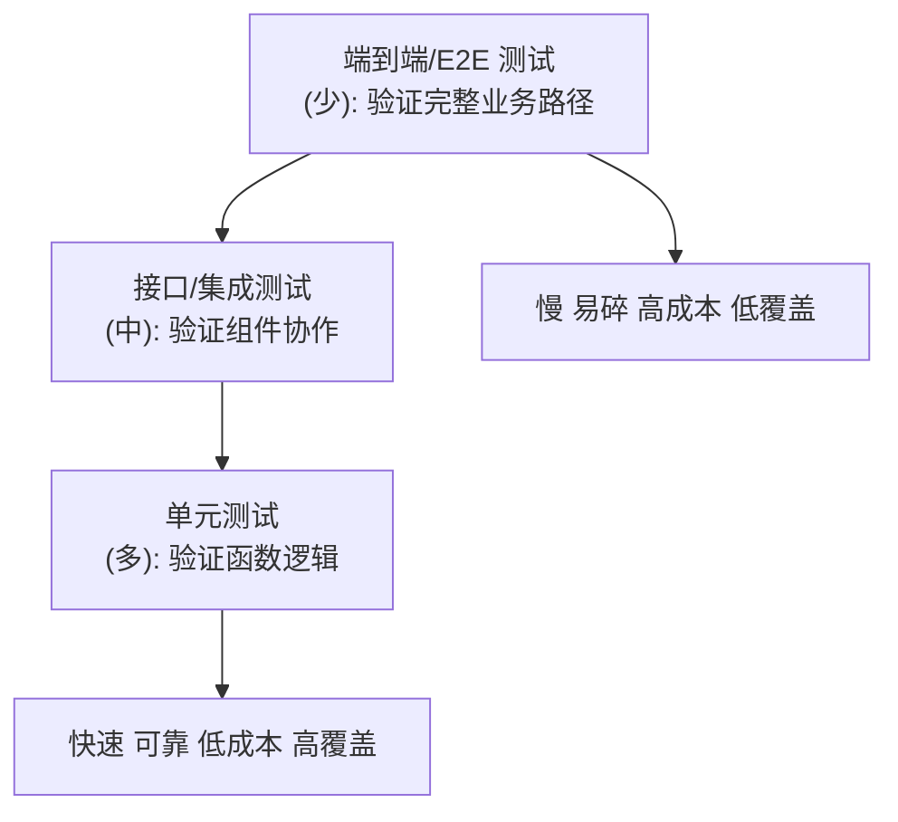
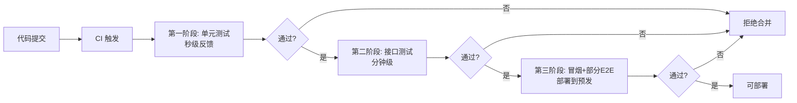
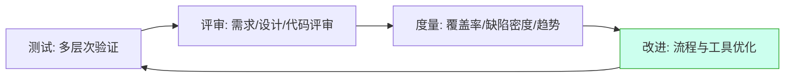
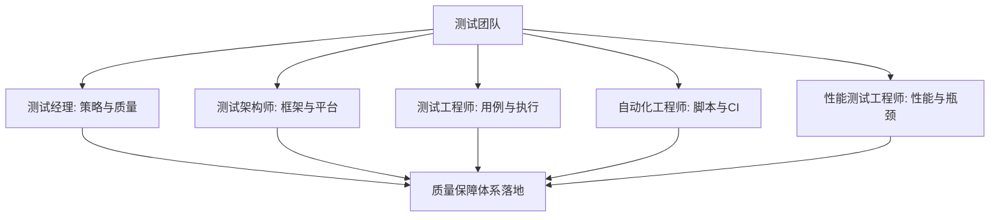

# 10.3 测试策略与质量保障体系

测试策略回答“针对这个项目，测什么、怎么测、测到什么程度”，质量保障体系回答“如何让质量可持续而非依赖个人英雄主义”。本节介绍测试策略的制定依据、测试金字塔模型、持续集成中的测试策略、质量保障体系的组成与测试团队组织，是全课程方法论的收束。

## 测试策略制定

> [!definition] 测试策略
> 测试策略（Test Strategy）是指导测试活动的高层方针，定义测试的目标、范围、层次、方法、工具、资源分配与通过准则，回答“在有限资源下如何最大化质量保障效果”。

### 制定依据

| 依据 | 核心思想 | 适用场景 |
| --- | --- | --- |
| 基于风险 | 高风险模块重点投入，低风险模块轻测 | 资源有限、需聚焦 |
| 基于需求 | 每条需求都有对应测试，覆盖率导向 | 合同测试、合规要求 |
| 基于质量目标 | 以缺陷密度/逃逸率等目标反推测试投入 | 成熟团队、有度量基线 |

> [!note] 风险驱动策略
> > 风险 = 发生概率 × 影响程度。高风险模块（如支付、权限、核心业务）应分配更多测试资源与更深的测试层次；低风险模块（如静态帮助页）轻测。这是“有限资源最大化质量”的核心思路。

## 测试金字塔

> [!definition] 测试金字塔
> 测试金字塔（Test Pyramid）是 Mike Cohn 提出的测试分层模型，底层单元测试最多、中层接口测试次之、顶层端到端测试最少，呈金字塔结构。

| 层次 | 数量 | 速度 | 稳定性 | 反馈 |
| --- | --- | --- | --- | --- |
| 单元测试 | 最多 | 极快 | 高 | 即时 |
| 接口/集成测试 | 中 | 快 | 较高 | 较快 |
| 端到端/E2E 测试 | 最少 | 慢 | 低（易碎） | 慢 |

> [!rule] 金字塔原则
> 1. **底层多**：单元测试数量最多，覆盖逻辑分支；
> 2. **顶层少**：E2E 测试只覆盖核心业务路径，避免易碎与慢速；
> 3. **接口居中**：接口测试覆盖契约与业务逻辑，性价比高；
> 4. **快反馈**：底层测试秒级反馈，问题早发现早修复。

> [!warning] 反模式：冰淇淋模型
> > 当 E2E/UI 测试最多、单元测试最少时，金字塔倒置为“冰淇淋模型”：测试慢、易碎、维护成本高、反馈滞后。这是常见的反模式，应通过补齐单元与接口测试纠正。

## 持续集成中的测试策略

| 阶段 | 测试类型 | 执行时机 | 反馈 |
| --- | --- | --- | --- |
| 提交门禁 | 单元测试 | 每次 commit/PR | 秒级 |
| 集成阶段 | 接口测试 | 合并后 | 分钟级 |
| 部署前 | 冒烟 + 部分 E2E | 部署到预发后 | 分钟级 |
| 定期 | 全量回归 + 性能 | 每日/版本前 | 小时级 |

> [!tip] 分层执行原则
> > CI 测试应分层：快速测试先行门禁，慢速测试后置预发。把所有测试塞进一个阶段会导致 CI 慢且反馈滞后。快速失败、尽早反馈是 CI 测试的核心。

## 质量保障体系

> [!definition] 质量保障体系
> 质量保障体系（Quality Assurance System）是测试、评审、度量与改进构成的闭环，目标是从“事后发现缺陷”前移为“事前预防缺陷”，使质量可持续。

| 组成 | 作用 | 关键活动 |
| --- | --- | --- |
| 测试 | 发现缺陷 | 单元/接口/系统/性能测试 |
| 评审 | 预防缺陷 | 需求评审、设计评审、代码评审、用例评审 |
| 度量 | 量化质量 | 覆盖率、缺陷密度、缺陷逃逸率、趋势 |
| 改进 | 持续优化 | 复盘、根因分析、流程改进、工具建设 |

> [!note] 度量关键指标
> > ①覆盖率（测试充分性）；②缺陷密度（代码质量）；③缺陷逃逸率（漏到生产的缺陷占比，反映测试有效性）；④缺陷趋势（质量收敛）；⑤缺陷分布（薄弱模块定位）。度量驱动改进，避免“没有数据就没有改进”。

## 测试团队组织与角色

| 角色 | 职责 | 关键产出 |
| --- | --- | --- |
| 测试经理 | 测试策略、资源、进度、质量 | 测试计划、质量报告 |
| 测试架构师 | 测试框架、工具链、CI 集成 | 自动化框架、测试平台 |
| 测试工程师 | 用例设计、执行、缺陷 | 测试用例、缺陷报告 |
| 自动化工程师 | 自动化脚本、维护 | 自动化用例、CI 配置 |
| 性能测试工程师 | 性能测试与瓶颈定位 | 性能测试报告、优化建议 |

> [!tip] 质量是全员责任
> > 质量保障不只是测试团队的事。开发负责单元测试与代码质量，产品负责需求清晰，运维负责环境稳定。测试团队是质量的推动者与度量者，而非唯一责任人。质量文化是体系有效运作的基础。

## 小结

测试策略基于风险与需求制定，高风险模块重点投入。测试金字塔建议单元测试最多、接口次之、E2E 最少，避免冰淇淋反模式。CI 测试分层执行，快速测试先行门禁、慢速测试后置预发，实现快反馈。质量保障体系由测试、评审、度量、改进构成闭环，把事后发现前移为事前预防。测试团队按角色分工协作，但质量是全员责任。

## 关联

- 上一级：[[MOC - 第10章]]
- 上一节：[[10.2 移动应用测试实践]]
- 关联概念：[[7.1 测试计划编写]]（策略落地的载体）、[[8.3 缺陷管理工具与流程规范]]（度量数据来源）、[[9.1 自动化测试原理与框架]]（金字塔层次）、[[MOC - 软件测试技术]]（课程总览）
