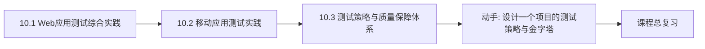
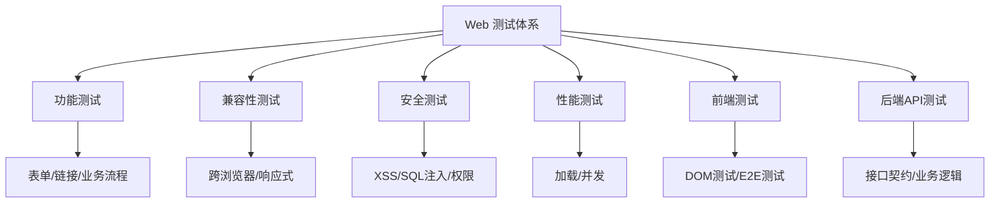

# MOC - 第10章 测试综合实践与测试策略

> [!info] 本章定位
> 第10章是课程的综合实践与策略收束。前 9 章分别讲了测试方法、用例设计、缺陷管理与自动化工具，本章回答“面对一个真实项目，如何把这些能力组织成完整的测试方案与质量保障体系”。Web 测试与移动测试是两类典型工程对象的综合实践，测试策略与质量保障体系则是把方法、工具与流程整合为可持续的工程能力。本章是课程的最终落地，串联全部前序章节。

## 学习路线图

> [!note] 路线说明
> Web 与移动测试是“对象实践”，解决不同形态产品的测试要点；测试策略与质量保障体系是“方法论收束”，回答如何基于风险与需求制定策略、如何用测试金字塔与持续集成落地、如何构建测试+评审+度量+改进的质量闭环。

## 知识点导航

| 节 | 主题 | 核心要点 | 入口 |
| --- | --- | --- | --- |
| 10.1 | Web应用测试综合实践 | 测试类型、跨浏览器、前后端测试、电商案例 | [[10.1 Web应用测试综合实践]] |
| 10.2 | 移动应用测试实践 | 设备碎片化、测试类型、Appium、测试策略 | [[10.2 移动应用测试实践]] |
| 10.3 | 测试策略与质量保障体系 | 风险驱动、测试金字塔、CI 测试、质量体系 | [[10.3 测试策略与质量保障体系]] |

## 核心考点

> [!warning] 重点掌握
> 1. Web 测试的类型：功能、兼容性、安全、性能、易用性测试要点。
> 2. 跨浏览器与响应式测试的关键考虑，Cookie/Session 的测试要点。
> 3. 前端测试层次：DOM 单元测试与 E2E 测试的区别与工具。
> 4. 移动测试的特点：设备碎片化、网络切换、电量与中断影响。
> 5. 移动测试类型与 Appium 自动化框架原理。
> 6. 测试策略的制定依据：基于风险与基于需求。
> 7. 测试金字塔的层次结构与各层比例原则。
> 8. 持续集成中的测试策略：分层执行、快速反馈。
> 9. 质量保障体系：测试+评审+度量+改进的闭环。

## Web 测试体系

## 自测题

> [!question] 题1
> 列出 Web 应用测试的主要类型，并说明兼容性测试需要覆盖哪些维度。
> > [!check]- 参考答案
> > 主要类型：功能测试、兼容性测试、安全测试、性能测试、易用性测试、接口测试。兼容性测试维度：①浏览器（Chrome/Edge/Firefox/Safari 及版本）；②操作系统（Windows/macOS/Linux/Android/iOS）；③分辨率（桌面、平板、手机）；④响应式布局断点；⑤网络环境（4G/5G/WiFi/弱网）。兼容性测试应基于用户实际使用分布优先覆盖主流环境，而非穷举所有组合。

> [!question] 题2
> 说明移动应用测试相比 Web 测试的特殊性，并列举至少四种移动特有的测试类型。
> > [!check]- 参考答案
> > 移动特殊性：①设备碎片化（机型、屏幕、系统版本繁多）；②网络切换（WiFi/4G/5G 切换、弱网、断网）；③电量与后台机制影响；④中断事件（来电、短信、通知、闹钟）；⑤安装/卸载/升级场景；⑥触控与手势交互。移动特有测试类型：安装/卸载/升级测试、中断测试、网络切换测试、兼容性测试（机型/分辨率）、电量与性能测试、手势与传感器测试。

> [!question] 题3
> 解释测试金字塔的层次结构，并说明为什么 UI 层测试应占最小比例。
> > [!check]- 参考答案
> > 测试金字塔从底到顶为：单元测试（最多）、集成/接口测试（次之）、端到端/UI 测试（最少）。UI 层应占最小比例的原因：①UI 测试执行慢，反馈周期长；②UI 易变，脚本维护成本高、易碎；③定位问题困难，失败难以归因到具体代码；④投入产出比低于底层测试。金字塔原则保证大量快速的底层测试覆盖逻辑，少量 E2E 测试覆盖核心路径，兼顾速度与覆盖。

> [!question] 题4
> 描述质量保障体系的组成，并说明“测试+评审+度量+改进”闭环如何运作。
> > [!check]- 参考答案
> > 质量保障体系组成：测试（多层次的验证）、评审（需求/设计/代码评审）、度量（覆盖率、缺陷密度、趋势等指标）、改进（基于度量的流程优化）。闭环运作：测试发现缺陷并度量 → 度量数据暴露薄弱环节 → 评审在源头预防同类问题 → 改进流程与工具 → 进入下一轮迭代验证。该闭环把“事后发现”逐步前移为“事前预防”，使质量保障从单纯的测试上升为体系化的工程能力。

## 章节导航

- 上一级：[[MOC - 软件测试技术]]
- 上一章：[[MOC - 第9章]]
- 课程总览：[[MOC - 软件测试技术]]
