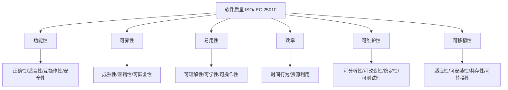
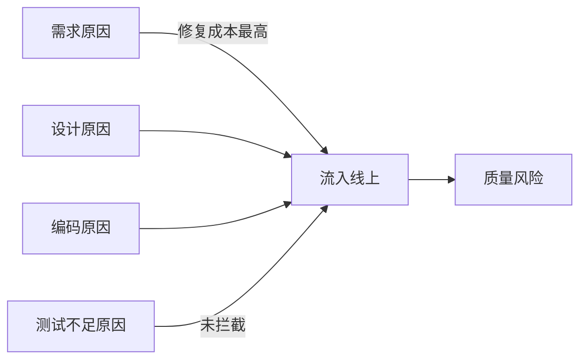

# 1.1 软件质量、软件缺陷定义

软件测试的起点是“质量”与“缺陷”这一对概念：没有质量模型，就无法判断软件“好不好”；没有缺陷定义，就无法判断测试“发现了什么”。本节明确软件质量的度量维度、软件缺陷的本质与分类，以及缺陷产生的根源，为后续测试原则与方法提供判断依据。

## 软件质量定义

> [!definition] 软件质量
> 软件质量指软件产品满足规定或隐含需求能力的全部特征与特性之和，既包括功能正确性，也包括可靠性、易用性、效率、可维护性与可移植性等非功能属性。

度量软件质量的权威框架是 **ISO/IEC 25010** 质量模型（其前身是 ISO/IEC 9126）。它将软件质量分解为若干可度量的特性，本科阶段重点掌握以下六个特性：

| 特性 | 英文 | 含义 | 典型关注点 |
| --- | --- | --- | --- |
| 功能性 | Functionality | 满足明确与隐含功能需求的能力 | 正确性、适合性、互操作性、安全性 |
| 可靠性 | Reliability | 在指定条件下、指定时间内维持规定性能水平的能力 | 成熟性、容错性、可恢复性 |
| 易用性 | Usability | 用户理解、学习、使用软件的能力 | 可理解性、可学性、可操作性 |
| 效率 | Efficiency | 使用资源量与完成工作量之间的关系 | 时间行为（响应时间）、资源利用（CPU/内存） |
| 可维护性 | Maintainability | 被修改以纠正、改进或适应的能力 | 可分析性、可改变性、稳定性、可测试性 |
| 可移植性 | Portability | 从一个环境转移到另一个环境的能力 | 适应性、可安装性、共存性、可替换性 |

> [!note] 质量模型的作用
> 质量模型把“质量好不好”这一模糊判断拆解为可度量、可分配责任的特性。测试用例不仅要验证功能，还要按需覆盖非功能特性——例如对在线交易系统，可靠性与效率往往和功能性同等重要。

## 软件缺陷定义

> [!definition] 软件缺陷
> 软件缺陷（Software Defect / Bug）指软件产品中存在的、导致软件在特定条件下无法完成规定功能、或表现与预期行为不符的任何瑕疵、错误或问题。广义上，文档、需求与设计中的错误也可视为缺陷。

缺陷的核心是“**与预期行为的偏差**”——预期可以来自需求规格、设计文档、用户期望或通用约定。缺陷未必一定会被触发，但只要存在偏差，就构成潜在风险。

## 缺陷分类

按缺陷影响的对象，常见分类如下：

| 类别 | 含义 | 典型表现 |
| --- | --- | --- |
| 功能缺陷 | 软件未实现、错误实现或多余实现了某项功能 | 需求遗漏、逻辑错误、计算结果错误 |
| 性能缺陷 | 软件在效率、容量上未达到要求 | 响应过慢、并发崩溃、内存泄漏 |
| 界面缺陷 | 用户界面与设计或可用性规范不符 | 控件错位、文案错误、交互不流畅 |
| 文档缺陷 | 文档与实际行为不一致或存在错误 | 用户手册过时、帮助链接失效、API 文档错误 |

> [!tip] 分类用途
> 缺陷分类是缺陷管理（第7章）的基础：分类统计能揭示质量薄弱环节，例如某模块性能缺陷集中，则需重点回归效率；文档缺陷多则反映交付流程的文档同步问题。

## 缺陷产生原因

缺陷并非只在编码阶段产生，而是贯穿软件生命周期的各个阶段。常见四类原因：

1. **需求原因**：需求模糊、遗漏、冲突或被误解，导致实现与用户期望不符。需求阶段引入的缺陷往往到验收才暴露，修复成本最高。
2. **设计原因**：架构不合理、接口定义错误、未考虑异常与边界，导致结构性缺陷。
3. **编码原因**：语法错误、逻辑错误、资源管理错误、并发缺陷、对边界处理不当。
4. **测试不足原因**：测试覆盖不全、用例设计不当、测试环境与生产环境差异，导致缺陷未被及时发现而流入后续阶段或线上。

> [!warning] 成本规律
> 缺陷越早发现，修复成本越低；越晚发现，修复成本呈指数级上升。需求阶段的一个误解若到验收才发现，可能牵动整个模块重构——这正是“尽早测试”原则的现实依据（详见 [[1.2 软件测试目的、原则与发展阶段]]）。

## 小结

软件质量由 ISO/IEC 25010 的六个特性刻画，软件缺陷是与预期行为的偏差。缺陷按影响分为功能、性能、界面、文档四类，按产生原因归于需求、设计、编码与测试不足四类。理解质量模型与缺陷来源，是制定测试策略、设计测试用例与管理缺陷的前提。

## 关联

- 上一级：[[MOC - 第1章]]
- 下一节：[[1.2 软件测试目的、原则与发展阶段]]
- 关联概念：[[1.3 测试与调试区别、测试风险]]（测试风险与缺陷来源的对应）
