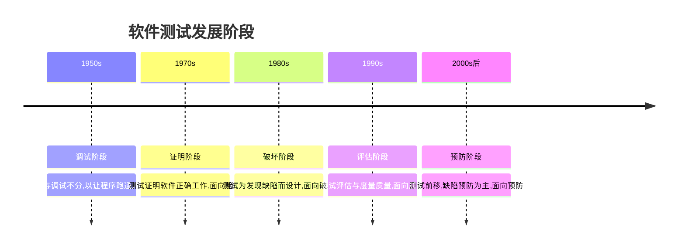

# 1.2 软件测试目的、原则与发展阶段

明确了质量与缺陷的概念后，本节回答“为什么测”与“如何测”的指导思想：软件测试的目的决定了测试活动的价值取向，测试原则约束了测试设计与执行的边界，测试发展阶段则揭示了测试理念从“找错”到“预防”的演进。

## 软件测试目的

> [!definition] 软件测试目的
> 软件测试是为发现软件缺陷、评估产品质量、降低发布风险并最终增强干系人对软件的信心而进行的有计划的验证与确认活动。

测试目的可归纳为四个层面：

1. **发现缺陷**：通过有针对性的用例触发程序异常，暴露功能、性能与可靠性问题。
2. **评估质量**：基于测试结果与缺陷分布，给出产品质量的客观度量与发布建议。
3. **降低风险**：在发布前消除高风险缺陷，减少缺陷流入生产环境造成的损失。
4. **增强信心**：通过充分的验证，使开发方与用户对软件满足需求具有合理信心。

> [!note] 目的之间的张力
> “发现缺陷”强调破坏性验证，“增强信心”强调建设性确认。二者并不矛盾：信心建立在“已尽力发现并修复缺陷”的基础上，而非盲目乐观——这正是“无错谬误”原则要纠正的误区。

## 测试七大原则

测试原则是经验与理论沉淀的指导性结论，影响测试策略与决策：

| 原则 | 英文 | 含义 |
| --- | --- | --- |
| 测试显示缺陷存在 | Testing shows the presence of defects | 测试能证明缺陷存在，但不能证明缺陷不存在 |
| 穷尽测试不可能 | Exhaustive testing is impossible | 输入与状态组合无限，无法全覆盖，需基于风险与优先级 |
| 尽早测试 | Early testing | 缺陷越早发现修复成本越低，测试应从需求阶段介入 |
| 缺陷聚集 | Defect clustering | 少数模块往往集中了大多数缺陷（帕累托现象） |
| 杀虫剂悖论 | Pesticide paradox | 反复使用相同用例会降低发现新缺陷的能力，用例需持续更新 |
| 测试活动依赖测试上下文 | Testing depends on context | 安全关键系统与电商系统的测试策略应不同 |
| 无错谬误 | Absence-of-errors fallacy | 找完缺陷 ≠ 软件可用，仍需验证需求是否被正确满足 |

> [!concept] 关键原则解读
> - **尽早测试**对应测试左移思想（详见 [[2.3 敏捷测试模型与测试左移]]），在需求与设计阶段通过评审预防缺陷。
> - **缺陷聚集**指导测试资源分配：对历史缺陷密集模块、复杂模块加重测试。
> - **杀虫剂悖论**要求用例库随版本演进，引入变异、探索式测试与随机数据补充。

## 软件测试发展阶段

软件测试理念随软件工程的发展经历了五个阶段，从被动调试走向主动预防：

| 阶段 | 核心理念 | 代表观点 |
| --- | --- | --- |
| 调试 | 让程序运行起来 | 测试等同于调试 |
| 证明 | 证明程序正确 | Dijkstra：测试只能证明错误存在 |
| 破坏 | 主动发现缺陷 | Myers：测试是为发现错误而执行程序 |
| 评估 | 评估与度量质量 | 测试是质量度量与风险评估手段 |
| 预防 | 预防缺陷产生 | 测试前移、TDD、持续测试 |

> [!tip] 阶段演进的本质
> 演进方向是“**从事后补救走向事前预防**”：调试阶段在出错后才测，预防阶段在编码前就用测试驱动设计（TDD）。现代测试（敏捷、DevOps）强调测试贯穿全生命周期，而非编码完成后的独立阶段。

## 小结

软件测试以发现缺陷、评估质量、降低风险、增强信心为目的，受七大原则约束。其中“穷尽测试不可能”决定了必须用方法学设计高效用例，“尽早测试”与“缺陷聚集”指导资源分配，“无错谬误”提醒测试也要做需求验证。测试理念从调试演进到预防，是现代测试左移与持续测试的思想源头。

## 关联

- 上一级：[[MOC - 第1章]]
- 上一节：[[1.1 软件质量、软件缺陷定义]]
- 下一节：[[1.3 测试与调试区别、测试风险]]
- 关联概念：[[2.3 敏捷测试模型与测试左移]]（尽早测试与测试左移的落地）
