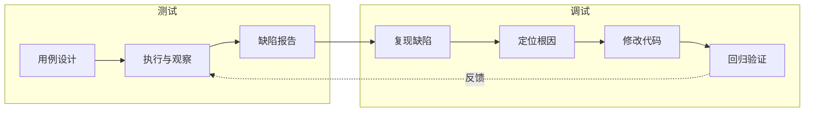
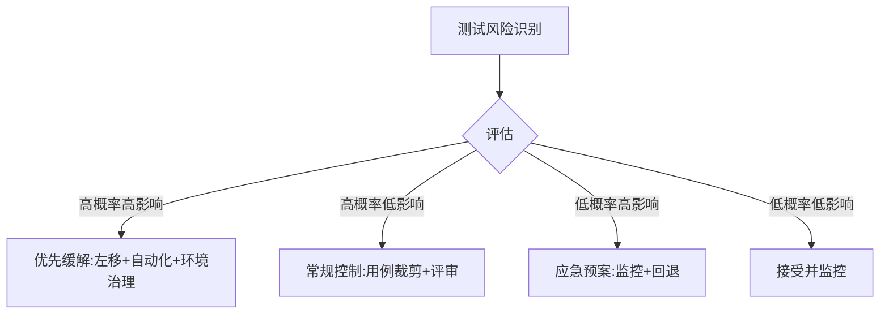

# 1.3 测试与调试区别、测试风险

测试与调试常被混淆，但二者目标、方法与责任主体不同。同时，测试活动本身也面临进度、技术、人员与环境等多重风险，需要识别并缓解。本节厘清测试与调试的边界，并建立测试风险的基本认识。

## 测试与调试区别

> [!definition] 测试与调试
> 软件测试是**有计划地**用设计好的用例执行程序以发现缺陷并评估质量；软件调试是开发者针对已暴露的缺陷**分析根因并修正**的过程。测试面向“发现问题”，调试面向“定位与修复问题”。

| 维度 | 软件测试 | 软件调试 |
| --- | --- | --- |
| 目标 | 发现缺陷、评估质量、降低风险 | 定位缺陷根因并修复 |
| 方法 | 系统化用例设计与执行 | 分析失败现场、推理与验证假设 |
| 触发 | 主动设计输入触发 | 由测试或用户报告的缺陷触发 |
| 责任人 | 测试工程师为主 | 开发人员为主 |
| 产物 | 缺陷报告、测试报告 | 代码修复、根因记录 |
| 性质 | 有计划的验证活动 | 探索性的修正活动 |

> [!note] 边界说明
> 在敏捷与 DevOps 实践中，开发人员也写单元测试、测试人员也参与根因分析，二者职责趋于融合，但“测试偏验证、调试偏修复”的本质区分依然成立。

## 静态测试与动态测试

按是否运行被测对象，测试可分为静态测试与动态测试：

- **静态测试（Static Testing）**：不运行程序，通过对文档、需求、设计与代码的人工或工具审查发现缺陷。包括代码走查、审查（Review）、静态分析。能在编码早期发现需求与设计缺陷，成本低。
- **动态测试（Dynamic Testing）**：运行程序并观察其实际行为与预期是否一致。需要输入、执行与输出比较，是发现运行时缺陷的主要手段。

> [!tip] 何时用静态测试
> 静态测试对需求、设计与代码三类工件都适用，尤其擅长发现文档不一致、接口不匹配、编码规范违反等问题。它与动态测试互补：静态发现“写得对不对”，动态发现“跑得对不对”。

## 测试风险

> [!definition] 测试风险
> 测试风险指在测试过程中，因进度、技术、人员或环境等不确定因素导致测试目标无法达成或质量评估失真的可能性。

| 风险类型 | 典型表现 | 影响 |
| --- | --- | --- |
| 进度风险 | 测试时间被压缩、用例来不及执行 | 覆盖不足，缺陷流入后续阶段 |
| 技术风险 | 被测系统复杂、自动化框架不成熟、新技术未掌握 | 用例难以设计或执行，结果不稳定 |
| 人员风险 | 测试人员经验不足、流动性大、对业务不熟 | 用例质量低、缺陷漏测 |
| 环境风险 | 测试环境与生产环境差异、数据不足、依赖不稳定 | 缺陷难以复现，性能结论失真 |

## 风险评估与缓解策略

风险评估通常从**发生概率**与**影响程度**两个维度度量，优先处理高概率高影响的风险。常见缓解策略：

1. **进度风险**：尽早介入测试（测试左移）、用例并行执行、按风险与优先级裁剪用例、引入自动化回归。
2. **技术风险**：关键技术预研、建立测试脚手架、引入专家评审、分阶段验证。
3. **人员风险**：知识沉淀与文档化、结对测试、交叉评审、业务培训。
4. **环境风险**：环境与数据治理、使用容器化与配置管理保证一致性、建立隔离的测试数据集。

> [!warning] 环境差异的隐患
> “在测试环境通过”不等于“在生产环境安全”。环境配置、数据量、依赖版本差异都可能导致缺陷只在生产暴露。性能测试尤其需要在贴近生产的环境与数据规模下进行，否则结论可能失真。

## 小结

测试以发现缺陷为目标，调试以修复缺陷为目标，二者目标、方法、责任人不同且互补。静态测试在文档与代码层面低成本发现缺陷，动态测试在运行时验证行为。测试活动本身面临进度、技术、人员与环境四类风险，需按概率与影响评估并采取对应缓解策略，以保证测试目标达成与质量评估可信。

## 关联

- 上一级：[[MOC - 第1章]]
- 上一节：[[1.2 软件测试目的、原则与发展阶段]]
- 关联概念：[[2.3 敏捷测试模型与测试左移]]（测试左移与风险缓解）、[[1.1 软件质量、软件缺陷定义]]（缺陷来源对应风险来源）
