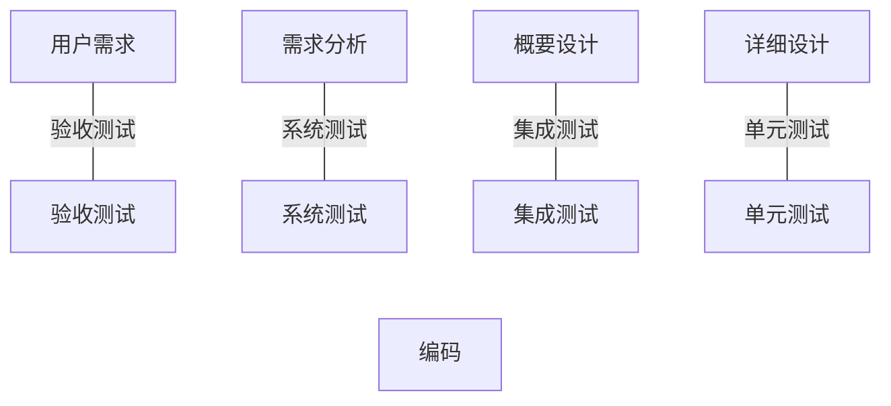
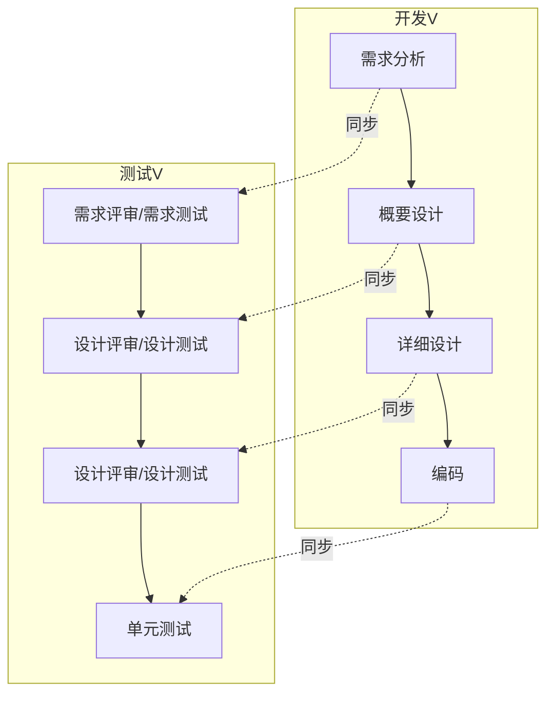

# 2.1 V模型与W模型

测试过程模型描述了测试活动如何与开发活动协同组织。V 模型是经典的瀑布式测试组织模型，明确每类测试对应的开发产物；W 模型在此基础上强调测试与开发同步，支撑“尽早测试”。理解二者的对应关系与局限，是组织测试过程的基础。

## V 模型

> [!definition] V 模型
> V 模型是软件开发的瀑布模型在测试阶段的延伸。它把开发过程（左半边自上而下）与测试过程（右半边自下而上）构成 V 字形，每一类测试与一个开发阶段一一对应，作为该阶段产物的验证。

V 模型的核心对应关系：

| 开发阶段（左侧） | 对应测试（右侧） | 验证对象 |
| --- | --- | --- |
| 用户需求 | 验收测试 | 软件是否满足用户需求 |
| 需求分析 | 系统测试 | 软件是否满足需求规格 |
| 概要设计 | 集成测试 | 模块接口与组装是否正确 |
| 详细设计 | 单元测试 | 单个模块内部逻辑是否正确 |
| 编码 | （实现） | 代码本身 |

> [!note] V 模型的含义
> > V 模型的对应关系表明：**每类测试的依据来自对应的开发阶段产物**。单元测试依据详细设计，集成测试依据概要设计，系统测试依据需求规格，验收测试依据用户需求。这为测试用例的设计提供了来源依据。

### V 模型优缺点

> [!tip] 优点
> - 明确每类测试的依据与时机，结构清晰、易于管理；
> - 强调验证活动，覆盖了从单元到验收的完整测试层次。

> [!warning] 缺点
> - 测试集中在编码之后，介入较晚，需求与设计阶段的缺陷要到后期才暴露；
> - 假设需求在前期已明确且稳定，难以应对需求频繁变化的场景；
> - 把测试视为开发完成后的独立阶段，与“尽早测试”原则相悖。

## W 模型

> [!definition] W 模型
> W 模型由两个 V 形结构叠加组成：一个开发 V，一个测试 V。它强调**开发与测试同步推进**——每个开发阶段都伴随相应的测试活动，使测试贯穿从需求到编码的全过程，故又称“双 V 模型”。

W 模型的同步关系：

| 开发阶段 | 同步测试活动 |
| --- | --- |
| 需求分析 | 需求评审、需求测试 |
| 概要设计 | 设计评审、设计测试 |
| 详细设计 | 设计评审、设计测试 |
| 编码 | 单元测试 |
| 集成 | 集成测试 |
| 系统 | 系统测试 |
| 交付 | 验收测试 |

> [!concept] W 模型的核心价值
> W 模型把测试从“编码后”提前到“需求与设计阶段”，通过评审与静态测试在早期发现文档与设计缺陷，是对 V 模型“测试介入晚”的直接改进，也是“尽早测试”原则的过程化体现。

> [!warning] W 模型局限
> W 模型仍以瀑布式开发为前提，假设需求与设计能一次性确定；在敏捷迭代中需求持续变化时，严格的双 V 同步难以完全适用。其价值更多在于强调“同步测试”的思想，而非机械套用。

## 小结

V 模型以“测试—开发阶段对应”组织测试层次，结构清晰但介入晚；W 模型用双 V 结构强调测试与开发同步，支持尽早测试，是 V 模型在过程视角的改进。两者都是瀑布式开发的产物，思想在敏捷模型中演化为持续测试（详见 [[2.3 敏捷测试模型与测试左移]]）。

## 关联

- 上一级：[[MOC - 第2章]]
- 下一节：[[2.2 H模型与X模型]]
- 关联概念：[[1.2 软件测试目的、原则与发展阶段]]（尽早测试原则）、[[2.3 敏捷测试模型与测试左移]]（持续测试）
