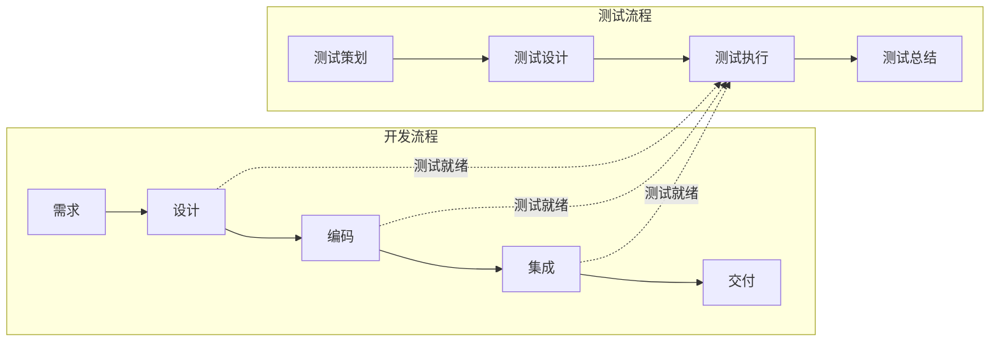
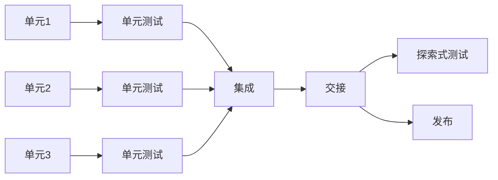

# 2.2 H模型与X模型

V 与 W 模型都把测试绑定在开发阶段上，但在实际项目中测试往往需要独立进行、贯穿全程，甚至以探索式方式进行。H 模型把测试抽象为独立流程，X 模型强调探索式测试与单元到集成的交接，二者从不同角度补充了 V/W 模型的局限。

## H 模型

> [!definition] H 模型
> H 模型将软件测试抽象为一个**独立于开发的流程**，它贯穿整个软件生命周期。无论开发处于哪个阶段，只要达到测试就绪点，就可以触发相应的测试活动。H 的两条竖线代表开发与测试两条并行流程，中间的横线代表测试就绪与执行。

H 模型的核心思想：

- 测试不是开发的附属阶段，而是一条独立的、贯穿全程的质量保障主线；
- 测试活动可在生命周期的任意阶段触发，只要被测对象达到“测试就绪”条件；
- 强调测试的准备性——测试设计与用例编写可与开发并行，提前就绪。

> [!note] H 模型的价值
> H 模型把测试从“阶段对应”中解放出来，使测试可以按需触发、与开发并行准备。它强调“测试就绪”这一触发条件，适合测试活动需要灵活安排的项目，也契合迭代与持续测试思想。

## X 模型

> [!definition] X 模型
> X 模型由 Marick 提出，强调**探索式测试**与**单元测试到集成的交接**。它把单个程序的单元测试与程序间的集成分开，并在集成后进行交接（handoff），同时允许探索式测试对未明确规约的部分进行补充验证。

X 模型的要点：

- 单个程序单元经过单元测试后，再与其他单元集成；
- 集成后通过“交接”进入更高层次的测试；
- 对没有明确规格或规格不全的部分，依赖探索式测试发现缺陷；
- 承认测试无法完全靠预先设计的用例覆盖，探索式测试是必要补充。

> [!tip] 探索式测试的定位
> 探索式测试不是“乱测”，而是测试人员在执行过程中边设计、边学习、边执行的智能化测试，适合需求模糊、快速迭代或复杂交互场景。它与预先设计的用例测试互补：前者覆盖已知规约，后者补充未知风险。

## 模型对比

| 维度 | V 模型 | W 模型 | H 模型 | X 模型 |
| --- | --- | --- | --- | --- |
| 测试与开发关系 | 测试在开发后对应 | 测试与开发同步 | 测试独立贯穿全程 | 单元到集成交接 |
| 测试介入时机 | 编码后 | 需求阶段起 | 任意就绪点 | 单元测试起 |
| 探索式测试 | 不强调 | 不强调 | 不强调 | 强调 |
| 适用场景 | 需求稳定的瀑布项目 | 强调早期评审的项目 | 测试需灵活安排的项目 | 需求模糊、迭代快的项目 |
| 主要局限 | 介入晚、不适变化 | 仍以瀑布为前提 | 抽象、落地需框架支撑 | 缺乏整体过程规范 |

> [!concept] 选型要点
> - 需求稳定、流程规范：V/W 模型足够；
> - 测试需并行准备、灵活触发：H 模型；
> - 需求模糊、迭代快速、强调探索：X 模型；
> - 实际项目常组合使用，并以敏捷与持续测试统一组织（详见 [[2.3 敏捷测试模型与测试左移]]）。

## 小结

H 模型把测试抽象为贯穿全程的独立流程，强调测试就绪与并行准备；X 模型强调单元到集成的交接与探索式测试。四类模型各有适用场景与局限，实际项目往往组合使用，并以敏捷测试与持续测试统一组织。

## 关联

- 上一级：[[MOC - 第2章]]
- 上一节：[[2.1 V模型与W模型]]
- 下一节：[[2.3 敏捷测试模型与测试左移]]
- 关联概念：[[1.2 软件测试目的、原则与发展阶段]]（杀虫剂悖论与探索式测试）
