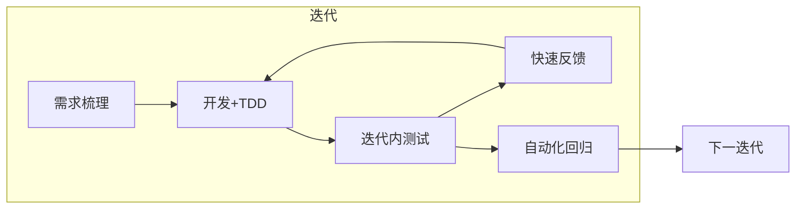
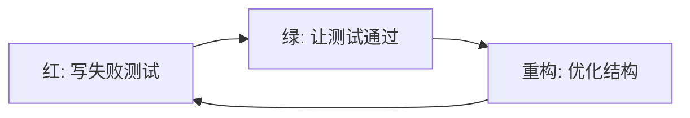
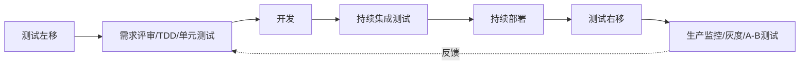

# 2.3 敏捷测试模型与测试左移

经典模型（V/W/H/X）以瀑布为背景，而现代软件开发普遍采用敏捷与 DevOps。敏捷测试强调在迭代内完成测试、持续反馈，并通过 TDD、BDD、测试左移/右移与 CI/CD 持续测试，把测试从“阶段”转变为“贯穿全程的持续活动”。

## 敏捷测试

> [!definition] 敏捷测试
> 敏捷测试是与敏捷开发相适配的测试方式：在短迭代内对增量功能进行测试，强调快速反馈、持续协作、自动化回归与质量内建，而非把测试集中在开发完成之后。

敏捷测试的特点：

- **迭代内测试**：每个迭代完成后即可对增量功能测试，迭代结束即交付可工作软件；
- **持续反馈**：测试结果即时反馈给开发，缺陷在迭代内修复；
- **自动化回归**：用自动化用例保证已有功能不被破坏，使迭代可快速推进；
- **全员质量**：测试不再只是测试人员职责，开发通过单元测试与 TDD 共同保障质量。



> [!note] 与瀑布测试的根本差异
> 瀑布测试把测试放在开发之后集中进行；敏捷测试把测试嵌入每个迭代，使测试与开发交替、并行推进。这使得“测试阶段”的概念弱化，测试成为持续活动。

## TDD 测试驱动开发

> [!definition] TDD
> 测试驱动开发（Test-Driven Development）要求在编写功能代码之前先写测试用例，通过“红—绿—重构”循环驱动设计与实现演进。

TDD 的循环：

1. **红（Red）**：写一个会失败的测试（功能尚未实现）；
2. **绿（Green）**：用最简单的方式让测试通过；
3. **重构（Refactor）**：在测试保护下优化代码结构、消除重复，保持测试通过。



> [!concept] TDD 的深层意义
> TDD 不仅是“先写测试”，更是用测试驱动设计——它迫使开发者从调用方视角思考接口与行为，促使代码可测、解耦，并通过持续运行测试形成安全网。它是测试左移在编码层面的典型实践。

## BDD 行为驱动开发

> [!definition] BDD
> 行为驱动开发（Behavior-Driven Development）通过用业务可读的场景描述软件行为，把需求、测试与文档统一，使业务方、开发与测试对“做什么”达成共识。其标准表达是 Given-When-Then。

场景表达示例：

```gherkin
Feature: 用户登录
  Scenario: 使用有效账号登录
    Given 用户已在注册并存在账号
    When 用户输入正确的用户名和密码并提交
    Then 系统应返回登录成功并跳转到首页
```

> [!tip] TDD 与 BDD 的关系
> TDD 关注代码单元的行为，面向开发者；BDD 关注业务场景的行为，面向业务与开发协作。二者可结合：用 BDD 描述业务场景，用 TDD 实现并验证，使从需求到代码的行为可追溯。

## 测试左移与测试右移

- **测试左移（Shift-Left Testing）**：把测试活动提前到需求与设计阶段，通过需求评审、TDD、单元测试、静态分析在早期发现并预防缺陷。对应“尽早测试”原则。
- **测试右移（Shift-Right Testing）**：把测试延伸到发布后的生产环境，通过监控、灰度发布、A/B 测试与真实用户行为分析，在真实流量下发现实验室难以复现的问题。



> [!note] 左右移的协同
> 测试左移降低缺陷流入后期的概率，测试右移覆盖实验室难以模拟的真实场景。二者结合，使测试从“开发后的一次性活动”转变为“贯穿需求到运维的持续闭环”。

## DevOps 中的测试：CI/CD 持续测试

在 DevOps 中，测试被嵌入持续集成/持续交付（CI/CD）流水线，形成**持续测试**：

- **代码提交即测试**：每次提交自动触发单元测试与静态检查；
- **构建即集成测试**：构建成功后自动运行集成与接口测试；
- **部署前门禁**：自动化回归与性能测试作为部署门禁，不通过则阻断发布；
- **生产可观测**：部署后通过监控与告警持续验证生产行为（测试右移）。

> [!warning] 持续测试的前提
> 持续测试高度依赖自动化——只有测试用例可自动运行、结果可自动判定，才能嵌入流水线。手工测试无法支撑高频持续交付。因此自动化测试框架与脚本维护（详见第9章）是 DevOps 测试的基础设施。

## 小结

敏捷测试在迭代内完成测试并持续反馈，TDD 用红-绿-重构驱动设计，BDD 用 Given-When-Then 统一需求与测试。测试左移把测试提前到需求与设计，测试右移把测试延伸到生产，二者在 DevOps 的 CI/CD 流水线中统一为持续测试。现代测试的核心是从“阶段”走向“贯穿全程的持续活动”。

## 关联

- 上一级：[[MOC - 第2章]]
- 上一节：[[2.2 H模型与X模型]]
- 关联概念：[[1.2 软件测试目的、原则与发展阶段]]（尽早测试原则）、[[1.3 测试与调试区别、测试风险]]（测试左移与风险缓解）、[[3.1 黑盒测试概念与方法概述]]（BDD 场景与黑盒用例的衔接）
