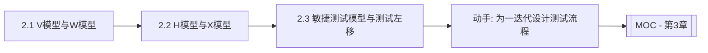

# MOC - 第2章 软件测试模型

> [!info] 本章定位
> 第2章回答“测试在软件生命周期中处于什么位置、与开发如何协同”。它系统介绍 V、W、H、X 四种经典测试过程模型，并延伸到敏捷测试、TDD、BDD 与测试左移/右移。掌握本章后，才能理解测试为何要尽早介入、持续进行，并为后续测试分类与方法学习建立过程视角。

## 学习路线图

## 知识点导航

| 节 | 主题 | 核心要点 | 入口 |
| --- | --- | --- | --- |
| 2.1 | V模型与W模型 | V 模型各测试阶段对应开发阶段、W 模型双 V 同步结构、优缺点 | [[2.1 V模型与W模型]] |
| 2.2 | H模型与X模型 | H 模型独立测试流程、X 模型探索式测试、四模型对比 | [[2.2 H模型与X模型]] |
| 2.3 | 敏捷测试模型与测试左移 | 敏捷迭代内测试、TDD 红-绿-重构、BDD Given-When-Then、测试左移/右移、CI/CD 持续测试 | [[2.3 敏捷测试模型与测试左移]] |

## 核心考点

> [!warning] 重点掌握
> 1. V 模型中单元测试对应详细设计、集成测试对应概要设计、系统测试对应需求分析、验收测试对应用户需求的对应关系。
> 2. W 模型“开发与测试同步”的双 V 结构及其对“尽早测试”的支撑。
> 3. H 模型将测试作为独立流程贯穿生命周期的思想；X 模型探索式测试与交接点。
> 4. V/W/H/X 四模型各自适用场景与局限的对比。
> 5. TDD 的红-绿-重构循环；BDD 的 Given-When-Then 场景表达。
> 6. 测试左移与测试右移的含义，及在 DevOps/CI/CD 中持续测试的落地。

## 自测题

> [!question] 题1
> 画出 V 模型结构，并说明每类测试对应哪个开发阶段。
> > [!check]- 参考答案
> > V 模型左半边自上而下为：需求分析 → 概要设计 → 详细设计 → 编码；右半边自下而上为：单元测试 → 集成测试 → 系统测试 → 验收测试。对应关系：单元测试 ← 详细设计，集成测试 ← 概要设计，系统测试 ← 需求分析，验收测试 ← 用户需求。

> [!question] 题2
> W 模型相对 V 模型的主要改进是什么？
> > [!check]- 参考答案
> > W 模型由两个 V 形结构组成：一个开发 V，一个测试 V，二者同步推进。它强调测试与开发同步——每个开发阶段（需求、设计、编码）都有对应的测试活动（需求评审、设计评审、单元测试等），从而支持“尽早测试”原则，能在需求与设计阶段就发现缺陷，降低后期修复成本。V 模型则把测试主要集中在编码之后的对应阶段，介入较晚。

> [!question] 题3
> 解释 TDD 的“红-绿-重构”循环。
> > [!check]- 参考答案
> > 红：先写一个会失败的测试用例（因功能尚未实现）；绿：用最简单的方式让测试通过（实现功能）；重构：在测试保护下优化代码结构、消除重复，保持测试通过。循环往复，使代码始终被测试覆盖，并通过测试驱动设计演进。

> [!question] 题4
> 简述测试左移与测试右移分别指什么，并各举一项实践。
> > [!check]- 参考答案
> > 测试左移指把测试活动提前到生命周期的早期阶段，在需求与设计阶段就介入，实践如需求评审、TDD、单元测试。测试右移指把测试延伸到发布之后的运维与生产环境，实践如生产监控、灰度发布、线上 A/B 测试与真实用户行为分析。二者共同构成贯穿全生命周期的持续测试。

## 章节导航

- 上一级：[[MOC - 软件测试技术]]
- 上一章：[[MOC - 第1章]]
- 下一章：[[MOC - 第3章]]
