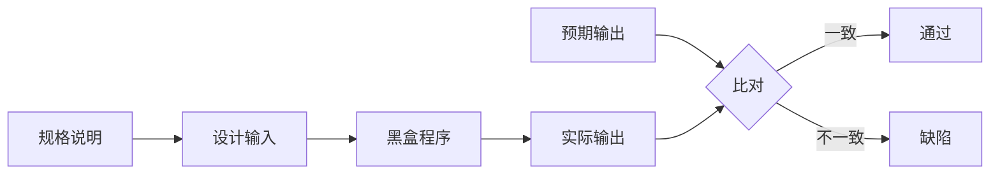

# 3.1 黑盒测试概念与方法概述

黑盒测试是从用户视角验证软件功能的主流测试方式。它不关心程序内部如何实现，只依据规格说明判断“给定输入，输出是否正确”。本节明确黑盒测试的本质、特点与方法体系，为第4章深入各类黑盒方法奠定基础。

## 黑盒测试定义

> [!definition] 黑盒测试
> 黑盒测试（Black-Box Testing）又称功能测试，是把被测程序看作一个不透明的“黑盒”，测试人员只依据需求规格与功能说明设计输入、执行并检查输出，**不关心程序的内部结构、逻辑与实现**。

黑盒测试的依据是“规格说明”——它回答“软件应该做什么”，而非“软件是怎么做的”。

## 黑盒测试特点

- **以用户视角验证功能**：从外部行为而非内部实现出发，贴近用户使用方式；
- **不依赖实现细节**：即使实现重写，只要外部行为符合规格，用例仍可复用；
- **关注输入输出与功能正确性**：验证功能、边界、异常处理是否符合规约；
- **可与实现并行准备**：测试用例可基于需求与设计文档提前编写（对应 H 模型与测试左移）。

> [!note] 黑盒与实现无关的意义
> > 因为黑盒用例不依赖实现，它能发现“实现错误导致外部行为错误”的缺陷；但也正因不关心实现，黑盒测试难以发现未被执行的代码路径或隐藏的边界缺陷——这正是白盒测试（详见 [[3.2 白盒测试概念与方法概述]]）的补充价值。

## 黑盒测试方法概述

黑盒测试的核心是“如何用有限的输入覆盖几乎无限的输入空间”。为此发展出多种方法学，本节仅概述，第4章将分别深入：

| 方法 | 核心思想 | 适用场景 |
| --- | --- | --- |
| 等价类划分 | 把输入划分为有效/无效等价类，每类取代表值 | 输入域可分类、需减少冗余用例 |
| 边界值分析 | 缺陷常出现在边界附近，重点测试边界与邻域 | 数值/范围输入、数组与循环边界 |
| 因果图 | 用因果关系刻画输入条件与动作的依赖 | 输入组合存在逻辑依赖与约束 |
| 决策表 | 用表格穷举条件组合与对应动作 | 多条件组合、规则明确的功能 |
| 正交实验 | 用正交表选择有代表性的输入组合 | 多因素多水平、需控制用例规模 |

> [!tip] 方法选择
> - 输入独立、范围明确：等价类 + 边界值；
> - 输入之间存在逻辑依赖：因果图 → 决策表；
> - 多因素组合且需控制规模：正交实验；
> - 实际项目常组合使用，并辅以场景法覆盖业务流程。

## 黑盒测试优缺点

> [!tip] 优点
> - 从用户视角出发，能发现功能与交互层面的缺陷；
> - 不依赖实现，用例在实现完成后即可执行，也可提前设计；
> - 对测试人员的编程能力要求相对较低，易于开展。

> [!warning] 缺点
> - 无法保证内部逻辑全覆盖，可能遗漏未执行代码中的缺陷；
> - 输入空间巨大，若方法不当易产生冗余或遗漏；
> - 依赖规格说明的质量，规格不全或错误时测试有效性受限。

## 小结

黑盒测试以规格说明为依据、以用户视角验证功能，方法体系围绕“用代表性输入覆盖输入空间”展开。它贴近用户、与实现无关，但难以保证内部覆盖，需与白盒测试互补。

## 关联

- 上一级：[[MOC - 第3章]]
- 下一节：[[3.2 白盒测试概念与方法概述]]
- 关联概念：[[2.3 敏捷测试模型与测试左移]]（BDD 场景与黑盒用例的衔接）、[[3.3 灰盒测试与测试分类体系]]（灰盒的折中）
