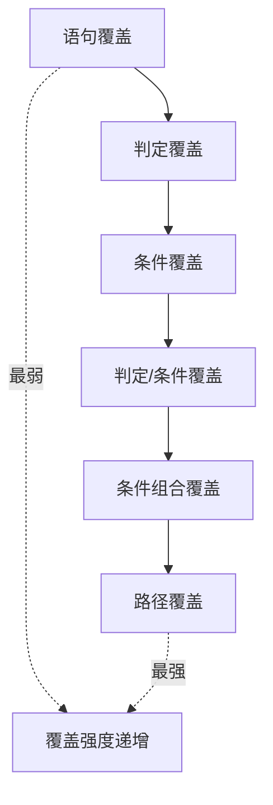

# 3.2 白盒测试概念与方法概述

白盒测试是与黑盒互补的测试方式：它打开“黑盒”，依据程序内部结构与逻辑设计用例，关注代码路径与条件的覆盖。本节明确白盒测试的本质、特点与六种逻辑覆盖准则的层次关系，为第5章深入白盒方法奠定基础。

## 白盒测试定义

> [!definition] 白盒测试
> 白盒测试（White-Box Testing）又称结构测试或透明盒测试，是把被测程序看作一个透明的“白盒”，测试人员**依据程序内部结构、控制流与逻辑**设计用例，目标是使程序的语句、分支、条件与路径得到充分覆盖。

白盒测试的依据是“代码与设计”——它回答“软件是怎么做的”，并通过覆盖内部结构验证实现的正确性。

## 白盒测试特点

- **以结构验证为目标**：通过覆盖内部逻辑保证代码路径被执行；
- **依赖代码与控制流**：需阅读源码、绘制控制流图、计算圈复杂度；
- **关注路径与条件覆盖**：以覆盖准则度量测试充分性；
- **通常由开发者或具备编程能力的测试人员执行**：单元测试是其主要落地形式。

> [!note] 白盒与黑盒的互补
> > 白盒测试擅长发现“未被执行的代码”与“逻辑条件组合”中的缺陷，弥补黑盒看不见内部的不足；但它从实现出发，可能漏掉“实现正确但不符合需求”的缺陷——这需黑盒测试从需求侧补充。二者结合即灰盒（详见 [[3.3 灰盒测试与测试分类体系]]）。

## 白盒测试方法概述：六种逻辑覆盖

逻辑覆盖是白盒测试的核心方法体系，按覆盖强度由弱到强分为六种准则：

| 准则 | 英文 | 覆盖要求 | 强度 |
| --- | --- | --- | --- |
| 语句覆盖 | Statement Coverage | 每条可执行语句至少执行一次 | 最弱 |
| 判定覆盖 | Decision Coverage | 每个判定的真假分支至少各执行一次 | 弱 |
| 条件覆盖 | Condition Coverage | 每个基本条件的真假至少各取一次 | 弱 |
| 判定/条件覆盖 | Decision/Condition Coverage | 同时满足判定覆盖与条件覆盖 | 中 |
| 条件组合覆盖 | Multiple Condition Coverage | 每个判定中各基本条件的真假组合至少出现一次 | 强 |
| 路径覆盖 | Path Coverage | 程序所有独立执行路径至少各执行一次 | 最强 |

> [!concept] 覆盖强度的含义
> > 覆盖强度越高，能发现的缺陷类型越多，但所需用例数也越多。实际中并非一味追求最强覆盖，而是依据风险与成本选择准则——例如安全关键代码常要求条件组合或路径覆盖，普通业务代码满足判定覆盖即可。

> [!warning] 覆盖率与质量的辩证
> > 高覆盖率不等于高质量：覆盖只要求“执行过”，不保证“验证了正确性”。若用例缺少断言，即使路径覆盖 100% 也可能放过缺陷。覆盖率是测试充分性的下限度量，而非质量保证。

## 白盒测试优缺点

> [!tip] 优点
> - 能发现未被执行的代码与逻辑组合缺陷，覆盖可度量；
> - 与单元测试结合紧密，适合在编码阶段由开发者执行；
> - 可借助工具（如 JaCoCo、coverage.py）自动统计覆盖率。

> [!warning] 缺点
> - 依赖代码，实现变更时用例需同步维护；
> - 从实现出发，可能漏掉需求层面的缺陷；
> - 路径随复杂度指数增长，路径覆盖在大程序中难以达成。

## 小结

白盒测试以代码结构为依据，通过六种逻辑覆盖准则由弱到强地度量测试充分性。它与黑盒互补：白盒保证内部逻辑被覆盖，黑盒保证外部行为符合需求。覆盖率高不代表质量高，需结合断言与风险导向选择覆盖准则。

## 关联

- 上一级：[[MOC - 第3章]]
- 上一节：[[3.1 黑盒测试概念与方法概述]]
- 下一节：[[3.3 灰盒测试与测试分类体系]]
- 关联概念：[[2.3 敏捷测试模型与测试左移]]（TDD 与白盒单元测试的结合）、[[1.3 测试与调试区别、测试风险]]（白盒与调试的边界）
