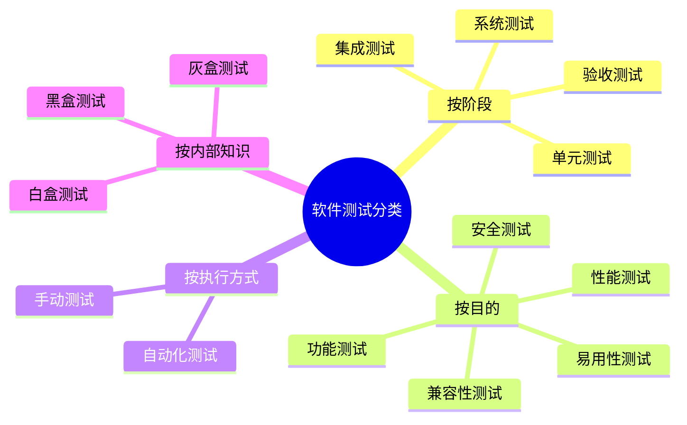

# 3.3 灰盒测试与测试分类体系

黑盒与白盒是从“是否关注内部实现”这一单一维度划分的。实际测试还需从阶段、目的、执行方式等多维度组织。本节先引入灰盒测试作为黑/白盒的折中，再建立完整的测试分类体系，使各类测试在脑中有清晰定位。

## 灰盒测试

> [!definition] 灰盒测试
> 灰盒测试（Gray-Box Testing）是结合黑盒与白盒的测试方式：既依据规格说明设计输入、验证输出，又参考程序内部结构（如接口、数据流、模块交互、状态机）设计用例，但不需要像白盒那样对每行代码做逻辑覆盖。

灰盒测试的特点：

- **兼顾规约与结构**：以规格说明为主，辅以对内部接口与数据流的理解；
- **适合接口与集成测试**：模块间交互既需验证外部契约，又需了解接口实现；
- **便于定位缺陷**：相比纯黑盒，更易判断缺陷来自哪个模块或接口。

> [!note] 灰盒的定位
> 灰盒并非独立的方法学，而是黑/白盒在不同测试层次的组合策略。例如接口测试既验证请求/响应是否符合契约（黑盒），又参考服务内部状态与数据流（白盒），即为典型的灰盒实践。

## 测试分类体系

软件测试可从多个维度分类，同一项测试在不同维度下有不同归属。

### 按测试阶段分

| 阶段 | 目标 | 依据 | 典型活动 |
| --- | --- | --- | --- |
| 单元测试 | 验证最小可测单元的正确性 | 详细设计 | 函数/类级测试、白盒逻辑覆盖 |
| 集成测试 | 验证模块组装后的接口与协作 | 概要设计 | 接口测试、灰盒测试 |
| 系统测试 | 验证系统整体满足需求规格 | 需求规格 | 功能、性能、安全等系统级测试 |
| 验收测试 | 验证系统满足用户需求与验收标准 | 用户需求 | 用户验收、Alpha/Beta 测试 |

### 按测试目的分

| 类型 | 验证内容 |
| --- | --- |
| 功能测试 | 功能是否满足需求 |
| 性能测试 | 响应时间、吞吐量、资源利用等效率特性 |
| 安全测试 | 抵御攻击、数据保护与权限控制 |
| 兼容性测试 | 在不同平台/浏览器/设备上的表现 |
| 易用性测试 | 用户理解、学习与操作的便利性 |

### 按执行方式分

| 类型 | 含义 | 特点 |
| --- | --- | --- |
| 手动测试 | 测试人员手工执行用例并观察 | 灵活、易发现交互问题，效率低、难回归 |
| 自动化测试 | 用脚本或工具自动执行与判定 | 高效、可重复、适合回归，需维护脚本 |

### 按内部知识分

| 类型 | 是否关注内部实现 | 主要依据 |
| --- | --- | --- |
| 黑盒测试 | 否 | 规格说明 |
| 白盒测试 | 是 | 内部结构/代码 |
| 灰盒测试 | 部分 | 规约 + 部分内部结构 |

> [!concept] 多维度归属
> 一项测试在不同维度有不同归属。例如“用 JMeter 对登录接口做并发压力测试”，按阶段属于集成/系统测试，按目的属于性能测试，按执行方式属于自动化测试，按内部知识属于灰盒测试。分类维度互补而非互斥，共同描述一项测试的完整定位。

## 小结

灰盒测试结合黑盒与白盒，适合接口与集成测试场景。测试分类体系从阶段、目的、执行方式、内部知识四个维度组织，同一项测试可同时具备多个维度的归属。理解分类体系有助于针对测试目标选择合适的方法、工具与组织方式，也是后续章节（第4–5章方法、第7章缺陷、第9章自动化）的导航框架。

## 关联

- 上一级：[[MOC - 第3章]]
- 上一节：[[3.2 白盒测试概念与方法概述]]
- 关联概念：[[2.1 V模型与W模型]]（测试阶段与开发阶段的对应）、[[1.1 软件质量、软件缺陷定义]]（测试目的与质量特性的对应）
