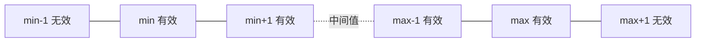
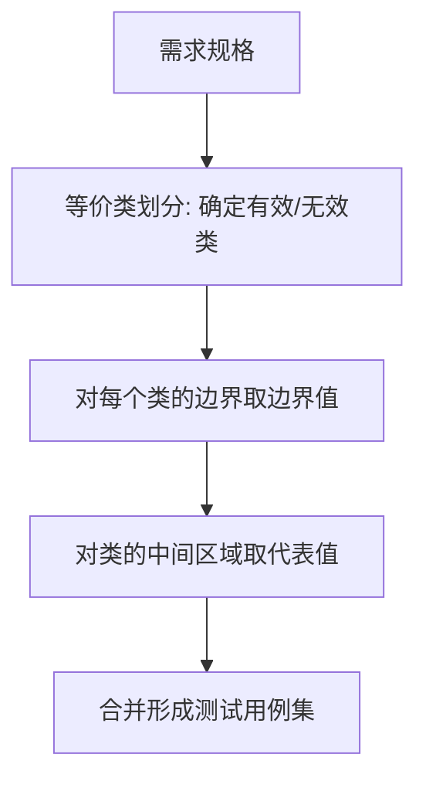

# 4.2 边界值分析法

边界值分析法是对等价类划分法的重要补充。它基于一个长期测试经验总结出的规律：**缺陷往往集中在输入范围的边界及其附近**，而等价类划分从类中任取代表值，往往恰好避开边界，导致边界缺陷漏测。本节明确边界值的选取规则、与等价类的配合策略，并通过示例给出完整设计流程。

## 边界值分析原理

> [!definition] 边界值分析
> 边界值分析（Boundary Value Analysis, BVA）是一种黑盒测试方法，它选取输入范围的**边界及其邻域值**作为测试数据，其依据是“大量的缺陷发生在输入域的边界附近，而非中心区域”。

边界附近易出错的原因：

- 编程中常使用 `<` 与 `<=` 混淆，导致边界值被错误地包含或排除；
- 循环边界条件 `i < n` 与 `i <= n` 的 off-by-one 错误；
- 数组下标从 0 还是 1 开始的混淆；
- 需求规格中“含/不含端点”表述不清导致实现偏差。

> [!note] 边界值与等价类的关系
> 边界值分析通常**作为等价类划分的补充**使用：等价类划分确定“测哪些类”，边界值分析确定“在类的边界附近取哪些具体值”。二者配合能显著提升缺陷发现率。

## 边界值选取

对于输入范围为 $[min, max]$ 的数值型输入，边界值分析法通常选取以下 6 个值：

| 取值 | 含义 | 类型 |
| --- | --- | --- |
| min-1 | 刚好小于下界 | 无效 |
| min | 下界 | 有效 |
| min+1 | 刚好大于下界 | 有效 |
| max-1 | 刚好小于上界 | 有效 |
| max | 上界 | 有效 |
| max+1 | 刚好大于上界 | 无效 |

> [!tip] 取值记忆
> 记住“**3 个边界点 + 2 个越界点**”：min、min+1、max-1、max 是有效边界附近值，min-1、max+1 是无效越界值。共 6 个用例。

### 边界值的扩展

- **如果输入是序号/数组下标**：同样取 min、min+1、max-1、max 及越界值；
- **如果输入是字符串长度**：按字符数取边界，如长度为 6~18 的字符串，取长度 5、6、7、17、18、19；
- **如果输入是日期**：考虑月末、年末、闰年 2 月 29 日等特殊边界。

## 边界值与等价类配合使用

边界值分析通常与等价类划分配合，形成“**等价类定类 + 边界值定点**”的设计策略：

### 配合策略

1. **先划分等价类**：确定输入的有效区间与无效区间；
2. **对每个边界取 6 个值**：min-1、min、min+1、max-1、max、max+1；
3. **对中间区域取 1 个代表值**：用于覆盖非边界的等价类内部；
4. **合并去重**：边界值与等价类代表值重合时合并。

> [!warning] 注意
> 边界值分析主要针对**数值型与范围型输入**。对于枚举型、布尔型输入，边界值意义不大，应优先使用等价类或决策表。

## 完整示例：日期范围验证边界值设计

### 需求描述

某查询系统要求用户输入日期范围：

- 开始日期 `startDate`、结束日期 `endDate`；
- 日期格式为 `YYYY-MM-DD`；
- 日期范围限定在 2020-01-01 至 2025-12-31 之间；
- 开始日期须不晚于结束日期。

### 等价类与边界值分析

针对“日期范围是否在 [2020-01-01, 2025-12-31] 内”这一条件：

| 等价类 | 边界值取值 | 类型 |
| --- | --- | --- |
| 早于下界 | 2019-12-31（min-1） | 无效 |
| 下界 | 2020-01-01（min） | 有效 |
| 下界邻域 | 2020-01-02（min+1） | 有效 |
| 中间代表值 | 2023-06-15 | 有效 |
| 上界邻域 | 2025-12-30（max-1） | 有效 |
| 上界 | 2025-12-31（max） | 有效 |
| 晚于上界 | 2026-01-01（max+1） | 无效 |

### 特殊边界考虑

日期类型还需考虑以下特殊边界：

| 特殊边界 | 取值 | 说明 |
| --- | --- | --- |
| 闰年 2 月 29 日 | 2024-02-29 | 2024 为闰年，应有效 |
| 非闰年 2 月 29 日 | 2023-02-29 | 2023 非闰年，应无效 |
| 月末 | 2023-01-31 | 1 月有 31 天，有效 |
| 月末越界 | 2023-02-30 | 2 月无 30 日，无效 |
| 年末 | 2025-12-31 | 年末边界，有效 |

### 测试用例

| 用例号 | startDate | endDate | 预期结果 | 说明 |
| --- | --- | --- | --- | --- |
| TC1 | 2019-12-31 | 2023-06-15 | 提示日期超出范围 | min-1 无效 |
| TC2 | 2020-01-01 | 2023-06-15 | 查询成功 | min 有效边界 |
| TC3 | 2020-01-02 | 2023-06-15 | 查询成功 | min+1 有效 |
| TC4 | 2023-06-15 | 2025-12-30 | 查询成功 | max-1 有效 |
| TC5 | 2023-06-15 | 2025-12-31 | 查询成功 | max 有效边界 |
| TC6 | 2023-06-15 | 2026-01-01 | 提示日期超出范围 | max+1 无效 |
| TC7 | 2024-02-29 | 2024-03-01 | 查询成功 | 闰年边界 |
| TC8 | 2023-02-29 | 2023-03-01 | 提示日期非法 | 非闰年越界 |
| TC9 | 2023-06-15 | 2023-06-14 | 提示开始日期晚于结束日期 | 日期顺序约束 |

> [!example] 设计要点
> 日期边界值设计不能只看范围上下界，还要考虑日历本身的特殊边界（闰年、月末、年末），这些是实践中极易出错的位置。

## 优缺点

> [!tip] 优点
> - 针对性强，直接命中高缺陷密度区域；
> - 用例数量少，性价比高；
> - 易于与等价类划分配合使用。

> [!warning] 缺点
> - 仅适用于有明确范围的输入，对无界或枚举型输入不适用；
> - 不能发现边界内部逻辑依赖与组合问题；
> - 需测试人员准确识别边界，遗漏边界即遗漏缺陷。

## 小结

边界值分析基于“边界附近缺陷密集”的经验规律，选取 min-1、min、min+1、max-1、max、max+1 六个值作为测试数据。它通常与等价类划分配合使用，形成“定类 + 定点”的策略，是黑盒测试中性价比极高的方法。对于日期等特殊类型，还需额外考虑日历本身的特殊边界。

## 关联

- 上一级：[[MOC - 第4章]]
- 上一节：[[4.1 等价类划分法]]
- 下一节：[[4.3 因果图法与决策表法]]
- 关联概念：[[3.1 黑盒测试概念与方法概述]]（黑盒方法体系总览）
