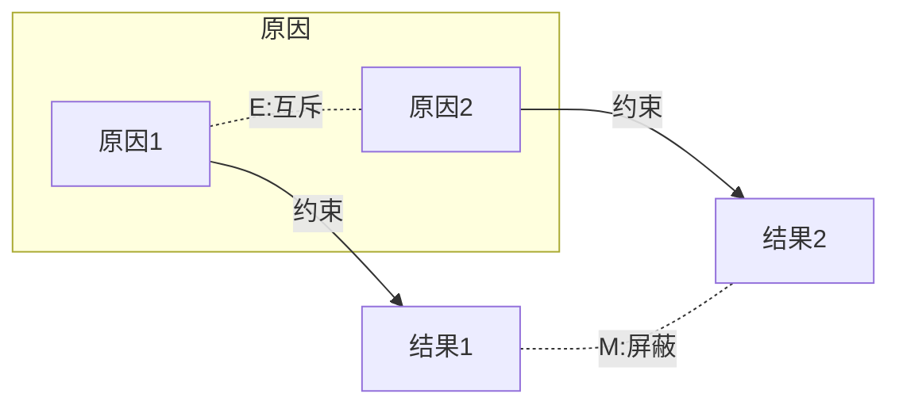
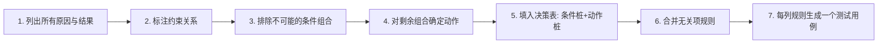
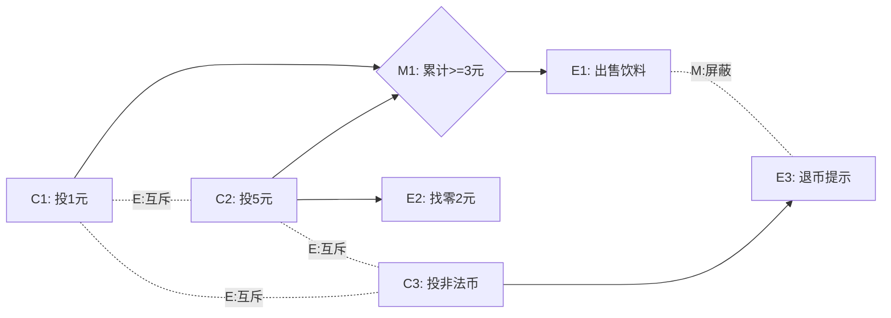

# 4.3 因果图法与决策表法

等价类划分与边界值分析适用于输入独立的场景，但当输入之间存在逻辑依赖与约束时，二者难以系统覆盖条件组合。因果图法与决策表法正是为此而生：**因果图刻画输入条件与输出动作之间的因果关系与约束，决策表则把因果关系表格化为可执行规则**。二者常配套使用，是处理复杂业务规则的核心方法。

## 因果图法

> [!definition] 因果图
> 因果图（Cause-Effect Graph）是一种描述输入条件（原因）与输出结果（结果）之间逻辑关系的有向图。它用图示方式刻画“哪些原因组合会产生哪些结果”，并通过约束标注原因或结果之间的限制关系。

### 基本符号

因果图使用四类基本逻辑关系连接原因与结果：

| 关系 | 含义 | 图示 |
| --- | --- | --- |
| 恒等（Identity） | 原因为真则结果为真，为假则结果为假 | $\text{原因} \rightarrow \text{结果}$ |
| 非（NOT） | 原因为真则结果为假，为假则结果为真 | $\text{原因} \sim\rightarrow \text{结果}$ |
| 或（OR） | 任一原因为真则结果为真 | $\text{原因}_1 \lor \text{原因}_2 \rightarrow \text{结果}$ |
| 与（AND） | 所有原因为真则结果为真 | $\text{原因}_1 \land \text{原因}_2 \rightarrow \text{结果}$ |

### 约束关系

因果图的核心价值在于表达原因之间、结果之间的约束。共五类约束：

| 约束 | 名称 | 作用对象 | 含义 |
| --- | --- | --- | --- |
| E | 互斥（Exclude） | 原因之间 | 两个原因不能同时成立，至多一个为真 |
| I | 包含（Include） | 原因之间 | 至少有一个原因必须成立 |
| O | 唯一（Only） | 原因之间 | 有且仅有一个原因成立 |
| R | 要求（Require） | 原因之间 | 若原因 a 成立，则原因 b 必须成立 |
| M | 屏蔽（Mask） | 结果之间 | 若结果 a 成立，则结果 b 不成立 |

> [!warning] 易混点
> E、I、O、R 四类约束作用于**原因之间**，M 约束作用于**结果之间**。考试常考五类约束的含义与作用对象，须准确区分。

## 决策表法

> [!definition] 决策表
> 决策表（Decision Table）是一种以表格形式穷举“条件组合 → 动作”对应关系的工具。它把所有条件的取值组合列出，对每一组合确定应执行的动作，是表达复杂业务规则的规范化工具。

### 决策表四要素

| 要素 | 含义 |
| --- | --- |
| 条件桩 | 列出所有条件的清单 |
| 条件项 | 每条规则中各条件的取值（Y/N/—） |
| 动作桩 | 列出所有可能动作的清单 |
| 动作项 | 每条规则中各动作是否执行（X/空） |

> [!note] 规则（Rule）
> 决策表的每一列称为一条规则，表示一组条件组合及其对应动作。若有 $n$ 个条件，最多有 $2^n$ 条规则；通过约束与无关项（—）可合并简化。

### 决策表示例结构

| 规则 | 1 | 2 | 3 | 4 |
| --- | --- | --- | --- | --- |
| **条件桩** | | | | |
| 条件A | Y | Y | N | N |
| 条件B | Y | N | — | — |
| **动作桩** | | | | |
| 动作1 | X | | X | |
| 动作2 | | X | | X |

## 从因果图到决策表的转换

### 转换步骤说明

1. **列出原因与结果**：从需求规格中提取所有输入条件（原因）与输出动作（结果）；
2. **标注约束**：在因果图中标注 E/I/O/R/M 约束；
3. **排除不可能组合**：根据约束排除不可能出现的条件组合；
4. **确定动作**：对每一组有效条件组合，依据因果关系确定对应动作；
5. **填入决策表**：条件作为条件桩、动作作为动作桩，每列组合为一条规则；
6. **合并简化**：对条件项为无关项（—）且动作相同的规则进行合并；
7. **生成用例**：每条规则对应一个测试用例。

> [!tip] 无关项（—）的处理
> 当某条件对动作无影响时，其取值记为“—”，表示该条件无论 Y 或 N 动作均相同。此时可合并规则以减少用例数。

## 完整示例：自动售货机因果图与决策表

### 需求描述

某自动售货机销售饮料，单价 3 元，仅接受 1 元和 5 元硬币：

1. 投入总额 ≥ 3 元时，出售饮料并找零；
2. 若投入 5 元，找零 2 元；
3. 若投入 3 元（三个 1 元），不找零；
4. 投入总额 < 3 元，等待继续投币，不出货；
5. 投入非 1 元/5 元硬币，退币并提示。

### 原因与结果

**原因（条件）**：

- C1：投入 1 元硬币
- C2：投入 5 元硬币
- C3：投入非法硬币

**中间节点**：

- M1：累计金额 ≥ 3 元（C1 多次或 C2）

**结果（动作）**：

- E1：出售饮料
- E2：找零 2 元
- E3：退币并提示

### 因果图

> [!note] 约束说明
> - C1、C2、C3 互斥（E）：每次投币只能投入一种硬币；
> - E1 与 E3 屏蔽（M）：出货时不会同时退币。

### 决策表

| 规则 | 1 | 2 | 3 | 4 | 5 |
| --- | --- | --- | --- | --- | --- |
| **条件桩** | | | | | |
| C1 投1元 | Y | N | N | Y | N |
| C2 投5元 | N | Y | N | N | Y |
| C3 投非法币 | N | N | Y | N | N |
| 累计≥3元 | N | Y | — | Y | Y |
| **动作桩** | | | | | |
| E1 出售饮料 | | X | | X | X |
| E2 找零2元 | | X | | | X |
| E3 退币提示 | | | X | | |

> [!warning] 规则说明
> - 规则1：投 1 元且累计不足 3 元，无动作（等待继续投币）；
> - 规则2：投 5 元，累计≥3，出售并找零 2 元；
> - 规则3：投非法币，退币提示；
> - 规则4：投 1 元且累计≥3（如已投两个 1 元后再投一个），出售不找零；
> - 规则5：投 5 元时累计≥3 必然成立，出售并找零。

### 测试用例

| 用例号 | 投币情况 | 累计金额 | 预期动作 | 覆盖规则 |
| --- | --- | --- | --- | --- |
| TC1 | 投入 1 元（首次） | 1 元 | 无动作，等待继续投币 | 规则1 |
| TC2 | 投入 5 元 | 5 元 | 出售饮料 + 找零 2 元 | 规则2 |
| TC3 | 投入 0.5 元（非法） | — | 退币并提示 | 规则3 |
| TC4 | 投入 1 元（第三次） | 3 元 | 出售饮料，不找零 | 规则4 |

> [!example] 方法价值
> 本例中“投币组合 → 出货与找零”存在多条业务规则，等价类与边界值难以系统覆盖。因果图刻画了“互斥投币”与“屏蔽动作”的约束，决策表则把所有规则穷举为列，确保每种组合都有对应用例，是处理此类问题的标准方法。

## 优缺点

> [!tip] 优点
> - 能系统覆盖输入组合与业务规则，避免遗漏；
> - 决策表形式规范，易于审查与维护；
> - 适用于规则明确、条件组合复杂的功能。

> [!warning] 缺点
> - 因果图绘制与决策表构建成本较高，需完整梳理需求；
> - 条件数量多时决策表规模指数增长（$2^n$ 条规则），需借助无关项合并简化；
> - 不适用于规则不明确或动态变化的功能。

## 小结

因果图法与决策表法是处理输入间逻辑依赖与约束的核心黑盒方法。因果图刻画原因、结果与五类约束（E/I/O/R/M）的因果关系，决策表把关系表格化为条件桩、条件项、动作桩、动作项四要素。二者配套使用，从因果图到决策表的转换包括列原因结果、标注约束、排除不可能组合、确定动作、填表合并、生成用例六步，特别适合售货机、计费、权限判定等规则密集型功能。

## 关联

- 上一级：[[MOC - 第4章]]
- 上一节：[[4.2 边界值分析法]]
- 关联概念：[[3.1 黑盒测试概念与方法概述]]（黑盒方法体系总览）、[[4.1 等价类划分法]]（输入独立时的简化方法）
