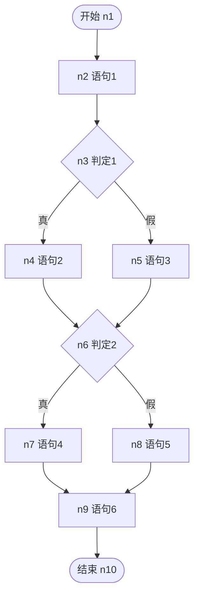
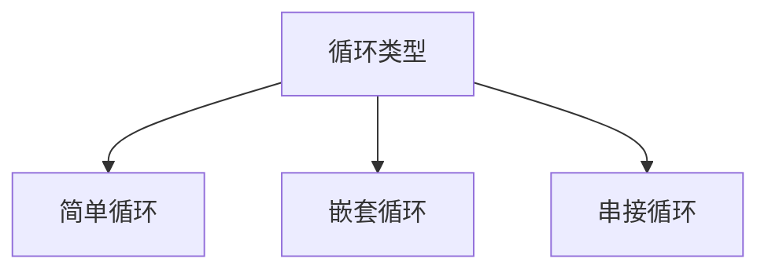

# 5.3 条件组合覆盖与路径覆盖

条件覆盖与判定/条件覆盖虽然覆盖了单个条件的真假，但未覆盖条件之间的组合，可能遗漏“某条件组合下逻辑运算符短路或判定错误”的缺陷。条件组合覆盖与路径覆盖是六种逻辑覆盖中最强的两种，本节还将介绍基本路径测试法与循环测试，它们是路径覆盖在工程中的实用化方法。

## 条件组合覆盖

> [!definition] 条件组合覆盖
> 条件组合覆盖（Multiple Condition Coverage）要求**每个判定中所有条件的真假组合至少各出现一次**。

注意：条件组合覆盖针对**单个判定内部**的条件组合，而非跨判定的组合。若某判定含 $k$ 个条件，则需覆盖 $2^k$ 种组合。

### 覆盖率计算

$$\text{条件组合覆盖率} = \frac{\text{已覆盖的条件组合数}}{\text{条件组合总数}} \times 100\%$$

### 特点

- **优点**：覆盖判定内所有条件组合，能发现条件组合与短路求值相关的错误，是最强的逻辑覆盖准则之一；
- **缺点**：条件数多时组合数指数增长（$2^k$），用例规模大；未覆盖跨判定的路径组合。

> [!warning] 组合的范围
> 条件组合覆盖组合的是**同一判定内的条件**，不组合不同判定之间的条件。例如判定1 与判定2 各含 2 个条件，则需 $2^2 + 2^2 = 8$ 种组合，而非 $2^4 = 16$ 种。

## 路径覆盖

> [!definition] 路径覆盖
> 路径覆盖（Path Coverage）要求**程序中所有可能的独立执行路径至少各执行一次**。

### 覆盖率计算

$$\text{路径覆盖率} = \frac{\text{已执行的独立路径数}}{\text{独立路径总数}} \times 100\%$$

### 特点

- **优点**：最强的覆盖准则，覆盖所有执行路径，能发现路径相关错误；
- **缺点**：含循环时路径数可能无限，无法穷举，需用基本路径测试法简化。

> [!tip] 路径覆盖与条件组合覆盖的关系
> 路径覆盖关注“从入口到出口的完整路径”，条件组合覆盖关注“判定内条件组合”。二者维度不同，路径覆盖通常隐含了条件组合覆盖（不同路径往往经过不同条件组合），但含循环时路径覆盖难以实现。

## 基本路径测试法

由于路径覆盖在含循环时难以穷举，McCabe 提出基本路径测试法：通过**环形复杂度**确定独立路径数，选取一组基本路径进行测试。

### McCabe 环形复杂度

$$V(G) = e - n + 2$$

其中 $e$ 为控制流图的边数，$n$ 为节点数。等价地：

$$V(G) = P + 1$$

其中 $P$ 为判定节点数。

> [!note] 环形复杂度的含义
> 环形复杂度 $V(G)$ 等于程序中**线性独立路径**的条数，也是基本路径测试应选取的最少路径数。

### 基本路径测试步骤

```mermaid
flowchart LR
    A[1. 绘制控制流图] --> B[2. 计算环形复杂度 V(G)]
    B --> C[3. 确定独立路径集合]
    C --> D[4. 对每条独立路径设计用例]
    D --> E[5. 验证路径覆盖]
```

### 示例

沿用 [[5.1 语句覆盖与判定覆盖]] 的控制流图：



**计算环形复杂度**：

- 节点数 $n = 10$，边数 $e = 11$（S→A, A→D1, D1→B, D1→C, B→D2, C→D2, D2→E, D2→F, E→G, F→G, G→E2）
- $V(G) = e - n + 2 = 11 - 10 + 2 = 3$
- 验证：判定节点数 $P = 2$（D1, D2），$V(G) = P + 1 = 3$ ✓

**独立路径（3 条）**：

| 路径 | 节点序列 | 判定取值 |
| --- | --- | --- |
| 路径1 | n1→n2→n3→n4→n6→n7→n9→n10 | D1真, D2真 |
| 路径2 | n1→n2→n3→n5→n6→n7→n9→n10 | D1假, D2真 |
| 路径3 | n1→n2→n3→n5→n6→n8→n9→n10 | D1假, D2假 |

> [!note] 独立路径的选取
> 独立路径指至少含有一条其他路径未走过的新边的路径。选取时从主路径开始，逐步引入新边，直到达到 $V(G)$ 条。

**基本路径测试用例**：

| 用例号 | a | b | 路径 | 预期结果 |
| --- | --- | --- | --- | --- |
| BP1 | 1 | 1 | 路径1 | both positive, at least one positive |
| BP2 | -1 | 1 | 路径2 | not both positive, at least one positive |
| BP3 | -1 | -1 | 路径3 | not both positive, none positive |

## 循环测试

循环是路径覆盖的主要障碍，需分类处理：



### 简单循环

对循环次数为 $n$ 的简单循环，测试以下执行次数：

| 测试场景 | 执行次数 | 说明 |
| --- | --- | --- |
| 跳过循环 | 0 次 | 循环条件初始为假 |
| 仅执行一次 | 1 次 | 边界 |
| 执行两次 | 2 次 | 边界 |
| 执行 m 次 | m 次（m<n） | 中间值 |
| 执行 n-1 次 | n-1 次 | 接近上限 |
| 执行 n 次 | n 次 | 正常上限 |
| 执行 n+1 次 | n+1 次 | 越界 |

### 嵌套循环

对多层嵌套循环，**自内向外**测试：

1. 从最内层循环开始，按简单循环策略测试，外层循环设为最小值；
2. 逐层向外，对当前层按简单循环测试，内层已测的部分取典型值；
3. 最外层测试全部范围。

> [!warning] 嵌套循环不可全组合
> 若对嵌套循环的每层都做 7 种测试，三层嵌套需 $7^3 = 343$ 个用例，不现实。因此采用“自内向外”策略，控制用例规模。

### 串接循环

多个循环顺序执行：

- 若各循环独立：按简单循环分别测试；
- 若后一循环依赖前一循环的结果：按嵌套循环策略测试。

## 覆盖率对比表

| 覆盖准则 | 覆盖对象 | 用例规模 | 强度 | 发现的缺陷类型 |
| --- | --- | --- | --- | --- |
| 语句覆盖 | 语句 | 最小 | 最弱 | 语句级错误 |
| 判定覆盖 | 判定分支 | 小 | 较弱 | 分支错误 |
| 条件覆盖 | 条件取值 | 小 | 中等 | 条件取值错误 |
| 判定/条件覆盖 | 判定+条件 | 中 | 中等 | 判定与条件错误 |
| 条件组合覆盖 | 条件组合 | 较大 | 较强 | 条件组合与短路错误 |
| 路径覆盖 | 独立路径 | 大 | 最强 | 路径相关错误 |

> [!tip] 实践建议
> 工程中通常以达到 **判定/条件覆盖或条件组合覆盖** 为目标，路径覆盖用基本路径测试法近似实现。盲目追求 100% 路径覆盖在含循环时不可行，需结合风险与成本权衡。

## 小结

条件组合覆盖要求判定内所有条件组合都被覆盖，是最强的逻辑覆盖准则之一；路径覆盖要求所有独立路径被执行，是最强的覆盖准则，但含循环时难以穷举。基本路径测试法通过 McCabe 环形复杂度 $V(G) = e - n + 2 = P + 1$ 确定独立路径数，是路径覆盖的实用化方法。循环测试按简单、嵌套、串接分类处理，嵌套循环采用“自内向外”策略控制用例规模。六种覆盖准则强度递增，工程中需在覆盖率与成本间权衡。

## 关联

- 上一级：[[MOC - 第5章]]
- 上一节：[[5.2 条件覆盖与判定条件覆盖]]
- 关联概念：[[3.2 白盒测试概念与方法概述]]（白盒方法体系总览）、[[5.1 语句覆盖与判定覆盖]]（覆盖准则基础）
