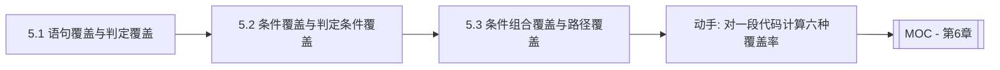

# MOC - 第5章 白盒测试逻辑覆盖法

> [!info] 本章定位
> 第5章是白盒测试方法体系的核心。与第4章黑盒测试从外部验证功能不同，白盒测试以程序内部结构为依据，回答“如何系统覆盖代码的逻辑单元与执行路径”。本章围绕逻辑覆盖准则，由弱到强依次展开语句覆盖、判定覆盖、条件覆盖、判定/条件覆盖、条件组合覆盖与路径覆盖，并引入基本路径测试法与循环测试，建立从代码结构到测试用例的完整方法论，是白盒测试与期末考试的重点章节。

## 学习路线图

> [!note] 路线说明
> 六种覆盖准则按覆盖强度由弱到强排列：语句覆盖最弱，路径覆盖最强。学习时应理解每种准则“覆盖了什么、遗漏了什么”，以及为何需要更强的准则。基本路径测试法与循环测试是工程实践中常用的路径覆盖简化方法。

## 知识点导航

| 节 | 主题 | 核心要点 | 入口 |
| --- | --- | --- | --- |
| 5.1 | 语句覆盖与判定覆盖 | 语句覆盖、判定覆盖、覆盖率计算、控制流图 | [[5.1 语句覆盖与判定覆盖]] |
| 5.2 | 条件覆盖与判定条件覆盖 | 条件覆盖、判定/条件覆盖、覆盖率计算 | [[5.2 条件覆盖与判定条件覆盖]] |
| 5.3 | 条件组合覆盖与路径覆盖 | 条件组合覆盖、路径覆盖、基本路径法、循环测试 | [[5.3 条件组合覆盖与路径覆盖]] |

## 核心考点

> [!warning] 重点掌握
> 1. 六种逻辑覆盖准则的定义与覆盖强度排序：语句 < 判定 < 条件 < 判定/条件 < 条件组合 < 路径。
> 2. 每种覆盖准则的覆盖率计算方法：已覆盖单元数 / 应覆盖单元总数。
> 3. 判定覆盖与条件覆盖的区别：判定覆盖关注判定整体真假，条件覆盖关注每个条件的真假。
> 4. 条件组合覆盖要求同一判定中所有条件的真假组合都被覆盖。
> 5. 基本路径测试法：McCabe 环形复杂度 $V(G)=e-n+2$ 或 $V(G)=P+1$，独立路径数等于环形复杂度。
> 6. 循环测试的分类：简单循环、嵌套循环、串接循环的测试策略。

## 覆盖准则强度对比

| 覆盖准则 | 覆盖对象 | 强度 | 典型缺陷发现能力 |
| --- | --- | --- | --- |
| 语句覆盖 | 每条语句 | 最弱 | 仅能发现语句级错误 |
| 判定覆盖 | 每个判定的真假分支 | 较弱 | 能发现分支错误 |
| 条件覆盖 | 每个条件的真假 | 中等 | 能发现条件取值错误 |
| 判定/条件覆盖 | 判定真假 + 条件真假 | 中等 | 兼顾判定与条件 |
| 条件组合覆盖 | 条件组合 | 较强 | 能发现条件组合错误 |
| 路径覆盖 | 所有独立路径 | 最强 | 能发现路径相关错误 |

> [!tip] 覆盖强度记忆
> 强度由弱到强：**语 < 判 < 条 < 判条 < 组合 < 路径**。前四种是“逻辑覆盖”，条件组合与路径覆盖属于更强的准则，但路径覆盖在含循环时难以穷举。

## 自测题

> [!question] 题1
> 简述语句覆盖与判定覆盖的区别，并说明为何语句覆盖是最弱的覆盖准则。
> > [!check]- 参考答案
> > 语句覆盖要求每条可执行语句至少执行一次；判定覆盖要求每个判定的真假分支至少执行一次。语句覆盖最弱，因为它只保证语句被执行，不关心判定分支——若某条语句位于判定为假的分支中，只取判定为真的用例无法执行该语句，但即便所有语句被执行，也可能遗漏判定的某一分支，导致分支内的逻辑错误未被发现。判定覆盖强于语句覆盖，因为覆盖判定两分支必然使两分支内的语句都被执行。

> [!question] 题2
> 对判定 `if (a > 0 && b > 0)`，写出满足条件组合覆盖所需的测试用例条件取值。
> > [!check]- 参考答案
> > 条件组合覆盖要求 `a > 0` 与 `b > 0` 两个条件的所有真假组合都被覆盖，共 $2^2=4$ 种组合：
> > ① a>0 为真、b>0 为真；② a>0 为真、b>0 为假；③ a>0 为假、b>0 为真；④ a>0 为假、b>0 为假。

> [!question] 题3
> 说明 McCabe 环形复杂度的两种计算方法，并解释其与独立路径数的关系。
> > [!check]- 参考答案
> > 方法一：$V(G) = e - n + 2$，其中 $e$ 为控制流图的边数，$n$ 为节点数；方法二：$V(G) = P + 1$，其中 $P$ 为判定节点数。环形复杂度等于程序中独立路径的上界，即程序中线性独立路径的条数。基本路径测试法据此选取 $V(G)$ 条独立路径作为测试用例，保证每条独立路径至少执行一次。

> [!question] 题4
> 简述简单循环、嵌套循环、串接循环三类循环的测试策略差异。
> > [!check]- 参考答案
> > 简单循环：测试零次、一次、两次、m 次（m<n）、n-1 次、n 次、n+1 次执行；嵌套循环：从最内层循环开始测试，外层设为最小值，逐层向外，最外层测试所有范围；串接循环：若各循环独立，按简单循环分别测试；若前后循环有依赖，按嵌套循环策略测试。

## 章节导航

- 上一级：[[MOC - 软件测试技术]]
- 上一章：[[MOC - 第4章]]
- 下一章：[[MOC - 第6章]]
