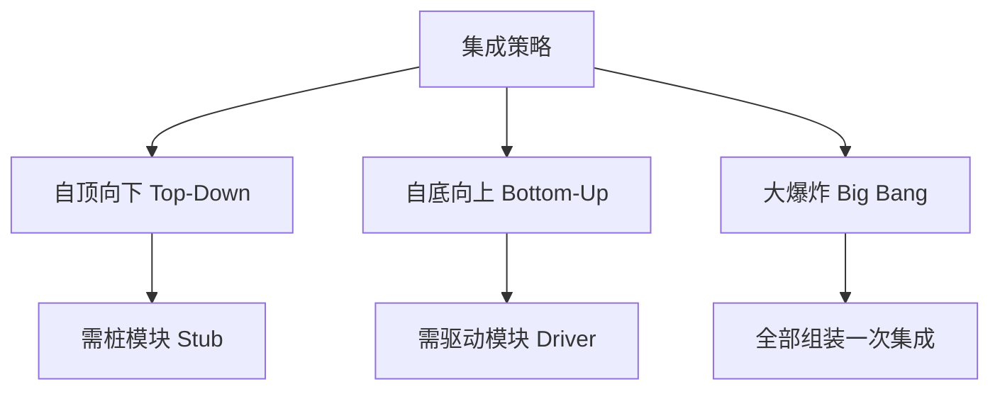
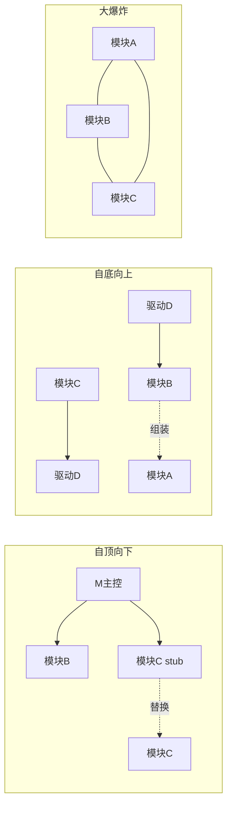

# 6.1 单元测试与集成测试

单元测试与集成测试是软件生命周期中最早开展的测试活动。单元测试验证最小可测试单元的内部逻辑，集成测试验证模块间的接口与协作。二者共同构成“从模块到子系统”的早期质量保障，是 V 模型中对应详细设计与概要设计阶段的测试活动。

## 单元测试

> [!definition] 单元测试
> 单元测试（Unit Testing）是对软件中**最小可测试单元**（通常是函数、方法或类）进行的测试，验证其内部逻辑是否符合详细设计。它由开发人员主导，以白盒测试为主，是测试金字塔的底层。

### 单元测试特点

- **对象**：单个函数、方法或类；
- **执行者**：主要由开发人员编写与执行；
- **依据**：详细设计文档；
- **方法**：白盒测试为主，覆盖语句、判定、条件等（见 [[5.1 语句覆盖与判定覆盖]]）；
- **环境**：通常在开发环境中隔离执行，不依赖数据库、网络等外部资源。

### 单元测试的内容

单元测试通常关注模块的五个方面：

| 测试内容 | 说明 |
| --- | --- |
| 模块接口 | 参数传递、返回值、I/O 是否正确 |
| 局部数据结构 | 局部变量初始化、数据类型一致性 |
| 边界条件 | 等价类边界、循环边界（见 [[4.2 边界值分析法]]） |
| 独立路径 | 覆盖所有独立执行路径（见 [[5.3 条件组合覆盖与路径覆盖]]） |
| 出错处理 | 异常是否被正确捕获与处理 |

### JUnit 框架

JUnit 是 Java 生态最主流的单元测试框架，使用注解与断言组织测试。

```java
import org.junit.jupiter.api.Test;
import org.junit.jupiter.api.BeforeEach;
import static org.junit.jupiter.api.Assertions.*;

public class CalculatorTest {
    private Calculator calc;

    @BeforeEach
    public void setUp() {
        // 每个测试方法前执行，初始化测试夹具
        calc = new Calculator();
    }

    @Test
    public void testAdd() {
        // 输入: 2 和 3; 预期输出: 5
        assertEquals(5, calc.add(2, 3));
    }

    @Test
    public void testDivideByZero() {
        // 验证除零异常处理
        assertThrows(ArithmeticException.class, () -> calc.divide(10, 0));
    }
}
```

> [!note] TestNG 简介
> > TestNG 是另一款 Java 测试框架，支持依赖测试、分组、并发与数据驱动，适合复杂集成测试。JUnit 更轻量，TestNG 更灵活，二者可根据项目需要选用。

## 集成测试

> [!definition] 集成测试
> 集成测试（Integration Testing）是在单元测试之后，将已通过测试的模块按设计组装起来，**测试模块间的接口与协作**，验证组装后的子系统是否满足概要设计。它以灰盒测试为主。

### 集成测试的必要性

- 单元测试通过不代表组装后正确：接口参数不匹配、数据传递错误、调用顺序错误等只在集成时暴露；
- 验证模块间的数据流与控制流；
- 发现全局数据结构、误差累积等问题。

## 集成策略

集成测试的核心问题是“按什么顺序组装模块”。三种主流策略如下：



### 自顶向下集成

从主控模块开始，逐步向下集成下层模块，未实现的下层模块用**桩模块（Stub）**模拟。

| 特性 | 说明 |
| --- | --- |
| 集成顺序 | 主控模块 → 下层模块（深度优先或广度优先） |
| 辅助模块 | 桩模块（Stub）：模拟被调用的下层模块，返回预设值 |
| 优点 | 能尽早验证主控逻辑与整体骨架；可早期演示系统轮廓 |
| 缺点 | 底层关键模块较晚集成；桩模块开发成本高 |

### 自底向上集成

从底层模块开始，逐步向上集成，未实现的上层模块用**驱动模块（Driver）**模拟。

| 特性 | 说明 |
| --- | --- |
| 集成顺序 | 底层模块 → 上层模块 |
| 辅助模块 | 驱动模块（Driver）：模拟调用上层模块，传递参数并接收返回值 |
| 优点 | 底层模块较早验证；驱动模块易编写（只需调用接口） |
| 缺点 | 主控逻辑较晚集成；整体骨架验证滞后 |

### 大爆炸集成

将所有模块一次性组装后进行整体测试。

| 特性 | 说明 |
| --- | --- |
| 集成方式 | 全部模块一次组装 |
| 优点 | 简单快速，适合小规模系统 |
| 缺点 | 缺陷定位困难（不知道是哪个接口出错）；难以并行，集成风险集中 |

### 集成策略对比图



> [!warning] 桩与驱动的区别
> - **桩模块（Stub）**：位于被测模块的**下层**，模拟被调用的模块，接收参数并返回预设值。用于自顶向下集成。
> - **驱动模块（Driver）**：位于被测模块的**上层**，模拟调用模块，传递参数并接收返回值。用于自底向上集成。
> 记忆：桩在下（被调用），驱在上（调用者）。

## JUnit 代码示例

以下示例展示对“用户服务”模块的单元测试与集成测试。假设 `UserService` 依赖 `UserRepository`：

```java
// 单元测试: 使用桩模拟 Repository
public class UserServiceTest {
    @Test
    public void testFindUser() {
        // 桩: 模拟 UserRepository 返回固定用户
        UserRepository stubRepo = new UserRepository() {
            public User findById(int id) {
                return new User(1, "alice");
            }
        };
        UserService service = new UserService(stubRepo);
        // 输入: id=1; 预期: 返回名为 alice 的用户
        assertEquals("alice", service.getUserName(1));
    }
}

// 集成测试: 使用真实 Repository 与数据库
public class UserServiceIntegrationTest {
    @Test
    public void testFindUserFromDb() {
        // 驱动: 真实组装 Service 与 Repository, 验证接口协作
        UserRepository realRepo = new DbUserRepository();
        UserService service = new UserService(realRepo);
        // 输入: 预置用户 id=1; 预期: 返回真实数据
        assertEquals("alice", service.getUserName(1));
    }
}
```

> [!example] 单元 vs 集成
> 单元测试用桩隔离依赖，验证 `UserService` 自身逻辑；集成测试用真实依赖，验证 `UserService` 与 `UserRepository` 的接口协作。前者快而隔离，后者慢而真实。

## 小结

单元测试验证最小可测试单元的内部逻辑，由开发人员主导，以白盒为主，常用 JUnit/TestNG 框架；集成测试验证模块间接口与协作，以灰盒为主。集成策略有三种：自顶向下（用桩模块）、自底向上（用驱动模块）、大爆炸（一次组装）。桩模块模拟被调用的下层模块，驱动模块模拟调用上层模块。三者各有优劣，实际项目常混合使用，先自底向上验证底层，再自顶向下验证主控。

## 关联

- 上一级：[[MOC - 第6章]]
- 下一节：[[6.2 系统测试与验收测试]]
- 关联概念：[[2.1 V模型与W模型]]（V模型中单元与集成测试的位置）、[[5.1 语句覆盖与判定覆盖]]（单元测试的白盒方法）
