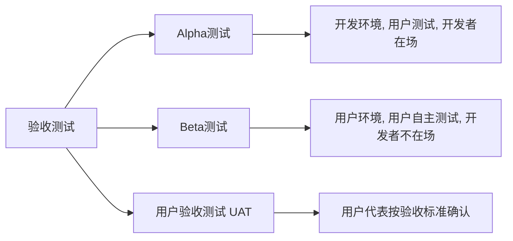
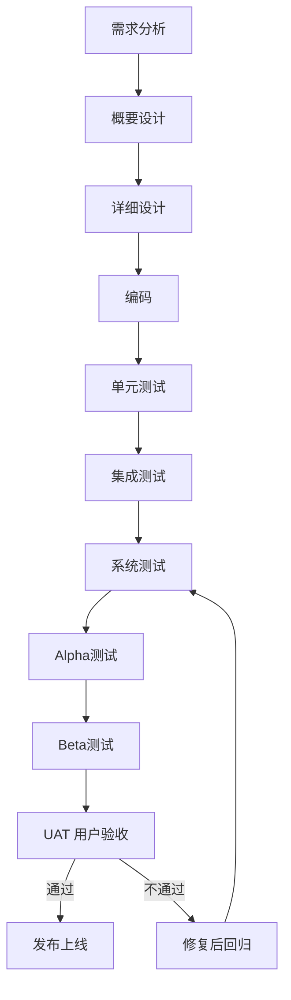

# 6.2 系统测试与验收测试

集成测试验证模块间协作后，仍需从整体视角验证系统是否满足需求，并由最终用户确认是否可交付。系统测试与验收测试承担这一职责。系统测试由测试团队在模拟生产环境中进行端到端验证，验收测试由用户确认系统满足业务需求。二者是发布前的最后质量关卡。

## 系统测试

> [!definition] 系统测试
> 系统测试（System Testing）是将已通过集成测试的整个系统作为测试对象，在**模拟真实生产环境**中进行端到端测试，验证系统是否满足需求规格说明。它由测试团队主导，以黑盒测试为主。

### 系统测试特点

- **对象**：整个系统（含硬件、软件、外部接口）；
- **执行者**：独立测试团队；
- **依据**：需求规格说明书；
- **方法**：黑盒测试为主，覆盖功能与非功能需求；
- **环境**：尽量接近生产环境的独立测试环境。

### 系统测试类型

| 类型 | 关注点 | 典型指标/方法 |
| --- | --- | --- |
| 功能测试 | 需求定义的功能是否实现 | 需求覆盖、用例通过率 |
| 性能测试 | 响应时间、吞吐量、并发 | TPS、响应时延、资源占用 |
| 安全测试 | 权限控制、数据保护、漏洞 | 渗透测试、SQL 注入检测 |
| 兼容性测试 | 不同浏览器/OS/设备表现 | 跨浏览器、跨设备矩阵 |
| 可靠性测试 | 长时间运行稳定性 | MTBF、故障恢复时间 |
| 易用性测试 | 用户操作便捷性 | 启发式评估、用户访谈 |
| 安装/卸载测试 | 部署流程正确性 | 不同环境安装验证 |

> [!tip] 端到端测试
> > 系统测试常采用端到端（End-to-End）方式，模拟真实用户从入口到完成的完整业务流程，验证系统作为整体的协作。例如电商场景：注册→登录→浏览→下单→支付→发货→收货。

## 验收测试

> [!definition] 验收测试
> 验收测试（Acceptance Testing）是由**用户或其代表**进行的测试，确认系统是否满足用户需求并可以交付。它是发布前的最终确认，以黑盒测试为主。

### 验收测试的形式

| 形式 | 环境 | 参与者 | 特点 |
| --- | --- | --- | --- |
| Alpha 测试 | 开发者环境 | 用户（开发者在场观察） | 受控、可即时反馈，早期内测 |
| Beta 测试 | 用户实际环境 | 最终用户（开发者不在场） | 不可控、贴近真实，发布前公测 |
| 用户验收测试（UAT） | 模拟或生产环境 | 用户代表 | 按合同/验收标准逐项确认 |

> [!note] Alpha 与 Beta 的时序
> > Alpha 测试通常先于 Beta 测试：Alpha 是开发后期的内测，修复主要问题后进入 Beta 公测，Beta 反馈稳定后进入 UAT 与发布。

### 用户验收测试（UAT）

UAT 是验收测试的正式环节，由用户代表依据**验收标准**逐项确认系统是否满足业务需求：

- **依据**：合同、需求规格、验收标准；
- **参与者**：用户代表、业务方，测试团队协助；
- **输出**：验收报告，决定是否接收系统；
- **通过条件**：所有关键验收用例通过，非关键问题已记录并约定修复。

## 测试环境搭建

系统测试与验收测试都需要接近生产的环境。测试环境搭建要点：

| 要素 | 说明 |
| --- | --- |
| 硬件 | 服务器配置、网络拓扑尽量与生产一致 |
| 软件 | OS、中间件、数据库版本与生产对齐 |
| 数据 | 准备测试数据集，避免污染生产数据 |
| 配置 | 参数、环境变量、证书等与生产一致 |
| 隔离 | 测试环境与生产环境物理或逻辑隔离 |

> [!warning] 环境一致性
> > 测试环境与生产环境不一致是“测试通过、生产出问题”的常见根因。应尽量缩小二者差异，尤其注意 OS 版本、依赖库版本、时区与字符集等隐性差异。

## 测试阶段流程图

> [!example] V 模型对应
> > 在 V 模型（[[2.1 V模型与W模型]]）中，单元测试对应详细设计，集成测试对应概要设计，系统测试对应需求分析，验收测试对应用户需求。本章的测试阶段划分正是 V 模型右半部分的具体展开。

## 小结

系统测试由测试团队在模拟生产环境中对整个系统进行端到端验证，覆盖功能、性能、安全、兼容性等非功能需求，以黑盒为主。验收测试由用户确认系统可交付，分 Alpha（开发环境内测）、Beta（用户环境公测）、UAT（正式验收）三种形式。测试环境应尽量与生产一致以保证测试有效性。各测试阶段对应 V 模型右半部分，由内向外逐步验证设计层次。

## 关联

- 上一级：[[MOC - 第6章]]
- 上一节：[[6.1 单元测试与集成测试]]
- 下一节：[[6.3 回归测试与冒烟测试]]
- 关联概念：[[2.1 V模型与W模型]]（V模型中系统与验收测试的位置）、[[4.1 等价类划分法]]（系统测试的黑盒方法）
