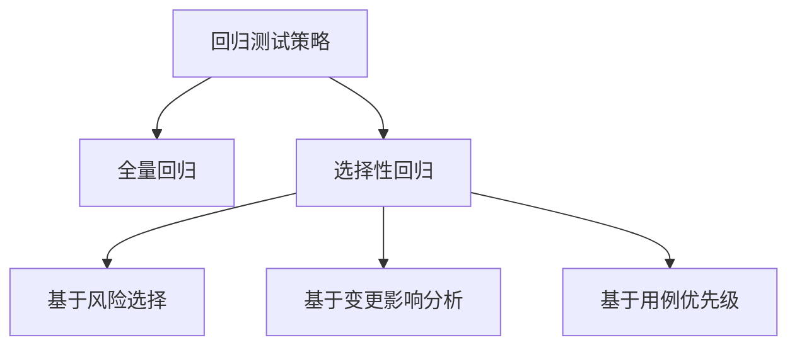
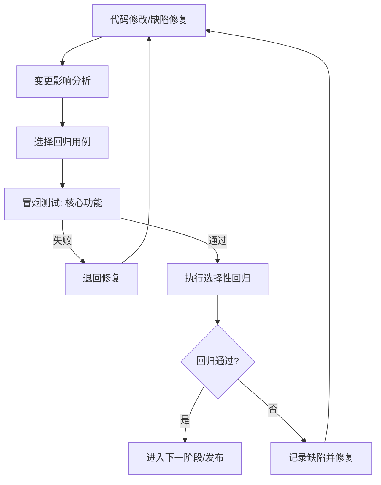

# 6.3 回归测试与冒烟测试

软件在生命周期中会不断被修改——修复缺陷、新增功能、重构代码。每次修改都可能引入新的缺陷或导致原有功能退化。回归测试与冒烟测试是应对这类风险的常规手段：冒烟测试确保“系统可测”，回归测试确保“不退化”。二者贯穿测试各阶段，是质量保障的基石。

## 回归测试

> [!definition] 回归测试
> 回归测试（Regression Testing）是指软件修改后（缺陷修复、功能变更、环境变更等），**重新执行已有测试用例**，验证修改未引入新缺陷、原有功能仍正常。其目标是确保“修改不导致退化”。

### 回归测试的必要性

- 缺陷修复可能引入新缺陷；
- 新增功能可能影响已有功能；
- 代码重构可能改变行为；
- 环境/依赖升级可能破坏兼容性。

### 回归测试策略

| 策略 | 方法 | 适用场景 | 优缺点 |
| --- | --- | --- | --- |
| 全量回归 | 执行全部已有用例 | 发布前关键节点 | 覆盖最全，但成本高、耗时长 |
| 选择性回归 | 选择部分用例执行 | 日常迭代、缺陷修复 | 成本低，但需准确选择，否则漏测 |

### 选择性回归的依据

- **基于风险**：优先回归高风险模块与核心功能；
- **基于变更影响分析**：分析修改影响的代码范围，选择相关用例；
- **基于用例优先级**：按用例优先级选择（高优先级必跑）；
- **基于自动化**：将高频回归用例自动化，每次构建自动执行。

> [!tip] 自动化回归
> > 回归测试是自动化测试最受益的场景。高频执行的回归用例应优先自动化，集成到 CI/CD 流水线中，每次代码提交自动触发，实现持续回归。常用工具：Selenium（UI）、TestNG/JUnit（单元/接口）、Postman（接口）。

## 冒烟测试

> [!definition] 冒烟测试
> 冒烟测试（Smoke Testing）是在详细测试前，对系统的**基本功能与核心流程进行快速验证**，确认系统“可测”。若冒烟测试失败，则直接退回修复，不进入后续详细测试。

### 冒烟测试特点

- **目标**：确认系统主要功能可用，不是详细测试；
- **范围**：覆盖核心功能与主流程，用例数量少（通常 20~50 个）；
- **执行时机**：每次构建后、详细测试前；
- **执行者**：测试人员或自动化脚本。

> [!note] 名称由来
> > “冒烟测试”源于硬件测试：新电路板通电后若冒烟，说明有严重问题，无需进一步测试。软件领域借指“基本功能是否可用”的快速验证。

## 回归测试与冒烟测试的区别

| 维度 | 冒烟测试 | 回归测试 |
| --- | --- | --- |
| 目标 | 确认系统可测（准入） | 确认不退化（保障） |
| 范围 | 核心功能主流程 | 已有用例（全量或选择） |
| 时机 | 详细测试前 | 修改后、发布前 |
| 用例数 | 少（核心） | 多（覆盖） |
| 失败处理 | 退回修复，不继续 | 记录缺陷，继续或停止 |

## 测试用例优先级管理

回归测试常基于用例优先级选择执行。优先级划分依据：

| 优先级 | 依据 | 回归策略 |
| --- | --- | --- |
| P0 高 | 核心功能、主流程、高频使用 | 每次必跑，优先自动化 |
| P1 中 | 重要功能、常见场景 | 每次迭代回归 |
| P2 低 | 边缘功能、低频场景 | 发布前或周期性回归 |

> [!warning] 优先级动态调整
> > 用例优先级不是一成不变。应根据业务变化、缺陷分布、用户反馈动态调整。缺陷密集区域（缺陷聚集原则，见 [[1.2 软件测试目的、原则与发展阶段]]）应提升优先级。

## 回归测试流程图

> [!example] 典型流程
> > 开发修复缺陷 → 测试分析影响范围选择回归用例 → 先跑冒烟测试确认基本可用 → 再跑选择性回归 → 通过则进入下一阶段，失败则退回修复。全量回归通常保留给发布前关键节点。

## 小结

回归测试在软件修改后重新执行已有用例，验证不退化，策略分全量回归与选择性回归，后者基于风险、影响分析与用例优先级选择用例，是日常迭代的主流。冒烟测试在详细测试前快速验证核心功能，是测试准入门槛。二者区别在于目标（可测 vs 不退化）、范围（核心 vs 全量）、时机（测试前 vs 修改后）。回归测试是自动化测试最受益场景，应集成到 CI/CD 实现持续回归。

## 关联

- 上一级：[[MOC - 第6章]]
- 上一节：[[6.2 系统测试与验收测试]]
- 关联概念：[[1.2 软件测试目的、原则与发展阶段]]（缺陷聚集原则指导优先级）、[[2.3 敏捷测试模型与测试左移]]（持续回归与 CI/CD）
