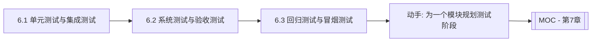
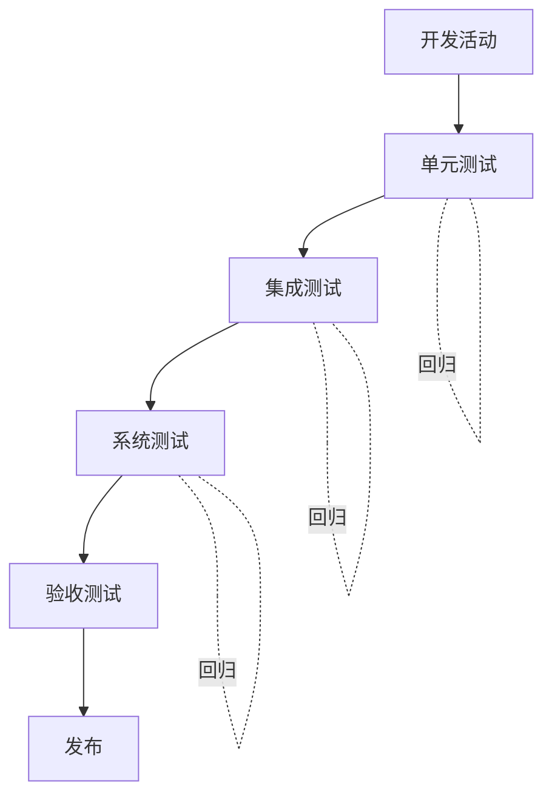

# MOC - 第6章 软件测试阶段划分

> [!info] 本章定位
> 第6章把测试活动嵌入软件生命周期，回答“在开发的哪些阶段做哪种测试”。前两章聚焦“如何设计用例”，本章聚焦“何时、以何种规模执行测试”。从单元测试到集成测试、系统测试、验收测试，再到回归与冒烟测试，本章建立完整的测试阶段体系，是 V 模型（[[2.1 V模型与W模型]]）在工程中的具体落地。

## 学习路线图

> [!note] 路线说明
> 测试阶段按粒度由小到大展开：单元测试验证模块内部，集成测试验证模块间接口，系统测试验证端到端，验收测试由用户确认。回归与冒烟测试贯穿各阶段，是质量保障的常规手段。学习时应结合 V 模型理解各阶段与开发活动的对应关系。

## 知识点导航

| 节 | 主题 | 核心要点 | 入口 |
| --- | --- | --- | --- |
| 6.1 | 单元测试与集成测试 | 单元测试、JUnit、集成策略（自顶向下/自底向上/大爆炸） | [[6.1 单元测试与集成测试]] |
| 6.2 | 系统测试与验收测试 | 系统测试类型、Alpha/Beta 测试、UAT | [[6.2 系统测试与验收测试]] |
| 6.3 | 回归测试与冒烟测试 | 回归测试策略、冒烟测试、用例优先级 | [[6.3 回归测试与冒烟测试]] |

## 核心考点

> [!warning] 重点掌握
> 1. 测试阶段划分：单元测试、集成测试、系统测试、验收测试的目标与对象。
> 2. 集成测试的三种策略：自顶向下（需桩模块 stub）、自底向上（需驱动模块 driver）、大爆炸集成，及其优缺点。
> 3. 桩模块（Stub）与驱动模块（Driver）的区别：桩模拟被调用的下层模块，驱动模拟调用上层模块。
> 4. 系统测试的类型：功能、性能、安全、兼容性、可靠性等。
> 5. 验收测试的形式：Alpha 测试（开发环境下）、Beta 测试（用户环境下）、用户验收测试（UAT）。
> 6. 回归测试与冒烟测试的区别：回归测试验证修改未引入新缺陷，冒烟测试验证基本功能可用。

## 测试阶段总览

| 阶段 | 测试对象 | 执行者 | 依据 | 典型方法 |
| --- | --- | --- | --- | --- |
| 单元测试 | 模块/函数 | 开发人员 | 详细设计 | 白盒为主 |
| 集成测试 | 模块间接口 | 开发+测试 | 概要设计 | 灰盒为主 |
| 系统测试 | 整个系统 | 测试团队 | 需求规格 | 黑盒为主 |
| 验收测试 | 整个系统 | 用户 | 用户需求 | 黑盒为主 |

## 自测题

> [!question] 题1
> 比较自顶向下与自底向上两种集成测试策略，说明各自使用的辅助模块及优缺点。
> > [!check]- 参考答案
> > 自顶向下集成：从主控模块开始，逐步向下集成下层模块，需用**桩模块（Stub）**模拟尚未实现的下层模块。优点是能尽早验证主控逻辑与整体骨架；缺点是底层关键模块较晚集成，且桩模块开发成本高。自底向上集成：从底层模块开始，逐步向上集成，需用**驱动模块（Driver）**模拟调用上层模块。优点是底层模块较早验证，驱动模块易编写；缺点是主控逻辑较晚集成，整体骨架验证滞后。

> [!question] 题2
> 简述 Alpha 测试与 Beta 测试的区别。
> > [!check]- 参考答案
> > Alpha 测试在**开发者的环境中**由用户进行，开发者在场观察并记录问题，受控程度高，便于即时反馈与修复。Beta 测试在**用户的实际环境中**由最终用户进行，开发者不在场，用户自主使用并反馈问题，环境不可控，更贴近真实使用场景。Alpha 通常先于 Beta，是发布前的内测，Beta 是发布前的公测。

> [!question] 题3
> 说明回归测试与冒烟测试的区别，以及二者在测试流程中的作用。
> > [!check]- 参考答案
> > 回归测试是在软件修改后重新执行已有用例，验证修改未引入新缺陷、原有功能仍正常，关注“不退化”，通常贯穿各阶段。冒烟测试是在详细测试前对基本功能进行快速验证，确认系统“可测”，若冒烟失败则直接退回修复，不进入后续测试。前者是质量保障的常规手段，后者是测试准入的门槛。

> [!question] 题4
> 列举系统测试的至少四种类型，并各举一个测试关注点。
> > [!check]- 参考答案
> > ①功能测试：验证需求定义的功能是否实现；②性能测试：验证响应时间、吞吐量、并发等指标；③安全测试：验证权限控制、数据加密、漏洞防护；④兼容性测试：验证在不同浏览器、操作系统、设备上的表现；⑤可靠性测试：验证长时间运行的稳定性与故障恢复能力。

## 章节导航

- 上一级：[[MOC - 软件测试技术]]
- 上一章：[[MOC - 第5章]]
- 下一章：[[MOC - 第7章]]
