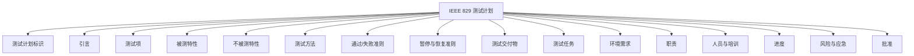
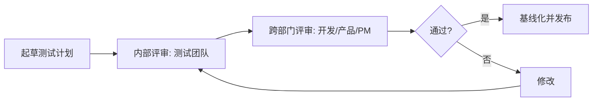

# 7.1 测试计划编写

测试计划是测试活动的顶层设计文档，它把“测什么、怎么测、何时测、谁测、风险如何”系统化地规定下来。一份好的测试计划为测试执行提供明确依据，避免随意性与遗漏，是测试管理的基础。本节介绍测试计划的内容、IEEE 829 标准、估算方法与评审流程。

## 测试计划内容

> [!definition] 测试计划
> 测试计划（Test Plan）是描述测试活动范围、策略、资源、进度、风险与交付物的文档，是指导测试执行的纲领。它回答“为什么测、测什么、怎么测、何时测、谁测、风险如何控制”。

### 核心内容

| 内容项 | 作用 | 关键问题 |
| --- | --- | --- |
| 测试范围 | 明确测什么、不测什么 | 哪些功能/模块在范围内？哪些排除？ |
| 测试策略 | 定义各阶段方法与工具 | 单元/集成/系统各用什么方法？用哪些工具？ |
| 资源 | 人员、设备、环境 | 需要多少人？什么角色？需要什么环境？ |
| 进度 | 各活动起止与里程碑 | 何时开始/结束？有哪些关键节点？ |
| 风险 | 识别风险与应对 | 可能出错的地方？如何缓解？ |
| 测试环境 | 软硬件配置 | 与生产环境差异如何处理？ |
| 交付物 | 产出物清单 | 计划、用例、报告等何时交付？ |
| 通过/失败准则 | 判定标准 | 何时算通过？何时暂停/恢复？ |

## IEEE 829 测试计划标准

IEEE 829 是软件测试文档的国际标准，定义了测试文档的规范化结构。其测试计划部分包含以下组成：



| 组成 | 说明 |
| --- | --- |
| 测试计划标识 | 文档唯一编号与版本 |
| 引言 | 文档目的、背景、引用文档 |
| 测试项 | 被测的软件项及其版本 |
| 被测特性 | 本次测试覆盖的特性与功能 |
| 不被测特性 | 明确排除的特性及原因 |
| 测试方法 | 各特性的测试策略与方法 |
| 通过/失败准则 | 判定测试项通过或失败的标准 |
| 暂停与恢复准则 | 何时暂停测试、何时恢复 |
| 测试交付物 | 测试计划、用例、报告等产出 |
| 测试任务 | 各项测试任务分解 |
| 环境需求 | 硬件、软件、数据、工具 |
| 职责 | 各角色的职责划分 |
| 人员与培训 | 人员需求与培训计划 |
| 进度 | 任务的时间安排与里程碑 |
| 风险与应急 | 风险识别与应对措施 |
| 批准 | 审批人签字 |

> [!tip] 标准的灵活运用
> > IEEE 829 提供完整结构，实际项目可按规模裁剪。小型项目可精简为“范围、策略、资源、进度、风险”五项；大型项目或合同测试应严格遵循。关键是“计划要有，结构可裁”。

## 测试计划模板

```markdown
# 测试计划 - 项目名称

## 1. 引言
- 目的、背景、引用文档

## 2. 测试范围
- 被测特性（功能列表）
- 不被测特性（及原因）

## 3. 测试策略
- 单元测试：方法、工具、覆盖率目标
- 集成测试：策略（自顶向下/自底向上）
- 系统测试：功能、性能、安全、兼容性
- 验收测试：UAT 形式

## 4. 测试环境
- 硬件、软件、网络、数据

## 5. 资源与职责
- 人员、角色、设备
- 职责矩阵

## 6. 进度计划
- 任务、起止时间、里程碑

## 7. 通过/失败准则
- 通过标准、暂停/恢复条件

## 8. 风险与应对
- 风险清单、概率、影响、应对

## 9. 交付物
- 计划、用例、报告、度量数据
```

## 测试估算方法

测试估算是计划中的难点，常用方法：

| 方法 | 说明 | 适用场景 |
| --- | --- | --- |
| 专家评估 | 由经验丰富的测试人员估算 | 早期、信息不全 |
| 类比估算 | 参考类似项目的历史数据 | 有历史项目可比 |
| 分解估算（WBS） | 把测试分解为任务，逐项估算再汇总 | 任务边界清晰 |
| 三点估算 | 乐观/最可能/悲观加权 $E=(O+4M+P)/6$ | 不确定性高 |
| 功能点估算 | 按功能点数与生产率估算 | 规模可量化 |

> [!note] 三点估算公式
> > 三点估算的期望值 $E = \frac{O + 4M + P}{6}$，其中 $O$ 为乐观估计、$M$ 为最可能估计、$P$ 为悲观估计。该公式源自 PERT，加权偏向最可能值。

## 测试计划评审

测试计划需经评审确保完整性与可行性：



评审关注点：

- 范围是否完整、无遗漏；
- 策略是否合理、可执行；
- 资源与进度是否匹配；
- 风险识别是否充分；
- 通过/失败准则是否可度量。

> [!warning] 计划的动态性
> > 测试计划不是一成不变。需求变更、进度调整、风险发生时，应及时更新计划并重新评审，保持计划与实际一致。计划应作为“活文档”维护。

## 小结

测试计划是测试活动的纲领，核心内容包括范围、策略、资源、进度、风险、环境、交付物与通过准则。IEEE 829 标准提供了十六项规范化组成，实际可按规模裁剪。测试估算可采用专家评估、类比、WBS 分解、三点估算、功能点估算等方法。计划需经内部与跨部门评审后基线化，并随项目变化动态更新。

## 关联

- 上一级：[[MOC - 第7章]]
- 下一节：[[7.2 测试用例设计与管理]]
- 关联概念：[[6.1 单元测试与集成测试]]（计划中策略的落地）、[[6.2 系统测试与验收测试]]（计划中阶段的划分）
