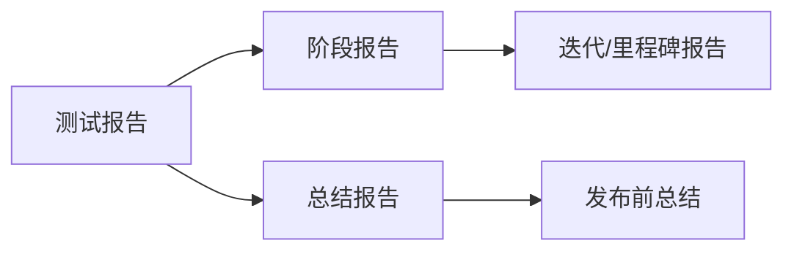
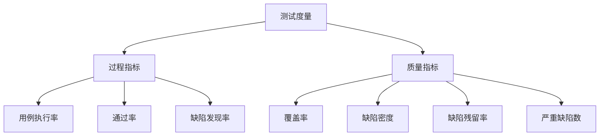
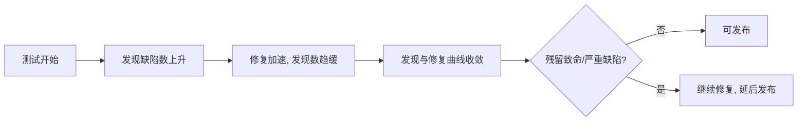

# 7.3 测试报告与度量

测试报告是测试活动的结果汇总，用客观数据回答“质量如何、能否发布”。测试度量是把测试过程与结果量化为指标，支撑报告与决策。本节介绍测试报告的类型、核心度量指标、缺陷统计分析方法与报告模板，是测试管理闭环的收尾环节。

## 测试报告类型

> [!definition] 测试报告
> 测试报告（Test Report）是汇总测试执行结果、度量数据与质量评估的文档，用于支撑发布决策与过程改进。



| 类型 | 时机 | 内容 | 目的 |
| --- | --- | --- | --- |
| 阶段报告 | 某测试阶段或迭代结束 | 本阶段执行情况、缺陷状态、遗留风险 | 阶段性进展同步 |
| 总结报告 | 发布前或项目结束时 | 整体执行情况、度量指标、质量评估、发布建议 | 支撑发布决策 |

> [!note] 阶段报告与总结报告的关系
> > 阶段报告是过程性的，频繁产出，关注“进展是否正常”；总结报告是收尾性的，关注“质量是否达标、能否发布”。总结报告通常汇总各阶段报告的数据。

## 测试度量指标

度量指标是测试报告的核心数据，分为过程指标与质量指标。



### 核心指标与计算

| 指标 | 含义 | 计算公式 |
| --- | --- | --- |
| 用例执行率 | 已执行用例占比 | 已执行用例数 / 用例总数 × 100% |
| 通过率 | 通过用例占已执行的比例 | 通过用例数 / 已执行用例数 × 100% |
| 缺陷发现率 | 单位时间发现缺陷数 | 缺陷数 / 测试时长 |
| 覆盖率 | 测试覆盖程度 | 已覆盖数 / 应覆盖总数 × 100% |
| 缺陷密度 | 单位规模缺陷数 | 缺陷数 / 代码规模（KLOC 或功能点） |
| 缺陷残留率 | 发布后缺陷占预测缺陷比例 | 发布后缺陷数 / (发布前+发布后)缺陷数 × 100% |

### 覆盖率详解

覆盖率是测试充分性的核心指标，按测试对象有多种维度：

| 覆盖率类型 | 计算对象 | 公式 |
| --- | --- | --- |
| 需求覆盖率 | 需求项 | 已测需求数 / 需求总数 × 100% |
| 语句覆盖率 | 代码语句 | 已执行语句数 / 语句总数 × 100% |
| 判定覆盖率 | 判定分支 | 已覆盖分支数 / 分支总数 × 100% |
| 路径覆盖率 | 独立路径 | 已执行路径数 / 独立路径总数 × 100% |

> [!tip] 覆盖率与白盒测试的衔接
> > 语句、判定、路径覆盖率见 [[5.1 语句覆盖与判定覆盖]] 与 [[5.3 条件组合覆盖与路径覆盖]]。工程中通常以需求覆盖率（黑盒）+ 语句/判定覆盖率（白盒）组合衡量测试充分性。

## 缺陷统计分析

缺陷统计是测试报告的重要组成，用于定位质量薄弱环节与评估发布风险。

### 统计维度

| 维度 | 分析目的 |
| --- | --- |
| 按严重度 | 评估缺陷影响，关注致命与严重缺陷 |
| 按优先级 | 指导修复顺序 |
| 按模块分布 | 定位缺陷密集模块（缺陷聚集原则） |
| 按状态 | 跟踪修复进展（新建/处理中/已修复/关闭/重开） |
| 按时间趋势 | 观察缺陷发现与修复速率，预测收敛 |

### 缺陷严重度分级

| 严重度 | 含义 | 示例 |
| --- | --- | --- |
| 致命 | 系统崩溃、数据丢失、核心功能不可用 | 支付导致数据丢失 |
| 严重 | 主要功能失效、有规避方案 | 下单后无法跳转支付页 |
| 一般 | 次要功能问题、影响有限 | 排序功能错误 |
| 轻微 | 界面、文案、易用性问题 | 错别字、对齐不齐 |

### 缺陷趋势分析



> [!note] 缺陷收敛判据
> > 发布判据通常包括：①无未关闭的致命/严重缺陷；②缺陷发现率持续下降并趋近于零；③通过率达目标（如 ≥95%）；④关键路径覆盖率达标。满足这些条件方可建议发布。

## 测试报告模板

```markdown
# 测试总结报告 - 项目名称

## 1. 概述
- 测试目的、范围、周期

## 2. 测试环境
- 硬件、软件、网络配置

## 3. 测试执行情况
| 指标 | 数值 |
| --- | --- |
| 用例总数 | N |
| 已执行 | M |
| 通过 | X |
| 失败 | Y |
| 阻塞 | Z |
| 执行率 | M/N |
| 通过率 | X/M |

## 4. 度量指标
- 需求覆盖率: __%
- 语句覆盖率: __%
- 缺陷密度: __个/KLOC

## 5. 缺陷统计
| 严重度 | 数量 | 已修复 | 未修复 |
| --- | --- | --- | --- |
| 致命 | | | |
| 严重 | | | |
| 一般 | | | |
| 轻微 | | | |

- 按模块分布: ...
- 趋势分析: ...

## 6. 遗留缺陷与风险
- 未修复缺陷清单与影响评估
- 已知风险与规避措施

## 7. 质量评估与发布建议
- 质量结论: 达标/基本达标/不达标
- 发布建议: 可发布/有条件发布/不可发布

## 8. 审批
- 测试负责人、项目经理签字
```

> [!warning] 报告的客观性
> > 测试报告应基于客观数据，避免主观断言。“质量还行”“应该没问题”等表述无价值。应给出具体数据、缺陷清单与明确建议，让决策者基于事实判断。

## 小结

测试报告分阶段报告与总结报告，前者同步进展，后者支撑发布决策。核心度量指标包括用例执行率、通过率、覆盖率、缺陷密度、缺陷残留率等，覆盖率可按需求、语句、判定、路径多维度衡量。缺陷统计按严重度、优先级、模块、状态、时间趋势分析，定位薄弱环节并预测收敛。报告应基于客观数据给出明确发布建议，是测试管理闭环的关键产出。

## 关联

- 上一级：[[MOC - 第7章]]
- 上一节：[[7.2 测试用例设计与管理]]
- 关联概念：[[5.1 语句覆盖与判定覆盖]]（覆盖率计算）、[[1.2 软件测试目的、原则与发展阶段]]（缺陷聚集原则指导模块分析）、[[6.3 回归测试与冒烟测试]]（通过率与回归验证）
