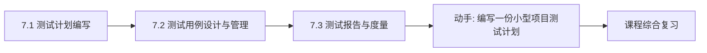
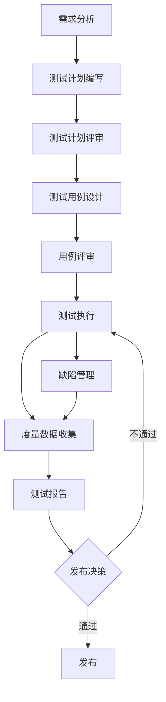

# MOC - 第7章 测试计划、测试用例、测试报告

> [!info] 本章定位
> 第7章把测试活动从“方法”上升到“管理”。前几章回答“如何设计用例、如何执行测试”，本章回答“如何规划测试、如何规范化用例、如何度量与汇报测试结果”。测试计划定义“测什么、怎么测、何时测、谁测”，测试用例是可执行可管理的测试资产，测试报告用度量数据支撑发布决策。本章是测试管理阶段的核心，承接第6章的测试阶段划分。

## 学习路线图

> [!note] 路线说明
> 测试计划是测试活动的顶层设计，先于测试执行；测试用例是计划的落地，需规范化设计与持续管理；测试报告是测试执行的结果汇总，用度量数据回答“质量如何、能否发布”。三者构成“规划 → 执行 → 度量”的闭环。

## 知识点导航

| 节 | 主题 | 核心要点 | 入口 |
| --- | --- | --- | --- |
| 7.1 | 测试计划编写 | IEEE 829 标准、计划内容、估算方法、评审 | [[7.1 测试计划编写]] |
| 7.2 | 测试用例设计与管理 | 用例要素、设计规范、评审、管理工具 | [[7.2 测试用例设计与管理]] |
| 7.3 | 测试报告与度量 | 报告类型、度量指标、缺陷统计、模板 | [[7.3 测试报告与度量]] |

## 核心考点

> [!warning] 重点掌握
> 1. 测试计划的核心内容：测试范围、策略、资源、进度、风险、环境、交付物。
> 2. IEEE 829 测试计划标准的主要组成部分。
> 3. 测试用例的核心要素：用例编号、标题、前置条件、步骤、预期结果、优先级。
> 4. 测试度量指标：覆盖率、缺陷密度、通过率、缺陷发现率。
> 5. 测试报告的类型：阶段报告与总结报告的区别。
> 6. 缺陷统计分析方法：按严重度、优先级、模块分布统计。

## 测试管理流程

## 自测题

> [!question] 题1
> 列出测试计划应包含的至少五项核心内容，并简要说明每项的作用。
> > [!check]- 参考答案
> > ①测试范围：明确测什么、不测什么，划定边界；②测试策略：定义各阶段采用的方法与工具；③资源：明确人员、设备、环境需求；④进度：定义各测试活动的起止时间与里程碑；⑤风险：识别潜在风险及应对措施；⑥环境：定义测试环境的软硬件配置；⑦交付物：明确测试计划、用例、报告等产出物。

> [!question] 题2
> 简述 IEEE 829 测试文档标准中测试计划的主要组成。
> > [!check]- 参考答案
> > IEEE 829 规定测试计划包含：测试计划标识、引言、测试项、被测特性、不被测特性、测试方法、测试项通过/失败准则、暂停与恢复准则、测试交付物、测试任务、环境需求、职责、人员与培训需求、进度、风险与应急、批准。该标准提供了测试文档的规范化结构，便于团队协作与审计。

> [!question] 题3
> 列出测试用例的核心要素，并说明“前置条件”与“预期结果”的作用。
> > [!check]- 参考答案
> > 核心要素：用例编号、标题、优先级、前置条件、测试步骤、测试数据、预期结果、实际结果。前置条件说明执行用例前系统应处于的状态或需准备的资源，确保用例可重复执行；预期结果定义执行步骤后系统应呈现的可观察行为，是判定用例通过与否的依据，必须明确、可验证。

> [!question] 题4
> 说明缺陷密度、测试通过率、测试覆盖率三个度量指标的含义与计算方法。
> > [!check]- 参考答案
> > ①缺陷密度：单位规模（千行代码或功能点）的缺陷数，缺陷密度 = 缺陷数 / 代码规模，反映代码质量；②测试通过率：通过的用例数占执行用例数的比例，通过率 = 通过用例数 / 执行用例数 × 100%，反映测试进展与质量；③测试覆盖率：已覆盖的测试对象占应覆盖总数的比例，如语句覆盖率 = 已执行语句数 / 语句总数 × 100%，反映测试充分性。

## 章节导航

- 上一级：[[MOC - 软件测试技术]]
- 上一章：[[MOC - 第6章]]
- 下一章：综合复习（参见 [[MOC - 软件测试技术]]）
