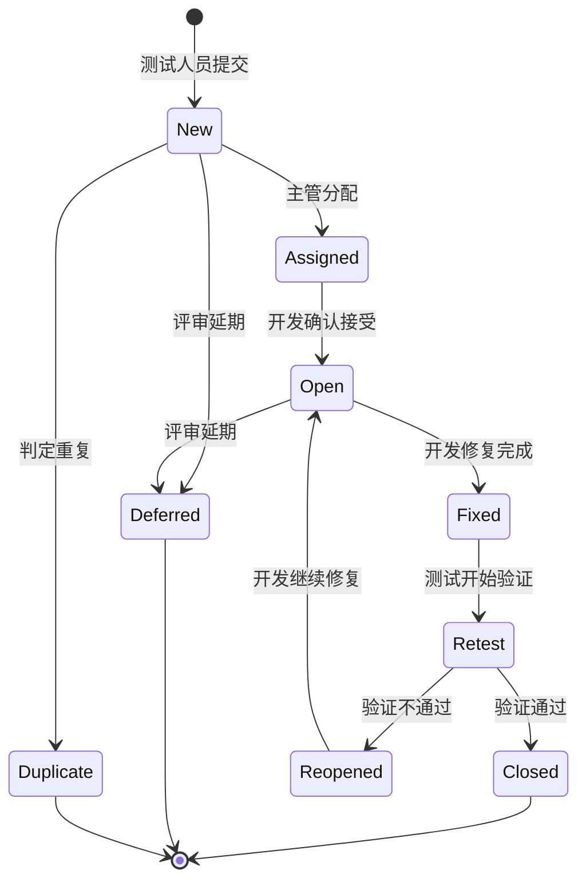
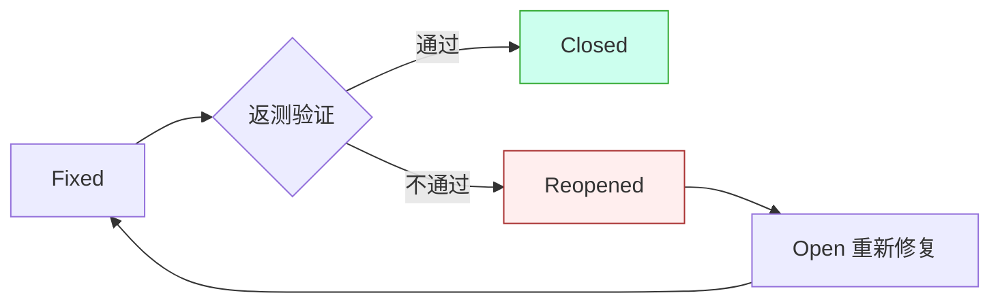

# 8.1 缺陷生命周期与状态流转

缺陷一旦被发现，就进入一个有明确状态和流转规则的生命周期。状态流转把“谁该做什么”与“缺陷处于哪一阶段”绑定起来，避免缺陷被遗忘、重复处理或在没有验证的情况下关闭。本节介绍缺陷生命周期的阶段、缺陷状态的定义、状态流转规则及其可视化。

## 缺陷生命周期

> [!definition] 缺陷生命周期
> 缺陷生命周期（Defect Lifecycle）是缺陷从被发现、提交、分配、修复、验证到最终关闭或延期的完整过程。每个阶段对应一个缺陷状态，状态之间的转换由角色行为触发并受流转规则约束。

### 基本阶段

| 阶段 | 动作 | 负责角色 | 产物 |
| --- | --- | --- | --- |
| 发现 | 测试中发现异常 | 测试人员 | 缺陷报告草稿 |
| 提交 | 录入缺陷管理工具 | 测试人员 | 缺陷编号（New） |
| 分配 | 指派给对应开发 | 测试主管/开发主管 | Assigned |
| 处理 | 开发确认并修复 | 开发人员 | Open → Fixed |
| 验证 | 测试返测修复 | 测试人员 | Retest |
| 关闭 | 验证通过后关闭 | 测试人员 | Closed |
| 重开 | 验证不通过，回流 | 测试人员 | Reopened |

## 缺陷状态定义

> [!definition] 缺陷状态
> 缺陷状态（Defect Status）是缺陷在生命周期中当前所处阶段的标识，用于协调多角色协作与跟踪进度。

| 状态 | 英文 | 含义 | 触发条件 |
| --- | --- | --- | --- |
| 新建 | New | 缺陷刚被提交，尚未处理 | 测试人员录入缺陷 |
| 已分配 | Assigned | 已指派给开发负责人 | 主管分配 |
| 已打开 | Open | 开发已确认接受，处理中 | 开发确认非重复/非误报 |
| 已修复 | Fixed | 开发完成修复，等待返测 | 开发提交修复 |
| 返测 | Retest | 测试人员正在验证修复 | 测试开始验证 |
| 已关闭 | Closed | 验证通过，缺陷终结 | 返测通过 |
| 重新打开 | Reopened | 验证未通过，回流修复 | 返测失败 |
| 延期 | Deferred | 经评审决定推迟修复 | 评审决议延期 |
| 重复 | Duplicate | 与已有缺陷重复 | 主管/开发判定 |

> [!note] 状态的语义边界
> > Open 与 Assigned 的区别：Assigned 表示“已指派但开发尚未确认”，Open 表示“开发已确认接受并处理”。Fixed 表示开发自认修复完成，但不等于缺陷已解决——必须经过 Retest 验证通过才能 Closed。

## 缺陷状态流转图

## 缺陷流转规则

状态流转不是任意的，必须遵循以下规则以保证流程严谨：

> [!rule] 核心流转规则
> 1. **单向闭环**：缺陷只能按既定方向流转，不允许从 Closed 直接回到 Open（重开须走 Reopened）。
> 2. **验证必经**：Fixed 必须经过 Retest，验证通过才能 Closed，禁止开发直接关闭。
> 3. **重开有据**：Reopened 必须附返测失败证据（复现步骤、截图、日志）。
> 4. **关闭权限**：只有测试人员有权关闭缺陷，开发无权关闭自己修复的缺陷。
> 5. **延期需评审**：Deferred 必须经缺陷评审会议决议，并记录延期版本与理由。
> 6. **重复需引用**：标记为 Duplicate 时必须关联被重复的主缺陷编号。

> [!warning] 常见违规
> > ①开发直接把缺陷置为 Closed，跳过测试验证；②Fixed 但未验证就随版本发布；③Reopened 不附复现说明，导致开发无法定位；④大量缺陷长期滞留 Open 不闭环。这些都破坏了缺陷管理的可追溯性。

## 角色与职责

| 角色 | 状态权限 | 主要职责 |
| --- | --- | --- |
| 测试人员 | New、Retest、Closed、Reopened | 提交缺陷、验证修复、关闭或重开 |
| 测试主管 | Assigned、Duplicate、Deferred | 分配缺陷、评审、去重 |
| 开发人员 | Open、Fixed | 确认接受、修复缺陷 |
| 开发主管 | Deferred、资源协调 | 评审、协调修复优先级 |

## 小结

缺陷生命周期把“发现缺陷”转化为“可管理的状态流转”。核心状态包括 New、Assigned、Open、Fixed、Retest、Closed、Reopened、Deferred、Duplicate。流转规则强调“验证必经、关闭权限归属测试、重开有据、延期评审”，保证缺陷不会被遗忘或草率关闭。状态图是团队协作的通用语言，是后续缺陷分级与工具落地的流程基础。

## 关联

- 上一级：[[MOC - 第8章]]
- 下一节：[[8.2 缺陷分级与分类]]
- 关联概念：[[7.3 测试报告与度量]]（缺陷统计是度量的核心输入）、[[1.1 软件质量、软件缺陷定义]]（缺陷的定义基础）
