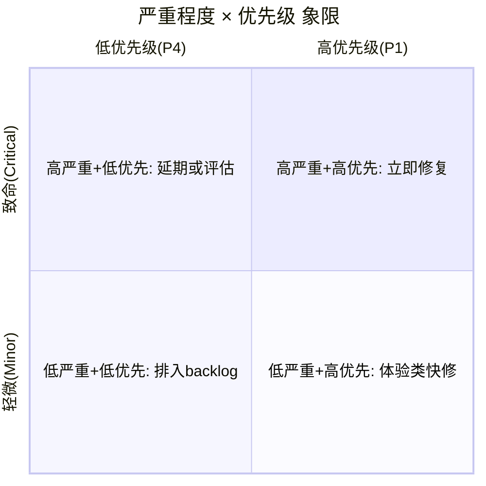

# 8.2 缺陷分级与分类

缺陷并非“发现即同等重要”。有的缺陷会让系统崩溃，有的只是文案错别字；有的需要立即热修复，有的可以随下个版本迭代。分级（按严重程度与优先级）解决“影响多大、先修谁”，分类（按类型）解决“属于哪类问题、由谁负责”。本节介绍缺陷的严重程度、优先级及其关系，并给出按类型的分类体系。

## 缺陷严重程度

> [!definition] 严重程度
> 严重程度（Severity）描述缺陷对系统功能、数据或用户体验的影响程度，是一个偏向客观的技术属性，回答“这个缺陷有多严重”。

| 等级 | 英文 | 含义 | 典型表现 |
| --- | --- | --- | --- |
| 致命 | Critical | 阻塞主流程或导致数据丢失 | 系统崩溃、数据被覆盖、核心功能完全不可用 |
| 严重 | Major | 主要功能异常或错误 | 计算结果错误、关键路径报错、功能部分失效 |
| 一般 | Normal | 次要功能异常，有规避方法 | 边界场景报错、提示信息错误、非核心流程异常 |
| 轻微 | Minor | 界面、文案或体验问题 | 错别字、对齐错位、颜色不一致 |
| 建议 | Enhancement | 改进建议，非缺陷 | 建议增加快捷键、优化交互文案 |

> [!example] 严重程度示例
> - Critical：支付接口返回 500，用户无法完成下单。
> - Major：订单列表金额合计少算优惠券，结果错误。
> - Normal：仅在特定分辨率下筛选下拉框显示异常，刷新后恢复。
> - Minor：帮助页“账户”误写为“帐户”。
> - Enhancement：建议登录页支持回车提交。

## 缺陷优先级

> [!definition] 优先级
> 优先级（Priority）描述缺陷应被修复的紧迫程度，综合考虑业务影响、发布计划与修复成本，回答“这个缺陷要先修谁”。

| 等级 | 含义 | 修复时点 |
| --- | --- | --- |
| P1 | 立即修复 | 阻塞测试或上线，须立即修复并出补丁 |
| P2 | 高优先 | 当前版本/迭代内修复 |
| P3 | 中优先 | 下一版本修复 |
| P4 | 低优先 | 排入 backlog，视资源情况修复 |

## 严重程度与优先级的关系

严重程度与优先级是两个独立维度：严重程度看“技术影响”，优先级看“业务紧迫”。二者常常一致，但不必然相等。

> [!note] 不一致的典型情况
> > - **高严重 + 低优先**：深埋在罕见操作下的崩溃（Critical + P3），因极少触发而延期。
> > - **低严重 + 高优先**：首页品牌名拼写错误（Minor + P2），影响品牌形象需快修。
> > - **高严重 + 高优先**：支付崩溃（Critical + P1），立即热修复。
> > - **低严重 + 低优先**：帮助页错别字（Minor + P4），随版本迭代修。

> [!warning] 常见误区
> > 不要把严重程度与优先级机械等同为“Critical 必为 P1”。优先级还需结合业务场景、修复成本与发布窗口判断。最终优先级通常在缺陷评审会议中确定。

## 缺陷类型分类

按缺陷产生的技术维度分类，有助于定位责任模块与改进方向。

| 类型 | 说明 | 典型示例 |
| --- | --- | --- |
| 功能缺陷 | 功能未实现或实现错误 | 提交按钮无响应、计算结果错误 |
| 性能缺陷 | 响应慢、吞吐不足 | 列表加载 8 秒、并发时超时 |
| 界面缺陷 | 布局、样式、文案问题 | 按钮错位、颜色不符设计稿 |
| 兼容性缺陷 | 不同环境表现不一致 | Chrome 正常、Edge 下样式错乱 |
| 安全缺陷 | 权限、数据、注入问题 | 越权访问、SQL 注入、明文传输 |
| 数据缺陷 | 数据校验、存储、一致性 | 金额负数未拦截、并发更新丢失 |
| 逻辑缺陷 | 业务流程逻辑错误 | 已注销账号仍能下单 |

## 缺陷分级表

综合严重程度、优先级与类型，形成可操作的分级对照表：

| 严重程度 | 默认建议优先级 | 处理时点 | 类型归属示例 |
| --- | --- | --- | --- |
| Critical | P1 | 立即修复 | 功能/安全/数据 |
| Major | P2 | 当前版本 | 功能/性能 |
| Normal | P3 | 下一版本 | 功能/兼容性/逻辑 |
| Minor | P4 | 视资源安排 | 界面/数据校验 |
| Enhancement | P4 | backlog | 建议类 |

> [!tip] 分级的应用
> > 分级直接驱动测试与开发的资源分配：P1 缺陷阻塞版本发布，必须为零；P2 缺陷影响发布质量，须在版本内清零；P3/P4 可纳入遗留缺陷清单跟踪。缺陷分布按严重程度统计还能定位质量薄弱模块，见 [[8.3 缺陷管理工具与流程规范]] 的度量分析。

## 小结

缺陷分级解决“影响多大、先修谁”：严重程度（Critical/Major/Normal/Minor/Enhancement）描述技术影响，优先级（P1/P2/P3/P4）描述修复紧迫，二者独立但常一致。缺陷分类（功能/性能/界面/兼容性/安全/数据/逻辑）帮助定位责任与改进方向。分级与分类共同构成缺陷的属性坐标，为缺陷管理工具与度量分析提供结构化基础。

## 关联

- 上一级：[[MOC - 第8章]]
- 上一节：[[8.1 缺陷生命周期与状态流转]]
- 下一节：[[8.3 缺陷管理工具与流程规范]]
- 关联概念：[[7.3 测试报告与度量]]（缺陷按严重程度统计是测试报告核心内容）
