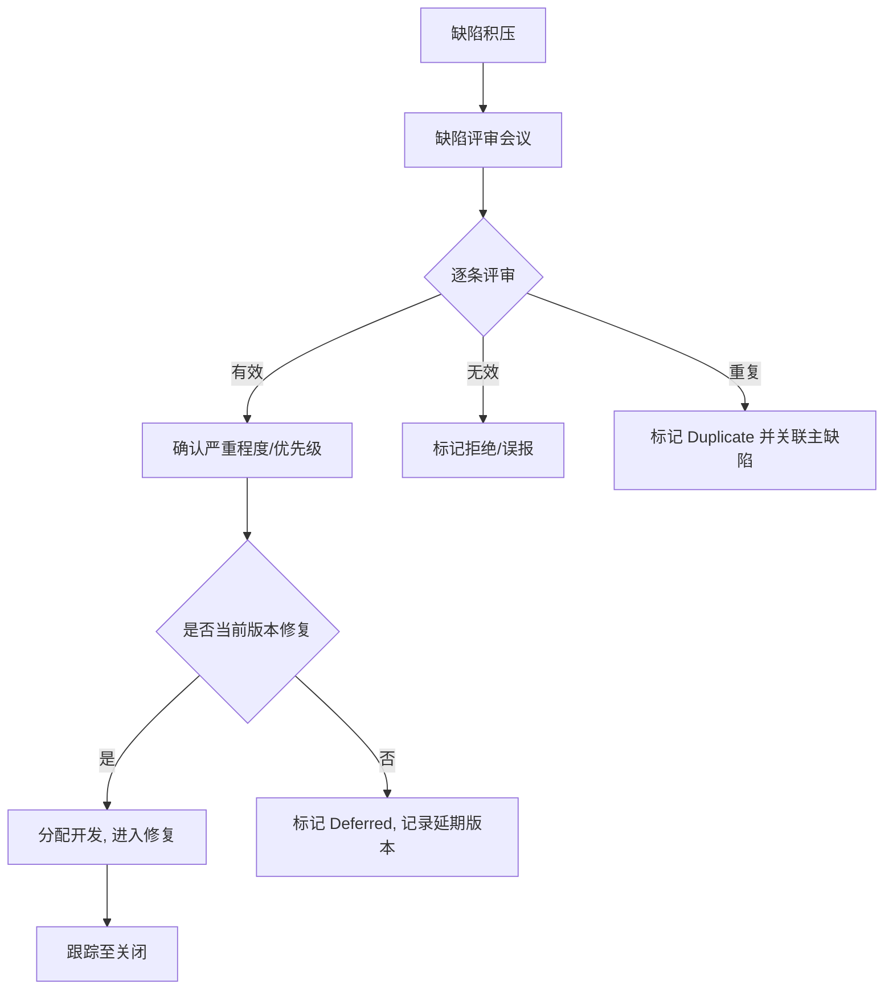
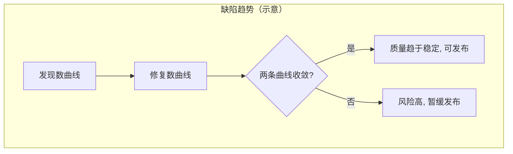
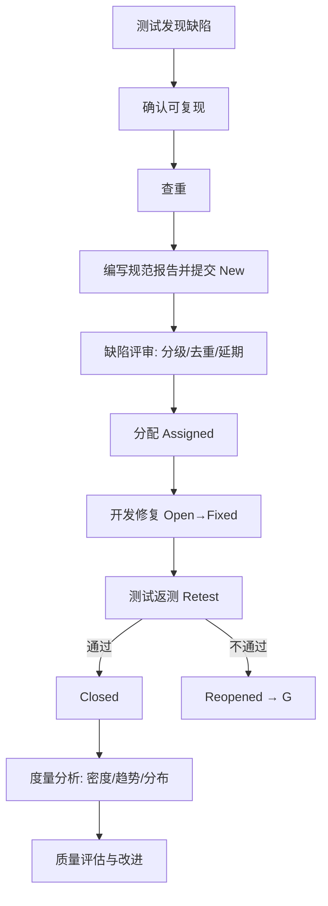

# 8.3 缺陷管理工具与流程规范

缺陷生命周期与分级需要工具与规范来落地。缺陷管理工具提供记录、流转、协作与统计的能力；缺陷报告规范保证每条缺陷可复现、可定位、可验证；缺陷评审与度量把零散的缺陷数据转化为质量改进依据。本节介绍主流工具、报告要素与规范、评审流程及度量分析。

## 缺陷管理工具

| 工具 | 厂商/来源 | 特点 | 适用场景 |
| --- | --- | --- | --- |
| Jira | Atlassian | 灵活的工作流配置、与开发深度集成、生态丰富 | 中大型团队、敏捷开发 |
| Bugzilla | Mozilla | 开源、成熟稳定、字段完善 | 传统项目、开源社区 |
| Mantis | MantisBT | 轻量开源、部署简单 | 小型团队、教学 |
| 禅道 | 易软天创 | 国产、集成项目管理与测试管理 | 国内中小团队、一体化管理 |

> [!note] 选型要点
> > 工具选型应考虑：工作流是否可配置以适配团队流程、是否支持自定义字段（严重程度/优先级/模块）、统计与导出能力、与 CI/CD 及代码仓库的集成、权限与角色模型。课程练习推荐使用禅道或 Jira 体验完整缺陷流程。

## 缺陷报告要素

> [!definition] 缺陷报告
> 缺陷报告（Defect Report）是记录缺陷信息的结构化文档，目标是让开发人员能在不询问测试人员的前提下复现并定位问题。

| 要素 | 说明 | 示例 |
| --- | --- | --- |
| 标题 | 一句话概括现象与影响 | 登录页输入正确密码提示"密码错误" |
| 描述 | 现象概述与背景 | 系统升级到 v2.3 后出现 |
| 复现步骤 | 编号化操作序列 | 1.打开登录页 2.输入 alice/Pass1234 3.点击登录 |
| 预期结果 | 应有行为 | 跳转首页 |
| 实际结果 | 实际行为 | 提示"密码错误" |
| 截图/日志 | 可视证据 | login_error.png、控制台日志 |
| 环境 | 软硬件与版本 | Win10/Chrome 124/后端 v2.3.1 |
| 严重程度 | 技术影响 | Major |
| 优先级 | 修复紧迫 | P2 |
| 归属模块 | 责任模块 | 登录模块 |
| 复现概率 | 必现/偶发 | 必现（100%） |

## 缺陷报告编写规范

### 编写要点

> [!rule] 报告编写规范
> 1. **标题精准**：概括现象与影响，避免“系统坏了”这种无信息标题。
> 2. **步骤可复现**：编号化、具体到点击与输入数据，包含前置条件。
> 3. **预期对照实际**：并列写出，便于开发快速判定差异。
> 4. **证据充分**：附截图、日志、网络请求，标注关键位置。
> 5. **环境完整**：写明操作系统、浏览器、版本、账号、网络。
> 6. **去重前置**：提交前搜索是否已存在相同缺陷。
> 7. **一缺陷一报告**：不把多个问题塞进同一报告。

> [!example] 规范报告示例
> > **标题**：登录页输入正确密码提示"密码错误"（必现）
> > **环境**：Win10 / Chrome 124 / 后端 v2.3.1 / 测试账号 alice
> > **前置条件**：账号 alice 已注册且密码为 Pass1234
> > **复现步骤**：
> > 1. 访问 https://demo.example.com/login
> > 2. 用户名输入 alice
> > 3. 密码输入 Pass1234
> > 4. 点击"登录"按钮
> > **预期结果**：跳转到首页，右上角显示用户名 alice
> > **实际结果**：页面停留在登录页，提示"密码错误"
> > **复现概率**：必现（100%）
> > **截图**：login_error.png
> > **严重程度**：Major　**优先级**：P2　**归属模块**：登录模块

> [!warning] 反面案例
> > “登录功能有问题，密码对了登不上，麻烦看下。”——无环境、无步骤、无预期对照、无可复现数据，开发无法高效定位。

## 缺陷评审流程

评审参与者通常包括测试主管、开发主管、产品经理。评审关注：

- 缺陷是否有效（非误报、非需求未实现）；
- 严重程度与优先级是否合理；
- 是否当前版本修复或延期；
- 去重与归属模块。

## 缺陷度量分析

度量把缺陷数据转化为质量决策依据，常见三类度量：

| 度量 | 定义 | 回答的问题 |
| --- | --- | --- |
| 缺陷密度 | 缺陷数 / 代码规模（KLOC 或功能点） | 单位代码质量如何 |
| 缺陷趋势 | 随时间变化的发现数与修复数曲线 | 质量是否收敛、能否按期发布 |
| 缺陷分布 | 按模块/严重程度/类型/人员统计 | 问题集中在哪、重点投入哪 |

> [!note] 缺陷密度公式
> > 缺陷密度 $D = \dfrac{N}{S}$，其中 $N$ 为缺陷总数，$S$ 为代码规模（千行代码 KLOC 或功能点 FP）。该指标用于横向比较模块与项目的质量水平，需在相同规模度量口径下使用。

### 缺陷趋势

理想的发布前趋势是：发现曲线先升后降、修复曲线逐步跟上，二者在发布前趋于收敛（积压缺陷趋近于零）。

### 缺陷管理流程总图

## 小结

缺陷管理工具（Jira、Bugzilla、Mantis、禅道）提供缺陷记录与流转的协作平台。缺陷报告要素包括标题、描述、复现步骤、预期/实际结果、截图、环境等，规范的核心是“可独立复现、可对照判定”。缺陷评审解决有效性、去重、分级与延期决策。度量分析通过缺陷密度、趋势与分布，把缺陷数据转化为发布决策与质量改进依据。至此，缺陷从“发现”到“关闭”再到“度量”的闭环完整建立。

## 关联

- 上一级：[[MOC - 第8章]]
- 上一节：[[8.2 缺陷分级与分类]]
- 关联概念：[[7.3 测试报告与度量]]（缺陷度量是测试报告核心数据）、[[8.1 缺陷生命周期与状态流转]]（工具落地的流程基础）、[[MOC - 第9章]]（自动化测试旨在减少回归缺陷）
