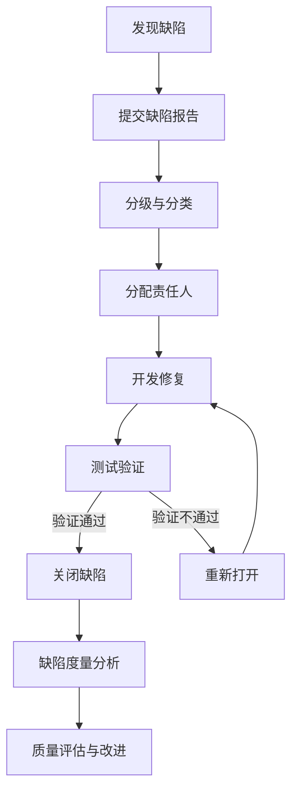

# MOC - 第8章 缺陷管理流程

> [!info] 本章定位
> 第8章把测试发现的缺陷作为“对象”进行系统管理。前几章回答“如何发现缺陷”，本章回答“发现缺陷之后怎么办”：缺陷的生命周期与状态如何流转、如何分级分类、如何用工具与流程规范保证缺陷被记录、修复、验证并关闭。缺陷管理是测试质量闭环的关键一环，承接第7章的测试报告与度量，并为第9–10章的自动化与综合实践提供质量数据基础。

## 学习路线图

> [!note] 路线说明
> 缺陷生命周期定义了缺陷从发现到关闭的完整状态流转，是缺陷管理的骨架；分级与分类解决“先修谁、怎么修、属于哪类问题”，是优先级与资源分配的依据；工具与流程规范把生命周期与分级落地为可协作、可度量的工程实践。三者构成“状态 → 优先级 → 工具落地”的闭环。

## 知识点导航

| 节 | 主题 | 核心要点 | 入口 |
| --- | --- | --- | --- |
| 8.1 | 缺陷生命周期与状态流转 | 生命周期阶段、缺陷状态、流转规则、状态图 | [[8.1 缺陷生命周期与状态流转]] |
| 8.2 | 缺陷分级与分类 | 严重程度、优先级、二者关系、缺陷类型 | [[8.2 缺陷分级与分类]] |
| 8.3 | 缺陷管理工具与流程规范 | 管理工具、报告要素、编写规范、评审与度量 | [[8.3 缺陷管理工具与流程规范]] |

## 核心考点

> [!warning] 重点掌握
> 1. 缺陷生命周期的核心状态：New、Assigned、Open、Fixed、Retest、Closed、Reopened、Deferred、Duplicate。
> 2. 缺陷状态流转规则与触发条件，特别是 Fixed→Retest→Closed 与 Reopened 的回路。
> 3. 缺陷严重程度（Critical/Major/Normal/Minor/Enhancement）与优先级（P1/P2/P3/P4）的定义。
> 4. 严重程度与优先级的区别与对应关系：严重程度描述“对系统的影响”，优先级描述“修复的紧迫程度”。
> 5. 缺陷报告的核心要素：标题、描述、复现步骤、预期/实际结果、截图、环境信息。
> 6. 缺陷度量指标：缺陷密度、缺陷趋势、缺陷分布及其在质量评估中的作用。

## 缺陷管理闭环

## 自测题

> [!question] 题1
> 描述缺陷从“新建”到“关闭”的完整生命周期，并说明 Reopened（重新打开）状态出现的条件与流转路径。
> > [!check]- 参考答案
> > 完整生命周期为：New（新建）→ Assigned（已分配）→ Open（已处理/打开）→ Fixed（已修复）→ Retest（返测）→ Closed（已关闭）。Reopened 出现在 Retest 阶段验证未通过时：缺陷从 Retest 流转到 Reopened，再回到 Open 由开发继续修复，修复后再次进入 Fixed→Retest。Deferred 用于经评审决定延期修复的缺陷；Duplicate 表示与已有缺陷重复。

> [!question] 题2
> 区分“缺陷严重程度”与“缺陷优先级”，并各举一例说明二者不一致的情况。
> > [!check]- 参考答案
> > 严重程度（Severity）描述缺陷对系统功能、数据或用户体验的影响程度，是客观的技术影响；优先级（Priority）描述缺陷应被修复的紧迫程度，考虑业务影响、发布计划与修复成本。二者不一致的例子：①一个拼写错误出现在首页公司名称上，严重程度为 Minor，但优先级可能定为 P2（影响品牌形象需尽快修复）；②一个深埋在罕见操作路径下的崩溃，严重程度为 Critical，但因极少触发，优先级可能定为 P3。

> [!question] 题3
> 列出缺陷报告的核心要素，并说明“复现步骤”应满足哪些要求才能让开发高效定位问题。
> > [!check]- 参考答案
> > 核心要素：标题、描述、复现步骤、预期结果、实际结果、截图/日志、环境信息（操作系统、浏览器、版本、账号）、严重程度、优先级、归属模块。复现步骤应满足：①步骤编号清晰、可顺序执行；②每步操作具体（点击哪个按钮、输入什么数据）；③包含必要的前置条件与数据准备；④预期结果与实际结果并列对照；⑤可独立复现，不依赖隐含上下文；⑥附截图或日志佐证。

> [!question] 题4
> 说明缺陷密度、缺陷趋势、缺陷分布三个度量指标的含义，并说明它们各自回答什么质量问题。
> > [!check]- 参考答案
> > ①缺陷密度 = 缺陷数 / 代码规模（千行代码或功能点），回答“单位代码的质量如何”，用于跨模块/项目横向比较；②缺陷趋势 = 随时间变化的缺陷发现数与修复数曲线，回答“质量在收敛还是发散、能否按期发布”，关注发现与修复的收敛关系；③缺陷分布 = 按模块、严重程度、类型、人员等维度统计的缺陷分布，回答“问题集中在哪些区域、需要重点投入哪里”，用于定位质量薄弱环节。

## 章节导航

- 上一级：[[MOC - 软件测试技术]]
- 上一章：[[MOC - 第7章]]
- 下一章：[[MOC - 第9章]]
