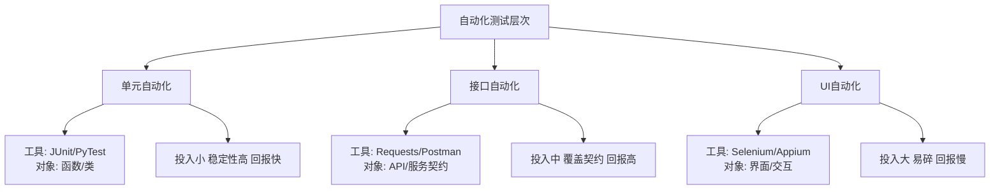
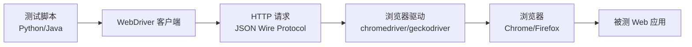

# 9.1 自动化测试原理与框架

手工测试在回归频繁的项目中效率低、易遗漏。自动化测试用脚本替代人工执行，把重复的回归、数据驱动与性能验证交给机器，让人聚焦于探索性测试与设计。本节介绍自动化测试的定义与适用场景、测试层次、框架类型，以及 Selenium WebDriver 的架构与定位策略。

## 自动化测试定义与适用场景

> [!definition] 自动化测试
> 自动化测试（Automated Testing）是使用工具或脚本自动驱动被测软件、执行预定义的测试用例并比较实际结果与预期结果的过程。它替代的是“执行与比对”环节，而非“测试设计与判断”环节。

### 适用与不适用场景

| 场景 | 是否适用 | 原因 |
| --- | --- | --- |
| 频繁回归 | ✅ 适用 | 脚本可重复执行，节省人力 |
| 稳定接口测试 | ✅ 适用 | 契约稳定，投入产出比高 |
| 性能/负载测试 | ✅ 适用 | 人工无法模拟高并发 |
| 数据驱动大量输入 | ✅ 适用 | 同一脚本跑多组数据 |
| 需求频繁变更 | ❌ 不适用 | 脚本频繁失效，维护成本高 |
| 探索性测试 | ❌ 不适用 | 依赖人的即时判断 |
| 一次性项目 | ❌ 不适用 | 投入无法收回 |
| UI 极不稳定 | ❌ 不适用 | 易碎，维护成本超过收益 |

> [!warning] 自动化测试的边界
> > 自动化测试不能“替代手工测试”。它擅长回归与重复，不擅长发现新缺陷；自动化测试用例本身也需要设计与维护成本。引入自动化前应评估投入产出比（ROI）。

## 自动化测试层次



| 层次 | 测试对象 | 特点 | 投入产出比 |
| --- | --- | --- | --- |
| 单元自动化 | 函数/类 | 粒度小、执行快、定位准 | 高 |
| 接口自动化 | API/服务契约 | 覆盖业务逻辑、稳定性好 | 高 |
| UI 自动化 | 界面/交互 | 贴近用户、覆盖端到端 | 中低（易碎） |

> [!tip] 金字塔原则
> > 测试金字塔建议“底层多、顶层少”：单元自动化最多、接口自动化次之、UI 自动化最少。这与第10章的测试策略相呼应，见 [[10.3 测试策略与质量保障体系]]。

## 自动化测试框架类型

> [!definition] 自动化测试框架
> 自动化测试框架是为组织和执行测试脚本而提供的规则、工具与结构的集合，解决“如何把脚本组织得可维护、可复用、可扩展”。

| 框架类型 | 特点 | 优点 | 缺点 | 适用场景 |
| --- | --- | --- | --- | --- |
| 线性 | 脚本顺序执行，无抽象 | 简单直观 | 难复用、难维护 | 一次性验证 |
| 模块化 | 按功能模块封装公共操作 | 复用性提升 | 抽象成本 | 中型项目 |
| 数据驱动 | 数据与脚本分离 | 多组数据复用脚本 | 数据管理复杂 | 大量输入组合 |
| 关键字驱动 | 操作抽象为关键字表格 | 非技术可参与 | 实现复杂 | 大型长期项目 |
| 混合驱动 | 数据驱动+关键字驱动结合 | 灵活全面 | 复杂度高 | 大型企业项目 |

### 数据驱动示例

测试数据从外部读取，脚本与数据分离：

```python
import pytest
import csv

# 从 CSV 读取测试数据
def load_test_data():
    with open("login_data.csv", encoding="utf-8") as f:
        return list(csv.DictReader(f))

@pytest.mark.parametrize("case", load_test_data())
def test_login(case):
    # 输入: case["username"], case["password"]
    # 预期: case["expected"]
    assert login(case["username"], case["password"]) == case["expected"]
```

## Selenium WebDriver 架构

Selenium 是 Web UI 自动化的主流工具，其 WebDriver 直接驱动浏览器，模拟真实用户操作。



> [!note] WebDriver 工作原理
> > 测试脚本调用 WebDriver 客户端 API，客户端通过 HTTP 协议向浏览器驱动发送命令（W3C WebDriver 协议），浏览器驱动再操作浏览器执行点击、输入、导航等动作，并返回执行结果。这种 C/S 架构支持多语言多浏览器。

### 定位策略

| 定位方式 | 示例 | 说明 |
| --- | --- | --- |
| id | `By.ID, "username"` | 最稳定，推荐优先使用 |
| name | `By.NAME, "user"` | 较稳定 |
| class name | `By.CLASS_NAME, "btn-primary"` | 用于样式类定位 |
| tag name | `By.TAG_NAME, "input"` | 按标签 |
| link text | `By.LINK_TEXT, "登录"` | 超链接文本 |
| xpath | `By.XPATH, "//input[@id='user']"` | 灵活但易碎 |
| css selector | `By.CSS_SELECTOR, "#login .btn"` | 推荐替代 xpath |

> [!tip] 定位优先级
> > 优先 id > name/css selector > xpath。xpath 虽灵活但表达式长、易随 DOM 变化失效，能不用则不用。

## Python Selenium 代码示例

以下示例实现一个登录场景的 UI 自动化，演示定位、操作、断言：

```python
from selenium import webdriver
from selenium.webdriver.common.by import By
from selenium.webdriver.support.ui import WebDriverWait
from selenium.webdriver.support import expected_conditions as EC

# 1. 启动浏览器
driver = webdriver.Chrome()
driver.maximize_window()
driver.get("https://demo.example.com/login")

try:
    # 2. 定位并输入用户名密码
    driver.find_element(By.ID, "username").send_keys("alice")
    driver.find_element(By.ID, "password").send_keys("Pass1234")

    # 3. 点击登录
    driver.find_element(By.CSS_SELECTOR, "#login .btn-primary").click()

    # 4. 显式等待首页元素出现
    welcome = WebDriverWait(driver, 10).until(
        EC.presence_of_element_located((By.ID, "welcome"))
    )

    # 5. 断言登录成功
    assert "alice" in welcome.text, "登录后未显示用户名"
    print("登录测试通过")
finally:
    # 6. 关闭浏览器
    driver.quit()
```

> [!example] 代码说明
> - **环境**：Python 3.x + Selenium 4.x + chromedriver 对应 Chrome 版本；
> - **输入**：测试账号 alice / Pass1234；
> - **关键点**：使用 `By.ID` 定位输入框、`By.CSS_SELECTOR` 定位按钮、`WebDriverWait` 显式等待避免同步失败；
> - **输出**：登录成功打印"登录测试通过"，断言失败抛出异常；
> - **前提**：被测站点可访问，账号已注册。

## 小结

自动化测试用脚本替代人工执行与比对，适用于频繁回归、稳定接口与性能压测，不适用于需求频繁变更与探索性测试。自动化测试分单元、接口、UI 三个层次，投入产出比由高到低。框架类型从线性到混合驱动，解决可维护性与可复用性。Selenium WebDriver 通过 C/S 架构驱动浏览器，定位策略应优先使用 id 与 css selector。

## 关联

- 上一级：[[MOC - 第9章]]
- 下一节：[[9.2 接口测试与API测试]]
- 关联概念：[[6.1 单元测试与集成测试]]（单元自动化的基础）、[[10.1 Web应用测试综合实践]]（UI 自动化的综合应用）、[[10.3 测试策略与质量保障体系]]（测试金字塔）
