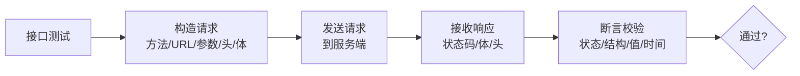
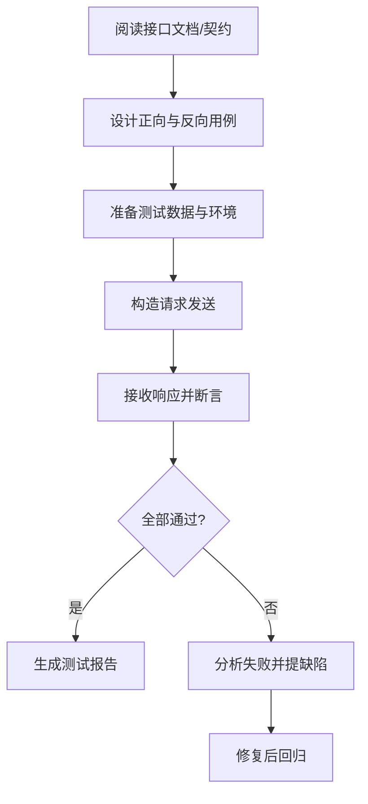

# 9.2 接口测试与API测试

接口是系统之间交互的契约。相比 UI 测试，接口测试粒度更细、执行更快、稳定性更高，能在前端就绪前验证后端逻辑，是性价比最高的自动化测试层次。本节介绍接口测试的概念、REST API 测试方法、Postman 工具使用、Requests+PyTest 框架及代码示例。

## 接口测试概念

> [!definition] 接口测试
> 接口测试（API Testing）是对系统组件间接口的测试，验证接口的输入、处理与输出是否符合契约约定。它绕过 UI，直接向服务端发送请求并校验响应，关注数据契约、业务逻辑与异常处理。



> [!note] API 契约
> > API 契约是接口提供方与调用方约定：请求方法、URL、参数（名/类型/必填）、请求体结构、响应状态码、响应体结构与字段语义。接口测试本质是契约验证——任何偏离契约的响应都是缺陷。

## REST API 测试方法

> [!definition] REST
> REST（Representational State Transfer）是一种基于 HTTP 的 Web 服务架构风格，资源由 URL 标识，通过 HTTP 方法操作资源，常用 JSON 作为数据格式。

### HTTP 方法与资源操作

| 方法 | 语义 | 典型场景 | 幂等性 |
| --- | --- | --- | --- |
| GET | 查询资源 | 获取列表/详情 | 幂等 |
| POST | 新增资源 | 创建订单/提交表单 | 不幂等 |
| PUT | 整体更新资源 | 替换整条记录 | 幂等 |
| PATCH | 部分更新资源 | 更新单个字段 | 不一定 |
| DELETE | 删除资源 | 删除记录 | 幂等 |

### 典型状态码

| 状态码 | 含义 | 测试关注 |
| --- | --- | --- |
| 200 | 成功 | 响应体正确 |
| 201 | 创建成功 | 资源已生成 |
| 400 | 请求错误 | 参数校验提示 |
| 401 | 未认证 | 缺少/失效 token |
| 403 | 禁止访问 | 权限不足 |
| 404 | 资源不存在 | 路径正确 |
| 500 | 服务器错误 | 异常处理与日志 |

### 接口测试要点

> [!rule] 接口测试应覆盖
> 1. **正向用例**：合法参数，预期成功响应；
> 2. **反向用例**：缺参、类型错误、越界值、非法枚举；
> 3. **边界值**：空字符串、最大长度、数值边界；
> 4. **认证与权限**：无 token、过期 token、越权访问；
> 5. **业务逻辑**：状态流转、数据一致性（如创建后能查到）；
> 6. **性能**：响应时间阈值。

## Postman 接口测试

Postman 是图形化接口测试工具，支持集合管理、环境变量、断言脚本与批量运行。

| 功能 | 作用 | 说明 |
| --- | --- | --- |
| 集合（Collection） | 组织多个接口用例 | 按模块分组，支持批量运行 |
| 环境变量（Environment） | 切换测试环境 | dev/staging/prod 不同 baseURL 与 token |
| 断言（Tests） | 校验响应 | 用 JavaScript 编写断言脚本 |
| 前置脚本（Pre-request） | 动态生成参数 | 如生成时间戳、计算签名 |
| 批量运行（Runner） | 顺序/并发执行集合 | 支持数据文件参数化 |

### Postman 断言示例

在 Tests 标签中编写 JavaScript 断言：

```javascript
// 1. 断言状态码为 200
pm.test("状态码应为 200", function () {
    pm.response.to.have.status(200);
});

// 2. 断言响应体包含字段
pm.test("返回包含 token", function () {
    var jsonData = pm.response.json();
    pm.expect(jsonData.token).to.not.be.null;
});

// 3. 断言响应时间小于 500ms
pm.test("响应时间应小于 500ms", function () {
    pm.expect(pm.response.responseTime).to.below(500);
});

// 4. 提取 token 存入环境变量供后续用例使用
var jsonData = pm.response.json();
pm.environment.set("auth_token", jsonData.token);
```

> [!example] 环境变量流转
> > 登录接口断言通过后把 token 存入环境变量，后续业务接口（如查询订单）在 Header 中引用 `{{auth_token}}`，实现接口间数据传递。这正是“接口测试要验证业务副作用与状态流转”的体现。

## 接口测试流程图



## Requests + PyTest 框架

Requests 是 Python 的 HTTP 库，PyTest 是测试框架，二者结合可构建轻量接口自动化框架，适合集成进 CI。

```python
import pytest
import requests

BASE_URL = "https://demo.example.com/api"


class TestUserAPI:
    """用户接口测试"""

    def setup_class(self):
        # 登录获取 token, 供后续用例使用
        resp = requests.post(f"{BASE_URL}/login", json={
            "username": "alice",
            "password": "Pass1234"
        })
        assert resp.status_code == 200
        self.token = resp.json()["token"]

    def test_get_user_info(self):
        """正向: 查询用户信息"""
        headers = {"Authorization": f"Bearer {self.token}"}
        resp = requests.get(f"{BASE_URL}/user/alice", headers=headers)

        assert resp.status_code == 200
        data = resp.json()
        assert data["username"] == "alice"
        assert "email" in data

    def test_get_user_without_token(self):
        """反向: 未认证应返回 401"""
        resp = requests.get(f"{BASE_URL}/user/alice")
        assert resp.status_code == 401

    @pytest.mark.parametrize("username,password,expected_code", [
        ("alice", "Pass1234", 200),        # 正确
        ("alice", "wrong", 401),            # 密码错误
        ("", "Pass1234", 400),              # 用户名为空
    ])
    def test_login(self, username, password, expected_code):
        """数据驱动: 多组登录用例"""
        resp = requests.post(f"{BASE_URL}/login", json={
            "username": username,
            "password": password
        })
        assert resp.status_code == expected_code
```

> [!example] 代码说明
> - **环境**：Python 3.x + requests + pytest，`pip install requests pytest`；
> - **输入**：测试账号 alice / Pass1234，参数化三组登录数据；
> - **关键点**：`setup_class` 登录获取 token 并复用，`test_get_user_without_token` 验证未认证，`test_login` 用 `@pytest.mark.parametrize` 做数据驱动；
> - **输出**：pytest 执行报告，断言失败即标记用例失败；
> - **运行**：`pytest test_user_api.py -v`；
> - **前提**：接口服务可访问，账号已注册。

## 小结

接口测试是对系统组件间接口的契约验证，绕过 UI 直接测后端，稳定性高、执行快、投入产出比高。REST API 测试关注方法、状态码、参数校验与业务逻辑。Postman 提供图形化的集合、环境变量、断言与批量运行能力；Requests+PyTest 适合构建可进 CI 的轻量接口自动化框架。接口测试是自动化测试金字塔中性价比最高的层次，应作为自动化建设的重点。

## 关联

- 上一级：[[MOC - 第9章]]
- 上一节：[[9.1 自动化测试原理与框架]]
- 下一节：[[9.3 性能测试基础与工具]]
- 关联概念：[[6.1 单元测试与集成测试]]（接口测试属于集成层）、[[10.1 Web应用测试综合实践]]（后端 API 测试是 Web 测试一环）、[[10.3 测试策略与质量保障体系]]（CI 中的接口测试策略）
