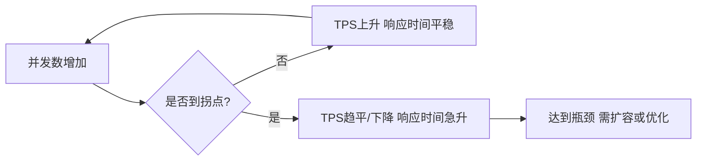
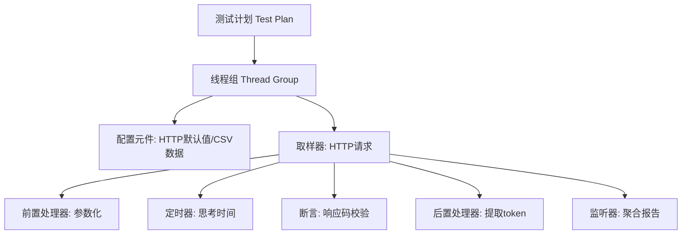
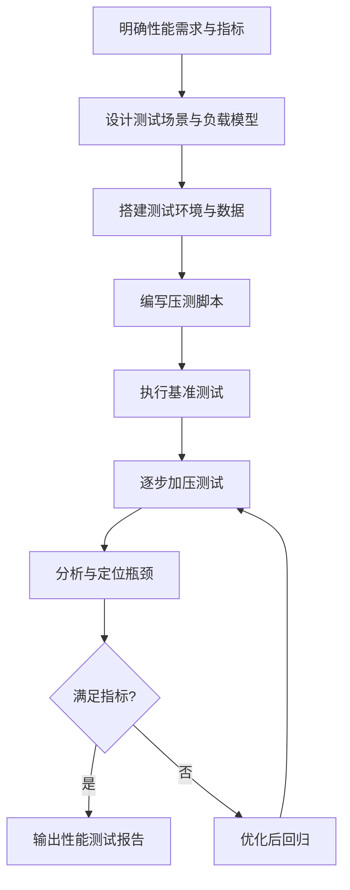

# 9.3 性能测试基础与工具

功能正确不代表系统在真实负载下可用。性能测试回答“系统能支撑多少用户、响应多快、何时崩溃、能否长期稳定”。本节介绍性能测试的类型、性能指标、JMeter 工具的使用与性能测试流程。

## 性能测试类型

> [!definition] 性能测试
> 性能测试（Performance Testing）是通过模拟真实负载，测量系统在特定条件下的响应时间、吞吐量与资源利用率，验证非功能性能指标是否满足需求的测试活动。

| 类型 | 目的 | 回答的问题 | 典型负载 |
| --- | --- | --- | --- |
| 负载测试 | 找出满足性能指标的最大吞吐 | 系统能支撑多少 | 逐步加压 |
| 压力测试 | 找出崩溃点与恢复能力 | 何时崩溃、能否恢复 | 超过容量 |
| 并发测试 | 验证多用户并发下的数据一致性 | 并发是否出错 | 同时并发请求 |
| 容量测试 | 验证特定容量下的表现 | 给定用户数下表现如何 | 固定负载 |
| 稳定性测试 | 长时间运行检查内存泄漏与稳定性 | 能否长期稳定 | 正常负载长时间 |
| 配置测试 | 对比不同配置下的性能 | 哪种配置最优 | 相同负载不同配置 |

> [!note] 负载 vs 压力
> > 负载测试是“找能撑住的最大值”，压力测试是“找撑不住的崩溃点”。前者关注正常区间，后者关注极限与恢复。

## 性能指标

| 指标 | 定义 | 单位 | 说明 |
| --- | --- | --- | --- |
| 响应时间 | 从发送请求到收到完整响应的时间 | 毫秒（ms） | 用户体验直接相关 |
| 吞吐量 | 单位时间内处理的请求数 | req/s | 系统处理能力 |
| TPS | 每秒完成的事务数 | tps | 事务=一组请求 |
| 并发用户数 | 同时向系统发请求的虚拟用户数 | 个 | 负载规模 |
| 资源利用率 | CPU/内存/网络/IO 使用率 | % | 瓶颈定位 |
| 错误率 | 失败请求占总请求比例 | % | 可靠性 |

> [!note] TPS 与响应时间的关系
> > TPS 反映吞吐能力，响应时间反映延迟。随并发数增加，TPS 先线性上升，到达拐点后受资源限制趋于平缓或下降，同时响应时间急剧上升。性能评估的黄金拐点是 TPS 达到峰值且响应时间仍在可接受区间。



## JMeter 性能测试

JMeter 是开源性能测试工具，支持 HTTP/HTTPS、JDBC、TCP 等多种协议，可分布式压测。

### 核心元件

| 元件 | 作用 | 说明 |
| --- | --- | --- |
| 线程组（Thread Group） | 模拟虚拟用户 | 定义并发数、循环次数、爬坡时间 |
| 取样器（Sampler） | 发送请求 | HTTP 请求、JDBC 请求等 |
| 断言（Assertion） | 校验响应 | 响应码、内容包含 |
| 监听器（Listener） | 收集与展示结果 | 聚合报告、查看结果树 |
| 配置元件 | 提供默认配置 | HTTP 请求默认值、CSV 数据文件 |
| 定时器（Timer） | 控制请求间隔 | 思考时间、固定定时器 |
| 前置/后置处理器 | 请求前后处理 | 参数化、提取变量 |



> [!tip] 关键参数
> > 线程组的三个关键参数：①Number of Threads（并发用户数）；②Ramp-up Period（爬坡时间，秒，全部线程启动完成的时长）；③Loop Count（循环次数）。例如 100 线程、Ramp-up 20 秒、循环 10 次，表示 20 秒内启动 100 个用户，每个用户循环 10 次。

### 性能指标计算

吞吐量与并发数、响应时间的关系（Little 定律）：

$$
L = \lambda \times W
$$

其中 $L$ 为系统中平均请求数（并发），$\lambda$ 为到达率（吞吐量，req/s），$W$ 为平均响应时间（s）。

> [!note] Little 定律
> > Little 定律描述了并发数、吞吐量与响应时间的关系：$L = \lambda \times W$。当系统稳定时，若已知并发数 $L$ 与平均响应时间 $W$，可估算吞吐量 $\lambda = L / W$。该定律用于性能容量规划。

## 性能测试流程



> [!rule] 性能测试流程要点
> 1. **需求明确**：明确响应时间、TPS、并发数目标；
> 2. **场景设计**：单接口、混合场景、峰值场景；
> 3. **环境隔离**：独立测试环境，避免干扰生产；
> 4. **数据准备**：模拟真实数据量与分布；
> 5. **瓶颈定位**：结合服务器资源监控（CPU/内存/IO）定位瓶颈；
> 6. **回归验证**：优化后复测确认改善。

## JMeter 测试计划示例

以下是一个登录接口压测的 JMeter 测试计划结构（.jmx 文件概念化表示）：

```xml
<!-- JMeter 测试计划结构示例(节选) -->
<TestPlan>
  <ThreadGroup
    num_threads="100"        <!-- 100 个并发用户 -->
    ramp_time="20"           <!-- 20 秒内爬升启动 -->
    loop_count="10">         <!-- 每个用户循环 10 次 -->
    <HTTPSamplerProxy>
      <domain>demo.example.com</domain>
      <path>/api/login</path>
      <method>POST</method>
      <body>{"username":"alice","password":"Pass1234"}</body>
    </HTTPSamplerProxy>
    <ResponseAssertion>      <!-- 断言: 响应码为 200 -->
      <scope>main</scope>
      <testField>response_code</testField>
      <comparison>2</comparison>
      <strings>200</strings>
    </ResponseAssertion>
    <ConstantTimer>           <!-- 定时器: 每次请求间隔 1 秒(思考时间) -->
      <delay>1000</delay>
    </ConstantTimer>
    <ResultCollector>         <!-- 监听器: 聚合报告 -->
      <name>聚合报告</name>
    </ResultCollector>
  </ThreadGroup>
</TestPlan>
```

> [!example] 运行与解读
> - **环境**：JMeter 5.x，被测服务 demo.example.com；
> - **场景**：100 并发用户在 20 秒内启动，每用户循环 10 次，每次请求间隔 1 秒；
> - **输出**：聚合报告中关注 Average（平均响应时间）、Throughput（吞吐量）、Error%（错误率）；
> - **判定**：若平均响应时间 < 500ms、错误率 < 0.1%、吞吐满足目标，则性能达标；
> - **前提**：测试环境与生产配置接近，数据库已灌入真实量级数据。

### 聚合报告关键字段

| 字段 | 含义 | 关注点 |
| --- | --- | --- |
| Average | 平均响应时间 | 是否达标 |
| 90th/95th pct | 90/95 分位响应时间 | 长尾用户体验 |
| Throughput | 吞吐量 | 系统能力 |
| Error % | 错误率 | 可靠性 |
| Min/Max | 最小/最大响应时间 | 波动范围 |

> [!warning] 常见误区
> > ①在开发本机压测，结果不可信；②只看平均响应时间不看分位，掩盖长尾；③压测数据量远小于生产，瓶颈未暴露；④忽略资源监控，无法定位瓶颈。性能测试必须有独立环境、真实数据与资源监控。

## 小结

性能测试验证系统在负载下的非功能表现，包括负载、压力、并发、容量与稳定性测试。核心指标有响应时间、吞吐量、TPS、并发用户数与资源利用率，Little 定律描述三者关系。JMeter 通过线程组、取样器、监听器等元件构建压测脚本，性能测试流程强调需求明确、场景设计、环境隔离与瓶颈定位。

## 关联

- 上一级：[[MOC - 第9章]]
- 上一节：[[9.2 接口测试与API测试]]
- 关联概念：[[6.2 系统测试与验收测试]]（性能测试属于系统测试）、[[7.3 测试报告与度量]]（性能指标是测试报告重要组成）、[[10.1 Web应用测试综合实践]]（Web 性能测试综合应用）
