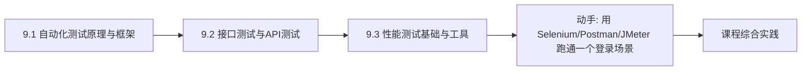
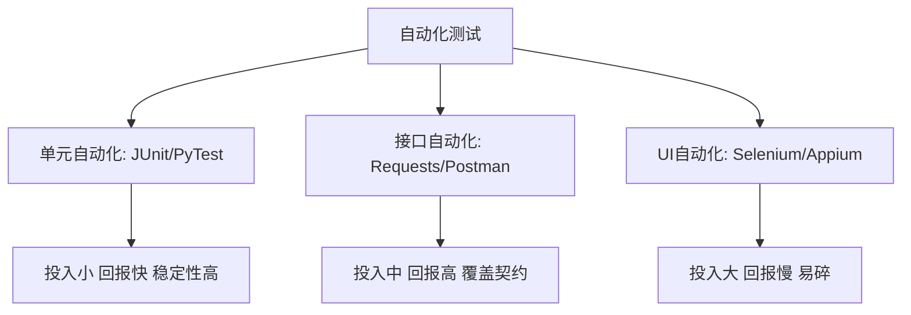

# MOC - 第9章 自动化测试与性能测试基础

> [!info] 本章定位
> 第9章把测试从“手工执行”推向“自动化与工程化”。前几章的测试方法主要依赖人工设计与执行，本章回答“哪些测试该自动化、用什么框架、如何测接口、如何压性能”。自动化测试解决回归效率问题，接口测试覆盖服务契约，性能测试回答系统在负载下的表现。本章是从测试方法到工程实践的过渡，承接第8章的缺陷管理（自动化能快速发现回归缺陷），并为第10章的综合测试实践打基础。

## 学习路线图

> [!note] 路线说明
> 自动化测试框架是基础，定义了“如何把测试脚本组织成可维护的体系”；接口测试是性价比最高的自动化层次，验证服务契约与业务逻辑；性能测试关注非功能质量，回答负载下的响应与稳定性。三者由内到外、由功能到非功能，构成自动化测试的完整图景。

## 知识点导航

| 节 | 主题 | 核心要点 | 入口 |
| --- | --- | --- | --- |
| 9.1 | 自动化测试原理与框架 | 定义、适用场景、测试层次、框架类型、Selenium | [[9.1 自动化测试原理与框架]] |
| 9.2 | 接口测试与API测试 | API 契约、REST、Postman、Requests+PyTest | [[9.2 接口测试与API测试]] |
| 9.3 | 性能测试基础与工具 | 测试类型、性能指标、JMeter、测试流程 | [[9.3 性能测试基础与工具]] |

## 核心考点

> [!warning] 重点掌握
> 1. 自动化测试的适用场景与不适用场景（需求频繁变更、探索性测试）。
> 2. 自动化测试层次：单元自动化、接口自动化、UI 自动化的特点与投入产出比。
> 3. 自动化测试框架类型：线性、模块化、数据驱动、关键字驱动、混合驱动。
> 4. Selenium WebDriver 架构与常用定位策略（id、name、xpath、css selector）。
> 5. 接口测试的核心概念：API 契约、REST 方法、状态码、断言。
> 6. 性能测试类型：负载测试、压力测试、并发测试、容量测试、稳定性测试。
> 7. 性能指标：响应时间、吞吐量、TPS、并发用户数、资源利用率。
> 8. JMeter 测试计划核心元件：线程组、取样器、监听器。

## 自动化测试层次

## 自测题

> [!question] 题1
> 说明自动化测试的适用场景与不适用场景，并解释为什么“需求频繁变更时不宜大规模引入 UI 自动化”。
> > [!check]- 参考答案
> > 适用场景：回归测试频繁、长期维护的项目、稳定接口、性能压测、数据驱动的大量输入组合。不适用场景：需求频繁变更、一次性项目、探索性测试、UI 极不稳定、投入产出比低的场景。需求频繁变更时 UI 自动化维护成本极高：每次界面调整都需重写定位与脚本，脚本易碎且频繁失败，维护成本超过回归收益，因此不宜大规模引入；应优先做接口自动化，UI 自动化只覆盖核心稳定路径。

> [!question] 题2
> 对比线性框架、数据驱动框架与关键字驱动框架的特点，并说明各自适用的场景。
> > [!check]- 参考答案
> > ①线性框架：脚本顺序执行、无抽象，简单但难维护，适合一次性验证；②数据驱动：测试数据与脚本分离，数据存于表格/文件，同一脚本可跑多组数据，适合大量输入组合的回归；③关键字驱动：把操作抽象为关键字（如 click、input），测试逻辑用关键字表格描述，非技术人员可参与，适合大型长期项目但实现复杂。大型项目通常采用混合框架（数据驱动+关键字驱动）。

> [!question] 题3
> 列出 REST API 的常用方法与典型状态码，并说明接口测试中应断言哪些内容。
> > [!check]- 参考答案
> > 常用方法：GET（查询）、POST（新增）、PUT（整体更新）、PATCH（部分更新）、DELETE（删除）。典型状态码：200 成功、201 创建成功、400 请求错误、401 未认证、403 禁止访问、404 资源不存在、500 服务器错误。接口测试应断言：①状态码是否符合预期；②响应体结构与字段值是否正确；③响应时间是否在阈值内；④响应头是否符合（如 Content-Type）；⑤业务副作用（如 POST 后 GET 能查到新增数据、数据库状态变化）。

> [!question] 题4
> 区分负载测试、压力测试与稳定性测试，并说明 TPS 与响应时间在性能评估中的关系。
> > [!check]- 参考答案
> > ①负载测试：逐步增加负载，找出满足性能指标的最大吞吐，回答“系统能支撑多少”；②压力测试：施加超过容量的负载，找出崩溃点与恢复能力，回答“系统何时崩溃、能否恢复”；③稳定性测试：在正常负载下长时间运行，检查内存泄漏与稳定性，回答“系统能否长期稳定”。TPS（每秒事务数）反映吞吐能力，响应时间反映用户体验；二者常此消彼长，当 TPS 达到拐点后继续加压，响应时间会急剧上升，性能评估需同时关注吞吐与响应，找到二者的平衡拐点。

## 章节导航

- 上一级：[[MOC - 软件测试技术]]
- 上一章：[[MOC - 第8章]]
- 下一章：[[MOC - 第10章]]
