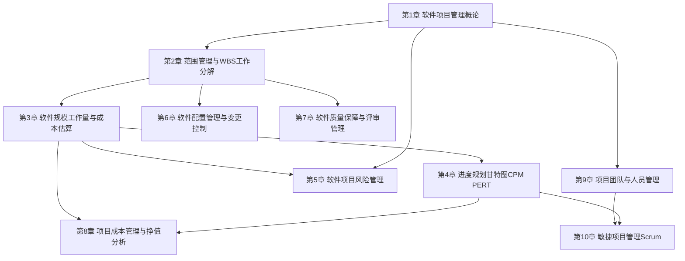

# MOC - 软件项目管理

> [!info] 课程定位
> 软件项目管理是软件工程的核心课程，研究软件项目的计划、组织、执行与控制。它解决的核心问题是：**如何在有限的范围、时间、成本与质量约束下，通过系统化的管理方法组织人员与资源，按时、按质、按预算交付满足用户需求的软件产品**。课程贯穿项目立项、范围分解、规模与成本估算、进度编排、质量保证、风险控制、配置管理、团队组织与敏捷过程，是从“能开发软件”走向“能交付软件项目”的关键能力跃迁。

## 课程摘要

本课程围绕“**基础概念 → 计划估算 → 执行控制 → 团队敏捷**”四条主线展开。学生需要掌握：

1. 软件项目特征、项目管理目标与五大过程组、PMBOK 十大知识领域、项目三重约束、项目组织形式与角色职责；
2. 范围管理：需求收集、范围定义、WBS 工作分解结构、范围确认与范围控制；
3. 软件规模、工作量与成本估算：代码行（LOC）与功能点（FPA）、COCOMO 模型、三点估算、德尔菲法、估算精度锥形曲线；
4. 进度规划：活动定义与排序、关键路径法（CPM）、甘特图、PERT 三点估算与进度压缩；
5. 软件项目风险管理：风险识别与分类、定性定量评估、风险应对策略与监控；
6. 软件配置管理与变更控制：配置项与基线、版本控制、变更控制流程与 CCB、配置审计；
7. 软件质量保障与评审管理：SQA 体系、CMMI 能力成熟度模型、评审管理与质量度量；
8. 成本管理与挣值分析（EVM）：PV/EV/AC、CV/SV、CPI/SPI；
9. 项目团队组织、人员管理与敏捷项目管理（Scrum）。

## 章节结构与依赖关系

> [!note] 依赖说明
> 第1章奠定项目管理的概念框架与三重约束，是后续一切管理活动的基础；第2章范围管理明确“做什么”，通过 WBS 把项目分解为可估算、可分配的工作包；第3章在工作包基础上进行规模与成本估算，为第4章进度编排提供工作量输入；第5章风险管理贯穿项目全生命周期，与第4章 PERT 概率估算呼应；第6章配置管理保证各阶段产物的完整性与可追溯；第7章质量保障以配置审计（第6章）为工程支撑，向上衔接 CMMI 过程改进；第8章挣值分析是范围、进度、成本三者集成的监控手段；第9章团队组织与第10章敏捷方法则从“人”与“过程”两个维度支撑项目落地。

## 章节导航

| 章节 | 主题 | 阶段 | 入口 |
| --- | --- | --- | --- |
| 第1章 | 软件项目管理概论 | 基础概念 | [[MOC - 第1章]] |
| 第2章 | 范围管理与WBS工作分解 | 计划估算 | [[MOC - 第2章]] |
| 第3章 | 软件规模、工作量与成本估算 | 计划估算 | [[MOC - 第3章]] |
| 第4章 | 进度规划：甘特图、关键路径、PERT | 计划估算 | [[MOC - 第4章]] |
| 第5章 | 软件项目风险管理 | 执行控制 | [[MOC - 第5章]] |
| 第6章 | 软件配置管理与变更控制 | 执行控制 | [[MOC - 第6章]] |
| 第7章 | 软件质量保障与评审管理 | 执行控制 | [[MOC - 第7章]] |
| 第8章 | 项目成本管理与挣值分析 | 执行控制 | [[MOC - 第8章]] |
| 第9章 | 项目团队与人员管理 | 团队敏捷 | [[MOC - 第9章]] |
| 第10章 | 敏捷项目管理（Scrum） | 团队敏捷 | [[MOC - 第10章]] |

> [!note] 整理进度
> 第4–7章的章节 MOC 与知识点笔记已建立（进度规划、风险管理、配置管理、质量保障）；第8–10章（成本与挣值分析、团队管理、Scrum）的链接为规划中的占位入口，将随后续整理补齐。

## 习题导航

每章习题覆盖单选、多选、判断、简答、计算/分析与综合题六种题型，共 30 题，答案与解析以 `
` 折叠。计算题（COCOMO、功能点、CPM、PERT、EMV、EVM、沟通渠道、Velocity）均给出完整步骤，期末复习与课程设计重点参考第3、4、5、8章计算题。

| 章节 | 习题入口 | 重点题型 |
| --- | --- | --- |
| 第1章 | [[习题-第1章-软件项目管理概论]] | 概念辨析、组织结构分析 |
| 第2章 | [[习题-第2章-范围管理WBS]] | WBS 绘制、范围蔓延分析 |
| 第3章 | [[习题-第3章-成本规模估算]] | 功能点计算、COCOMO 估算、三点估算 |
| 第4章 | [[习题-第4章-进度计划CPM&PERT]] | CPM 网络图计算、PERT、赶工 |
| 第5章 | [[习题-第5章-项目风险管理]] | EMV 计算、决策树、风险应对 |
| 第6章 | [[习题-第6章-配置与变更管理]] | 变更控制流程、Git 工作流、配置审计 |
| 第7章 | [[习题-第7章-软件质量管理]] | 缺陷度量、质量成本、CMMI |
| 第8章 | [[习题-第8章-挣值分析项目跟踪]] | EVM 完整计算、EAC 预测、项目收尾 |
| 第9章 | [[习题-第9章-团队沟通管理]] | 沟通渠道计算、激励理论、冲突解决 |
| 第10章 | [[习题-第10章-敏捷项目管理]] | Velocity 计算、Sprint 规划、燃尽图 |

## 分阶段学习目标

> [!example] 基础概念阶段（第1章）
> 建立软件项目管理的心智模型。理解项目与软件项目的特征、项目管理定义与五大过程组、PMBOK 十大知识领域、项目三重约束（范围-时间-成本，扩展为质量）、项目组织形式（职能型/项目型/矩阵型）与软件项目角色职责（RACI 矩阵）。

> [!example] 计划估算阶段（第2–4章）
> 掌握范围管理全流程：需求收集、范围说明书、WBS 工作分解（100% 规则、工作包）、范围确认与控制。掌握规模与工作量估算：代码行与功能点分析、COCOMO 三级模型、三点估算与德尔菲法。掌握进度规划：活动定义与排序、关键路径法（CPM）计算、甘特图与 PERT、进度压缩技术。

> [!example] 执行控制阶段（第5–8章）
> 掌握风险识别、定性定量分析、风险应对（规避/转移/减轻/接受）与风险监控；掌握配置项标识、基线、版本控制与变更控制流程（CCB）与配置审计；掌握 SQA 体系、CMMI 成熟度模型与评审管理；掌握挣值分析（PV/EV/AC、CV/SV、CPI/SPI）对项目绩效的集成监控。

> [!example] 团队敏捷阶段（第9–10章）
> 理解项目团队发展阶段（形成-震荡-规范-成熟）、激励与冲突管理；掌握敏捷宣言与 Scrum 框架（产品负责人、Scrum Master、开发团队；产品待办列表、冲刺待办列表、增量；Sprint 计划、每日站会、评审与回顾），理解敏捷与传统瀑布过程在管理上的差异。

## 先修与关联课程

- [[MOC - 软件工程|软件工程]]：本课程是软件工程第10章“软件项目管理”的系统化展开。软件工程提供软件生命周期、过程模型（瀑布/增量/螺旋/敏捷）与需求工程基础，本课程在其上聚焦“管理维度”——如何把工程活动组织为可计划、可监控、可交付的项目。两课程在配置管理、质量保证、需求管理部分相互呼应。
- [[MOC - 软件测试技术|软件测试技术]]：提供质量保障的方法论基础。本课程第7章软件质量保障与评审管理涉及测试计划、缺陷管理流程，与软件测试技术的测试用例设计、缺陷生命周期、测试阶段划分直接衔接。
- [[MOC - 结构化软件设计|结构化软件设计]]：提供模块化分解、内聚耦合等设计原则。本课程第2章 WBS 工作分解与结构化设计的“分解-组合”思想同源，第6章配置管理中的模块标识也借鉴设计阶段的模块划分。
- 关联延伸：[[MOC - 面向对象系统分析与建模|面向对象系统分析与建模]]（需求与设计产物是范围管理与配置管理对象）、[[MOC - 数据结构|数据结构]]与[[MOC - 算法设计与分析|算法设计与分析]]（估算时的复杂度判读）。

## 项目管理工具推荐

| 工具 | 类型 | 主要用途 | 适用章节 | 说明 |
| --- | --- | --- | --- | --- |
| MS Project | 进度计划工具 | WBS 分解、甘特图、关键路径、资源与成本分配 | 第2、4、5章 | 工业级项目管理工具，支持 CPM/PERT 与挣值分析；课程练习可使用学生版；轻量替代品：GanttProject、ProjectLibre |
| Jira | 敏捷与缺陷管理 | 需求/任务/缺陷跟踪、Scrum/Kanban 看板、Sprint 管理 | 第6、8、10章 | Atlassian 出品，支持敏捷故事点估算与燃尽图；可与 Git、CI 工具集成 |
| Git | 版本控制工具 | 源码版本管理、分支协作、配置项基线 | 第8章 | 配合 GitHub/Gitee，是软件配置管理的工程标准；分支策略如 Git Flow |
| Redmine | 项目管理平台 | 需求/缺陷/任务跟踪、甘特图、Wiki、时间跟踪 | 第4、6、8章 | 开源，支持多项目与自定义字段，适合中小团队综合管理 |
| Trello | 看板协作工具 | 任务可视化、Kanban 看板、轻量进度跟踪 | 第4、10章 | 适合小型项目与敏捷看板实践，操作简单 |

> [!tip] 工具选型建议
> 课程练习推荐 **MS Project**（或 GanttProject）体验 WBS 分解与甘特图编制、**Git** 进行配置管理实践、**Jira** 或 **Redmine** 体验需求与缺陷跟踪流程、**Trello** 体验敏捷看板。先用轻量工具掌握管理方法，再在综合项目中整合使用。

## 复习与查询入口

- 基础概念速查：[[1.1 软件项目特征、项目管理目标]]、[[1.2 项目三重约束：范围、时间、成本、质量]]、[[1.3 软件项目组织形式与参与角色]]
- 范围管理速查：[[2.1 需求收集与范围定义]]、[[2.2 WBS工作分解结构创建]]、[[2.3 范围确认与范围控制]]
- 估算方法速查：[[3.1 软件规模估算：代码行与功能点]]、[[3.2 工作量估算：COCOMO模型]]、[[3.3 成本估算与估算方法综合]]
- 进度规划速查：[[4.1 活动定义与活动排序]]、[[4.2 关键路径法（CPM）与甘特图]]、[[4.3 PERT技术与进度压缩]]
- 风险管理速查：[[5.1 风险识别与风险分类]]、[[5.2 风险评估与风险量化]]、[[5.3 风险应对策略与风险监控]]
- 配置管理速查：[[6.1 配置管理基本概念与版本控制]]、[[6.2 变更控制流程与CCB]]、[[6.3 配置审计与状态报告]]
- 质量保障速查：[[7.1 软件质量保障体系]]、[[7.2 CMMI能力成熟度模型]]、[[7.3 评审管理与质量度量]]
