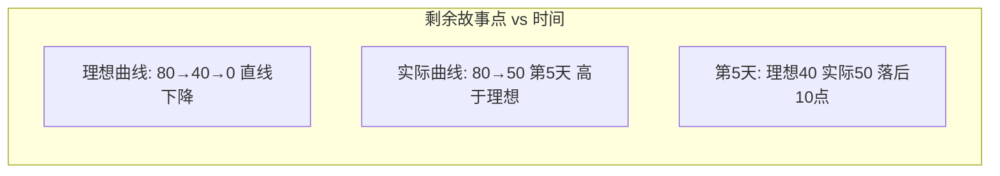
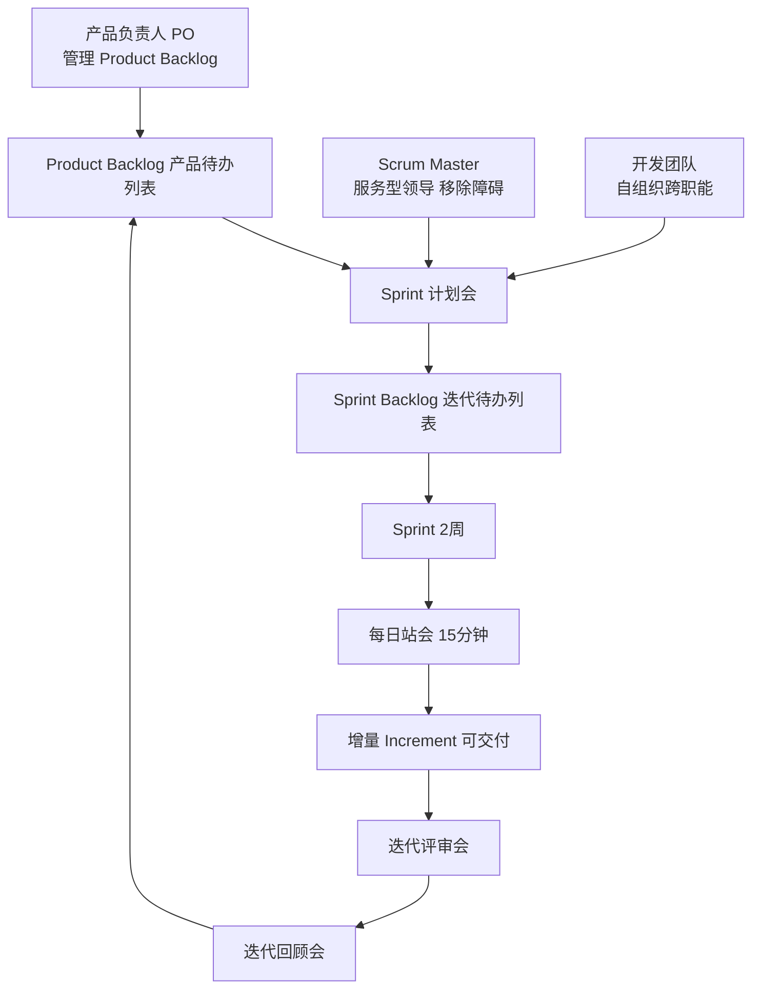
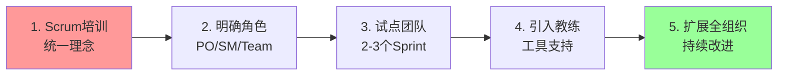

# 习题 - 第10章 敏捷项目管理 Scrum

> [!info] 本章习题定位
> 第10章聚焦敏捷项目管理与 Scrum 框架，习题覆盖敏捷宣言四大价值观、Scrum 三角色（PO/SM/Team）、三工件（Product Backlog/Sprint Backlog/Increment）、五事件（Sprint/计划会/站会/评审会/回顾会）、用户故事与故事点、Planning Poker、Velocity 与燃尽图。计算题要求 Velocity 计算与 Sprint 规划，综合题对比敏捷与传统方法，与第1章过程组（[[知识点/第1章 软件项目管理概论/MOC - 第1章]]）形成方法论对比。

## 知识点覆盖表

| 题号 | 题型 | 考查知识点 | 对应笔记 |
| --- | --- | --- | --- |
| 10.1 | 单选 | 敏捷宣言价值观 | [[10.1 敏捷宣言与Scrum框架]] |
| 10.2 | 单选 | 工作的软件高于文档 | [[10.1 敏捷宣言与Scrum框架]] |
| 10.3 | 单选 | Scrum 三角色 | [[10.1 敏捷宣言与Scrum框架]] |
| 10.4 | 单选 | 产品负责人 PO | [[10.1 敏捷宣言与Scrum框架]] |
| 10.5 | 单选 | Scrum Master | [[10.1 敏捷宣言与Scrum框架]] |
| 10.6 | 单选 | Scrum 三工件 | [[10.1 敏捷宣言与Scrum框架]] |
| 10.7 | 单选 | Sprint 时长 | [[10.2 Sprint计划与执行]] |
| 10.8 | 单选 | 每日站会 | [[10.2 Sprint计划与执行]] |
| 10.9 | 单选 | 用户故事格式 | [[10.3 敏捷估算与团队实践]] |
| 10.10 | 单选 | Velocity 含义 | [[10.3 敏捷估算与团队实践]] |
| 10.11 | 多选 | 敏捷宣言四价值观 | [[10.1 敏捷宣言与Scrum框架]] |
| 10.12 | 多选 | Scrum 三角色 | [[10.1 敏捷宣言与Scrum框架]] |
| 10.13 | 多选 | Scrum 五事件 | [[10.2 Sprint计划与执行]] |
| 10.14 | 多选 | Planning Poker | [[10.3 敏捷估算与团队实践]] |
| 10.15 | 多选 | 敏捷与传统对比 | [[10.1 敏捷宣言与Scrum框架]] |
| 10.16 | 判断 | 敏捷宣言价值观 | [[10.1 敏捷宣言与Scrum框架]] |
| 10.17 | 判断 | Scrum Master 职责 | [[10.1 敏捷宣言与Scrum框架]] |
| 10.18 | 判断 | Sprint 不可延长 | [[10.2 Sprint计划与执行]] |
| 10.19 | 判断 | 故事点与时间 | [[10.3 敏捷估算与团队实践]] |
| 10.20 | 判断 | 燃尽图 | [[10.3 敏捷估算与团队实践]] |
| 10.21 | 简答 | 敏捷宣言四价值观 | [[10.1 敏捷宣言与Scrum框架]] |
| 10.22 | 简答 | Scrum 三角色职责 | [[10.1 敏捷宣言与Scrum框架]] |
| 10.23 | 简答 | Scrum 五事件 | [[10.2 Sprint计划与执行]] |
| 10.24 | 简答 | 敏捷与传统对比 | [[10.1 敏捷宣言与Scrum框架]] |
| 10.25 | 计算 | Velocity 计算 | [[10.3 敏捷估算与团队实践]] |
| 10.26 | 计算 | Sprint 规划 | [[10.3 敏捷估算与团队实践]] |
| 10.27 | 计算 | Planning Poker 估算 | [[10.3 敏捷估算与团队实践]] |
| 10.28 | 分析 | 燃尽图分析 | [[10.3 敏捷估算与团队实践]] |
| 10.29 | 综合 | Scrum 实施综合案例 | [[10.2 Sprint计划与执行]] |
| 10.30 | 综合 | 敏捷转型案例 | [[10.1 敏捷宣言与Scrum框架]] |

## 一、单选题（每题 2 分，共 10 题）

**10.1** 敏捷宣言中"个体与互动"高于？

A. 工作的软件  
B. 客户合作  
C. 流程与工具  
D. 响应变化

**10.2** 敏捷宣言中"工作的软件"高于？

A. 详尽的文档  
B. 流程与工具  
C. 合同谈判  
D. 遵循计划

**10.3** Scrum 的三个核心角色是？

A. 项目经理、架构师、开发  
B. 产品负责人、Scrum Master、开发团队  
C. PO、PM、QA  
D. 客户、开发、测试

**10.4** 产品负责人（Product Owner）的主要职责是？

A. 保护团队免受干扰  
B. 管理产品待办列表，确定优先级  
C. 主持每日站会  
D. 编写代码

**10.5** Scrum Master 的主要职责是？

A. 决定产品功能优先级  
B. 编写测试用例  
C. 服务型领导，移除障碍，促进 Scrum 实践  
D. 分配任务给开发人员

**10.6** Scrum 的三个工件不包括？

A. 产品待办列表（Product Backlog）  
B. 迭代待办列表（Sprint Backlog）  
C. 增量（Increment）  
D. 甘特图

**10.7** Sprint（迭代）的典型时长是？

A. 1 天  
B. 1-4 周，通常 2 周  
C. 3 个月  
D. 6 个月

**10.8** 每日站会（Daily Scrum）的三个标准问题是？

A. 昨天做了什么、今天计划做什么、遇到什么障碍  
B. 进度如何、成本如何、质量如何  
C. 谁表现好、谁表现差、如何奖励  
D. 需求是什么、设计是什么、测试是什么

**10.9** 用户故事的标准格式是？

A. "作为[角色]，我希望[功能]，以便[价值]"  
B. "模块 A 应实现功能 B"  
C. "系统应满足性能指标 C"  
D. "缺陷 D 应在版本 E 修复"

**10.10** Velocity（速度）的含义是？

A. 团队成员的工作速度  
B. 团队一个 Sprint 完成的故事点总和  
C. 代码提交频率  
D. 缺陷修复速度

## 二、多选题（每题 3 分，共 5 题）

**10.11** 敏捷宣言的四大价值观包括？（多选）

A. 个体与互动 高于 流程与工具  
B. 工作的软件 高于 详尽的文档  
C. 客户合作 高于 合同谈判  
D. 响应变化 高于 遵循计划  
E. 文档完整 高于 快速交付

**10.12** Scrum 的三个核心角色包括？（多选）

A. 产品负责人（Product Owner）  
B. Scrum Master  
C. 开发团队（Development Team）  
D. 项目经理  
E. 架构师

**10.13** Scrum 的五个事件包括？（多选）

A. Sprint（迭代本身）  
B. 迭代计划会（Sprint Planning）  
C. 每日站会（Daily Scrum）  
D. 迭代评审会（Sprint Review）  
E. 迭代回顾会（Sprint Retrospective）

**10.14** 关于 Planning Poker，下列说法正确的有？（多选）

A. 用斐波那契数列（1, 2, 3, 5, 8, 13, 21）估算故事点  
B. 团队成员同时出牌，避免锚定效应  
C. 高低值者解释理由后重新估算  
D. 直到达成共识或收敛  
E. 由 PO 单独决定故事点

**10.15** 敏捷与传统瀑布方法的主要区别包括？（多选）

A. 敏捷拥抱变化，瀑布强调遵循计划  
B. 敏捷迭代增量交付，瀑布一次性交付  
C. 敏捷客户全程参与，瀑布阶段评审  
D. 敏捷轻文档，瀑布重文档  
E. 敏捷无项目管理，瀑布有项目管理

## 三、判断题（每题 2 分，共 5 题）

**10.16** 敏捷宣言强调"右项也有价值，但左项更有价值"，并非否定右项。

**10.17** Scrum Master 是团队的领导，负责分配任务与做技术决策。

**10.18** Sprint 一旦开始，其时长不可延长；若目标无法达成，可在团队与 PO 协商后提前终止 Sprint。

**10.19** 故事点是相对单位，衡量工作量复杂度，与时间（小时/天）无直接换算关系。

**10.20** 燃尽图（Burn-down Chart）显示 Sprint 内剩余工作量随时间的变化，理想曲线应趋近于零。

## 四、简答题（每题 6 分，共 4 题）

**10.21** 列出敏捷宣言的四大价值观，并说明"左项高于右项"的含义。

**10.22** 说明 Scrum 三个核心角色的职责与协作关系。

**10.23** 列出 Scrum 的五个事件，并说明各自的目的与典型时长。

**10.24** 从范围、计划、交付、客户参与、文档五个维度比较敏捷与传统瀑布方法。

## 五、计算题/分析题（每题 8 分，共 4 题）

**10.25** 某团队过去 4 个 Sprint 完成的故事点分别为：21、18、23、20。请计算：
1. 平均 Velocity。
2. 若 Product Backlog 剩余 200 故事点，预测还需多少个 Sprint 完成（按平均 Velocity）？
3. 说明 Velocity 的工程意义与使用注意事项。

**10.26** 某团队 Velocity = 13 故事点，当前 Product Backlog 优先级排序的故事点如下：8、5、5、3、3、2、2、1。请进行 Sprint 规划：
1. 选出本 Sprint 应完成的故事（使总点数不超过 Velocity）。
2. 给出至少两种组合方案。
3. 说明若某个 8 点故事未完成，对 Velocity 与下个 Sprint 的影响。

**10.27** 某团队 5 人用 Planning Poker 估算一个用户故事，第一轮出牌：3、5、5、8、3。请：
1. 说明第一轮分歧情况。
2. 给出收敛步骤（高低值解释后重新估算）。
3. 若第二轮出牌为 5、5、5、5、5，最终故事点为多少？
4. 说明 Planning Poker 相对单人估算的优势。

**10.28** 某 Sprint 共 10 个工作日，计划完成 80 故事点。第 5 天末燃尽图显示剩余 50 故事点。请分析：
1. 项目是否按计划推进？
2. 计算理想剩余与实际剩余的差异。
3. 给出可能的调整措施。
4. 用 Mermaid 绘制燃尽图示意图（理想 vs 实际曲线）。

## 六、综合题/案例题（每题 10 分，共 2 题）

**10.29** 某团队采用 Scrum 开发一个电商小程序，2 周 Sprint，团队 6 人（1 PO、1 SM、4 开发）。请回答：
1. 用 Mermaid 绘制 Scrum 框架示意图（角色、工件、事件）。
2. 设计一个 Sprint 的完整流程（从计划会到回顾会），标注各事件时长。
3. 编写 3 个用户故事（标准格式）。
4. 若团队 Velocity = 20 故事点，Backlog 故事点为 8、5、5、3、3、2、2、1、1，规划本 Sprint。
5. 说明燃尽图如何用于进度跟踪，并给出每日站会的三个问题示例。

**10.30** 某传统瀑布型公司希望转型敏捷，团队习惯了详细需求文档与长周期交付，PO 由原产品经理担任但不熟悉 Scrum，SM 由项目经理兼任。转型中出现：PO 仍写详细需求文档而非用户故事；SM 仍做任务分配而非服务型领导；团队等待指令缺乏自组织。请回答：
1. 分析转型中存在的三个主要问题。
2. 说明 PO、SM、开发团队在 Scrum 中的正确职责。
3. 给出敏捷转型的改进路线（至少 4 步）。
4. 用 Mermaid 绘制敏捷转型路线图。
5. 从敏捷宣言四价值观角度，说明转型应重点改变哪些理念。
6. 列出转型成功的关键指标（至少 4 项）。

---

## 答案与解析

### 单选题答案

点击展开单选题答案与解析

**10.1 答案：C**
解析：敏捷宣言"个体与互动 高于 流程与工具"。

**10.2 答案：A**
解析："工作的软件 高于 详尽的文档"。

**10.3 答案：B**
解析：Scrum 三角色为产品负责人（PO）、Scrum Master（SM）、开发团队。

**10.4 答案：B**
解析：PO 负责管理产品待办列表，确定优先级，代表客户与业务价值。

**10.5 答案：C**
解析：Scrum Master 是服务型领导，移除障碍，促进 Scrum 实践，不做技术决策。

**10.6 答案：D**
解析：Scrum 三工件为产品待办列表、迭代待办列表、增量。甘特图不是 Scrum 工件。

**10.7 答案：B**
解析：Sprint 典型时长 1-4 周，通常 2 周。

**10.8 答案：A**
解析：每日站会三问题：昨天做了什么、今天计划做什么、遇到什么障碍。

**10.9 答案：A**
解析：用户故事格式"作为[角色]，我希望[功能]，以便[价值]"。

**10.10 答案：B**
解析：Velocity 是团队一个 Sprint 完成的故事点总和。

### 多选题答案

点击展开多选题答案与解析

**10.11 答案：A、B、C、D**
解析：四价值观为个体与互动、工作的软件、客户合作、响应变化。E 错误，敏捷不强调文档完整高于快速交付。

**10.12 答案：A、B、C**
解析：Scrum 三角色为 PO、SM、开发团队。项目经理与架构师不是 Scrum 标准角色。

**10.13 答案：A、B、C、D、E**
解析：Scrum 五事件为 Sprint、迭代计划会、每日站会、迭代评审会、迭代回顾会。

**10.14 答案：A、B、C、D**
解析：Planning Poker 用斐波那契数列、同时出牌、高低解释后重估、收敛共识。E 错误，PO 不单独决定，由团队共识。

**10.15 答案：A、B、C、D**
解析：敏捷 vs 瀑布：拥抱变化、迭代交付、客户参与、轻文档。E 错误，敏捷也有项目管理（轻量级）。

### 判断题答案

点击展开判断题答案与解析

**10.16 答案：正确**
解析：敏捷宣言强调"右项也有价值，但左项更有价值"，并非否定文档、计划、合同、工具。

**10.17 答案：错误**
解析：Scrum Master 是服务型领导，不分配任务、不做技术决策，而是移除障碍、促进实践。

**10.18 答案：正确**
解析：Sprint 时长不可延长；若目标无法达成，可经团队与 PO 协商提前终止。

**10.19 答案：正确**
解析：故事点是相对单位，衡量工作量复杂度，与时间无直接换算，避免按时间估算的偏差。

**10.20 答案：正确**
解析：燃尽图显示剩余工作量随时间变化，理想曲线从总量趋近于零。

### 简答题答案

点击展开简答题参考答案

**10.21 参考答案**
敏捷宣言四大价值观：
1. 个体与互动 高于 流程与工具；
2. 工作的软件 高于 详尽的文档；
3. 客户合作 高于 合同谈判；
4. 响应变化 高于 遵循计划。
"左项高于右项"含义：右项（流程、文档、合同、计划）仍有价值，但左项（人、软件、合作、变化）更重要。敏捷并非否定右项，而是优先关注左项以更灵活地交付价值。

**10.22 参考答案**
| 角色 | 职责 |
| --- | --- |
| 产品负责人 PO | 管理产品待办列表，确定优先级，代表客户与业务价值，决定发布内容与时机 |
| Scrum Master | 服务型领导，移除障碍，促进 Scrum 实践，保护团队，辅导 PO 与团队 |
| 开发团队 | 自组织、跨职能，负责 Sprint 内的设计、开发、测试与交付 |

协作关系：PO 决定"做什么"（价值与优先级），团队决定"怎么做"（技术实现与任务分解），SM 保障"如何协作"（流程与障碍移除）。三者相互独立又协同。

**10.23 参考答案**
| 事件 | 目的 | 典型时长 |
| --- | --- | --- |
| Sprint | 迭代容器，固定时间盒 | 1-4 周，通常 2 周 |
| 迭代计划会 | 选择 Backlog 项，制定 Sprint 目标与计划 | 2-4 小时（2 周 Sprint） |
| 每日站会 | 同步进展，暴露障碍 | 15 分钟 |
| 迭代评审会 | 向 PO 与干系人演示增量，获取反馈 | 1-2 小时 |
| 迭代回顾会 | 团队反思流程，制定改进项 | 1-1.5 小时 |

**10.24 参考答案**
| 维度 | 敏捷 | 瀑布 |
| --- | --- | --- |
| 范围 | 渐进明细，迭代演进 | 前期冻结，变更控制严 |
| 计划 | 滚动式规划，响应变化 | 详细计划，遵循计划 |
| 交付 | 增量交付，频繁反馈 | 一次性交付，末期验收 |
| 客户参与 | 全程参与，每个 Sprint 评审 | 阶段评审，参与度低 |
| 文档 | 轻文档，代码即文档 | 重文档，详细规格 |

### 计算题答案

点击展开计算题参考答案与完整步骤

**10.25 参考答案**
1. 平均 Velocity：
$$\bar{V} = \frac{21 + 18 + 23 + 20}{4} = \frac{82}{4} = 20.5 \text{ 故事点/Sprint}$$

2. 剩余 200 故事点，所需 Sprint 数：
$$Sprint 数 = \frac{200}{20.5} \approx 9.76 \approx 10 \text{ 个 Sprint}$$

3. Velocity 工程意义与注意事项：
- 工程意义：Velocity 是团队产能的量化指标，用于 Sprint 规划与发布预测，是敏捷估算的核心依据。
- 注意事项：
  - Velocity 需 3-4 个 Sprint 才稳定，早期不稳定；
  - 不同团队 Velocity 不可直接比较（故事点定义不同）；
  - Velocity 受团队规模、能力、技术债影响，会波动；
  - 不应作为考核指标，避免团队虚报或降低标准。

**10.26 参考答案**
1. 本 Sprint 选择（总点数 ≤ 13）：

方案 A：8 + 5 = 13（2 个故事）
方案 B：5 + 5 + 3 = 13（3 个故事）
方案 C：5 + 3 + 3 + 2 = 13（4 个故事）
方案 D：8 + 3 + 2 = 13（3 个故事）

2. 至少两种组合：
- 方案 A：选 8 点 + 5 点故事（高价值优先，2 个故事）；
- 方案 B：选 5 + 5 + 3 点故事（分散风险，3 个故事，降低单故事未完成影响）。

3. 若 8 点故事未完成：
- 该 Sprint 实际 Velocity = 已完成故事点之和（不含 8 点）；
- 8 点故事回到 Product Backlog，由 PO 重新评估优先级，可能拆分为更小故事（如 5+3）放入下个 Sprint；
- 影响：本 Sprint Velocity 下降，团队需在回顾会分析原因（估算偏差、技术难点、依赖未解），下个 Sprint 规划时参考调整后的 Velocity。

**10.27 参考答案**
1. 第一轮分歧：出牌 3、5、5、8、3，最小 3，最大 8，差距 5，存在明显分歧（部分认为简单，部分认为复杂）。

2. 收敛步骤：
- 出 3 的成员解释：认为需求清晰、有类似经验；
- 出 8 的成员解释：发现隐藏复杂度、依赖外部接口；
- 团队讨论澄清需求与依赖；
- 重新出牌。

3. 第二轮出牌 5、5、5、5、5，达成共识，最终故事点 = 5。

4. Planning Poker 优势：
- 同时出牌避免锚定效应（首位发言影响他人）；
- 集体智慧，发现隐藏复杂度；
- 高低值解释促进需求澄清；
- 共识提升估算准确性与团队认同；
- 相对单人估算更客观。

**10.28 参考答案**
1. 是否按计划：
- Sprint 10 天，第 5 天应为进度中点；
- 计划 80 点，理想第 5 天剩余 = 80 × (1 - 5/10) = 40 点；
- 实际剩余 50 点 > 40 点，进度落后。

2. 差异：实际剩余 50 - 理想剩余 40 = 10 点落后。完成速率 = (80-50)/5 = 6 点/天，理想速率 = 80/10 = 8 点/天，落后约 25%。

3. 调整措施：
- 在每日站会暴露落后原因（阻塞、估算偏差、依赖）；
- SM 协助移除障碍；
- 与 PO 协商是否缩减 Sprint 范围（移除低优先级故事）；
- 评估是否需加班或寻求外部支持；
- 在回顾会分析根因，改进下个 Sprint。

4. 燃尽图示意图（Mermaid）：

注：实际燃尽图为折线图，横轴时间（天），纵轴剩余故事点。理想曲线为从 80 到 0 的直线；实际曲线第 5 天在 50，高于理想 40，表示落后。

### 综合题答案

点击展开综合题参考答案

**10.29 参考答案**
1. Scrum 框架示意图（Mermaid）：

2. Sprint 完整流程（2 周 = 10 工作日）：

| 事件 | 时间 | 时长 |
| --- | --- | --- |
| 迭代计划会 | 第 1 天上午 | 2-4 小时 |
| Sprint 执行 | 第 1-10 天 | 10 天 |
| 每日站会 | 每天上午 | 15 分钟 |
| 迭代评审会 | 第 10 天下午 | 1-2 小时 |
| 迭代回顾会 | 第 10 天评审后 | 1-1.5 小时 |

3. 用户故事示例：
- 作为买家，我希望按商品名称搜索，以便快速找到想要的商品；
- 作为买家，我希望将商品加入购物车，以便批量结算；
- 作为卖家，我希望发布商品并设置库存，以便开始销售。

4. Sprint 规划（Velocity = 20，Backlog: 8、5、5、3、3、2、2、1、1）：
- 方案：8 + 5 + 5 + 2 = 20（4 个故事）
- 或：8 + 5 + 3 + 3 + 1 = 20（5 个故事）
建议选 8+5+5+2（高价值优先，4 个故事降低协调成本）。

5. 燃尽图与站会：
- 燃尽图：每天更新剩余故事点，绘制实际曲线与理想曲线对比，落后时及时预警。
- 每日站会三问题示例：
  - 昨天完成了用户故事"搜索功能"的前端页面；
  - 今天计划完成搜索接口联调；
  - 遇到障碍：后端接口未就绪，需 SM 协调。

**10.30 参考答案**
1. 转型问题：
- PO 仍写详细需求文档而非用户故事：未理解敏捷"工作的软件高于详尽的文档"；
- SM 仍做任务分配而非服务型领导：未理解 Scrum Master 是服务型领导，非传统项目经理；
- 团队等待指令缺乏自组织：未建立自组织文化与授权机制。

2. Scrum 正确职责：

| 角色 | 正确职责 |
| --- | --- |
| PO | 管理产品待办列表，编写用户故事，确定优先级，代表业务价值 |
| SM | 服务型领导，移除障碍，促进 Scrum 实践，保护团队，辅导 PO 与团队 |
| 开发团队 | 自组织、跨职能，自行认领任务，负责设计、开发、测试、交付 |

3. 敏捷转型改进路线：
- 第 1 步：Scrum 培训，统一团队对敏捷价值观与 Scrum 框架的理解；
- 第 2 步：明确角色职责，PO 学会写用户故事，SM 转为服务型领导，团队建立自组织机制；
- 第 3 步：试点 1-2 个团队，2-3 个 Sprint，积累经验；
- 第 4 步：引入敏捷教练，建立敏捷工具（Jira、看板、燃尽图）；
- 第 5 步：扩展到全组织，持续改进。

4. 敏捷转型路线图（Mermaid）：

5. 从敏捷宣言四价值观改变理念：
- 个体与互动高于流程与工具：从流程驱动转向人本驱动，鼓励面对面沟通；
- 工作的软件高于详尽的文档：从重文档转向可工作软件，用用户故事替代详尽需求文档；
- 客户合作高于合同谈判：PO 全程参与，每 Sprint 评审，从合同对立转向协作；
- 响应变化高于遵循计划：从详细计划转向滚动规划，拥抱需求变化。

6. 转型成功关键指标：
- Velocity 稳定（波动 ±20% 以内）；
- Sprint 交付率（计划故事点完成率 ≥ 85%）；
- 缺陷逃逸率下降（DRE 提升）；
- 客户满意度提升（每 Sprint 评审反馈）；
- 团队满意度提升（回顾会改进项执行率）；
- 交付周期缩短（从需求到上线的周期时间）。

## 考点统计表

| 考查维度 | 题量 | 分值占比 | 难度 |
| --- | --- | --- | --- |
| 敏捷宣言四价值观 | 6 | 约 20% | 中 |
| Scrum 三角色 | 6 | 约 20% | 中 |
| Scrum 五事件 | 5 | 约 17% | 中 |
| 用户故事与故事点 | 5 | 约 17% | 中高 |
| Velocity 与燃尽图 | 5 | 约 17% | 中高 |
| 敏捷转型综合 | 3 | 约 10% | 高 |
| **合计** | **30** | **100%** | — |

## 关联

- 上一级：[[MOC - 软件项目管理]]
- 本章知识点：[[MOC - 第10章]]
- 上一章习题：[[习题-第9章-团队沟通管理]]
- 敏捷与传统对比：[[习题-第1章-软件项目管理概论]]
