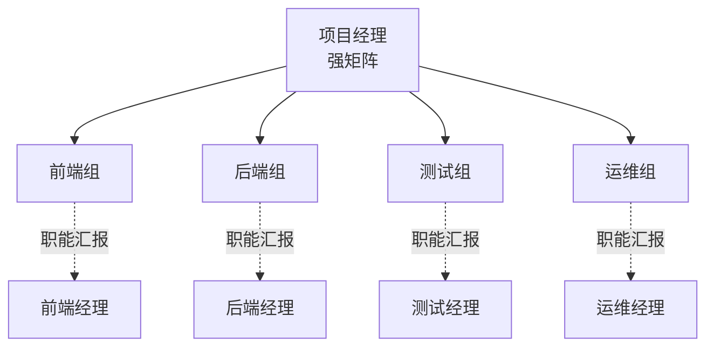

# 习题 - 第1章 软件项目管理概论

> [!info] 本章习题定位
> 第1章是软件项目管理课程的地基，习题覆盖项目定义与三大特征、软件项目特殊性、项目管理五大过程组、PMBOK 十大知识领域、三重约束（铁三角）、项目组织结构类型与 RACI 矩阵。重点考查概念辨析与组织结构选择，为后续范围管理（[[知识点/第2章 范围管理与WBS工作分解/MOC - 第2章]]）与估算（[[知识点/第3章 软件规模工作量与成本估算/MOC - 第3章]]）奠定基础。

## 知识点覆盖表

| 题号 | 题型 | 考查知识点 | 对应笔记 |
| --- | --- | --- | --- |
| 1.1 | 单选 | 项目定义与临时性 | [[1.1 软件项目特征、项目管理目标]] |
| 1.2 | 单选 | 项目独特性 | [[1.1 软件项目特征、项目管理目标]] |
| 1.3 | 单选 | 软件项目特殊性 | [[1.1 软件项目特征、项目管理目标]] |
| 1.4 | 单选 | 五大过程组顺序 | [[1.1 软件项目特征、项目管理目标]] |
| 1.5 | 单选 | PMBOK 十大知识领域 | [[1.1 软件项目特征、项目管理目标]] |
| 1.6 | 单选 | 三重约束含义 | [[1.2 项目三重约束：范围、时间、成本、质量]] |
| 1.7 | 单选 | 组织结构类型 | [[1.3 软件项目组织形式与参与角色]] |
| 1.8 | 单选 | 矩阵型组织分类 | [[1.3 软件项目组织形式与参与角色]] |
| 1.9 | 单选 | RACI 矩阵含义 | [[1.3 软件项目组织形式与参与角色]] |
| 1.10 | 单选 | 渐进明细 | [[1.1 软件项目特征、项目管理目标]] |
| 1.11 | 多选 | 项目三大特征 | [[1.1 软件项目特征、项目管理目标]] |
| 1.12 | 多选 | 软件项目特殊性 | [[1.1 软件项目特征、项目管理目标]] |
| 1.13 | 多选 | 五大过程组 | [[1.1 软件项目特征、项目管理目标]] |
| 1.14 | 多选 | 项目组织结构 | [[1.3 软件项目组织形式与参与角色]] |
| 1.15 | 多选 | RACI 角色 | [[1.3 软件项目组织形式与参与角色]] |
| 1.16 | 判断 | 项目临时性 | [[1.1 软件项目特征、项目管理目标]] |
| 1.17 | 判断 | 三重约束关系 | [[1.2 项目三重约束：范围、时间、成本、质量]] |
| 1.18 | 判断 | 项目型组织 | [[1.3 软件项目组织形式与参与角色]] |
| 1.19 | 判断 | 渐进明细 | [[1.1 软件项目特征、项目管理目标]] |
| 1.20 | 判断 | PMBOK 知识领域 | [[1.1 软件项目特征、项目管理目标]] |
| 1.21 | 简答 | 五大过程组与监控关系 | [[1.1 软件项目特征、项目管理目标]] |
| 1.22 | 简答 | 三重约束与压缩工期 | [[1.2 项目三重约束：范围、时间、成本、质量]] |
| 1.23 | 简答 | RACI 矩阵用法 | [[1.3 软件项目组织形式与参与角色]] |
| 1.24 | 简答 | 软件项目特殊性挑战 | [[1.1 软件项目特征、项目管理目标]] |
| 1.25 | 分析 | 组织结构对比分析 | [[1.3 软件项目组织形式与参与角色]] |
| 1.26 | 分析 | PMBOK 知识领域归类 | [[1.1 软件项目特征、项目管理目标]] |
| 1.27 | 分析 | 项目特征辨析 | [[1.1 软件项目特征、项目管理目标]] |
| 1.28 | 分析 | RACI 矩阵构建 | [[1.3 软件项目组织形式与参与角色]] |
| 1.29 | 综合 | 组织结构选择案例 | [[1.3 软件项目组织形式与参与角色]] |
| 1.30 | 综合 | 项目管理综合分析 | [[1.1 软件项目特征、项目管理目标]] |

## 一、单选题（每题 2 分，共 10 题）

**1.1** 项目（Project）作为临时性工作，其"临时性"指的是？

A. 项目持续时间短  
B. 项目有明确的开始与结束时间  
C. 项目团队临时组建即可随意更换  
D. 项目交付物是临时的

**1.2** 下列哪项最能体现项目的"独特性"？

A. 项目按照标准流程执行  
B. 项目产出的产品或成果在某种程度上独一无二  
C. 项目预算固定不可变  
D. 项目团队成员都是专家

**1.3** 与一般建设项目相比，软件项目最显著的特殊性是？

A. 需要预算控制  
B. 产物是逻辑实体，具有不可见性  
C. 需要团队协作  
D. 有明确的项目周期

**1.4** 项目管理五大过程组的正确顺序是？

A. 启动 → 执行 → 规划 → 监控 → 收尾  
B. 规划 → 启动 → 执行 → 监控 → 收尾  
C. 启动 → 规划 → 执行 → 监控 → 收尾  
D. 启动 → 规划 → 监控 → 执行 → 收尾

**1.5** 下列哪项不属于 PMBOK 十大知识领域？

A. 范围管理  
B. 风险管理  
C. 营销管理  
D. 干系人管理

**1.6** 项目管理"铁三角"中的三个约束是？

A. 范围、时间、质量  
B. 范围、时间、成本  
C. 时间、成本、人员  
D. 范围、成本、风险

**1.7** 在职能型组织中，项目经理的权力通常是？

A. 很强  
B. 中等  
C. 很弱或无专职 PM  
D. 完全自治

**1.8** 矩阵型组织按项目经理权力大小可分为弱矩阵、平衡矩阵和？

A. 强矩阵  
B. 复合矩阵  
C. 项目矩阵  
D. 职能矩阵

**1.9** RACI 矩阵中，"R"代表的责任类型是？

A. 咨询人（Consulted）  
B. 知会人（Informed）  
C. 负责人（Responsible）  
D. 批准人（Approver）

**1.10** 软件项目特别需要依赖"渐进明细"，其根本原因是？

A. 团队成员能力不足  
B. 早期信息不全，需求随项目推进逐步明确  
C. 项目预算有限  
D. 工期紧迫无法详细规划

## 二、多选题（每题 3 分，共 5 题）

**1.11** 项目的三大基本特征包括？（多选）

A. 临时性  
B. 独特性  
C. 渐进明细  
D. 可重复性  
E. 持续运营性

**1.12** 软件项目区别于一般项目的特殊性包括？（多选）

A. 逻辑产品，不可见性  
B. 复杂度高，状态空间庞大  
C. 需求易变  
D. 智力密集，主要成本是人力  
E. 可见度高，进度易度量

**1.13** 项目管理五大过程组包括？（多选）

A. 启动  
B. 规划  
C. 执行  
D. 监控  
E. 收尾

**1.14** 常见的项目组织结构类型包括？（多选）

A. 职能型  
B. 项目型  
C. 矩阵型  
D. 复合型  
E. 网络型

**1.15** RACI 矩阵中包含的角色有？（多选）

A. Responsible（负责人/执行人）  
B. Accountable（批准人/责任人）  
C. Consulted（咨询人）  
D. Informed（知会人）  
E. Auditor（审计人）

## 三、判断题（每题 2 分，共 5 题）

**1.16** 项目的"临时性"意味着项目持续时间一定很短。

**1.17** 在项目三重约束中，固定其中两个约束，第三个约束也随之固定；任意改变一个，必引起其他一个或两个的变化。

**1.18** 项目型组织中，团队成员全职归属项目，资源利用效率最高，且不会出现资源闲置。

**1.19** 渐进明细指项目目标与细节随信息积累逐步明确，软件项目因其需求易变特别依赖此特性。

**1.20** PMBOK 十大知识领域中，"干系人管理"是后来新增的知识领域。

## 四、简答题（每题 6 分，共 4 题）

**1.21** 列出项目管理的五大过程组，并简述规划过程组与监控过程组的关系。

**1.22** 解释项目"铁三角"中三个约束的相互关系，并说明当客户要求压缩工期时，项目经理通常如何应对。

**1.23** 说明 RACI 矩阵中四个字母的含义及其在项目角色分配中的作用。

**1.24** 简述软件项目相比一般项目有哪些特殊性，并说明这些特殊性对项目管理带来的挑战。

## 五、分析题（每题 8 分，共 4 题）

**1.25** 比较职能型、项目型与强矩阵型三种组织结构对项目经理权力与资源可获得性的影响，并说明各自适用的项目场景。

**1.26** PMBOK 十大知识领域是哪些？请将下列活动归类到对应知识领域：
1. 制定 WBS
2. 估算活动工期
3. 识别项目风险
4. 规划沟通渠道
5. 执行配置审计
6. 计算 SPI/CPI

**1.27** 判断下列描述分别体现项目的哪一特征（临时性/独特性/渐进明细），并简述理由：
1. 某政务系统开发项目工期为 2026 年 3 月至 2026 年 12 月。
2. 即使两个银行核心系统项目类似，其业务规则、监管要求与团队均不同。
3. 项目初期只能给出粗略范围，需通过原型评审逐步细化需求。

**1.28** 某软件项目需要完成"需求评审"任务，参与角色包括项目经理、产品经理、架构师、开发代表、测试代表、QA 经理。请用 RACI 矩阵为该任务分配责任（R）、批准（A）、咨询（C）、知会（I），并说明分配理由。

## 六、综合题/案例题（每题 10 分，共 2 题）

**1.29** 某互联网公司原采用职能型组织结构（按前端、后端、测试、运维分部门），现启动一个跨部门的大型金融平台项目，涉及多个业务线、需要 30 人团队、工期 8 个月。项目经理反映：跨部门协调困难、资源到位慢、需求频繁变更、责任不清。请回答：
1. 分析当前职能型结构在该项目中暴露的主要问题。
2. 建议改用哪种组织结构？说明理由。
3. 用 Mermaid 绘制建议的组织结构示意图。
4. 说明 RACI 矩阵如何配合新结构解决"责任不清"问题。

**1.30** 某初创软件公司承接首个大型企业 ERP 项目，项目经理首次承担此类规模项目，团队对项目管理过程不熟悉。项目过程中出现以下情况：①范围不断扩大；②工期一再延长；③成本超支；④客户满意度下降。请从软件项目管理概论角度分析：
1. 上述四个问题分别对应项目管理的哪些约束或过程缺陷？
2. 项目管理五大过程组中，哪些过程组执行不到位？
3. 结合软件项目特殊性，说明为何软件项目更易出现上述问题。
4. 给出三项改进建议，并指出对应的 PMBOK 知识领域。

---

## 答案与解析

### 单选题答案

点击展开单选题答案与解析

**1.1 答案：B**
解析：临时性指项目有明确的开始与结束时间，而非持续时间短。项目结束以目标达成或被终止为标志。

**1.2 答案：B**
解析：独特性指项目产出物在某种程度上独一无二，即使同类项目其需求、环境、团队、约束均不同。

**1.3 答案：B**
解析：软件是逻辑符号集合，看不见摸不着，这种逻辑产品与不可见性是软件项目最显著的特殊性。预算、协作、周期是所有项目共性。

**1.4 答案：C**
解析：五大过程组顺序为启动 → 规划 → 执行 → 监控 → 收尾。监控贯穿全过程，但概念上位于执行之后。

**1.5 答案：C**
解析：PMBOK 十大知识领域为整合、范围、进度、成本、质量、资源、沟通、风险、采购、干系人管理。营销管理不属于。

**1.6 答案：B**
解析：铁三角为范围、时间、成本。质量位于铁三角中心，是三约束平衡的评判标准，但不在三角顶点。

**1.7 答案：C**
解析：职能型组织中项目经理权力很弱甚至无专职 PM，资源由职能经理控制。

**1.8 答案：A**
解析：矩阵型按 PM 权力分为弱矩阵、平衡矩阵、强矩阵。

**1.9 答案：C**
解析：RACI 中 R=Responsible（负责人/执行人），A=Accountable（批准人/责任人），C=Consulted（咨询人），I=Informed（知会人）。

**1.10 答案：B**
解析：软件项目早期信息不全，需求随项目推进逐步明确，只能渐进明细，无法一开始就完全确定。

### 多选题答案

点击展开多选题答案与解析

**1.11 答案：A、B、C**
解析：项目三大特征为临时性、独特性、渐进明细。可重复性与持续运营性属于日常运营特征，与项目相反。

**1.12 答案：A、B、C、D**
解析：软件项目特殊性包括逻辑产品不可见、复杂度高、需求易变、智力密集。E 错误，软件可见度低、进度难度量。

**1.13 答案：A、B、C、D、E**
解析：五大过程组为启动、规划、执行、监控、收尾，五项均属于。

**1.14 答案：A、B、C、D**
解析：基本类型为职能型、项目型、矩阵型，矩阵型可细分为弱/平衡/强。复合型是多种结构混合。网络型不是 PMBOK 标准类型。

**1.15 答案：A、B、C、D**
解析：RACI = Responsible、Accountable、Consulted、Informed。Auditor（审计人）不属于 RACI 字母含义。

### 判断题答案

点击展开判断题答案与解析

**1.16 答案：错误**
解析：临时性指有明确终点，不代表持续时间短。大型软件项目可能延续数年仍属临时性。

**1.17 答案：正确**
解析：铁三角三约束相互制约，固定其二则第三个固定，改变其一必引起其他变化。这是铁三角的核心规律。

**1.18 答案：错误**
解析：项目型组织资源利用可能不均衡，项目间隙团队成员可能闲置，并非效率最高。其优势是沟通高效与项目经理权力强。

**1.19 答案：正确**
解析：渐进明细指随信息积累逐步明确目标与细节，软件项目需求易变、早期信息不全，特别依赖此特性。

**1.20 答案：正确**
解析：PMBOK 第五版（2012）将干系人管理新增为第十个知识领域，此前为九大知识领域。

### 简答题答案

点击展开简答题参考答案

**1.21 参考答案**
五大过程组：启动、规划、执行、监控、收尾。
规划与监控的关系：规划过程组制定项目管理计划与各项基准（范围、进度、成本、质量）；监控过程组对照计划基准测量实际绩效，识别偏差并采取纠正或预防措施。监控并非只在执行后进行，而是贯穿项目全过程——它以规划产物为依据，又通过变更控制反向修正规划，二者形成 PDCA 式的闭环。

**1.22 参考答案**
铁三角三约束——范围、时间、成本——相互制约：固定其中两个，第三个也随之固定；任意改变一个，必引起其他一个或两个的变化。
当客户要求压缩工期（缩短时间）时，项目经理通常有两条路径：
- 若范围不变：需增加资源（增加成本）或加班赶工，可能牺牲质量；
- 若成本受限：需缩小范围或削减非核心功能以在更短时间内交付。
质量位于铁三角中心，是三约束平衡的最终评判标准。

**1.23 参考答案**
RACI 矩阵四字母含义：
- R（Responsible，负责人/执行人）：实际执行任务的人，可多人；
- A（Accountable，批准人/责任人）：对任务结果负最终责任，每项任务只能有一人；
- C（Consulted，咨询人）：执行前需咨询意见的人，双向沟通；
- I（Informed，知会人）：任务完成或进展需告知的人，单向通知。
作用：RACI 矩阵将任务与角色一一映射，消除责任模糊、避免重复劳动或责任真空，是项目角色分配与责任澄清的标准工具。

**1.24 参考答案**
软件项目特殊性及挑战：
| 特殊性 | 对项目管理的挑战 |
| --- | --- |
| 逻辑产品、不可见性 | 进度难以物理度量，需用代码行、功能点等抽象指标，易出现"看似 90% 实则 10%"的错觉 |
| 复杂度高 | 状态空间庞大，需分解与抽象控制复杂度（WBS） |
| 需求易变 | 必须建立范围控制与变更管理机制 |
| 智力密集 | 人员能力与协作对质量影响巨大，需团队建设与激励 |
| 不可重复测试 | 缺陷修复后无法证明"无缺陷"，需系统化质量保证与测试策略 |

### 分析题答案

点击展开分析题参考答案

**1.25 参考答案**
| 组织结构 | PM 权力 | 资源可获得性 | 适用场景 |
| --- | --- | --- | --- |
| 职能型 | 很弱或无专职 PM | 由职能经理控制，跨部门协调难 | 技术深度优先的小型项目 |
| 项目型 | 很强 | 全职分配到项目，沟通高效但可能闲置 | 大型独立项目、工期紧 |
| 强矩阵型 | 较强 | 与职能经理共享成员，兼顾复用与项目驱动 | 大型软件项目最常用折中形式 |

**1.26 参考答案**
PMBOK 十大知识领域：整合管理、范围管理、进度管理、成本管理、质量管理、资源管理、沟通管理、风险管理、采购管理、干系人管理。
活动归类：
1. 制定 WBS → 范围管理
2. 估算活动工期 → 进度管理
3. 识别项目风险 → 风险管理
4. 规划沟通渠道 → 沟通管理
5. 执行配置审计 → 整合管理（属配置管理，归整合）
6. 计算 SPI/CPI → 成本管理（挣值分析属成本控制）

**1.27 参考答案**
1. 临时性——有明确起止时间（2026 年 3 月至 12 月）。
2. 独特性——即使同类项目，业务规则、监管、团队不同，产出独一无二。
3. 渐进明细——初期范围粗略，通过原型评审逐步细化，符合信息积累逐步明确的过程。

**1.28 参考答案**
RACI 分配示例：

| 角色 | R/A/C/I | 理由 |
| --- | --- | --- |
| 项目经理 | A | 对评审结果负最终责任 |
| 产品经理 | R | 实际组织并主持需求评审 |
| 架构师 | C | 评审技术可行性 |
| 开发代表 | C | 评审需求可实现性 |
| 测试代表 | C | 评审需求可测试性 |
| QA 经理 | I | 知会评审结论与质量要求 |

分配理由：A 只能一人（项目经理负最终责任）；R 为执行人（产品经理）；C 为需双向沟通的技术评审方；I 为单向知会的质量监督方。

### 综合题答案

点击展开综合题参考答案

**1.29 参考答案**
1. 职能型结构暴露的问题：
   - 跨部门协调困难：前端/后端/测试/运维各属不同部门，PM 无资源控制权；
   - 资源到位慢：需经各职能经理审批；
   - 需求频繁变更无统一控制：缺少专职产品与项目经理统筹；
   - 责任不清：任务跨部门，无人对整体结果负责。

2. 建议改用强矩阵型组织结构。理由：项目规模大（30 人）、跨多部门、工期长（8 个月），强矩阵兼顾项目经理对资源的较强控制与职能经理的专业能力复用，是大型软件项目最常用的折中形式。

3. 组织结构示意图（Mermaid）：

4. RACI 配合新结构：为每项关键任务（需求评审、设计评审、编码、测试、部署）建立 RACI 矩阵，明确每个角色的 R/A/C/I 责任，消除"责任不清"——A 唯一对结果负责（通常是 PM 或子模块负责人），R 为执行人，C 为咨询方，I 为知会方。这样即使成员来自不同职能部门，任务责任也有明确归属。

**1.30 参考答案**
1. 四个问题对应的约束/过程缺陷：
   - 范围不断扩大 → 范围管理缺陷（范围蔓延，缺少范围控制与变更管理）；
   - 工期延长 → 进度管理缺陷（估算与监控不力）；
   - 成本超支 → 成本管理缺陷（基准缺失、挣值分析缺失）；
   - 客户满意度下降 → 干系人/沟通管理缺陷（需求与期望未管理）。

2. 执行不到位的过程组：
   - 规划过程组：未建立范围、进度、成本基准；
   - 监控过程组：未对照基准测量绩效、未识别偏差与变更控制；
   - 启动过程组：干系人识别与项目章程可能不充分。

3. 软件项目特殊性导致更易出现上述问题：
   - 不可见性使进度难以直观度量，工期易失控；
   - 需求易变导致范围蔓延频发；
   - 逻辑产品复杂度高，估算难度大，成本易超支；
   - 智力密集，沟通不畅直接导致客户满意度下降。

4. 改进建议与对应知识领域：
   - 建立 WBS 与变更控制流程 → 范围管理；
   - 制定进度基准并用关键路径法监控 → 进度管理；
   - 引入挣值分析（PV/EV/AC）量化成本绩效 → 成本管理；
   - 建立干系人沟通计划与定期评审机制 → 沟通管理/干系人管理。

## 考点统计表

| 考查维度 | 题量 | 分值占比 | 难度 |
| --- | --- | --- | --- |
| 项目定义与特征 | 8 | 约 27% | 中 |
| 软件项目特殊性 | 5 | 约 17% | 中 |
| 五大过程组与 PMBOK | 6 | 约 20% | 中 |
| 三重约束 | 4 | 约 13% | 中 |
| 项目组织结构 | 5 | 约 17% | 中高 |
| RACI 矩阵 | 4 | 约 13% | 中 |
| **合计** | **30** | **100%** | — |

## 关联

- 上一级：[[MOC - 软件项目管理]]
- 本章知识点：[[MOC - 第1章]]
- 下一章习题：[[习题-第2章-范围管理WBS]]
