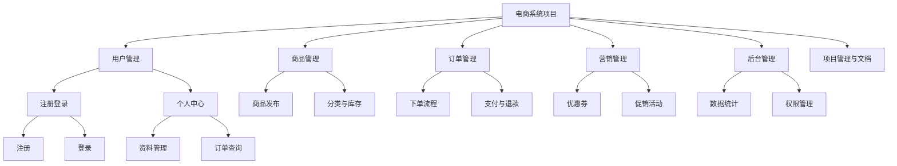
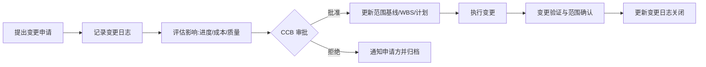

# 习题 - 第2章 范围管理与 WBS

> [!info] 本章习题定位
> 第2章聚焦软件项目范围管理，习题覆盖需求收集方法、范围说明书内容、WBS 分解原则（含 100% 规则）、工作包特征、范围确认流程、范围蔓延与镀金辨析。设计题要求绘制 WBS，综合题结合变更场景考查范围控制能力，为后续估算（[[知识点/第3章 软件规模工作量与成本估算/MOC - 第3章]]）与进度规划（[[知识点/第4章 进度规划甘特图关键路径PERT/MOC - 第4章]]）提供分解基础。

## 知识点覆盖表

| 题号 | 题型 | 考查知识点 | 对应笔记 |
| --- | --- | --- | --- |
| 2.1 | 单选 | 项目范围定义 | [[2.1 需求收集与范围定义]] |
| 2.2 | 单选 | 需求收集方法 | [[2.1 需求收集与范围定义]] |
| 2.3 | 单选 | 范围说明书内容 | [[2.1 需求收集与范围定义]] |
| 2.4 | 单选 | WBS 定义 | [[2.2 WBS工作分解结构创建]] |
| 2.5 | 单选 | 100% 规则 | [[2.2 WBS工作分解结构创建]] |
| 2.6 | 单选 | 工作包特征 | [[2.2 WBS工作分解结构创建]] |
| 2.7 | 单选 | 范围确认 | [[2.3 范围确认与范围控制]] |
| 2.8 | 单选 | 范围蔓延 | [[2.3 范围确认与范围控制]] |
| 2.9 | 单选 | 镀金 | [[2.3 范围确认与范围控制]] |
| 2.10 | 单选 | WBS 分解层级 | [[2.2 WBS工作分解结构创建]] |
| 2.11 | 多选 | 需求收集方法 | [[2.1 需求收集与范围定义]] |
| 2.12 | 多选 | 范围说明书内容 | [[2.1 需求收集与范围定义]] |
| 2.13 | 多选 | WBS 分解原则 | [[2.2 WBS工作分解结构创建]] |
| 2.14 | 多选 | 工作包特征 | [[2.2 WBS工作分解结构创建]] |
| 2.15 | 多选 | 范围控制措施 | [[2.3 范围确认与范围控制]] |
| 2.16 | 判断 | 100% 规则 | [[2.2 WBS工作分解结构创建]] |
| 2.17 | 判断 | 范围确认 | [[2.3 范围确认与范围控制]] |
| 2.18 | 判断 | 范围蔓延 | [[2.3 范围确认与范围控制]] |
| 2.19 | 判断 | 镀金 | [[2.3 范围确认与范围控制]] |
| 2.20 | 判断 | WBS 与进度关系 | [[2.2 WBS工作分解结构创建]] |
| 2.21 | 简答 | WBS 分解原则与步骤 | [[2.2 WBS工作分解结构创建]] |
| 2.22 | 简答 | 范围确认与质量控制区别 | [[2.3 范围确认与范围控制]] |
| 2.23 | 简答 | 范围蔓延与镀金 | [[2.3 范围确认与范围控制]] |
| 2.24 | 简答 | 需求收集方法对比 | [[2.1 需求收集与范围定义]] |
| 2.25 | 分析 | WBS 绘制与 100% 规则验证 | [[2.2 WBS工作分解结构创建]] |
| 2.26 | 分析 | 工作包分解粒度判断 | [[2.2 WBS工作分解结构创建]] |
| 2.27 | 分析 | 范围蔓延案例分析 | [[2.3 范围确认与范围控制]] |
| 2.28 | 分析 | 范围说明书编制 | [[2.1 需求收集与范围定义]] |
| 2.29 | 综合 | 电商系统 WBS 设计 | [[2.2 WBS工作分解结构创建]] |
| 2.30 | 综合 | 范围管理综合案例 | [[2.3 范围确认与范围控制]] |

## 一、单选题（每题 2 分，共 10 题）

**2.1** 项目范围（Scope）是指？

A. 项目所需花费的总成本  
B. 为交付具有特定特征和功能的产品所必须完成的工作总和  
C. 项目从启动到收尾的总工期  
D. 项目团队的所有人员配置

**2.2** 下列哪种需求收集方法通过少量专家匿名多轮征求意见，最终收敛达成共识？

A. 访谈  
B. 头脑风暴  
C. 德尔菲法  
D. 原型法

**2.3** 项目范围说明书（Scope Statement）通常不包括？

A. 项目目标与产品范围描述  
B. 项目可交付成果  
C. 项目验收标准与排除项  
D. 详细源代码清单

**2.4** WBS（Work Breakdown Structure）是？

A. 项目进度网络图  
B. 把项目可交付成果自顶向下逐层分解为工作包的层次结构  
C. 项目组织结构图  
D. 项目风险登记册

**2.5** WBS 分解的"100% 规则"含义是？

A. 100% 的资源必须全职投入  
B. WBS 每一层各子项之和必须 100% 覆盖其父项工作，既不遗漏也不重叠  
C. 项目必须 100% 按计划完成  
D. 100% 的团队成员必须参与分解

**2.6** 关于工作包（Work Package），下列说法正确的是？

A. 工作包是 WBS 顶层节点  
B. 工作包是 WBS 最底层可估算、可调度、可分配的工作单元  
C. 工作包不需要估算工期  
D. 工作包可以包含多个父节点

**2.7** 范围确认（Scope Validation）是指？

A. 由项目团队内部核对范围是否完成  
B. 由客户正式验收项目可交付成果的过程  
C. 由 QA 部门进行质量测试  
D. 由项目经理签字批准范围说明书

**2.8** "范围蔓延"（Scope Creep）是指？

A. 项目进度不断延长  
B. 未经正式变更控制而擅自扩大项目范围的现象  
C. 项目成本不断超支  
D. 团队成员不断增加

**2.9** 开发人员在交付需求外自行增加"贴心小功能"，这种行为称为？

A. 范围蔓延  
B. 镀金（Gold Plating）  
C. 范围确认  
D. 渐进明细

**2.10** WBS 分解的合理层级通常为？

A. 1-2 层  
B. 3-6 层，避免过深导致管理成本上升  
C. 10 层以上越细越好  
D. 层级不影响管理效果

## 二、多选题（每题 3 分，共 5 题）

**2.11** 常见的需求收集方法包括？（多选）

A. 访谈  
B. 头脑风暴  
C. 德尔菲法  
D. 原型法  
E. 观察与文档审查

**2.12** 项目范围说明书通常包含以下哪些内容？（多选）

A. 项目目标与产品范围描述  
B. 可交付成果与验收标准  
C. 项目排除项（Out of Scope）  
D. 约束条件与假设条件  
E. 详细技术架构设计

**2.13** WBS 分解应遵循的原则包括？（多选）

A. 100% 规则（每层子项之和覆盖父项）  
B. 同层子项相互独立不重叠  
C. 工作包可估算、可调度、可分配  
D. 分解越细越好，层数不限  
E. 由项目团队共同分解，非 PM 一人决定

**2.14** 合格的工作包应具备的特征包括？（多选）

A. 可估算工期与成本  
B. 可分配给单一负责人或团队  
C. 可独立交付或验证  
D. 工期通常在 4-8 周以内（经验法则）  
E. 包含多个不相关子任务

**2.15** 控制范围蔓延的有效措施包括？（多选）

A. 建立正式变更控制流程（CCB 审批）  
B. 明确范围说明书与排除项  
C. 需求变更需评估对进度、成本、质量的影响  
D. 所有变更一律拒绝不接受  
E. 定期与客户进行范围确认与评审

## 三、判断题（每题 2 分，共 5 题）

**2.16** WBS 的 100% 规则要求每一层各子项的工作之和必须等于父项工作，既不能遗漏也不能重叠。

**2.17** 范围确认与质量控制是同一过程，都由 QA 部门完成。

**2.18** 范围蔓延通常指客户或干系人通过正式变更控制流程追加范围。

**2.19** 镀金是开发人员未经批准擅自增加功能，虽出于好意但违反范围管理原则，应予避免。

**2.20** WBS 反映任务间的依赖关系，可直接用于绘制项目网络图。

## 四、简答题（每题 6 分，共 4 题）

**2.21** 说明 WBS 分解的原则与基本步骤。

**2.22** 比较范围确认与质量控制的区别。

**2.23** 解释范围蔓延与镀金的含义、成因与防范措施。

**2.24** 简述访谈、头脑风暴、德尔菲法、原型法四种需求收集方法的适用场景与优缺点。

## 五、分析题（每题 8 分，共 4 题）

**2.25** 某项目 WBS 第一层为"系统开发"，第二层分为"需求分析、设计、编码、测试、部署"五项。请：
1. 评估该分解是否满足 100% 规则（假设项目仅含开发工作）。
2. 指出该分解可能存在的问题。
3. 给出改进建议。

**2.26** 某项目经理将"用户登录模块"分解为：①前端页面 2 人天；②后端接口 3 人天；③数据库表 1 人天；④编写文档 5 人天；⑤跨系统的支付对接 20 人天。请分析该分解是否合理，并说明理由。

**2.27** 某项目原计划交付 5 个功能模块，工期 4 个月。执行过程中：客户口头要求增加 2 个模块；开发人员自行添加了"消息推送"功能；项目经理为讨好客户全部接受，未走变更流程。最终工期延长至 7 个月，成本超支 30%。请分析：
1. 哪些行为属于范围蔓延？哪些属于镀金？
2. 项目经理的做法有哪些错误？
3. 应如何改进？

**2.28** 某在线教育平台项目，需要为 K12 学生提供直播、录播、题库、作业、家长端等功能。请编写一份简要的项目范围说明书，至少包含：项目目标、产品范围描述、主要可交付成果、验收标准、排除项。

## 六、综合题/案例题（每题 10 分，共 2 题）

**2.29** 某电商系统项目，主要功能包括：用户管理（注册、登录、个人中心）、商品管理（商品发布、分类、库存）、订单管理（下单、支付、退款）、营销管理（优惠券、促销活动）、后台管理（数据统计、权限管理）。请完成：
1. 用 Mermaid 绘制该项目的 WBS（至少分解到工作包层，3-4 层）。
2. 验证 100% 规则是否满足。
3. 说明工作包的粒度判断依据。
4. 指出哪些工作包适合并行执行。

**2.30** 某政务系统项目在验收阶段出现严重范围争议：客户认为"数据导出 Excel"功能应包含在原合同范围内，而项目团队认为该功能未在需求文档中明确列出。同时项目执行期间，客户业务部门多次口头要求增加新报表，项目经理为维护关系均予接受，导致工期延长 2 个月、成本超支 25%。请回答：
1. 从范围管理角度分析争议的根源。
2. 客户口头要求增加报表属于什么现象？项目经理处理是否恰当？
3. 给出范围确认与范围控制的改进方案，说明涉及的产物与流程。
4. 用 Mermaid 绘制变更控制流程图。

---

## 答案与解析

### 单选题答案

点击展开单选题答案与解析

**2.1 答案：B**
解析：项目范围是为交付具有特定特征和功能的产品所必须完成的工作总和。成本、工期、人员是其他约束，不属于范围。

**2.2 答案：C**
解析：德尔菲法通过少量专家匿名多轮征求意见，避免权威压制，最终收敛达成共识。访谈一对一；头脑风暴公开自由发言；原型法用原型收集反馈。

**2.3 答案：D**
解析：范围说明书包含项目目标、产品范围描述、可交付成果、验收标准、排除项、约束与假设。详细源代码清单属于实现阶段产物，不属于范围说明书。

**2.4 答案：B**
解析：WBS 是把项目可交付成果自顶向下逐层分解为工作包的层次结构，是范围管理核心产物。

**2.5 答案：B**
解析：100% 规则指 WBS 每一层各子项之和必须 100% 覆盖父项工作，既不遗漏也不重叠，是 WBS 分解的核心原则。

**2.6 答案：B**
解析：工作包是 WBS 最底层可估算、可调度、可分配的工作单元，每个工作包有唯一负责人，可估算工期与成本。

**2.7 答案：B**
解析：范围确认是由客户正式验收可交付成果的过程，强调"客户接受"。质量控制是 QA 内部检查，与范围确认不同。

**2.8 答案：B**
解析：范围蔓延指未经正式变更控制而擅自扩大项目范围，通常由客户不断提出新需求且未走变更流程导致。

**2.9 答案：B**
解析：镀金是开发人员未经批准擅自增加功能（"贴心小功能"），虽出于好意但违反范围管理原则。范围蔓延通常由客户引起，镀金由团队内部引起。

**2.10 答案：B**
解析：WBS 分解通常 3-6 层为宜，过深会导致管理成本上升，过浅则工作包粒度过大无法估算与调度。

### 多选题答案

点击展开多选题答案与解析

**2.11 答案：A、B、C、D、E**
解析：需求收集方法包括访谈、头脑风暴、德尔菲法、原型法、观察、文档审查等，五项均属于。

**2.12 答案：A、B、C、D**
解析：范围说明书包含项目目标、产品范围描述、可交付成果、验收标准、排除项、约束与假设。E（详细技术架构设计）属于设计阶段产物，不属于范围说明书。

**2.13 答案：A、B、C、E**
解析：WBS 原则包括 100% 规则、同层互斥、工作包可估算可调度可分配、团队共同分解。D 错误，分解并非越细越好，层数应合理（3-6 层）。

**2.14 答案：A、B、C、D**
解析：工作包应可估算、可分配、可独立验证，工期通常 4-8 周以内。E 错误，工作包应聚焦单一相关工作，不应包含多个不相关子任务。

**2.15 答案：A、B、C、E**
解析：控制范围蔓延需建立变更控制流程、明确范围与排除项、评估变更影响、定期范围确认。D 错误，一律拒绝变更不合理，应通过 CCB 评估后决策。

### 判断题答案

点击展开判断题答案与解析

**2.16 答案：正确**
解析：100% 规则要求每层子项之和等于父项工作，不遗漏不重叠，是 WBS 分解的核心原则。

**2.17 答案：错误**
解析：范围确认是客户正式验收可交付成果（关注"是否做了该做的事"）；质量控制是 QA 内部检查是否符合质量标准（关注"做得是否正确"）。二者主体、对象、目的均不同。

**2.18 答案：错误**
解析：范围蔓延是"未经正式变更控制"擅自扩大范围。通过正式变更控制流程追加范围属于合法变更，不是范围蔓延。

**2.19 答案：正确**
解析：镀金是开发人员未经批准擅自增加功能，违反范围管理原则，虽出于好意但可能引入风险与浪费，应避免。

**2.20 答案：错误**
解析：WBS 不直接反映任务间依赖关系，只反映工作分解层次。依赖关系在网络图（CPM/PERT）中表示。

### 简答题答案

点击展开简答题参考答案

**2.21 参考答案**
WBS 分解原则：
1. 100% 规则：每层子项之和覆盖父项，不遗漏不重叠；
2. 同层互斥：同层子项相互独立；
3. 工作包可估算、可调度、可分配；
4. 面向可交付成果分解；
5. 团队共同参与分解。

分解步骤：
1. 识别项目主要可交付成果与项目阶段；
2. 自顶向下逐层分解，第二层通常按可交付成果或生命周期阶段划分；
3. 继续分解至工作包层（可估算、可调度、可分配）；
4. 验证 100% 规则与互斥性；
5. 为每个工作包分配唯一编码与负责人。

**2.22 参考答案**
| 维度 | 范围确认 | 质量控制 |
| --- | --- | --- |
| 主体 | 客户/发起人正式验收 | 项目团队/QA 内部检查 |
| 对象 | 可交付成果是否被接受 | 可交付成果是否符合质量标准 |
| 目的 | 确认"做了该做的事" | 确认"做得正确" |
| 时机 | 阶段末或交付时 | 全过程持续进行 |
| 产物 | 验收单、正式接受文件 | 缺陷报告、测试报告 |

**2.23 参考答案**
范围蔓延：未经正式变更控制而擅自扩大项目范围，通常由客户不断提出新需求且未走变更流程导致。
镀金：开发人员未经批准擅自增加功能，由团队内部"好意"驱动。
防范措施：
1. 建立正式变更控制流程，所有范围变更经 CCB 评估审批；
2. 明确范围说明书与排除项，签订需求基线；
3. 评估变更对进度、成本、质量的影响；
4. 定期与客户范围确认，使用需求跟踪矩阵；
5. 加强团队培训，杜绝镀金行为。

**2.24 参考答案**
| 方法 | 适用场景 | 优点 | 缺点 |
| --- | --- | --- | --- |
| 访谈 | 干系人少、需求深度高 | 深入、灵活 | 耗时、主观 |
| 头脑风暴 | 早期探索、创新需求 | 激发创意、快 | 易跑题、需筛选 |
| 德尔菲法 | 专家分散、需收敛共识 | 避免权威压制、收敛 | 周期长、专家难求 |
| 原型法 | 需求模糊、用户难表达 | 直观、易反馈 | 原型可能误导、成本高 |

### 分析题答案

点击展开分析题参考答案

**2.25 参考答案**
1. 100% 规则评估：若项目仅含开发工作，"需求分析+设计+编码+测试+部署"五项之和覆盖了开发全流程，原则上满足 100% 规则。
2. 存在问题：
   - 按生命周期阶段分解，而非按可交付成果分解，不利于交付验收；
   - 缺少项目管理、培训、文档等非开发工作；
   - 第二层为"活动"而非"成果"，工作包难以独立交付与验收。
3. 改进建议：改为按可交付成果分解，如"用户管理模块、商品管理模块、订单管理模块、营销管理模块、文档与培训"等，每个模块再细分需求、设计、编码、测试子工作。

**2.26 参考答案**
该分解不合理：
- 工作包粒度严重不均：①②③均为 1-3 人天，过细；⑤跨系统支付对接 20 人天，过大；
- ⑤"跨系统支付对接"与"用户登录模块"主题不相关，应单独列为一个工作包或独立模块；
- 工作包过大（20 人天）应继续分解为接口设计、联调、异常处理等子工作包；
- 工作包过细（1-3 人天）应合并到上级节点，避免管理成本过高。
改进：将①②③④合并为"用户登录模块开发"（约 11 人天），将⑤独立为"支付对接"模块并进一步分解。

**2.27 参考答案**
1. 范围蔓延：客户口头要求增加 2 个模块（外部引起，未走变更流程）。镀金：开发人员自行添加"消息推送"功能（内部引起，未经批准）。
2. 项目经理错误：
   - 未走正式变更控制流程，口头接受客户需求；
   - 未评估变更对进度、成本的影响；
   - 未制止开发人员镀金行为；
   - 未维护需求基线与范围说明书。
3. 改进：
   - 建立 CCB 变更控制流程，所有变更需评估后审批；
   - 更新范围说明书与 WBS，签订需求基线；
   - 加强团队范围管理培训，杜绝镀金；
   - 定期与客户范围确认。

**2.28 参考答案**
项目范围说明书（简要）：
- 项目目标：6 个月内交付 K12 在线教育平台，支持 10000 并发直播，覆盖直播、录播、题库、作业、家长端五类核心功能。
- 产品范围描述：面向 K12 学生与家长的在线学习平台，提供直播授课、录播回看、智能题库、作业管理与家长监督功能。
- 主要可交付成果：直播子系统、录播子系统、题库子系统、作业子系统、家长端 App、管理后台、用户文档与培训。
- 验收标准：五类核心功能通过 UAT 测试；直播支持 10000 并发；系统可用性 ≥ 99.5%；通过安全审计。
- 排除项：不含内容制作（课件由教师自备）、不含硬件采购、不含第三方支付系统对接（一期）。

### 综合题答案

点击展开综合题参考答案

**2.29 参考答案**
1. WBS（Mermaid）：

2. 100% 规则验证：第二层"用户管理+商品管理+订单管理+营销管理+后台管理+项目管理与文档"覆盖电商系统全部范围，且互不重叠，满足 100% 规则。第三层各模块继续满足（如用户管理=注册登录+个人中心）。
3. 工作包粒度判断依据：每个工作包可估算工期（通常 4-8 周以内）、可分配单一负责人、可独立验收、与其他工作包互斥。
4. 可并行执行的工作包：用户管理、商品管理、营销管理、后台管理之间无强依赖，可并行开发；订单管理依赖用户与商品，需在其后启动。注册与登录可在前端与后端并行。

**2.30 参考答案**
1. 争议根源：范围说明书与需求文档未明确"数据导出 Excel"是否在范围内，验收标准不清晰，缺乏明确排除项与可交付成果清单。范围基线不完整导致双方各执一词。
2. 客户口头要求增加报表属于范围蔓延（未经正式变更控制擅自扩大范围）。项目经理处理不恰当：为维护关系全部接受、未走变更流程、未评估影响、未更新基线，导致工期延长与成本超支。
3. 改进方案：
   - 产物：完善项目范围说明书（明确可交付成果、验收标准、排除项）、需求基线、需求跟踪矩阵、变更日志；
   - 流程：建立 CCB 变更控制流程，所有范围变更需提交变更申请 → 评估影响（进度/成本/质量）→ CCB 审批 → 更新基线与文档 → 通知干系人；
   - 范围确认：每个阶段末与客户正式验收，签署验收单。
4. 变更控制流程图（Mermaid）：

## 考点统计表

| 考查维度 | 题量 | 分值占比 | 难度 |
| --- | --- | --- | --- |
| 需求收集方法 | 5 | 约 17% | 中 |
| 范围说明书 | 4 | 约 13% | 中 |
| WBS 分解原则与 100% 规则 | 8 | 约 27% | 中高 |
| 工作包特征 | 4 | 约 13% | 中 |
| 范围确认 | 3 | 约 10% | 中 |
| 范围蔓延与镀金 | 6 | 约 20% | 中高 |
| **合计** | **30** | **100%** | — |

## 关联

- 上一级：[[MOC - 软件项目管理]]
- 本章知识点：[[MOC - 第2章]]
- 上一章习题：[[习题-第1章-软件项目管理概论]]
- 下一章习题：[[习题-第3章-成本规模估算]]
