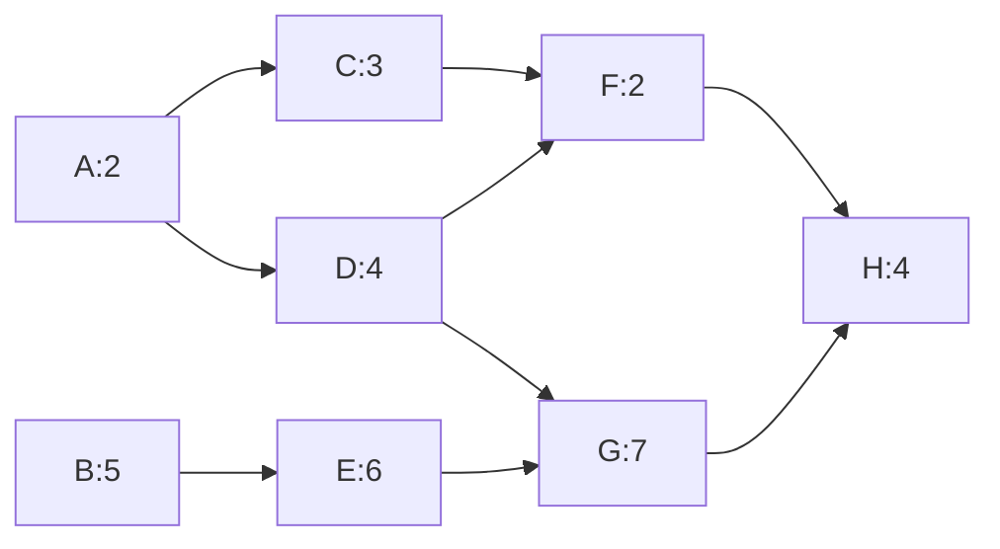
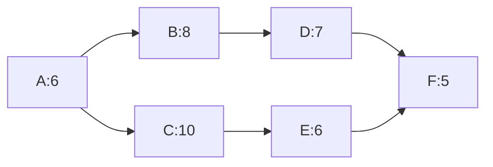

# 习题 - 第4章 进度计划 CPM 与 PERT

> [!info] 本章习题定位
> 第4章是计算题核心章，习题覆盖活动排序（FS/FF/SS/SF 四种依赖关系）、关键路径法（CPM）的 ES/EF/LS/LF/TF 计算、甘特图绘制、PERT 三点估算、进度压缩（赶工与快速跟进）。计算题要求完整 CPM 网络图计算（正推逆推、关键路径识别），并用 Mermaid 绘制网络图，为后续挣值分析（[[知识点/第8章 项目跟踪挣值分析与控制/MOC - 第8章]]）的 PV 基准提供进度依据。

## 知识点覆盖表

| 题号 | 题型 | 考查知识点 | 对应笔记 |
| --- | --- | --- | --- |
| 4.1 | 单选 | 活动排序 FS 依赖 | [[4.1 活动定义与活动排序]] |
| 4.2 | 单选 | 四种依赖关系 | [[4.1 活动定义与活动排序]] |
| 4.3 | 单选 | 关键路径定义 | [[4.2 关键路径法（CPM）与甘特图]] |
| 4.4 | 单选 | 总时差与自由时差 | [[4.2 关键路径法（CPM）与甘特图]] |
| 4.5 | 单选 | 甘特图特点 | [[4.2 关键路径法（CPM）与甘特图]] |
| 4.6 | 单选 | PERT 与 CPM 区别 | [[4.3 PERT技术与进度压缩]] |
| 4.7 | 单选 | 赶工与快速跟进 | [[4.3 PERT技术与进度压缩]] |
| 4.8 | 单选 | ES/EF 计算规则 | [[4.2 关键路径法（CPM）与甘特图]] |
| 4.9 | 单选 | LS/LF 计算规则 | [[4.2 关键路径法（CPM）与甘特图]] |
| 4.10 | 单选 | 网络图类型 | [[4.2 关键路径法（CPM）与甘特图]] |
| 4.11 | 多选 | 四种依赖关系 | [[4.1 活动定义与活动排序]] |
| 4.12 | 多选 | CPM 关键路径特征 | [[4.2 关键路径法（CPM）与甘特图]] |
| 4.13 | 多选 | 进度压缩方法 | [[4.3 PERT技术与进度压缩]] |
| 4.14 | 多选 | PERT 三点估算 | [[4.3 PERT技术与进度压缩]] |
| 4.15 | 多选 | 甘特图要素 | [[4.2 关键路径法（CPM）与甘特图]] |
| 4.16 | 判断 | 关键路径唯一性 | [[4.2 关键路径法（CPM）与甘特图]] |
| 4.17 | 判断 | 总时差与工期 | [[4.2 关键路径法（CPM）与甘特图]] |
| 4.18 | 判断 | PERT 概率性 | [[4.3 PERT技术与进度压缩]] |
| 4.19 | 判断 | 快速跟进风险 | [[4.3 PERT技术与进度压缩]] |
| 4.20 | 判断 | 甘特图与依赖 | [[4.2 关键路径法（CPM）与甘特图]] |
| 4.21 | 简答 | CPM 计算步骤 | [[4.2 关键路径法（CPM）与甘特图]] |
| 4.22 | 简答 | 赶工与快速跟进对比 | [[4.3 PERT技术与进度压缩]] |
| 4.23 | 简答 | PERT 与 CPM 区别 | [[4.3 PERT技术与进度压缩]] |
| 4.24 | 简答 | 甘特图作用与局限 | [[4.2 关键路径法（CPM）与甘特图]] |
| 4.25 | 计算 | CPM 完整计算 | [[4.2 关键路径法（CPM）与甘特图]] |
| 4.26 | 计算 | CPM 网络图与关键路径 | [[4.2 关键路径法（CPM）与甘特图]] |
| 4.27 | 计算 | PERT 三点估算 | [[4.3 PERT技术与进度压缩]] |
| 4.28 | 计算 | 赶工成本分析 | [[4.3 PERT技术与进度压缩]] |
| 4.29 | 综合 | CPM 与进度压缩综合 | [[4.3 PERT技术与进度压缩]] |
| 4.30 | 综合 | 进度规划综合案例 | [[4.2 关键路径法（CPM）与甘特图]] |

## 一、单选题（每题 2 分，共 10 题）

**4.1** 完成-开始（Finish-to-Start, FS）依赖关系是指？

A. 前序活动开始后，后序活动才能开始  
B. 前序活动完成后，后序活动才能开始  
C. 前序活动完成后，后序活动才能完成  
D. 前序活动开始后，后序活动才能完成

**4.2** 软件项目中"代码评审完成后才能开始测试"，这种依赖属于？

A. FS（完成-开始）  
B. SS（开始-开始）  
C. FF（完成-完成）  
D. SF（开始-完成）

**4.3** 关键路径（Critical Path）是指项目网络图中？

A. 最短的路径  
B. 耗时最长的路径，决定项目最短工期  
C. 资源最多的路径  
D. 风险最高的路径

**4.4** 关于总时差（Total Float, TF），下列说法正确的是？

A. 总时差 = ES - LS  
B. 总时差 = LF - EF 或 LS - ES  
C. 关键活动总时差最大  
D. 总时差为负表示进度提前

**4.5** 甘特图（Gantt Chart）的主要特点不包括？

A. 以横道形式直观展示任务时间安排  
B. 能清晰反映任务间依赖关系与关键路径  
C. 便于进度跟踪与沟通  
D. 适合高层汇报与里程碑展示

**4.6** PERT 与 CPM 的主要区别是？

A. PERT 用箭线图，CPM 用节点图  
B. PERT 是概率型估算（三点），CPM 是确定型估算（单点）  
C. PERT 关注成本，CPM 关注进度  
D. PERT 适用于小项目，CPM 适用于大项目

**4.7** 进度压缩中"赶工"（Crashing）是指？

A. 调整活动顺序，原本串行的改为并行  
B. 通过增加资源（加班/加人）缩短关键活动工期  
C. 删除部分非关键活动  
D. 等待问题自行解决

**4.8** 正向计算时，某活动有多个紧前活动，其最早开始 ES 等于？

A. 各紧前活动 EF 的平均值  
B. 各紧前活动 EF 的最大值  
C. 各紧前活动 EF 的最小值  
D. 各紧前活动 ES 之和

**4.9** 逆向计算时，某活动有多个紧后活动，其最晚结束 LF 等于？

A. 各紧后活动 LS 的最大值  
B. 各紧后活动 LS 的最小值  
C. 各紧后活动 LF 的平均值  
D. 各紧后活动 LF 之和

**4.10** 双代号网络图（AOA）中，虚活动（Dummy Activity）的作用是？

A. 表示实际工作  
B. 消除逻辑关系歧义，不消耗时间与资源  
C. 增加工期  
D. 标注关键路径

## 二、多选题（每题 3 分，共 5 题）

**4.11** 活动排序的四种依赖关系包括？（多选）

A. FS（完成-开始）  
B. SS（开始-开始）  
C. FF（完成-完成）  
D. SF（开始-完成）  
E. PP（并行-并行）

**4.12** 关于关键路径的特征，下列说法正确的有？（多选）

A. 关键路径上所有活动总时差为 0  
B. 关键路径决定项目最短工期  
C. 关键路径可能不止一条  
D. 关键活动延迟必然导致项目工期延长  
E. 关键路径上的活动资源最多

**4.13** 进度压缩的主要方法包括？（多选）

A. 赶工（Crashing）：增加资源缩短工期  
B. 快速跟进（Fast Tracking）：并行原串行活动  
C. 缩小范围  
D. 提高生产率（改进工具/方法）  
E. 删除关键活动

**4.14** PERT 三点估算涉及的三个估计值是？（多选）

A. 乐观工期 O（Optimistic）  
B. 最可能工期 M（Most Likely）  
C. 悲观工期 P（Pessimistic）  
D. 平均工期 A（Average）  
E. 标准工期 S（Standard）

**4.15** 甘特图通常包含的要素有？（多选）

A. 任务名称  
B. 时间轴（横轴）  
C. 任务横道（持续时长）  
D. 里程碑标记  
E. 任务间依赖关系箭线

## 三、判断题（每题 2 分，共 5 题）

**4.16** 一个项目只能有一条关键路径。

**4.17** 关键路径上活动的总时差为 0，任何关键活动延迟都会导致项目工期延长。

**4.18** PERT 是概率型估算方法，假设活动工期服从 β分布，期望工期 $E = (O+4M+P)/6$。

**4.19** 快速跟进通过并行原本串行的活动缩短工期，通常不增加成本，但会增加返工风险。

**4.20** 甘特图能清晰展示关键路径与复杂的依赖关系，是进度管理的核心工具。

## 四、简答题（每题 6 分，共 4 题）

**4.21** 说明关键路径法（CPM）的计算步骤及关键路径的意义。

**4.22** 比较赶工（Crashing）与快速跟进（Fast Tracking）两种进度压缩方法。

**4.23** 比较 PERT 与 CPM 的区别与联系。

**4.24** 说明甘特图的作用与局限性。

## 五、计算题（每题 8 分，共 4 题）

**4.25** 某项目活动及依赖关系如下，请计算各活动的 ES、EF、LS、LF、总时差 TF，找出关键路径并计算项目工期。

| 活动 | 紧前活动 | 工期（天） |
| --- | --- | --- |
| A | — | 3 |
| B | A | 4 |
| C | A | 5 |
| D | B | 2 |
| E | C | 3 |
| F | D, E | 2 |
| G | F | 1 |

**4.26** 某项目活动及依赖关系如下，请：
1. 用 Mermaid 绘制项目网络图。
2. 正向计算 ES/EF，逆向计算 LS/LF，找出关键路径与项目工期。
3. 计算各活动总时差。

| 活动 | 紧前活动 | 工期（天） |
| --- | --- | --- |
| A | — | 2 |
| B | — | 5 |
| C | A | 3 |
| D | A | 4 |
| E | B | 6 |
| F | C, D | 2 |
| G | D, E | 7 |
| H | F, G | 4 |

**4.27** 某活动 PERT 三点估算：乐观 O = 4 天，最可能 M = 6 天，悲观 P = 14 天。请计算：
1. 期望工期 E。
2. 标准差 σ 与方差 Var。
3. 项目工期落在 [E-σ, E+σ] 区间的概率（假设服从正态分布）。
4. 若要求 95% 概率按时完成，应承诺工期为多少（取 2σ）？

**4.28** 某项目关键活动赶工数据如下，请计算各活动的赶工成本斜率（元/天），并确定最优赶工顺序。

| 活动 | 正常工期(天) | 正常成本(元) | 赶工工期(天) | 赶工成本(元) |
| --- | --- | --- | --- | --- |
| A | 10 | 5000 | 7 | 8000 |
| B | 8 | 4000 | 6 | 6000 |
| C | 12 | 6000 | 9 | 9600 |

## 六、综合题/案例题（每题 10 分，共 2 题）

**4.29** 某软件项目活动及依赖关系如下：

| 活动 | 紧前活动 | 工期(天) | 可压缩天数 | 赶工成本(元/天) |
| --- | --- | --- | --- | --- |
| A | — | 6 | 2 | 400 |
| B | A | 8 | 3 | 300 |
| C | A | 10 | 2 | 500 |
| D | B | 7 | 2 | 200 |
| E | C | 6 | 1 | 600 |
| F | D, E | 5 | 1 | 800 |

请完成：
1. 用 Mermaid 绘制项目网络图。
2. 计算 ES/EF/LS/LF/TF，找出关键路径与项目工期。
3. 若客户要求压缩 3 天工期，给出成本最低的赶工方案（说明压缩哪些活动各几天，总增加成本多少）。
4. 若改用快速跟进，可能带来什么风险？

**4.30** 某项目有 8 个活动，工期与依赖如下：A(2)→C、A(2)→D；B(5)→E；C(3)→F；D(4)→F、D(4)→G；E(6)→G；F(2)→H；G(7)→H；H(4) 结束。请回答：
1. 用 Mermaid 绘制网络图。
2. 完成完整 CPM 计算（ES/EF/LS/LF/TF）。
3. 找出关键路径与项目工期。
4. 若活动 E 工期从 6 天延长到 9 天，关键路径与工期如何变化？
5. 若活动 D 工期从 4 天缩短到 2 天，关键路径与工期如何变化？

---

## 答案与解析

### 单选题答案

点击展开单选题答案与解析

**4.1 答案：B**
解析：FS（完成-开始）指前序活动完成后，后序活动才能开始，是最常见的依赖关系。

**4.2 答案：A**
解析："评审完成后才能开始测试"是 FS 关系（评审完成 → 测试开始）。

**4.3 答案：B**
解析：关键路径是耗时最长的路径，决定项目最短工期。

**4.4 答案：B**
解析：总时差 TF = LF - EF = LS - ES。关键活动 TF=0。

**4.5 答案：B**
解析：甘特图不擅长展示关键路径与复杂依赖，这是网络图（CPM/PERT）的强项。

**4.6 答案：B**
解析：PERT 用三点估算（概率型），CPM 用单点估算（确定型）。这是二者最本质区别。

**4.7 答案：B**
解析：赶工通过增加资源（加班/加人）缩短关键活动工期，通常增加成本。A 是快速跟进。

**4.8 答案：B**
解析：正向计算 ES = max(各紧前活动 EF)。

**4.9 答案：B**
解析：逆向计算 LF = min(各紧后活动 LS)。

**4.10 答案：B**
解析：虚活动仅表示逻辑关系，不消耗时间与资源，用于消除 AOA 图中的歧义。

### 多选题答案

点击展开多选题答案与解析

**4.11 答案：A、B、C、D**
解析：四种依赖关系为 FS、SS、FF、SF。PP 不属于标准依赖类型。

**4.12 答案：A、B、C、D**
解析：关键路径特征：总时差为 0、决定最短工期、可能多条、关键活动延迟延长工期。E 错误，关键路径与资源多少无关。

**4.13 答案：A、B、C、D**
解析：进度压缩方法包括赶工、快速跟进、缩小范围、提高生产率。E 错误，删除关键活动会破坏项目完整性。

**4.14 答案：A、B、C**
解析：PERT 三点为乐观 O、最可能 M、悲观 P。平均与标准是计算结果，非输入。

**4.15 答案：A、B、C、D、E**
解析：甘特图包含任务名、时间轴、横道、里程碑、依赖箭线等要素，五项均可呈现（依赖箭线在增强甘特图中展示）。

### 判断题答案

点击展开判断题答案与解析

**4.16 答案：错误**
解析：项目可能有多条关键路径（多条路径工期相同且最长），多条关键路径增加管理难度。

**4.17 答案：正确**
解析：关键活动总时差为 0，任何延迟都直接导致项目工期延长。

**4.18 答案：正确**
解析：PERT 假设工期服从 β分布，期望 $E = (O+4M+P)/6$，标准差 $\sigma = (P-O)/6$。

**4.19 答案：正确**
解析：快速跟进并行原串行活动，通常不增加直接成本，但增加返工与协调风险。

**4.20 答案：错误**
解析：甘特图不擅长展示关键路径与复杂依赖，这是网络图（CPM/PERT）的强项。甘特图优势是时间可视化。

### 简答题答案

点击展开简答题参考答案

**4.21 参考答案**
CPM 计算步骤：
1. 识别活动与依赖关系，绘制网络图；
2. 正向计算 ES/EF：ES = max(紧前 EF)，EF = ES + 工期；
3. 逆向计算 LS/LF：LF = min(紧后 LS)，LS = LF - 工期；
4. 计算总时差 TF = LF - EF = LS - ES；
5. TF = 0 的活动构成关键路径。
意义：关键路径决定项目最短工期，是进度管理重点；关键活动延迟必然延长工期，非关键活动有时差可调度。

**4.22 参考答案**
| 维度 | 赶工 Crashing | 快速跟进 Fast Tracking |
| --- | --- | --- |
| 方法 | 增加资源（加班/加人/加设备）缩短活动工期 | 调整顺序，原串行改并行 |
| 成本 | 通常增加直接成本 | 通常不增加直接成本 |
| 风险 | 成本上升、质量风险、人员疲劳 | 返工风险、协调成本、依赖冲突 |
| 适用 | 关键活动可压缩且有资源 | 活动间依赖可解耦 |

**4.23 参考答案**
| 维度 | PERT | CPM |
| --- | --- | --- |
| 估算类型 | 概率型（三点 O/M/P） | 确定型（单点） |
| 假设分布 | β分布，期望 $(O+4M+P)/6$ | 确定值 |
| 适用 | 研发/新领域，不确定性高 | 经验丰富，工期可估 |
| 关注 | 工期概率与区间 | 工期与成本权衡 |
| 联系 | 都用于进度规划与关键路径识别 | 同左 |

**4.24 参考答案**
作用：直观展示任务时间安排、持续时长、并行关系与里程碑，便于进度跟踪与高层汇报。
局限：①不擅长展示复杂依赖与关键路径；②难以反映资源约束与冲突；③对动态变化更新成本高；④细节多时图面拥挤。需与网络图配合使用。

### 计算题答案

点击展开计算题参考答案与完整步骤

**4.25 参考答案**
正向计算（ES/EF）：
| 活动 | ES | EF |
| --- | --- | --- |
| A | 0 | 3 |
| B | 3 | 7 |
| C | 3 | 8 |
| D | 7 | 9 |
| E | 8 | 11 |
| F | max(9,11)=11 | 13 |
| G | 13 | 14 |

项目工期 = 14 天。

逆向计算（LS/LF）：
| 活动 | LF | LS |
| --- | --- | --- |
| G | 14 | 13 |
| F | 13 | 11 |
| D | 11 | 9 |
| E | 11 | 8 |
| B | 9 | 5 |
| C | 8 | 3 |
| A | 3 | 0 |

总时差 TF = LS - ES：
A=0, B=2, C=0, D=2, E=0, F=0, G=0。
关键路径（TF=0）：A → C → E → F → G，工期 = 3+5+3+2+1 = 14 天。

**4.26 参考答案**
1. 网络图（Mermaid）：

2. 正向 ES/EF：
| 活动 | ES | EF |
| --- | --- | --- |
| A | 0 | 2 |
| B | 0 | 5 |
| C | 2 | 5 |
| D | 2 | 6 |
| E | 5 | 11 |
| F | max(5,6)=6 | 8 |
| G | max(6,11)=11 | 18 |
| H | max(8,18)=18 | 22 |

项目工期 = 22 天。

逆向 LS/LF：
| 活动 | LF | LS |
| --- | --- | --- |
| H | 22 | 18 |
| F | 18 | 16 |
| G | 18 | 11 |
| C | 16 | 13 |
| D | min(16,11)=11 | 7 |
| E | 11 | 5 |
| A | min(13,7)=7 | 5 |
| B | 5 | 0 |

3. 总时差 TF = LS - ES：
A=5, B=0, C=11, D=5, E=0, F=10, G=0, H=0。
关键路径：B → E → G → H，工期 = 5+6+7+4 = 22 天。

**4.27 参考答案**
1. 期望工期：
$$E = \frac{O + 4M + P}{6} = \frac{4 + 4 \times 6 + 14}{6} = \frac{4 + 24 + 14}{6} = \frac{42}{6} = 7 \text{ 天}$$

2. 标准差与方差：
$$\sigma = \frac{P - O}{6} = \frac{14 - 4}{6} = \frac{10}{6} \approx 1.67 \text{ 天}$$
$$Var = \sigma^2 \approx 2.78$$

3. [E-σ, E+σ] = [7-1.67, 7+1.67] = [5.33, 8.67] 天，概率约 68%。

4. 95% 概率按时完成（取 2σ）：承诺工期 = E + 2σ = 7 + 2 × 1.67 = 7 + 3.33 ≈ 10.33 天，取 11 天。

**4.28 参考答案**
赶工成本斜率 = (赶工成本 - 正常成本) / (正常工期 - 赶工工期)

| 活动 | 计算 | 成本斜率(元/天) |
| --- | --- | --- |
| A | (8000-5000)/(10-7) = 3000/3 | 1000 |
| B | (6000-4000)/(8-6) = 2000/2 | 1000 |
| C | (9600-6000)/(12-9) = 3600/3 | 1200 |

最优赶工顺序：按成本斜率从小到大压缩。A 与 B 斜率相同（1000 元/天）最低，C 最高（1200 元/天）。
- 优先压缩 A（可压缩 3 天）和 B（可压缩 2 天）；
- 若需进一步压缩，再压缩 C（成本最高，最后考虑）。
注：实际赶工须在关键路径上压缩才有意义，非关键活动压缩不缩短工期。

### 综合题答案

点击展开综合题参考答案

**4.29 参考答案**
1. 网络图（Mermaid）：

2. 正向 ES/EF：
| 活动 | ES | EF |
| --- | --- | --- |
| A | 0 | 6 |
| B | 6 | 14 |
| C | 6 | 16 |
| D | 14 | 21 |
| E | 16 | 22 |
| F | max(21,22)=22 | 27 |

项目工期 = 27 天。

逆向 LS/LF：
| 活动 | LF | LS |
| --- | --- | --- |
| F | 27 | 22 |
| D | 22 | 15 |
| E | 22 | 16 |
| B | 15 | 7 |
| C | 16 | 6 |
| A | 6 | 0 |

总时差：A=0, B=1, C=0, D=1, E=0, F=0。
关键路径：A → C → E → F，工期 = 6+10+6+5 = 27 天。

3. 压缩 3 天方案：
关键路径活动为 A、C、E、F，可压缩天数与成本：
| 活动 | 可压缩天数 | 赶工成本(元/天) |
| --- | --- | --- |
| A | 2 | 400 |
| C | 2 | 500 |
| E | 1 | 600 |
| F | 1 | 800 |

按成本从低到高压缩：
- 第 1 步：压缩 A 2 天，增加成本 2×400=800 元，工期减至 25 天（关键路径仍为 A→C→E→F，因 A 在关键路径上）。
- 第 2 步：再压缩 1 天。次低成本是 C（500 元/天），压缩 C 1 天，增加 500 元，工期减至 24 天。
- 总压缩 3 天，总增加成本 = 800 + 500 = 1300 元。

注意：需验证压缩后关键路径是否变化。A 压缩 2 天后，A 工期变 4 天，A→C→E→F = 4+10+6+5 = 25 天；A→B→D→F = 4+8+7+5 = 24 天，关键路径仍为 A→C→E→F。再压缩 C 1 天后，A→C→E→F = 4+9+6+5 = 24 天；A→B→D→F = 24 天，此时出现两条关键路径（都是 24 天），后续若再压缩需同时压缩两条路径。本例压缩 3 天方案成立。

4. 快速跟进风险：将原串行活动（如设计与编码、编码与测试）并行，可能引发返工（下游基于未稳定上游产物开工）、协调成本上升、依赖冲突、质量隐患。需评估活动间依赖的可解耦性。

**4.30 参考答案**
1. 网络图（Mermaid）：

2. 完整 CPM 计算：
正向 ES/EF：
| 活动 | ES | EF |
| --- | --- | --- |
| A | 0 | 2 |
| B | 0 | 5 |
| C | 2 | 5 |
| D | 2 | 6 |
| E | 5 | 11 |
| F | max(5,6)=6 | 8 |
| G | max(6,11)=11 | 18 |
| H | max(8,18)=18 | 22 |

逆向 LS/LF：
| 活动 | LF | LS |
| --- | --- | --- |
| H | 22 | 18 |
| F | 18 | 16 |
| G | 18 | 11 |
| C | 16 | 13 |
| D | min(16,11)=11 | 7 |
| E | 11 | 5 |
| A | min(13,7)=7 | 5 |
| B | 5 | 0 |

总时差 TF：A=5, B=0, C=11, D=5, E=0, F=10, G=0, H=0。

3. 关键路径：B → E → G → H，工期 = 5+6+7+4 = 22 天。

4. 若 E 从 6 天延长到 9 天：
- E: EF=5+9=14；G: ES=max(D EF=6, E EF=14)=14, EF=21；H: ES=max(F EF=8, G EF=21)=21, EF=25。
- 关键路径仍为 B → E → G → H，工期变为 5+9+7+4 = 25 天。
- 因 E 本在关键路径上，其延迟直接导致工期延长 3 天至 25 天。

5. 若 D 从 4 天缩短到 2 天：
- D: EF=2+2=4；F: ES=max(C EF=5, D EF=4)=5, EF=7；G: ES=max(D EF=4, E EF=11)=11, EF=18；H: ES=max(F EF=7, G EF=18)=18, EF=22。
- 关键路径仍为 B → E → G → H，工期仍为 22 天。
- D 不在关键路径上（原 TF=5），缩短 2 天未影响总工期，仅增加 D 的时差。这印证了"压缩非关键活动不缩短工期"的规律。

## 考点统计表

| 考查维度 | 题量 | 分值占比 | 难度 |
| --- | --- | --- | --- |
| 活动排序与依赖 | 4 | 约 13% | 中 |
| 关键路径法 CPM | 12 | 约 40% | 高 |
| 甘特图 | 4 | 约 13% | 中 |
| PERT 三点估算 | 5 | 约 17% | 中高 |
| 进度压缩 | 5 | 约 17% | 中高 |
| **合计** | **30** | **100%** | — |

## 关联

- 上一级：[[MOC - 软件项目管理]]
- 本章知识点：[[MOC - 第4章]]
- 上一章习题：[[习题-第3章-成本规模估算]]
- 下一章习题：[[习题-第5章-项目风险管理]]
